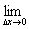
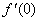
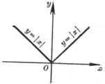

&nbsp;&nbsp;&nbsp;&nbsp;&nbsp;&nbsp;&nbsp;&nbsp;&nbsp;&nbsp;&nbsp;&nbsp;&nbsp;&nbsp;&nbsp;&nbsp;&nbsp;&nbsp;&nbsp;&nbsp;&nbsp;&nbsp;&nbsp;&nbsp;&nbsp;&nbsp;&nbsp;&nbsp;
<b>&nbsp;§3&nbsp;&nbsp; </b><b>微</b><b>&nbsp; </b><b>分</b>

一、单变量函数的微分

&nbsp;&nbsp;&nbsp; 1. 基本概念

[导数的定义及其几何意义]&nbsp;
设函数<i>y</i>=<i>f</i>(<i>x</i>)当自变量在点<i>x</i>有一改变量<i></i>时,函数<i>y</i>相应地有一改变量 ,那末当<i></i>趋于零时,若比的极限存在(一确定的有限值)，则称这个极限为函数<i>f</i>(<i>x</i>)在点<i>x</i>的导数,记作

<table cellspacing=0 cellpadding=0 hspace=0 vspace=0 width=182 height=196
 align=left>
 <tr>
  <td valign=top align=left height=196 style='padding-top:0mm;padding-right:
  9.0pt;padding-bottom:0mm;padding-left:9.0pt'>
  

  
&nbsp;

  
图5.1

  

  </td>
 </tr>
</table>

这时称函数<i>f</i>(<i>x</i>)在点<i>x</i>是可微分的函数(或称函数<i>f</i>(<i>x</i>)在点<i>x</i>可微)。

在几何上,函数<i>f</i>(<i>x</i>)的导数是函数<i>y</i>=<i>f</i>(<i>x</i>)表示的曲线在点<i>x</i>的切线的斜率,即

=

式中<i>α</i>为曲线在点<i>x</i>的切线与<i>x</i>轴的夹角(图5.1)。

&nbsp;&nbsp;&nbsp; [单边导数]

=

及

=

分别称为函数<i>f</i>(<i>x</i>)在点<i>x</i>的左导数和右导数。

导数存在的充分必要条件是:

=

&nbsp;&nbsp;&nbsp; [无穷导数]&nbsp; 若在某一点<i>x</i>有

=±∞

则称函数<i>f</i>(<i>x</i>)在点<i>x</i>有无穷导数。这时函数<i>y</i>=<i>f</i>(<i>x</i>)的图形在点<i>x</i>的切线与<i>x</i>轴垂直(当=

+∞时,函数<i>f</i>(<i>x</i>)的图形在点<i>x</i>的切线正向与<i>y</i>轴方向一致,当=－∞时,方向相反)。

&nbsp;&nbsp;&nbsp; [函数的可微性与连续性的关系]&nbsp;
如果函数<i>y</i>=<i>f</i>(<i>x</i>)在点<i>x</i>有导数，那末它在点<i>x</i>一定连续。反之,连续函数不一定有导数,例如

&nbsp;&nbsp;&nbsp; 1°　函数<i>y</i>=|<i>x</i>|在点<i>x</i>=0连续,在点<i>x</i>=0,左导数=－1,右导数 =1,而导数

不存在(图5.2)。

&nbsp;&nbsp;&nbsp;&nbsp;&nbsp;&nbsp;&nbsp;&nbsp;&nbsp;&nbsp;&nbsp;&nbsp;&nbsp;&nbsp;&nbsp;&nbsp;&nbsp;&nbsp;&nbsp;&nbsp;&nbsp;&nbsp;&nbsp;&nbsp;&nbsp;&nbsp;&nbsp;&nbsp;&nbsp;&nbsp;&nbsp;&nbsp;&nbsp;&nbsp; &nbsp;&nbsp;&nbsp;&nbsp;&nbsp;&nbsp;&nbsp;&nbsp;&nbsp;&nbsp;&nbsp;&nbsp;&nbsp; 

<table class=MsoNormalTable border=0 cellpadding=0 width="39%"
 style='width:39.0%'>
 <tr>
  <td style='padding:.75pt .75pt .75pt .75pt'>
  

  <pre style='text-align:center'>图5.2&nbsp;&nbsp;&nbsp;&nbsp;&nbsp;&nbsp;&nbsp;&nbsp;&nbsp; 图5.3</pre></td>
 </tr>
</table>

&nbsp;&nbsp; 

&nbsp;

&nbsp;&nbsp;&nbsp; 2°　函数

&nbsp;&nbsp;&nbsp;&nbsp;&nbsp;&nbsp;&nbsp;&nbsp;&nbsp;&nbsp;&nbsp;&nbsp;&nbsp;&nbsp;&nbsp;&nbsp;&nbsp;&nbsp;&nbsp;&nbsp;
<i>y</i>=<i>f</i>(<i>x</i>)=&nbsp; 

在点<i>x</i>=0连续,但在点<i>x</i>=0左右导数都不存在(图5.3)。

