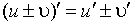

2. 求导数的基本法则

[四则运算求导公式]　若<i>c</i>为常数,函数<i>u</i>=<i>u</i>(<i>x</i>), 都有导数,则

=0 =<i>c</i><i></i>

[复合函数的导数] 若<i>y</i>=<i>f</i>(<i>u</i>),<i>u</i>=都有导数,则

=

[反函数的导数] 如果函数<i>y</i>=<i>f</i>(<i>x</i>)在点<i>x</i>有不等于零的导数,并且反函数<i>x</i>=<i>f</i>－1(<i>y</i>)在点<i>y</i>连续,那末 存在并且等于，即

=

[隐函数的导数] 假定函数<i>F</i>(<i>x</i>,<i>y</i>)连续,并且对于每个自变量都有连续的偏导数,而且，则由

<i>F</i>(<i>x</i>,<i>y</i>)=0

所决定的函数<i>y</i>=<i>f</i>(<i>x</i>)的导数

=＝

式中＝，＝(见本节，四)。

[用参数表示的函数的导数] 设方程组

　（<i>α</i>&lt;<i>t</i>&lt;<i>β</i>）

式中和为可微分的函数,且,则由隐函数存在定理(本节,四,1)可把<i>y</i>确定为<i>x</i>的单值连续函数

<i>y</i>=

而函数的导数可用公式

＝

求得。

[用对数求导数法] 求一函数的导数,有时先取其对数较为便利,然后由这函数的对数求其导数。

例 求

的导数。

解 两边各取对数,得

ln<i>y</i>=<i>p</i>ln(<i>x</i>－<i>a</i>)＋<i>q</i>ln(<i>x</i>－<i>b</i>)－<i>r</i>ln(<i>x</i>－<i>c</i>)

左边的ln<i>y</i>为<i>y</i>的函数,而<i>y</i>又为<i>x</i>的函数,故应用求复合函数的导数的法则得到

由此得

所以

