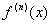
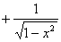
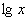

3.函数的微分与高阶导数

[函数的微分]&nbsp; 若函数<i>y</i>=<i>f</i>(<i>x</i>)的改变量可表为

＝<i>A</i>(<i>x</i>)d<i>x</i>+<i>o</i>(d<i>x</i>)

式中d<i>x</i>=Δ<i>x</i>，则此改变量的线性主部<i>A</i>(<i>x</i>)d<i>x</i>称为函数<i>y</i>的微分,记作

d<i>y</i>=<i>A</i>(<i>x</i>)d<i>x</i>

函数<i>y</i>=<i>f</i>(<i>x</i>)的微分存在的充分必要条件是:函数存在有限的导数=,这时函数的微分是

d<i>y</i>=d<i>x</i>

上式具有一阶微分的不变性,即当自变量<i>x</i>又是另一自变量<i>t</i>的函数时,上面的公式仍然成立.

[高阶导数]&nbsp; 函数<i>y</i>=<i>f</i>(<i>x</i>)的高阶导数由下列关系式逐次地定义出来(假设对应的运算都有意义)：

&nbsp;=&nbsp;&nbsp;&nbsp;&nbsp;&nbsp;&nbsp;

[高阶微分]&nbsp; 函数<i>y</i>=<i>f</i>(<i>x</i>)的高阶微分由下列公式逐次定义：

=&nbsp; 

式中.并且有

=

及&nbsp;&nbsp;&nbsp;&nbsp;&nbsp;&nbsp;&nbsp;&nbsp;&nbsp;&nbsp;&nbsp;&nbsp;&nbsp;&nbsp;&nbsp;&nbsp;&nbsp;&nbsp;&nbsp;&nbsp;&nbsp;&nbsp;&nbsp;&nbsp;&nbsp;&nbsp;&nbsp;&nbsp;&nbsp;&nbsp;&nbsp;&nbsp;

[莱布尼茨公式]&nbsp; 若函数<i>u</i>=及<i></i>=有<i>n</i>阶导数(可微分<i>n</i>次),则

式中,,为二项式系数。

同样有

式中&nbsp;&nbsp;&nbsp;&nbsp;&nbsp;&nbsp;&nbsp;&nbsp;&nbsp;&nbsp;&nbsp;&nbsp;&nbsp;&nbsp;&nbsp;&nbsp;&nbsp;&nbsp;&nbsp;&nbsp;&nbsp;&nbsp;&nbsp;&nbsp;&nbsp;&nbsp; &nbsp;&nbsp;&nbsp;&nbsp;&nbsp;&nbsp;&nbsp;
&nbsp;&nbsp;&nbsp;&nbsp;&nbsp; &nbsp;&nbsp;&nbsp;&nbsp;，

更一般地有

式中<i>m</i>，<i>n</i>为正整数。

[复合函数的高阶导数]&nbsp; 若函数<i>y</i>=<i>f</i>(<i>u</i>),<i>u</i>=有<i>l</i>阶导数，则

式中&nbsp;&nbsp;&nbsp;&nbsp;&nbsp;&nbsp;&nbsp;&nbsp;&nbsp;&nbsp;&nbsp;&nbsp;&nbsp;&nbsp;&nbsp;&nbsp;&nbsp;&nbsp;&nbsp; 

，

[基本函数的导数表]

<table class=MsoNormalTable border=1 cellspacing=0 cellpadding=0
 style='border-collapse:collapse;border:none'>
 <tr style='height:15.1pt'>
  <td width=121 style='width:90.75pt;border:solid windowtext 1.0pt;border-left:
  none;padding:0mm 5.4pt 0mm 5.4pt;height:15.1pt'>
  
<i>f</i>(<i>x</i>)

  </td>
  <td width=143 style='width:107.6pt;border-top:solid windowtext 1.0pt;
  border-left:none;border-bottom:solid windowtext 1.0pt;border-right:double windowtext 1.5pt;
  padding:0mm 5.4pt 0mm 5.4pt;height:15.1pt'>
  

  </td>
  <td width=109 style='width:81.4pt;border:solid windowtext 1.0pt;border-left:
  none;padding:0mm 5.4pt 0mm 5.4pt;height:15.1pt'>
  
<i>f</i>(<i>x</i>)

  </td>
  <td width=168 style='width:126.0pt;border-top:solid windowtext 1.0pt;
  border-left:none;border-bottom:solid windowtext 1.0pt;border-right:none;
  padding:0mm 5.4pt 0mm 5.4pt;height:15.1pt'>
  

  </td>
 </tr>
 <tr style='height:29.5pt'>
  <td width=121 style='width:90.75pt;border:none;border-right:solid windowtext 1.0pt;
  padding:0mm 5.4pt 0mm 5.4pt;height:29.5pt'>
  
<i>c</i>

  </td>
  <td width=143 style='width:107.6pt;border:none;border-right:double windowtext 1.5pt;
  padding:0mm 5.4pt 0mm 5.4pt;height:29.5pt'>
  
0

  </td>
  <td width=109 style='width:81.4pt;border:none;border-right:solid windowtext 1.0pt;
  padding:0mm 5.4pt 0mm 5.4pt;height:29.5pt'>
  

  </td>
  <td width=168 style='width:126.0pt;border:none;padding:0mm 5.4pt 0mm 5.4pt;
  height:29.5pt'>
  

  </td>
 </tr>
 <tr style='height:35.25pt'>
  <td width=121 style='width:90.75pt;border:none;border-right:solid windowtext 1.0pt;
  padding:0mm 5.4pt 0mm 5.4pt;height:35.25pt'>
  
<i>xn</i>

  </td>
  <td width=143 style='width:107.6pt;border:none;border-right:double windowtext 1.5pt;
  padding:0mm 5.4pt 0mm 5.4pt;height:35.25pt'>
  
<i>nxn</i><i>－</i>1

  </td>
  <td width=109 style='width:81.4pt;border:none;border-right:solid windowtext 1.0pt;
  padding:0mm 5.4pt 0mm 5.4pt;height:35.25pt'>
  

  </td>
  <td width=168 style='width:126.0pt;border:none;padding:0mm 5.4pt 0mm 5.4pt;
  height:35.25pt'>
  

  </td>
 </tr>
 <tr style='height:33.2pt'>
  <td width=121 style='width:90.75pt;border:none;border-right:solid windowtext 1.0pt;
  padding:0mm 5.4pt 0mm 5.4pt;height:33.2pt'>
  

  </td>
  <td width=143 style='width:107.6pt;border:none;border-right:double windowtext 1.5pt;
  padding:0mm 5.4pt 0mm 5.4pt;height:33.2pt'>
  
<i></i>

  </td>
  <td width=109 style='width:81.4pt;border:none;border-right:solid windowtext 1.0pt;
  padding:0mm 5.4pt 0mm 5.4pt;height:33.2pt'>
  

  </td>
  <td width=168 style='width:126.0pt;border:none;padding:0mm 5.4pt 0mm 5.4pt;
  height:33.2pt'>
  

  </td>
 </tr>
 <tr style='height:29.4pt'>
  <td width=121 style='width:90.75pt;border:none;border-right:solid windowtext 1.0pt;
  padding:0mm 5.4pt 0mm 5.4pt;height:29.4pt'>
  

  </td>
  <td width=143 style='width:107.6pt;border:none;border-right:double windowtext 1.5pt;
  padding:0mm 5.4pt 0mm 5.4pt;height:29.4pt'>
  

  </td>
  <td width=109 style='width:81.4pt;border:none;border-right:solid windowtext 1.0pt;
  padding:0mm 5.4pt 0mm 5.4pt;height:29.4pt'>
  

  </td>
  <td width=168 style='width:126.0pt;border:none;padding:0mm 5.4pt 0mm 5.4pt;
  height:29.4pt'>
  

  </td>
 </tr>
 <tr style='height:31.5pt'>
  <td width=121 style='width:90.75pt;border:none;border-right:solid windowtext 1.0pt;
  padding:0mm 5.4pt 0mm 5.4pt;height:31.5pt'>
  

  </td>
  <td width=143 style='width:107.6pt;border:none;border-right:double windowtext 1.5pt;
  padding:0mm 5.4pt 0mm 5.4pt;height:31.5pt'>
  

  </td>
  <td width=109 style='width:81.4pt;border:none;border-right:solid windowtext 1.0pt;
  padding:0mm 5.4pt 0mm 5.4pt;height:31.5pt'>
  

  </td>
  <td width=168 style='width:126.0pt;border:none;padding:0mm 5.4pt 0mm 5.4pt;
  height:31.5pt'>
  

  </td>
 </tr>
 <tr style='height:36.0pt'>
  <td width=121 style='width:90.75pt;border:none;border-right:solid windowtext 1.0pt;
  padding:0mm 5.4pt 0mm 5.4pt;height:36.0pt'>
  

  </td>
  <td width=143 style='width:107.6pt;border:none;border-right:double windowtext 1.5pt;
  padding:0mm 5.4pt 0mm 5.4pt;height:36.0pt'>
  

  </td>
  <td width=109 style='width:81.4pt;border:none;border-right:solid windowtext 1.0pt;
  padding:0mm 5.4pt 0mm 5.4pt;height:36.0pt'>
  

  </td>
  <td width=168 style='width:126.0pt;border:none;padding:0mm 5.4pt 0mm 5.4pt;
  height:36.0pt'>
  

  </td>
 </tr>
 <tr style='height:36.75pt'>
  <td width=121 style='width:90.75pt;border:none;border-right:solid windowtext 1.0pt;
  padding:0mm 5.4pt 0mm 5.4pt;height:36.75pt'>
  

  </td>
  <td width=143 style='width:107.6pt;border:none;border-right:double windowtext 1.5pt;
  padding:0mm 5.4pt 0mm 5.4pt;height:36.75pt'>
  

  </td>
  <td width=109 style='width:81.4pt;border:none;border-right:solid windowtext 1.0pt;
  padding:0mm 5.4pt 0mm 5.4pt;height:36.75pt'>
  

  </td>
  <td width=168 style='width:126.0pt;border:none;padding:0mm 5.4pt 0mm 5.4pt;
  height:36.75pt'>
  

  </td>
 </tr>
 <tr style='height:18.75pt'>
  <td width=121 style='width:90.75pt;border:none;border-right:solid windowtext 1.0pt;
  padding:0mm 5.4pt 0mm 5.4pt;height:18.75pt'>
  

  </td>
  <td width=143 style='width:107.6pt;border:none;border-right:double windowtext 1.5pt;
  padding:0mm 5.4pt 0mm 5.4pt;height:18.75pt'>
  

  </td>
  <td width=109 style='width:81.4pt;border:none;border-right:solid windowtext 1.0pt;
  padding:0mm 5.4pt 0mm 5.4pt;height:18.75pt'>
  
sh
  <i>x</i>

  </td>
  <td width=168 style='width:126.0pt;border:none;padding:0mm 5.4pt 0mm 5.4pt;
  height:18.75pt'>
  
ch<i>x</i>

  </td>
 </tr>
 <tr style='height:31.5pt'>
  <td width=121 style='width:90.75pt;border:none;border-right:solid windowtext 1.0pt;
  padding:0mm 5.4pt 0mm 5.4pt;height:31.5pt'>
  

  </td>
  <td width=143 style='width:107.6pt;border:none;border-right:double windowtext 1.5pt;
  padding:0mm 5.4pt 0mm 5.4pt;height:31.5pt'>
  

  </td>
  <td width=109 style='width:81.4pt;border:none;border-right:solid windowtext 1.0pt;
  padding:0mm 5.4pt 0mm 5.4pt;height:31.5pt'>
  
ch
  <i>x</i>

  </td>
  <td width=168 style='width:126.0pt;border:none;padding:0mm 5.4pt 0mm 5.4pt;
  height:31.5pt'>
  
sh<i>x</i>

  </td>
 </tr>
 <tr style='height:35.25pt'>
  <td width=121 style='width:90.75pt;border:none;border-right:solid windowtext 1.0pt;
  padding:0mm 5.4pt 0mm 5.4pt;height:35.25pt'>
  

  </td>
  <td width=143 style='width:107.6pt;border:none;border-right:double windowtext 1.5pt;
  padding:0mm 5.4pt 0mm 5.4pt;height:35.25pt'>
  

  </td>
  <td width=109 style='width:81.4pt;border:none;border-right:solid windowtext 1.0pt;
  padding:0mm 5.4pt 0mm 5.4pt;height:35.25pt'>
  
th
  <i>x</i>

  </td>
  <td width=168 style='width:126.0pt;border:none;padding:0mm 5.4pt 0mm 5.4pt;
  height:35.25pt'>
  
<i></i>

  </td>
 </tr>
 <tr style='height:30.0pt'>
  <td width=121 style='width:90.75pt;border:none;border-right:solid windowtext 1.0pt;
  padding:0mm 5.4pt 0mm 5.4pt;height:30.0pt'>
  

  </td>
  <td width=143 style='width:107.6pt;border:none;border-right:double windowtext 1.5pt;
  padding:0mm 5.4pt 0mm 5.4pt;height:30.0pt'>
  

  </td>
  <td width=109 style='width:81.4pt;border:none;border-right:solid windowtext 1.0pt;
  padding:0mm 5.4pt 0mm 5.4pt;height:30.0pt'>
  
cth
  <i>x</i>

  </td>
  <td width=168 style='width:126.0pt;border:none;padding:0mm 5.4pt 0mm 5.4pt;
  height:30.0pt'>
  
<i></i>

  </td>
 </tr>
 <tr style='height:15.75pt'>
  <td width=121 style='width:90.75pt;border:none;border-right:solid windowtext 1.0pt;
  padding:0mm 5.4pt 0mm 5.4pt;height:15.75pt'>
  

  </td>
  <td width=143 style='width:107.6pt;border:none;border-right:double windowtext 1.5pt;
  padding:0mm 5.4pt 0mm 5.4pt;height:15.75pt'>
  

  </td>
  <td width=109 style='width:81.4pt;border:none;border-right:solid windowtext 1.0pt;
  padding:0mm 5.4pt 0mm 5.4pt;height:15.75pt'>
  
sech
  <i>x</i>

  </td>
  <td width=168 style='width:126.0pt;border:none;padding:0mm 5.4pt 0mm 5.4pt;
  height:15.75pt'>
  
<i></i>

  </td>
 </tr>
 <tr style='height:18.0pt'>
  <td width=121 style='width:90.75pt;border:none;border-right:solid windowtext 1.0pt;
  padding:0mm 5.4pt 0mm 5.4pt;height:18.0pt'>
  

  </td>
  <td width=143 style='width:107.6pt;border:none;border-right:double windowtext 1.5pt;
  padding:0mm 5.4pt 0mm 5.4pt;height:18.0pt'>
  

  </td>
  <td width=109 style='width:81.4pt;border:none;border-right:solid windowtext 1.0pt;
  padding:0mm 5.4pt 0mm 5.4pt;height:18.0pt'>
  
csch
  <i>x</i>

  </td>
  <td width=168 style='width:126.0pt;border:none;padding:0mm 5.4pt 0mm 5.4pt;
  height:18.0pt'>
  
<i></i>

  </td>
 </tr>
 <tr style='height:36.75pt'>
  <td width=121 style='width:90.75pt;border:none;border-right:solid windowtext 1.0pt;
  padding:0mm 5.4pt 0mm 5.4pt;height:36.75pt'>
  

  </td>
  <td width=143 style='width:107.6pt;border:none;border-right:double windowtext 1.5pt;
  padding:0mm 5.4pt 0mm 5.4pt;height:36.75pt'>
  

  </td>
  <td width=109 style='width:81.4pt;border:none;border-right:solid windowtext 1.0pt;
  padding:0mm 5.4pt 0mm 5.4pt;height:36.75pt'>
  
<i></i>

  
<i></i>

  </td>
  <td width=168 style='width:126.0pt;border:none;padding:0mm 5.4pt 0mm 5.4pt;
  height:36.75pt'>
  

  </td>
 </tr>
 <tr style='height:54.0pt'>
  <td width=121 style='width:90.75pt;border:none;border-right:solid windowtext 1.0pt;
  padding:0mm 5.4pt 0mm 5.4pt;height:54.0pt'>
  

  </td>
  <td width=143 style='width:107.6pt;border:none;border-right:double windowtext 1.5pt;
  padding:0mm 5.4pt 0mm 5.4pt;height:54.0pt'>
  

  </td>
  <td width=109 style='width:81.4pt;border:none;border-right:solid windowtext 1.0pt;
  padding:0mm 5.4pt 0mm 5.4pt;height:54.0pt'>
  
Ar
  sech <i>x</i>

  </td>
  <td width=168 style='width:126.0pt;border:none;padding:0mm 5.4pt 0mm 5.4pt;
  height:54.0pt'>
  

  
<i>f</i>&gt;0取取+

  </td>
 </tr>
 <tr style='height:36.0pt'>
  <td width=121 style='width:90.75pt;border:none;border-right:solid windowtext 1.0pt;
  padding:0mm 5.4pt 0mm 5.4pt;height:36.0pt'>
  

  </td>
  <td width=143 style='width:107.6pt;border:none;border-right:double windowtext 1.5pt;
  padding:0mm 5.4pt 0mm 5.4pt;height:36.0pt'>
  

  </td>
  <td width=109 style='width:81.4pt;border:none;border-right:solid windowtext 1.0pt;
  padding:0mm 5.4pt 0mm 5.4pt;height:36.0pt'>
  
Ar
  csch <i>x</i>

  </td>
  <td width=168 style='width:126.0pt;border:none;padding:0mm 5.4pt 0mm 5.4pt;
  height:36.0pt'>
  
,<i>x</i>&gt;0

  </td>
 </tr>
 <tr style='height:46.9pt'>
  <td width=121 style='width:90.75pt;border:none;border-right:solid windowtext 1.0pt;
  padding:0mm 5.4pt 0mm 5.4pt;height:46.9pt'>
  <h1 style='text-align:justify;text-justify:inter-ideograph'>&nbsp;&nbsp; Arch x=</h1>
  
<i></i>

  </td>
  <td width=143 style='width:107.6pt;border:none;border-right:double windowtext 1.5pt;
  padding:0mm 5.4pt 0mm 5.4pt;height:46.9pt'>
  
,<i>x</i>&gt;1

  
<i>f</i>&gt;0取+，<i>f</i>&lt;0

  </td>
  <td width=109 style='width:81.4pt;border:none;border-right:solid windowtext 1.0pt;
  padding:0mm 5.4pt 0mm 5.4pt;height:46.9pt'>
  
<i></i>

  </td>
  <td width=168 style='width:126.0pt;border:none;padding:0mm 5.4pt 0mm 5.4pt;
  height:46.9pt'>
  

  </td>
 </tr>
 <tr style='height:42.6pt'>
  <td width=121 style='width:90.75pt;border:none;border-right:solid windowtext 1.0pt;
  padding:0mm 5.4pt 0mm 5.4pt;height:42.6pt'>
  <h1>Arth x=</h1>
  

  
(｜<i>x</i>｜&lt;1)

  </td>
  <td width=143 style='width:107.6pt;border:none;border-right:double windowtext 1.5pt;
  padding:0mm 5.4pt 0mm 5.4pt;height:42.6pt'>
  

  </td>
  <td width=109 style='width:81.4pt;border:none;border-right:solid windowtext 1.0pt;
  padding:0mm 5.4pt 0mm 5.4pt;height:42.6pt'>
  
ln
  ch <i>x</i>

  </td>
  <td width=168 style='width:126.0pt;border:none;padding:0mm 5.4pt 0mm 5.4pt;
  height:42.6pt'>
  
th
  <i>x</i>

  </td>
 </tr>
 <tr style='height:38.4pt'>
  <td width=121 style='width:90.75pt;border-top:none;border-left:none;
  border-bottom:solid windowtext 1.0pt;border-right:solid windowtext 1.0pt;
  padding:0mm 5.4pt 0mm 5.4pt;height:38.4pt'>
  
Arcth<i>x=</i>

  
<i></i>

  
(｜<i>x</i>｜&gt;1)

  </td>
  <td width=143 style='width:107.6pt;border-top:none;border-left:none;
  border-bottom:solid windowtext 1.0pt;border-right:double windowtext 1.5pt;
  padding:0mm 5.4pt 0mm 5.4pt;height:38.4pt'>
  

  </td>
  <td width=109 style='width:81.4pt;border-top:none;border-left:none;
  border-bottom:solid windowtext 1.0pt;border-right:solid windowtext 1.0pt;
  padding:0mm 5.4pt 0mm 5.4pt;height:38.4pt'>
  
ln<i></i>

  </td>
  <td width=168 style='width:126.0pt;border:none;border-bottom:solid windowtext 1.0pt;
  padding:0mm 5.4pt 0mm 5.4pt;height:38.4pt'>
  
<i></i>sech<i>x</i>csch<i>x</i>

  </td>
 </tr>
</table>

[简单函数的高阶导数表]

<table class=MsoNormalTable border=1 cellspacing=0 cellpadding=0
 style='border-collapse:collapse;border:none'>
 <tr style='height:22.9pt'>
  <td width=132 style='width:99.25pt;border:solid windowtext 1.0pt;border-left:
  none;padding:0mm 5.4pt 0mm 5.4pt;height:22.9pt'>
  
<i>f</i>(<i>x</i>)

  </td>
  <td width=425 style='width:318.95pt;border-top:solid windowtext 1.0pt;
  border-left:none;border-bottom:solid windowtext 1.0pt;border-right:none;
  padding:0mm 5.4pt 0mm 5.4pt;height:22.9pt'>
  

  </td>
 </tr>
 <tr style='height:17.25pt'>
  <td width=132 style='width:99.25pt;border:none;border-right:solid windowtext 1.0pt;
  padding:0mm 5.4pt 0mm 5.4pt;height:17.25pt'>
  

  </td>
  <td width=425 style='width:318.95pt;border:none;padding:0mm 5.4pt 0mm 5.4pt;
  height:17.25pt'>
  
<i>m</i>(<i>m</i>－1)…(<i>m</i>－<i>n</i>+1) (当<i>m</i>为整数且<i>n</i>&gt;<i>m</i>时，=0)

  </td>
 </tr>
 <tr style='height:33.75pt'>
  <td width=132 style='width:99.25pt;border:none;border-right:solid windowtext 1.0pt;
  padding:0mm 5.4pt 0mm 5.4pt;height:33.75pt'>
  

  </td>
  <td width=425 style='width:318.95pt;border:none;padding:0mm 5.4pt 0mm 5.4pt;
  height:33.75pt'>
  

  
这里(2<i>n</i>+1)!!=(2<i>n</i>+1)(2<i>n</i>－1)

  </td>
 </tr>
 <tr style='height:16.5pt'>
  <td width=132 style='width:99.25pt;border:none;border-right:solid windowtext 1.0pt;
  padding:0mm 5.4pt 0mm 5.4pt;height:16.5pt'>
  

  </td>
  <td width=425 style='width:318.95pt;border:none;padding:0mm 5.4pt 0mm 5.4pt;
  height:16.5pt'>
  

  </td>
 </tr>
 <tr style='height:15.75pt'>
  <td width=132 valign=top style='width:99.25pt;border:none;border-right:solid windowtext 1.0pt;
  padding:0mm 5.4pt 0mm 5.4pt;height:15.75pt'>
  

  </td>
  <td width=425 valign=top style='width:318.95pt;border:none;padding:0mm 5.4pt 0mm 5.4pt;
  height:15.75pt'>
  

  </td>
 </tr>
 <tr style='height:15.95pt'>
  <td width=132 valign=top style='width:99.25pt;border:none;border-right:solid windowtext 1.0pt;
  padding:0mm 5.4pt 0mm 5.4pt;height:15.95pt'>
  

  </td>
  <td width=425 valign=top style='width:318.95pt;border:none;padding:0mm 5.4pt 0mm 5.4pt;
  height:15.95pt'>
  
&nbsp; (<i>a</i>&gt;0)

  </td>
 </tr>
 <tr style='height:29.25pt'>
  <td width=132 valign=top style='width:99.25pt;border:none;border-right:solid windowtext 1.0pt;
  padding:0mm 5.4pt 0mm 5.4pt;height:29.25pt'>
  

  </td>
  <td width=425 valign=top style='width:318.95pt;border:none;padding:0mm 5.4pt 0mm 5.4pt;
  height:29.25pt'>
  

  </td>
 </tr>
 <tr style='height:30.0pt'>
  <td width=132 valign=top style='width:99.25pt;border:none;border-right:solid windowtext 1.0pt;
  padding:0mm 5.4pt 0mm 5.4pt;height:30.0pt'>
  

  </td>
  <td width=425 valign=top style='width:318.95pt;border:none;padding:0mm 5.4pt 0mm 5.4pt;
  height:30.0pt'>
  

  </td>
 </tr>
 <tr style='height:29.25pt'>
  <td width=132 valign=top style='width:99.25pt;border:none;border-right:solid windowtext 1.0pt;
  padding:0mm 5.4pt 0mm 5.4pt;height:29.25pt'>
  

  </td>
  <td width=425 valign=top style='width:318.95pt;border:none;padding:0mm 5.4pt 0mm 5.4pt;
  height:29.25pt'>
  

  </td>
 </tr>
 <tr style='height:27.0pt'>
  <td width=132 valign=top style='width:99.25pt;border:none;border-right:solid windowtext 1.0pt;
  padding:0mm 5.4pt 0mm 5.4pt;height:27.0pt'>
  

  </td>
  <td width=425 valign=top style='width:318.95pt;border:none;padding:0mm 5.4pt 0mm 5.4pt;
  height:27.0pt'>
  

  </td>
 </tr>
 <tr style='height:30.0pt'>
  <td width=132 valign=top style='width:99.25pt;border:none;border-right:solid windowtext 1.0pt;
  padding:0mm 5.4pt 0mm 5.4pt;height:30.0pt'>
  

  </td>
  <td width=425 valign=top style='width:318.95pt;border:none;padding:0mm 5.4pt 0mm 5.4pt;
  height:30.0pt'>
  

  </td>
 </tr>
 <tr style='height:31.5pt'>
  <td width=132 valign=top style='width:99.25pt;border:none;border-right:solid windowtext 1.0pt;
  padding:0mm 5.4pt 0mm 5.4pt;height:31.5pt'>
  

  </td>
  <td width=425 valign=top style='width:318.95pt;border:none;padding:0mm 5.4pt 0mm 5.4pt;
  height:31.5pt'>
  

  </td>
 </tr>
 <tr style='height:17.9pt'>
  <td width=132 valign=top style='width:99.25pt;border:none;border-right:solid windowtext 1.0pt;
  padding:0mm 5.4pt 0mm 5.4pt;height:17.9pt'>
  
sh<i>x</i>

  </td>
  <td width=425 valign=top style='width:318.95pt;border:none;padding:0mm 5.4pt 0mm 5.4pt;
  height:17.9pt'>
  
sh<i>x</i>(<i>n</i>为偶数)，ch<i>x</i>(<i>n</i>为奇数)

  </td>
 </tr>
 <tr style='height:15.35pt'>
  <td width=132 valign=top style='width:99.25pt;border-top:none;border-left:
  none;border-bottom:solid windowtext 1.0pt;border-right:solid windowtext 1.0pt;
  padding:0mm 5.4pt 0mm 5.4pt;height:15.35pt'>
  
ch<i>x</i>

  </td>
  <td width=425 valign=top style='width:318.95pt;border:none;border-bottom:
  solid windowtext 1.0pt;padding:0mm 5.4pt 0mm 5.4pt;height:15.35pt'>
  
ch<i>x</i>(<i>n</i>为偶数)，sh<i>x</i>(<i>n</i>为奇数)

  </td>
 </tr>
</table>

&nbsp;

