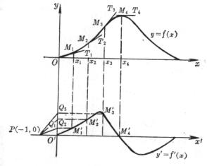
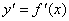
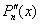
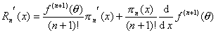
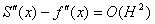

4.数值导数

当函数用图形或表格给出时,就不可能用定义求出它的导数,只能用近似方法求数值导数.

[图解微分法]&nbsp; 适用于用图形给出的函数求导数,例如机械设计中已知<i>s</i>－<i>t</i>图,求<i></i>图,&nbsp; <i>a</i>－<i>t</i>图等,其基本步骤如下：

(1)&nbsp;&nbsp;&nbsp;&nbsp;&nbsp;&nbsp;&nbsp;
将原坐标系<i>Oxy</i>沿<i>y</i>轴负方向平移一段距离得坐标系 (图5.4).

图5.4

(2)&nbsp; 过曲线<i>y</i>=<i>f</i>(<i>x</i>)上点<i>M</i>1(<i>x</i>1,<i>y</i>1)作切线<i>M</i>1<i>T</i>1 .在坐标系内,过点<i>P</i>(－1,0)作<i>PQ</i>1平行于<i>M</i>1<i>T</i>1交<i>y</i>轴于点<i>Q</i>1 ,那末点<i>Q</i>1 (点)的纵坐标就是导数.以<i>Q</i>1的纵坐标为纵坐标,<i>x</i>1为横坐标作出点.

(3) &nbsp;在曲线<i>y</i>=<i>f</i>(<i>x</i>)上取若干个点,在曲线弯曲程度较大处点取得密些.仿上作法,在坐标系内得到相应点,顺次连成光滑曲线,即是导函数的图形.

[差商公式]&nbsp; 在实用中常使用下列简单的近似公式

,,…,

式中

&nbsp;&nbsp; =&nbsp;&nbsp;&nbsp;
&nbsp;&nbsp;&nbsp;&nbsp;&nbsp; （函数<i>f </i>(<i>x</i>)在点<i>a</i>的１阶差分）

　 &nbsp;&nbsp;　&nbsp; （函数<i>f
</i>(<i>x</i>)在点<i>a</i>的２阶差分）

&nbsp;……………………………………

&nbsp;&nbsp;
（函数<i>f
</i>(<i>x</i>)在点<i>a</i>的<i>k</i>阶差分）

在函数的数值表中,如果有误差,则高阶差分的偏差较大,所以用以上公式不宜计算高阶导数.

[用插值多项式求数值导数]&nbsp; 假定已经求出了函数<i>y</i>=<i>f </i>(<i>x</i>)的插值多项式<i>Pn</i> (<i>x</i>),它可以求导,则用近似,由

<i>f</i>(<i>x</i>)=<i>Pn</i>(<i>x</i>)+<i>Rn</i>(<i>x</i>)

略去余项,得

≈&nbsp;&nbsp;&nbsp;&nbsp;&nbsp;&nbsp;&nbsp;&nbsp;&nbsp;&nbsp;
≈

等等.它们的余项相应为,,等等.

应当指出,当插值多项式<i>Pn</i>(<i>x</i>)收敛于<i>f</i>(<i>x</i>)时, 不一定收敛于<i>f</i>' (<i>x</i>).另外,当<i>h</i>缩小时,截断误差减小,但舍入误差却增加,因此,采用缩小步长的方法也不一定能达到提高精度的目的.由于用插值法求数值微分的不可靠性,在计算时,要特别注意误差分析,或者改用其他方法.

[拉格朗日公式]&nbsp; (由拉格朗日插值公式得来,见第十七章,§2,三)

式中&nbsp;&nbsp;&nbsp;&nbsp;&nbsp;&nbsp;&nbsp;&nbsp;&nbsp;&nbsp;&nbsp;&nbsp;&nbsp;&nbsp;&nbsp;&nbsp;&nbsp;&nbsp;&nbsp;
&nbsp;&nbsp;&nbsp; &nbsp;&nbsp;&nbsp;&nbsp;&nbsp;&nbsp;&nbsp;&nbsp;

&nbsp;&nbsp;&nbsp;&nbsp;&nbsp;&nbsp;&nbsp;&nbsp;&nbsp;&nbsp;&nbsp;&nbsp;&nbsp;&nbsp;&nbsp;&nbsp;&nbsp;&nbsp;&nbsp;&nbsp;
&nbsp;&nbsp;&nbsp;&nbsp;&nbsp;
&nbsp;&nbsp;&nbsp;&nbsp;&nbsp;&nbsp;&nbsp;&nbsp;&nbsp;

&nbsp;&nbsp;&nbsp;&nbsp;&nbsp;&nbsp;&nbsp;&nbsp;&nbsp;&nbsp;&nbsp;&nbsp;&nbsp;&nbsp;&nbsp;&nbsp;&nbsp;&nbsp;&nbsp;&nbsp;
&nbsp;&nbsp;&nbsp;&nbsp;&nbsp;
&nbsp;&nbsp;&nbsp;&nbsp;&nbsp;&nbsp;&nbsp;&nbsp;&nbsp;

&nbsp; &nbsp;&nbsp;
()

[马尔科夫公式]&nbsp; (由牛顿插值公式得来,见第十七章,§2,二)

&nbsp;&nbsp;&nbsp;&nbsp;&nbsp;&nbsp;&nbsp;&nbsp;&nbsp;&nbsp;&nbsp;&nbsp;&nbsp;
&nbsp;&nbsp;&nbsp;&nbsp;&nbsp;&nbsp;&nbsp;&nbsp;&nbsp;&nbsp;&nbsp;&nbsp;
()

特别,当<i>t </i>= 0时,有

&nbsp;&nbsp;&nbsp;&nbsp;&nbsp;&nbsp;&nbsp;&nbsp;&nbsp;&nbsp;&nbsp;&nbsp;&nbsp;

[等距公式]

三点公式

≈

四点公式

≈

五点公式

≈

&nbsp;&nbsp;&nbsp;&nbsp;&nbsp;&nbsp; 

[用三次样条函数求数值导数]&nbsp; 这个方法能避免用插值法求数值导数的不可靠性.因为对于样条函数(曲线<i>y</i>=<i>f</i>(<i>x</i>)的三次样条函数<i>S</i>(<i>x</i>)的作法见第十七章,§2,四),当被插值函数<i>f</i>(<i>x</i>)有四阶连续导数,且<i>hi</i>=<i>xi</i>+1－<i>xi</i>→0时,只要<i>S</i>(<i>x</i>)收敛于<i>f</i>(<i>x</i>),则导数一定收敛于,且<i>S</i>(<i>x</i>)－<i>f</i>(<i>x</i>)=<i>O</i>(<i>H</i>4)，－＝<i>O</i>(<i>H</i>3),,其中<i>H</i>是<i>hi</i>的最大值,因此,可直接通过三次样条函数

<pre style='text-align:justify;text-justify:inter-ideograph' align=center>&nbsp;&nbsp;&nbsp; &nbsp;&nbsp;&nbsp;&nbsp;&nbsp;&nbsp;&nbsp;&nbsp;&nbsp;&nbsp;&nbsp;&nbsp;&nbsp;&nbsp;&nbsp;&nbsp;&nbsp;&nbsp;&nbsp;&nbsp;&nbsp;&nbsp;&nbsp;&nbsp;&nbsp;&nbsp;&nbsp;&nbsp;&nbsp;&nbsp;&nbsp;&nbsp;&nbsp;&nbsp;&nbsp;&nbsp;&nbsp;&nbsp;&nbsp;&nbsp;&nbsp;&nbsp;&nbsp;&nbsp;</pre><pre
style='text-align:center' align=center>&nbsp;&nbsp;&nbsp;&nbsp;&nbsp;&nbsp;&nbsp;&nbsp;&nbsp;&nbsp;&nbsp; </pre><pre style='text-align:center'
align=center>&nbsp;&nbsp;&nbsp;&nbsp;&nbsp;&nbsp;&nbsp;&nbsp;&nbsp;&nbsp;</pre>

求数值导数得

=

<pre style='text-align:justify;text-justify:inter-ideograph' align=center>&nbsp;&nbsp;&nbsp;&nbsp;&nbsp;&nbsp;&nbsp;&nbsp;&nbsp;&nbsp;&nbsp;&nbsp;&nbsp;&nbsp;&nbsp;&nbsp;&nbsp;&nbsp;&nbsp;&nbsp;&nbsp;&nbsp;&nbsp;&nbsp;&nbsp;&nbsp;&nbsp;&nbsp; &nbsp;&nbsp;&nbsp;&nbsp;&nbsp;&nbsp;&nbsp;&nbsp;&nbsp;&nbsp;&nbsp;&nbsp;&nbsp;&nbsp;&nbsp;&nbsp;</pre><pre style='text-align:center'
align=center>&nbsp;&nbsp;&nbsp;&nbsp;&nbsp;&nbsp;&nbsp;&nbsp;&nbsp;&nbsp;&nbsp;&nbsp;&nbsp;&nbsp;</pre><pre style='text-align:center'
align=center>&nbsp;&nbsp;&nbsp;&nbsp;&nbsp;&nbsp;&nbsp;&nbsp;&nbsp;&nbsp;&nbsp;&nbsp;</pre><pre style='text-align:justify;
text-justify:inter-ideograph' align=center>&nbsp;&nbsp;&nbsp; &nbsp;&nbsp;&nbsp;&nbsp;&nbsp;&nbsp;&nbsp;&nbsp;&nbsp;&nbsp;&nbsp;&nbsp;&nbsp;&nbsp;&nbsp;&nbsp;&nbsp;&nbsp;&nbsp;</pre><pre style='text-align:center' align=center>&nbsp;&nbsp;&nbsp;&nbsp;&nbsp;&nbsp;&nbsp;&nbsp;&nbsp;&nbsp; &nbsp;&nbsp;&nbsp;&nbsp;&nbsp;&nbsp;&nbsp;&nbsp;&nbsp;&nbsp; </pre>

式中&nbsp;&nbsp;&nbsp;&nbsp;&nbsp;
,,&nbsp;&nbsp; 。

&nbsp;&nbsp; 若仅求样点<i>xi</i>上的导数,则

&nbsp;&nbsp;&nbsp;&nbsp;&nbsp;&nbsp;&nbsp;&nbsp;&nbsp;&nbsp;&nbsp;&nbsp;&nbsp;&nbsp;&nbsp;&nbsp;&nbsp;&nbsp;&nbsp;

≈=

≈=

