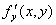
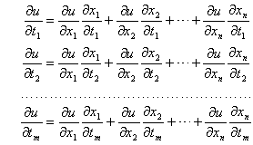
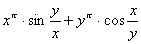
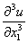
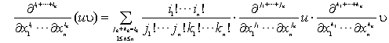
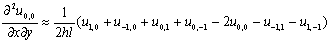
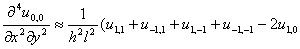
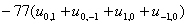

<h3 style='text-align:justify;text-justify:inter-ideograph'>二、多变量函数的微分</h3>

[偏导数及其几何意义]&nbsp; 设二元函数

<i>u</i>=<i>f</i>(<i>x</i>,<i>y</i>)

当变量<i>x</i>有一个改变量Δ<i>x</i>而变量<i>y</i>保持不变时,得到一个改变量

Δ<i>u</i>=<i>f</i>(<i>x</i>+Δ<i>x</i>,<i>y</i>)－<i>f</i>(<i>x</i>,<i>y</i>)

如果当Δ<i>x</i>→0时,极限

=

存在,那末这个极限称为函数<i>u</i>=<i>f</i>(<i>x</i>,<i>y</i>)关于变量<i>x</i>的偏导数,记作或,也记作或,即

=====

类似地,可以定义二元函数<i>u</i>=<i>f</i>(<i>x</i>,<i>y</i>)关于变量<i>y</i>的偏导数为

=====

偏导数可以按照单变量函数的微分法则求出,只须对所论变量求导数,其余变量都看作常数.

偏导数的几何意义如下:

二元函数<i>u</i>=<i>f</i>(<i>x</i>,<i>y</i>)表示一曲面,通过曲面上一点<i>M</i>(<i>x</i>,<i>y</i>,<i>u</i>)作一平行于<i>Oxu</i>平面的平面,与曲面有一条交线,就是这条曲线在该点的切线与<i>x</i>轴正向夹角<i></i>的正切,即=.同样,有= (图5.5).

图5.5

偏导数的定义不难推广到多变量函数<i>u</i>=<i>f</i>(<i>x</i>1,<i>x</i>2,…,<i>xn</i>)的情形.

[偏微分]&nbsp; 多变量函数<i>u</i>=<i>f</i>(<i>x</i>1,<i>x</i>2,…,<i>xn</i>)对其中一个变量(例如<i>x</i>1 )的偏微分为

也可记作.

[可微函数与全微分]&nbsp; 若函数<i>u</i>=<i>f</i>(<i>x</i>,<i>y</i>)的全改变量可写为

=+

式中<i>A</i>,<i>B</i>与Δ<i>x,</i>Δ<i>y</i>无关,,则称函数<i>u</i>=<i>f</i>(<i>x</i>,<i>y</i>)在点(<i>x</i>,<i>y</i>)可微分(或可微),这时函数<i>u</i>=<i>f</i>(<i>x</i>,<i>y</i>)的偏导数,一定存在,而且

=<i>A</i>,
=<i>B</i>

改变量<i>Δu</i>的线性主部

=+d<i>y</i>

称为函数<i>u</i>=<i>f</i>(<i>x</i>,<i>y</i>)的全微分,记作

<pre style='text-align:right' align=left><i>du</i>=+d<i>y</i> &nbsp;&nbsp;&nbsp;&nbsp;&nbsp;&nbsp;&nbsp;&nbsp;&nbsp;&nbsp;&nbsp;&nbsp;&nbsp;&nbsp;&nbsp;&nbsp;&nbsp;&nbsp;&nbsp;&nbsp;&nbsp;&nbsp;&nbsp;&nbsp;&nbsp;&nbsp;&nbsp;&nbsp;&nbsp;&nbsp;&nbsp;&nbsp;&nbsp;&nbsp; (1)</pre>

函数在一点可微的充分条件:如果在点(<i>x</i>,<i>y</i>)函数<i>u</i>=<i>f</i>(<i>x</i>,<i>y</i>)的偏导数存在而且连续,那末函数在该点是可微的.

公式(1)具有一阶微分的不变性,即当自变量<i>x</i>,<i>y</i>又是另外两个自变量<i>t</i>,<i>s</i>的函数时,上面的公式仍然成立.

上述结果不难推广到多变量函数<i>u</i>=<i>f</i>(<i>x</i>1,<i>x</i>2,…,<i>xn</i>)的情形.

注意,在一个已知点,偏导数的存在一般说来还不能确定微分的存在.

[复合函数的微分法与全导数]

(1)?设<i>u</i>=<i>f</i>(<i>x</i>,<i>y</i>),<i>x</i>=(<i>t</i>,<i>s</i>),<i>y</i>=(<i>t</i>,<i>s</i>),则

=+

=+

(2)?设<i>u</i>=<i>f</i>(<i>x</i>1,<i>x</i>2,…,<i>xn</i>),而<i>x</i>1,<i>x</i>2,…,<i>xn</i>又都是<i>t</i>1,<i>t</i>2,…,<i>tm</i>的函数,则

(3)?设<i>u</i>=<i>f</i>(<i>x</i>,<i>y</i>,<i>z</i>),而<i>y</i>=(<i>x</i>,<i>t</i>),<i>z</i>=(<i>x</i>,<i>t</i>),则

=

&nbsp;

=

(4)?设<i>u</i>=<i>f</i>(<i>x</i>1,<i>x</i>2,…,<i>xn</i>),<i>
x</i>1=<i> x</i>1(<i>t</i>),<i> x</i>2=<i> x</i>2(<i>t</i>),<i> </i>,则函数<i>u</i>=<i>f</i>(<i>x</i>1,<i>x</i>2,)的全导数为

[齐次函数与欧拉公式]&nbsp; 如果函数<i>f</i>(<i>x</i>,<i>y</i>,<i>z</i>)恒等地满足下列关系式&nbsp;

<i>f</i>(<i>tx</i>,<i>ty</i>,<i>tz</i>)=<i>f</i>(<i>x</i>,<i>y</i>,<i>z</i>)

则称<i>f</i>(<i>x</i>,<i>y</i>,<i>z</i>)是一个<i>k</i>次的齐次函数.对于这种函数,只要它可微,就有

&nbsp;&nbsp; (欧拉公式)

注意,齐次函数的次数<i>k</i>可以是任意实数,例如,函数

就是自变量<i>x</i>及<i>y</i>的<i>π</i>次齐次函数.

[隐函数的微分法]&nbsp; 设<i>F</i>(<i>x</i>1,<i>x</i>2,…,<i>xn</i>,<i>u</i>)=0,则

………………………

(参考本节,四).

[高阶偏导数与混合偏导数]&nbsp; 函数<i>u</i>=<i>f</i>(<i>x</i>1,<i>x</i>2,…,<i>xn</i>)的二阶偏导数为,,…,和,,,…,后者称为混合偏导数.三阶偏导数为,,…, ,,,…。类似地可定义更高阶的偏导数.

关于函数乘积的混合偏导数有下面公式:设<i>u</i>,<i></i>都是<i>x</i>1,<i>x</i>2,…,<i>xn</i>的函数,则

注意,混合偏导数一般与求导的次序有关,但是,如果两个同阶的偏导数,只是求导的次序不同,那末只要这两个偏导数都连续,它们就一定彼此相等.例如,如果在某一点(<i>x</i>,<i>y</i>)函数与都连续,那末一定有

(<i>x</i>,<i>y</i>)=
(<i>x</i>,<i>y</i>)

[高阶全微分]&nbsp; 二元函数<i>u</i>=<i>f</i>(<i>x</i>,<i>y</i>)的二阶全微分为

d2<i>u</i>=d(d<i>u</i>)=

或简记作

d2<i>u</i>=

式中偏导数符号,经平方后出现,,,它们再作用到函数<i>u</i>=<i>f</i>(<i>x</i>,<i>y</i>)上,以下类同.

二元函数<i>u</i>=<i>f</i>(<i>x</i>,<i>y</i>)的<i>n</i>阶全微分为

d<i>nu</i>=

多变量函数<i>u</i>=<i>f</i>(<i>x</i>1,<i>x</i>2,…,<i>xm</i>)的<i>n</i>阶全微分为

d<i>nu</i>=

[偏导数的差分形式]

(表中<i>h</i>为<i>x</i>轴方向步长,<i>l</i>为<i>y</i>轴方向步长)

<table class=MsoNormalTable border=1 cellspacing=0 cellpadding=0>
 <tr>
  <td width=273 colspan=8 style='width:204.75pt;padding:0mm 0mm 0mm 0mm'>
  
图&nbsp; 示

  </td>
  <td width=357 style='width:267.75pt;padding:0mm 0mm 0mm 0mm'>
  
差 分 公 式

  </td>
 </tr>
 <tr>
  <td width=49 valign=top style='width:36.75pt;padding:0mm 0mm 0mm 0mm'>
  

  </td>
  <td width=224 colspan=7 valign=top style='width:168.0pt;padding:0mm 0mm 0mm 0mm'>
  

  </td>
  <td width=357 valign=top style='width:267.75pt;padding:0mm 0mm 0mm 0mm'>
  

  </td>
 </tr>
 <tr>
  <td width=273 colspan=8 valign=top style='width:204.75pt;padding:0mm 0mm 0mm 0mm'>
  
&nbsp;&nbsp;&nbsp;&nbsp;&nbsp; &nbsp;

  </td>
  <td width=357 valign=top style='width:267.75pt;padding:0mm 0mm 0mm 0mm'>
  

  </td>
 </tr>
 <tr>
  <td width=66 colspan=5 valign=top style='width:49.5pt;padding:0mm 0mm 0mm 0mm'>
  

  </td>
  <td width=207 colspan=3 valign=top style='width:155.25pt;padding:0mm 0mm 0mm 0mm'>
  
&nbsp;&nbsp;&nbsp; 

  </td>
  <td width=357 valign=top style='width:267.75pt;padding:0mm 0mm 0mm 0mm'>
  

  </td>
 </tr>
 <tr>
  <td width=273 colspan=8 valign=top style='width:204.75pt;padding:0mm 0mm 0mm 0mm'>
  
&nbsp;&nbsp;&nbsp;&nbsp;&nbsp; 

  </td>
  <td width=357 valign=top style='width:267.75pt;padding:0mm 0mm 0mm 0mm'>
  

  </td>
 </tr>
 <tr>
  <td width=65 colspan=4 valign=top style='width:48.75pt;padding:0mm 0mm 0mm 0mm'>
  

  </td>
  <td width=208 colspan=4 valign=top style='width:156.0pt;padding:0mm 0mm 0mm 0mm'>
  

  </td>
  <td width=357 valign=top style='width:267.75pt;padding:0mm 0mm 0mm 0mm'>
  

  </td>
 </tr>
 <tr>
  <td width=273 colspan=8 valign=top style='width:204.75pt;padding:0mm 0mm 0mm 0mm'>
  
&nbsp;&nbsp;&nbsp;&nbsp;&nbsp;&nbsp;&nbsp; 

  </td>
  <td width=357 valign=top style='width:267.75pt;padding:0mm 0mm 0mm 0mm'>
  

  </td>
 </tr>
 <tr>
  <td width=273 colspan=8 valign=top style='width:204.75pt;padding:0mm 0mm 0mm 0mm'>
  

  
&nbsp;

  </td>
  <td width=357 valign=top style='width:267.75pt;padding:0mm 0mm 0mm 0mm'>
  

  

  
&nbsp;

  </td>
 </tr>
 <tr>
  <td width=54 colspan=2 valign=top style='width:40.5pt;padding:0mm 0mm 0mm 0mm'>
  

  </td>
  <td width=219 colspan=6 valign=top style='width:164.25pt;padding:0mm 0mm 0mm 0mm'>
  

  </td>
  <td width=357 valign=top style='width:267.75pt;padding:0mm 0mm 0mm 0mm'>
  

  </td>
 </tr>
 <tr>
  <td width=273 colspan=8 valign=top style='width:204.75pt;padding:0mm 0mm 0mm 0mm'>
  
&nbsp;&nbsp;&nbsp;&nbsp; 

  </td>
  <td width=357 valign=top style='width:267.75pt;padding:0mm 0mm 0mm 0mm'>
  

  </td>
 </tr>
 <tr>
  <td width=273 colspan=8 valign=top style='width:204.75pt;padding:0mm 0mm 0mm 0mm'>
  
&nbsp;&nbsp;&nbsp; 

  </td>
  <td width=357 valign=top style='width:267.75pt;padding:0mm 0mm 0mm 0mm'>
  

  

  </td>
 </tr>
 <tr>
  <td width=70 colspan=6 valign=top style='width:52.5pt;padding:0mm 0mm 0mm 0mm'>
  

  </td>
  <td width=203 colspan=2 valign=top style='width:152.25pt;padding:0mm 0mm 0mm 0mm'>
  
&nbsp;&nbsp; 

  </td>
  <td width=357 valign=top style='width:267.75pt;padding:0mm 0mm 0mm 0mm'>
  

  </td>
 </tr>
 <tr>
  <td width=273 colspan=8 valign=top style='width:204.75pt;padding:0mm 0mm 0mm 0mm'>
  
&nbsp;&nbsp;&nbsp;&nbsp; 

  </td>
  <td width=357 valign=top style='width:267.75pt;padding:0mm 0mm 0mm 0mm'>
  

  

  </td>
 </tr>
 <tr>
  <td width=273 colspan=8 valign=top style='width:204.75pt;padding:0mm 0mm 0mm 0mm'>
  
&nbsp;&nbsp;&nbsp; 

  </td>
  <td width=357 valign=top style='width:267.75pt;padding:0mm 0mm 0mm 0mm'>
  

  </td>
 </tr>
 <tr>
  <td width=54 colspan=2 valign=top style='width:40.5pt;padding:0mm 0mm 0mm 0mm'>
  

  </td>
  <td width=219 colspan=6 valign=top style='width:164.25pt;padding:0mm 0mm 0mm 0mm'>
  

  </td>
  <td width=357 valign=top style='width:267.75pt;padding:0mm 0mm 0mm 0mm'>
  

  </td>
 </tr>
 <tr>
  <td width=54 colspan=2 valign=top style='width:40.5pt;padding:0mm 0mm 0mm 0mm'>
  
&nbsp; 

  </td>
  <td width=219 colspan=6 valign=top style='width:164.25pt;padding:0mm 0mm 0mm 0mm'>
  
&nbsp;&nbsp;&nbsp;&nbsp; 图&nbsp;
  示

  </td>
  <td width=357 valign=top style='width:267.75pt;padding:0mm 0mm 0mm 0mm'>
  
差 分 公 式

  </td>
 </tr>
 <tr>
  <td width=56 colspan=3 valign=top style='width:42.0pt;padding:0mm 0mm 0mm 0mm'>
  

  </td>
  <td width=217 colspan=5 valign=top style='width:162.75pt;padding:0mm 0mm 0mm 0mm'>
  

  </td>
  <td width=357 valign=top style='width:267.75pt;padding:0mm 0mm 0mm 0mm'>
  

  </td>
 </tr>
 <tr>
  <td width=76 colspan=7 valign=top style='width:57.0pt;padding:0mm 0mm 0mm 0mm'>
  

  </td>
  <td width=197 valign=top style='width:147.75pt;padding:0mm 0mm 0mm 0mm'>
  
&nbsp;&nbsp; 

  </td>
  <td width=357 valign=top style='width:267.75pt;padding:0mm 0mm 0mm 0mm'>
  

  
&nbsp;&nbsp;&nbsp; 

  </td>
 </tr>
 <tr>
  <td width=273 colspan=8 valign=top style='width:204.75pt;padding:0mm 0mm 0mm 0mm'>
  
&nbsp;&nbsp;&nbsp;&nbsp;&nbsp;&nbsp;&nbsp;&nbsp; 

  </td>
  <td width=357 valign=top style='width:267.75pt;padding:0mm 0mm 0mm 0mm'>
  

  </td>
 </tr>
 <tr>
  <td width=273 colspan=8 valign=top style='width:204.75pt;padding:0mm 0mm 0mm 0mm'>
  
&nbsp;&nbsp;&nbsp;&nbsp;&nbsp;&nbsp; 

  </td>
  <td width=357 valign=top style='width:267.75pt;padding:0mm 0mm 0mm 0mm'>
  

  
&nbsp;&nbsp;&nbsp;&nbsp;&nbsp;&nbsp;&nbsp;&nbsp;&nbsp;&nbsp;&nbsp;&nbsp;
  

  </td>
 </tr>
 <tr>
  <td width=273 colspan=8 valign=top style='width:204.75pt;padding:0mm 0mm 0mm 0mm'>
  
&nbsp;&nbsp;&nbsp;&nbsp;&nbsp;&nbsp;&nbsp; 

  </td>
  <td width=357 valign=top style='width:267.75pt;padding:0mm 0mm 0mm 0mm'>
  

  
&nbsp;&nbsp; 

  
&nbsp;&nbsp; 

  </td>
 </tr>
 <tr>
  <td width=273 colspan=8 valign=top style='width:204.75pt;padding:0mm 0mm 0mm 0mm'>
  

  </td>
  <td width=357 valign=top style='width:267.75pt;padding:0mm 0mm 0mm 0mm'>
  

  

  

  
&nbsp;&nbsp;&nbsp;&nbsp;&nbsp;&nbsp; 

  
&nbsp;&nbsp;&nbsp;&nbsp;&nbsp;&nbsp;&nbsp;&nbsp;
  

  
&nbsp;&nbsp;&nbsp;&nbsp;&nbsp;&nbsp;&nbsp;&nbsp;
  

  </td>
 </tr>
 <tr>
  <td width=49 style='width:36.75pt;padding:0mm 0mm 0mm 0mm'>
  
&nbsp;

  </td>
  <td width=10 style='width:7.2pt;padding:0mm 0mm 0mm 0mm'>
  
&nbsp;

  </td>
  <td width=10 style='width:7.2pt;padding:0mm 0mm 0mm 0mm'>
  
&nbsp;

  </td>
  <td width=10 style='width:7.2pt;padding:0mm 0mm 0mm 0mm'>
  
&nbsp;

  </td>
  <td width=10 style='width:7.2pt;padding:0mm 0mm 0mm 0mm'>
  
&nbsp;

  </td>
  <td width=10 style='width:7.2pt;padding:0mm 0mm 0mm 0mm'>
  
&nbsp;

  </td>
  <td width=10 style='width:7.2pt;padding:0mm 0mm 0mm 0mm'>
  
&nbsp;

  </td>
  <td width=197 style='width:147.75pt;padding:0mm 0mm 0mm 0mm'>
  
&nbsp;

  </td>
  <td width=362 style='width:271.5pt;padding:0mm 0mm 0mm 0mm'>
  
&nbsp;

  </td>
 </tr>
</table>

&nbsp;

