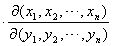
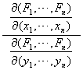

<h3>三、函数行列式(或雅可比式)及其性质</h3>

设有<i>n</i>个自变量的<i>n</i>个函数

&nbsp; (1)

它们定义在某一<i>n</i>维区域<i>D</i>中,并关于自变量有连续偏导数,则由这些偏导数组成的行列式

称为函数组(1)的函数行列式或雅可比式。记作

函数行列式具有与普通导数相似的一系列性质.

(1) 除函数组(1)外,再取在区域<i>P</i>中有定义且有连续偏导数的函数组

假设当点(<i>t</i>1,<i>t</i>2,)在<i>P</i>中变动时,对应点(<i>x</i>1,<i>x</i>2,)并不越出区域<i>D</i>,于是就可以通过<i>x</i>1,<i>x</i>2, 把<i>y</i>1,<i>y</i>2,看成是<i>t</i>1,<i>t</i>2,的复合函数.这时有

= (2)

它是一元的复合函数的微分法则

<i>y</i>=<i>f</i>(<i>x</i>),<i>x</i>=；=

的推广。

(2) 特别是,如果令<i>t</i>1=<i>y</i>1,<i>t</i>2=<i>y</i>2,=<i>yn</i>(换句话说,由新变量<i>x</i>1,<i>x</i>2,又回到旧变量<i>y</i>1,<i>y</i>2, ),则由(2)式得到

=1

它是一元函数的反函数微分法则

<i>y</i>=<i>f</i>(<i>x</i>), <i>x</i>==

的推广。

(3) 设有<i>n</i>个自变量<i>x</i>1,<i>x</i>2,的<i>m</i>（<i>m</i>&lt;<i>n</i>）个函数<i>y</i>1,<i>y</i>2,
：

式中<i>x</i>1,<i>x</i>2,又是<i>m</i>个自变量<i>t</i>1,<i>t</i>2,的函数：

假设它们都有连续偏导数，那末<i>y</i>1,<i>y</i>2,作为<i>t</i>1,<i>t</i>2,的函数的函数行列式的表达式为

等式右边的和式是从<i>n</i>个标号内每次取<i>m</i>个的一切可能组合而取遍的。

当<i>m</i>=1时,上面的公式就是普通的复合函数的微分公式

的推广.特别当<i>n</i>=3,<i>m</i>=2时,有

(4) 设有2<i>n</i>个自变量的<i>n</i>个方程所组成的方程组

<i>Fi</i>(<i>x</i>1,<i>x</i>2,;<i>y</i>1,<i>y</i>2,)=0 (<i>i</i>=1,2,…,<i>n</i>)

假定

≠0

将<i>y</i>1,<i>y</i>2,看成由这方程组所确定的<i>x</i>1,<i>x</i>2,的函数,这时有

它是由<i>F</i>(<i>x</i>,<i>y</i>)=0所确定的隐函数<i>y</i>=<i>f</i>(<i>x</i>)的导数公式

的推广.

(5) 函数行列式可作为面积(体积)的伸缩系数.

假定函数

<i>u</i>=<i>u</i>(<i>x</i>,<i>y</i>), = (<i>x</i>,<i>y</i>)

在<i>xy</i>平面的某个区域上连续,并且有连续的偏导数,又假定在这个区域上

≠0

那末有&nbsp;&nbsp;&nbsp;&nbsp;&nbsp;&nbsp;&nbsp;&nbsp;&nbsp;&nbsp;&nbsp;&nbsp;&nbsp;&nbsp;  d<i>u</i>d=d<i>x</i>d<i>y</i>

对更高维的空间有类似的表达式.

例 直角坐标与球面坐标的变换

<i>x</i>=<i>r</i>sincos,<i>y</i>=<i>r</i>sinsin,<i>z</i>=<i>r</i>cos

的函数行列式为

==

这时&nbsp;&nbsp;&nbsp;&nbsp;&nbsp;&nbsp;&nbsp;&nbsp;&nbsp; d<i>x</i>d<i>y</i>d<i>z</i>=d<i>r</i>dd= d<i>r</i>dd

