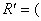

四、隐函数

1. 单变量隐函数

对于由方程

<i>F</i>(<i>x</i>,<i>y</i>)=0

所确定的隐函数有下述定理:

[存在定理]&nbsp; 设函数<i>F</i>(<i>x</i>,<i>y</i>)在点<i>M</i>0(<i>x</i>0,<i>y</i>0)的某一邻域<a href="#None"
name="_ftnref1" title="">*</a><i>R</i>内定义并且满足下列条件:

&nbsp;&nbsp; (i) <i>F</i>(<i>x</i>,<i>y</i>)及其偏导数在<i>R</i>内连续,

&nbsp;&nbsp; (ii) <i>F</i>(<i>x</i>0,<i>y</i>0)=0,

&nbsp;&nbsp; (iii)≠0,

那末在点<i>M</i>0(<i>x</i>0,<i>y</i>0)的某一邻域

;)

内有唯一的单值函数<i>y</i>=<i>f </i>(<i>x</i>)存在,具有下列性质:

1°&nbsp; <i>F</i>[<i>x</i>, <i>f </i>(<i>x</i>)]≡0,且<i>f </i>(<i>x</i>0)=<i>y</i>0,&nbsp;&nbsp;&nbsp;&nbsp;

2°&nbsp; 在区间()内函数<i>f</i>(<i>x</i>)连续,

3°&nbsp; 它在这区间内有连续的导数.

[导数的计算]

&nbsp; (≠0)

&nbsp;&nbsp;&nbsp; (≠0)

 

 

<a href="#None" name="_ftn1" title="">*</a> 邻域的概念见第二十一章，这里<i>M</i>0的领域是指包含<i>M</i>0的某一矩形

