

2.&nbsp; 多变量隐函数

对于由方程

&nbsp;&nbsp;&nbsp;&nbsp;&nbsp;&nbsp;&nbsp;&nbsp;&nbsp;&nbsp;&nbsp;&nbsp;&nbsp;&nbsp;&nbsp;&nbsp;&nbsp;&nbsp;&nbsp;
<i>F</i>(<i>x</i>,<i>y</i>,<i>z</i>)=0

所确定的隐函数有下述定理:

[存在定理]&nbsp; 设函数<i>F</i>(<i>x</i>,<i>y</i>,<i>z</i>)在点<i>P</i>0(<i>x</i>0,<i>y</i>0,<i>z</i>0)的某一邻域<i>R</i>内定义并且满足下列条件:

(i)&nbsp;&nbsp; <i>F</i>(<i>x</i>,<i>y</i>,<i>z</i>)及其偏导数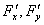,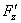在<i>R</i>内连续,

(ii)&nbsp; <i>F</i>(<i>x</i>0,<i>y</i>0,<i>z</i>0)=0,

(iii)&nbsp; (<i>x</i>0,<i>y</i>0,<i>z</i>0)
≠0,

那末在点<i>P</i>0(<i>x</i>0,<i>y</i>0,<i>z</i>0)的某一邻域

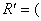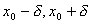;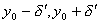;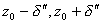)

内有唯一的单值函数<i>z</i>=<i>h</i>(<i>x</i>,<i>y</i>)存在,具有下列性质:

1°&nbsp; <i>F</i>[<i>x</i>,<i>y</i>,<i>h</i>(<i>x</i>,<i>y</i>)]≡0,且<i>h</i>(<i>x</i>0,<i>y</i>0)= <i>z</i>0,

2°&nbsp; 函数<i>h</i>(<i>x</i>,<i>y</i>)连续,

3°&nbsp; 它有连续的偏导数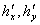.

[导数的计算]

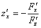,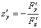&nbsp;&nbsp;&nbsp;&nbsp;&nbsp;&nbsp;&nbsp;&nbsp;&nbsp;&nbsp;&nbsp;&nbsp;&nbsp; (≠0)

&nbsp;&nbsp; 如果需要求所有一,二,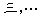各阶的偏导数,只要将恒等式

<i>F</i>(<i>x</i>,<i>y</i>,<i>z</i>)=0

两边求一阶,二阶,三阶,...各阶的全微分,然后和全微分d<i>z</i>,d2<i>z</i>,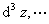的定义形式对比,即得.

注意,对于由方程

<i>F</i>(<i>x</i>1,<i></i>,<i>xn</i>,<i>y</i>)=0

所确定的隐函数有类似结果.

