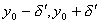

3. 由方程组所确定的隐函数

对由方程组

<pre style='text-align:right' align=right>&nbsp;&nbsp;&nbsp;&nbsp;&nbsp;&nbsp;&nbsp;&nbsp;&nbsp;&nbsp;&nbsp;&nbsp;&nbsp;&nbsp;&nbsp;&nbsp;&nbsp;&nbsp;&nbsp;&nbsp;&nbsp;&nbsp;&nbsp;&nbsp;&nbsp;&nbsp;&nbsp;&nbsp;&nbsp;&nbsp;&nbsp; (1)</pre>

所确定的隐函数有下述定理:

[存在定理]&nbsp; 设函数<i>F</i>(<i>x</i>,<i>y</i>,<i>z</i>)及<i>G</i>(<i>x</i>,<i>y</i>,<i>z</i>)在点<i>P</i>0(<i>x</i>0,<i>y</i>0,<i>z</i>0)的某一邻域<i>R</i>内定义,并且满足下列条件:

(i)&nbsp;&nbsp; <i>F</i>(<i>x</i>,<i>y</i>,<i>z</i>),<i>G</i>(<i>x</i>,<i>y</i>,<i>z</i>)及其所有偏导数都在<i>R</i>内连续,

(ii)&nbsp; <i>F</i>(<i>x</i>0,<i>y</i>0,<i>z</i>0)=0,<i>G</i>(<i>x</i>0,<i>y</i>0,<i>z</i>0)=0,&nbsp;&nbsp;&nbsp;&nbsp;&nbsp;&nbsp;&nbsp;&nbsp;&nbsp;&nbsp;&nbsp;&nbsp;

(iii) 行列式

<i>J</i>(<i>x</i>,<i>y</i>,<i>z</i>)=

在点<i>P</i>0(<i>x</i>0,<i>y</i>0,<i>z</i>0)不等于零:<i>J</i>(<i>x</i>0,<i>y</i>0,<i>z</i>0)≠0.

那末在点<i>P</i>0(<i>x</i>0,<i>y</i>0,<i>z</i>0)的某一邻域

;;)

内有唯一的一组单值函数<i>y</i>=<i>f</i>(<i>x</i>),<i>z</i>=<i>g</i>(<i>x</i>)存在,具有下列性质:

1°&nbsp; <i>F</i>[<i>x</i>,<i>f</i>(<i>x</i>),<i>g</i>(<i>x</i>)]≡0,<i>G</i>[<i>x</i>,<i>f</i>(<i>x</i>),<i>g</i>(<i>x</i>)]≡0,且<i>f</i>(<i>x</i>0)=<i>y</i>0,<i>g</i>(<i>x</i>0)=<i>z</i>0,

2°&nbsp; 在区间()内函数<i>f</i>(<i>x</i>),<i>g</i>(<i>x</i>)连续,

3°&nbsp; 在这区间内有连续导数.

[导数的计算]&nbsp; 将<i>y</i>和<i>z</i>看作<i>x</i>的隐函数,将方程组(1)对<i>x</i>微分得

这是关于及的线性方程组,其行列式<i>J</i>≠0,由此可以解出及.

注意,对于由方程组

所确定的隐函数有类似的结果.

