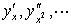
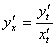
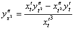
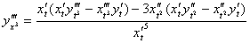
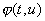
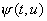
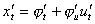
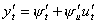
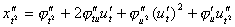
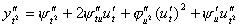

五、微分表达式中的变量替换

1.单变量函数

设<i>y</i>=<i>f </i>(<i>x</i>),并有一个含有自变量、因变量及其导数的表达式

<i>H</i>=<i>F</i>(<i>x</i>,<i>y</i>,)

当作变量替换时,各导数可按下列方法计算:

[作自变量变换的情形]&nbsp; 设变换公式为

<i>x</i>=

这时&nbsp;&nbsp;&nbsp;&nbsp;&nbsp;&nbsp;&nbsp;&nbsp;&nbsp;&nbsp;&nbsp;&nbsp;&nbsp;&nbsp;&nbsp;&nbsp;&nbsp;&nbsp;
&nbsp;&nbsp;&nbsp;&nbsp;&nbsp;&nbsp;&nbsp; ,

<pre style='text-align:right' align=right>&nbsp;&nbsp;&nbsp;&nbsp;&nbsp;&nbsp;&nbsp;&nbsp; &nbsp;&nbsp;&nbsp;&nbsp;&nbsp;&nbsp;&nbsp;&nbsp;&nbsp;&nbsp;&nbsp;&nbsp;&nbsp;&nbsp;&nbsp;&nbsp; (1)</pre>

………………

[自变量和函数都作变换的情形]&nbsp; 设变换公式为

<i>x</i>=,<i>y</i>=

式中<i>t</i>为新的自变量,<i>u</i>为新的函数.

这时,由复合函数的微分法则得到

,

…………………………

把这些式子代入公式(1),即得结果.

