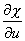

2. 多变量函数

[作自变量变换的情形]&nbsp; 设<i>z</i>=<i>f </i>(<i>x</i>,<i>y</i>),并有一个含有自变量、因变量及其偏导数的表达式

<i>H</i>=<i>F</i>(<i>x</i>,<i>y</i>,<i>z</i>,, ,,…)

变换公式为

<i>x</i>=,<i>y</i>=

式中<i>u</i>和为新的自变量,则偏导数, 由下列方程确定:

=+

其它高次偏导数也可仿此求出.

[自变量和函数都作变换的情形]&nbsp; 设变换公式为

<i>x</i>=,<i>y</i>=,<i>z</i>=

其中<i>u</i>, 为新的自变量, <i>w</i>=<i>w</i>(<i>u</i>,<i>v</i>)为新的函数,则偏导数, 由下列方程确定:

+)++)=+

其他高次偏导数也可仿此求出.

注意,当<i>H</i>内出现的不是个别的偏导数,而是已给阶次的全部偏导数,那末求逐次偏导数时利用全微分比较方便.

