

六、微分学的基本定理(中值定理)

<table cellspacing=0 cellpadding=0 hspace=0 vspace=0 align=left>
 <tr>
  <td valign=top align=left style='padding-top:0mm;padding-right:9.0pt;
  padding-bottom:0mm;padding-left:9.0pt'>
  

  
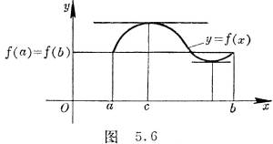

  

  </td>
 </tr>
</table>

[洛尔定理]&nbsp; 如果(i)函数<i>f</i>(<i>x</i>)定义在闭区间[<i>a</i>,<i>b</i>]上而且是连续的,(ii)在开区间(<i>a</i>,<i>b</i>)内存在有限导数,(iii)在区间的两端点处函数值相等:<i> f</i><i> </i>(<i>a</i>)=<i>
f</i><i> </i>(<i>b</i>).那末在<i>a</i>与<i>b</i>之间至少存在一点<i>c</i>,使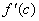=0.即曲线<i>y</i>=<i> f</i><i> </i>(<i>x</i>)在点(<i>c</i>,<i> f</i><i>
</i>(<i>c</i>))处的切线是水平的(图5.6).

特别,若<i>f</i><i> </i>(<i>a</i>)=<i> f</i><i> </i>(<i>b</i>)=0,洛尔定理可简述如下:在一个函数的两个根之间,它的一阶导数至少有一个根.

注意,函数<i>f</i><i> </i>(<i>x</i>)须在闭区间[<i>a</i>,<i>b</i>]上连续,并且在开区间(<i>a</i>,<i>b</i>)内点点要有导数存在,这对于定理的结论的正确性是很要紧的.例如函数

<i>f</i><i> </i>(<i>x</i>)=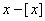在区间[0,1]上,除去在<i>x</i>=1时有间断以外满足定理的一切条件,但在(0,1)内处处都是=1.又例如由等式<i>f</i><i> </i>(<i>x</i>)=<i>x</i>(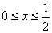)及<i>f</i><i> </i>(<i>x</i>)=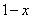(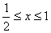)所定义的函数,在这区间内除去当<i>x</i>=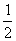时(双边的)导数不存在以外,它也满足定理的一切条件,可是导数在左半区间内等于+1,而在右半区间内等于.

定理的条件(iii)也是很重要的,例如函数<i>f</i><i> </i>(<i>x</i>)=<i>x</i>在区间[0,1]上,除去条件(iii)以外满足定理的一切条件,而它的导数处处是=1.

[中值定理]&nbsp; 如果(i) <i>f</i><i> </i>(<i>x</i>)定义在闭区间[<i>a</i>,<i>b</i>]上而且是连续的,(ii) 在开区间(<i>a</i>,<i>b</i>)内存在有限导数,那末在<i>a</i>与<i>b</i>之间至少存在一点<i>c</i>,满足等式

<pre style='text-align:right' align=right>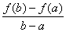= &nbsp;&nbsp;&nbsp;&nbsp;&nbsp;&nbsp;&nbsp;&nbsp;&nbsp;&nbsp;&nbsp;&nbsp; (<i>a</i>&lt;<i>c</i>&lt;<i>b</i>)&nbsp;&nbsp;&nbsp;&nbsp;&nbsp;&nbsp;&nbsp;&nbsp; &nbsp;&nbsp;&nbsp;&nbsp;&nbsp;&nbsp;&nbsp;&nbsp;&nbsp;&nbsp;&nbsp;&nbsp;&nbsp;&nbsp;&nbsp;&nbsp;&nbsp;&nbsp; &nbsp;&nbsp;&nbsp; (1)</pre>

<table cellspacing=0 cellpadding=0 hspace=0 vspace=0 width=200 height=148
 align=left>
 <tr>
  <td valign=top align=left height=148 style='padding-top:0mm;padding-right:
  9.0pt;padding-bottom:0mm;padding-left:9.0pt'>
  

  
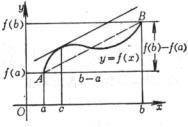

  
&nbsp;&nbsp;&nbsp;&nbsp;&nbsp;&nbsp;&nbsp;&nbsp;&nbsp;&nbsp;&nbsp;&nbsp;&nbsp; 图5.7

  

  </td>
 </tr>
</table>

即曲线<i>y</i>=<i> f</i><i> </i>(<i>x</i>)在点(<i>c</i>,<i>
f</i><i> </i>(<i>c</i>))处的切线与弦<i>AB</i>平行(图5.7).这个定理也称为有限改变量定理或拉格朗日定理. 

(1)式也常写成以下几种形式:

<i>f</i><i> </i>(<i>b</i>)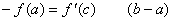

<i>f</i><i> </i>(<i>x</i>+Δ<i>x</i>)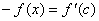Δ<i>x</i>&nbsp;&nbsp;&nbsp; (<i>x</i>&lt;<i>c</i>&lt;<i>x</i>+Δ<i>x</i>)

Δ<i>y</i>=<i> f</i><i> </i>(<i>x</i>+Δ<i>x</i>)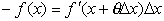&nbsp;&nbsp;&nbsp;&nbsp;&nbsp; (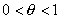)

由中值定理可得

定理&nbsp; 如果在区间[<i>a</i>,<i>b</i>]上的每一点都有=0,那末函数<i>f</i>(<i>x</i>)在这个区间上是一个常数.

[柯西定理]&nbsp; 如果(i)函数<i>f</i>(<i>t</i>)及<i>g</i>(<i>t</i>)在闭区间[<i>a</i>,<i>b</i>]上连续,(ii)在开区间(<i>a</i>,<i>b</i>)内有有限导数,(iii)在区间(<i>a</i>,<i>b</i>)内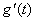≠0.那末在<i>a</i>与<i>b</i>之间至少存在一点<i>c</i>,使

<table cellspacing=0 cellpadding=0 hspace=0 vspace=0 width=186 height=160
 align=left>
 <tr>
  <td valign=top align=left height=160 style='padding-top:0mm;padding-right:
  9.0pt;padding-bottom:0mm;padding-left:9.0pt'>
  

  
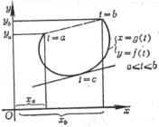

  
图5.8

  

  </td>
 </tr>
</table>

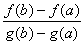=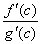&nbsp;&nbsp;&nbsp;&nbsp;&nbsp;&nbsp;&nbsp;&nbsp; (<i>a</i>&lt;<i>c</i>&lt;<i>b</i>)

这公式称为柯西公式(图5.8).柯西定理常称为微分学的广义中值定理,因<i>g</i>(<i>t</i>)=<i>x</i>时,这个公式就是公式(1).

[多变量函数的中值定理]&nbsp; 如果(i)函数<i>f</i>(<i>x</i>,<i>y</i>)定义在闭区域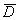上并且连续,(ii)在这区域内部(即在它的所有内点)有连续的偏导数,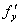,今考察<i>D</i>中的两点

<i>M</i>0(<i>x</i>0,<i>y</i>0)及<i>M</i>1(<i>x</i>0+Δ<i>x</i>,<i>y</i>0+Δ<i>y</i>)

假设这两点能用全部位于<i>D</i>区域内的直线段<i>M</i>0<i>M</i>1来连接,则下面的公式成立:

&nbsp;&nbsp;&nbsp;&nbsp;&nbsp; Δ<i>f</i>(<i>x</i>0,<i>y</i>0)=<i>f</i>(<i>x</i>0+Δ<i>x</i>,<i>y</i>0+Δ<i>y</i>)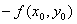

=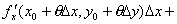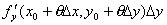&nbsp;&nbsp; (0&lt;<i>θ</i>&lt;1)

由中值定理可得

定理&nbsp; 若在闭连通区域<i>D*</i>内连续的函数<i>f</i>(<i>x</i>,<i>y</i>),在此区域内偏导数都等于零,即

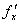==0,

则这函数在区域<i>D</i>内必为常数.

&nbsp;

&nbsp;*&nbsp; 若区域的任意两点可以用一“折线”来连接，而该折线的一切点都在这区域中，这区域就称为连通区域.

