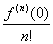

七、泰勒公式与泰勒级数

1. 单变量函数的泰勒公式

[泰勒局部公式]&nbsp; 如果函数<i>f</i>(<i>x</i>)满足条件:(i)在点<i>a</i>的某邻域内有定义,(ii)在此邻域内有一直到阶的导数,,(iii)在点<i>a</i>处有<i>n</i>阶导数,那末<i>f</i>(<i>x</i>)在点<i>a</i>的邻域内可表成以下各种形式:

1°&nbsp; <i>f</i><i> </i>(<i>a</i>+<i>h</i>)=<i>
f</i><i> </i>(<i>a</i>)+

&nbsp;&nbsp;&nbsp;&nbsp;&nbsp;&nbsp;&nbsp;&nbsp;&nbsp;&nbsp;&nbsp;&nbsp;
=&nbsp;&nbsp;&nbsp;&nbsp;&nbsp;&nbsp;&nbsp;&nbsp;&nbsp;&nbsp;&nbsp;&nbsp;
(当<i>h</i>→0)

2°&nbsp; <i>f</i><i> </i>(<i>x</i>)=<i>
f</i><i> </i>(<i>a</i>)+

&nbsp;&nbsp;&nbsp;&nbsp;&nbsp;&nbsp;&nbsp;&nbsp;&nbsp;
=&nbsp;&nbsp;&nbsp;&nbsp;&nbsp;&nbsp;&nbsp;&nbsp;&nbsp;
(当<i>x</i>→<i>a</i>)

特别,当<i>a</i>=0时,有

[马克劳林公式]

<i>f</i><i> </i>(<i>x</i>)=<i>
f</i><i> </i>(0)+

&nbsp;&nbsp;&nbsp;&nbsp;&nbsp;&nbsp;&nbsp;&nbsp;&nbsp;&nbsp;&nbsp;&nbsp;&nbsp;&nbsp;&nbsp;&nbsp;&nbsp;&nbsp;&nbsp;
= &nbsp;&nbsp;&nbsp;&nbsp;
(当<i>x</i>→0)

[泰勒公式]&nbsp; 如果函数<i>f</i><i> </i>(<i>x</i>)满足条件:(i)在闭区间[<i>a</i>,<i>b</i>]上有定义,(ii)在此闭区间上有一直到<i>n</i>阶的连续导数,(iii)当<i>a</i>&lt;<i>x</i>&lt;<i>b</i>时有有限导数,那末<i>f</i>(<i>x</i>)在闭区间[<i>a</i>,<i>b</i>]上可表成以下各种形式:

1°&nbsp; <i>f</i>(<i>a</i>+<i>h</i>)= &nbsp;&nbsp;&nbsp;&nbsp;&nbsp;&nbsp;&nbsp;&nbsp;&nbsp;&nbsp;&nbsp; &nbsp;&nbsp;&nbsp;&nbsp;&nbsp;&nbsp;(<i>a</i>&lt;<i>a</i>+<i>h</i>&lt;<i>b</i>)

式中&nbsp;&nbsp;&nbsp;&nbsp;&nbsp;&nbsp;&nbsp;&nbsp;&nbsp;&nbsp;&nbsp;&nbsp;&nbsp;&nbsp;
<i>Rn</i>(<i>h</i>)=&nbsp;&nbsp;&nbsp; (0&lt;<i>θ</i>&lt;1)&nbsp;&nbsp;&nbsp;
(拉格朗日型余项)

或&nbsp;&nbsp;&nbsp;&nbsp;&nbsp;&nbsp;&nbsp;&nbsp;&nbsp;&nbsp;&nbsp;&nbsp;&nbsp;&nbsp;&nbsp;&nbsp;
<i>Rn</i>(<i>h</i>)<i>=</i>&nbsp;&nbsp; (0&lt;<i>θ</i>&lt;1)&nbsp;&nbsp;
(柯西型余项)

2°&nbsp;&nbsp; <i>f</i>(<i>x</i>)=&nbsp; ()

式中&nbsp;&nbsp;&nbsp;&nbsp;&nbsp;&nbsp;&nbsp;&nbsp;&nbsp;&nbsp;&nbsp;&nbsp;&nbsp;&nbsp;
<i>Rn</i>(<i>x</i>)=&nbsp; (<i>a</i>&lt;<i>ξ</i>&lt;<i>b</i>)&nbsp;&nbsp;&nbsp;&nbsp;&nbsp;&nbsp;&nbsp;&nbsp;
(拉格朗日型余项)

或&nbsp;&nbsp;&nbsp;&nbsp;&nbsp;&nbsp;&nbsp;&nbsp;&nbsp;&nbsp;&nbsp;&nbsp;&nbsp;&nbsp;&nbsp;
<i>Rn</i>(<i>x</i>)=&nbsp; (0&lt;<i>θ</i>&lt;1)&nbsp;&nbsp;&nbsp;
(柯西型余项)

特别,当<i>a</i>=0时,有

[马克劳林公式]

<i>&nbsp;&nbsp;&nbsp;&nbsp;&nbsp;&nbsp;&nbsp;
f</i>(<i>x</i>)=&nbsp;&nbsp;&nbsp;&nbsp;&nbsp;&nbsp;&nbsp;&nbsp;&nbsp;
&nbsp;&nbsp;&nbsp;&nbsp;&nbsp;()

式中&nbsp;&nbsp;&nbsp;&nbsp;&nbsp;&nbsp;&nbsp;&nbsp;&nbsp;&nbsp;&nbsp;&nbsp;&nbsp;&nbsp;&nbsp;
<i>Rn</i>(<i>x</i>)= (<i>a</i>&lt;<i>ξ</i>&lt;<i>b</i>)&nbsp;&nbsp;&nbsp;&nbsp;&nbsp;&nbsp;&nbsp;
(拉格朗日型余项)

或&nbsp;&nbsp;&nbsp;&nbsp;&nbsp;&nbsp;&nbsp;&nbsp;&nbsp;&nbsp;&nbsp;&nbsp;&nbsp;&nbsp;&nbsp;&nbsp;&nbsp;
<i>Rn</i>(<i>x</i>)= (0&lt;<i>θ</i>&lt;1)&nbsp;&nbsp;&nbsp;&nbsp;
(柯西型余项)

[泰勒级数]&nbsp; 在带余项的泰勒公式2°中,如果把展开式进行到()的任意高的乘幂,则有

<i>f</i>(<i>x</i>)=<i>f</i>(<i>a</i>)+

不论它是否收敛,以及它的和是否等于<i>f</i>(<i>x</i>),都称它为函数<i>f</i>(<i>x</i>)的泰勒级数.()的乘幂的系数

<i>f</i>(<i>a</i>),,,…,,…

称为泰勒系数.

[马克劳林级数]&nbsp; 在带余项的马克劳林公式中,如果展开式进行到<i>x</i>的任意高的乘幂,则有

<i>f</i>(<i>x</i>)=<i>f</i>(0)+

不论它是否收敛,以及它的和是否等于<i>f</i>(<i>x</i>),都称它为函数<i>f</i>(<i>x</i>)的马克劳林级数.<i>x</i>的乘幂的系数

<i>f</i><i> </i>(0),,,…,,…

称为马克劳林系数.

多项式的泰勒公式(秦九韶法)见第三章,§2,一.

