

2. 多变量函数的泰勒公式

[泰勒公式]&nbsp; 假定在某一点(<i>x</i>0,<i>y</i>0)的邻域<i>D</i>内二元函数<i>f</i>(<i>x</i>,<i>y</i>)有直到<i>n</i>+1阶为止的一切连续偏导数.分别给<i>x</i>及<i>y</i>以改变量<i>h</i>及<i>k</i>,使连结点(<i>x</i>0,<i>y</i>0)及(<i>x</i>0+<i>h</i>,<i>y</i>0+<i>k</i>)的直线段不越出<i>D</i>外,那末<i>f</i><i> </i>(<i>x</i>,<i>y</i>)在<i>D</i>内可表成形式:

1° <i>f</i><i> </i>(<i>x</i>0+<i>h</i>,<i>y</i>0+<i>k</i>)

<pre>&nbsp;&nbsp;&nbsp;&nbsp;&nbsp; =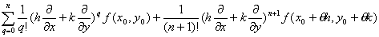&nbsp;&nbsp;&nbsp;&nbsp;&nbsp; </pre>

&nbsp;&nbsp;&nbsp;&nbsp;&nbsp;&nbsp;&nbsp;&nbsp;&nbsp;&nbsp;&nbsp;&nbsp;&nbsp;&nbsp;&nbsp;&nbsp;&nbsp;&nbsp;&nbsp;&nbsp;&nbsp;&nbsp;&nbsp;&nbsp;&nbsp;&nbsp;&nbsp;&nbsp;&nbsp;&nbsp;&nbsp;&nbsp;&nbsp;&nbsp;&nbsp;&nbsp;&nbsp;&nbsp;&nbsp;&nbsp;&nbsp;&nbsp;&nbsp;&nbsp;&nbsp;&nbsp;&nbsp;&nbsp;&nbsp;&nbsp;&nbsp;&nbsp;&nbsp;&nbsp;&nbsp;&nbsp;
(0&lt;<i>θ</i>&lt;1)

式中符号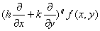

的意义如下:把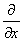,看作一个数(而不是看作微分运算的符号),并根据二项公式展开,得到

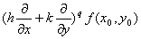=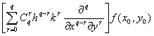=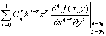

&nbsp;&nbsp;&nbsp;&nbsp;&nbsp;&nbsp; 20&nbsp;&nbsp;
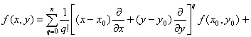

&nbsp;&nbsp;&nbsp;&nbsp;&nbsp;&nbsp;&nbsp;&nbsp;&nbsp;&nbsp;&nbsp;&nbsp;&nbsp;&nbsp;&nbsp;&nbsp;&nbsp;&nbsp;&nbsp;&nbsp;&nbsp;&nbsp;&nbsp;&nbsp;&nbsp;&nbsp;&nbsp; 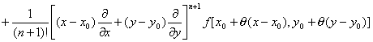

&nbsp;&nbsp;&nbsp;&nbsp;&nbsp;&nbsp;&nbsp;&nbsp;&nbsp;&nbsp;&nbsp;&nbsp;&nbsp;&nbsp;&nbsp;&nbsp;&nbsp;&nbsp;&nbsp;&nbsp;&nbsp;&nbsp;&nbsp;&nbsp;&nbsp;&nbsp;&nbsp;&nbsp;&nbsp;&nbsp;&nbsp;&nbsp;&nbsp;&nbsp;&nbsp;&nbsp;&nbsp;&nbsp;&nbsp;&nbsp;&nbsp;&nbsp;&nbsp;&nbsp;&nbsp;&nbsp;&nbsp;&nbsp;&nbsp;&nbsp;&nbsp;&nbsp;&nbsp;&nbsp;&nbsp;&nbsp;&nbsp;&nbsp;&nbsp;&nbsp;&nbsp;&nbsp;&nbsp;&nbsp;&nbsp;&nbsp;&nbsp;&nbsp;&nbsp;&nbsp;&nbsp;&nbsp;&nbsp;&nbsp;&nbsp;&nbsp;&nbsp;&nbsp;&nbsp;&nbsp;&nbsp;&nbsp;&nbsp;&nbsp;&nbsp;&nbsp;&nbsp;&nbsp;&nbsp;&nbsp;&nbsp;&nbsp;&nbsp;&nbsp;&nbsp;&nbsp;&nbsp;&nbsp;&nbsp;&nbsp;&nbsp;&nbsp;&nbsp;&nbsp;&nbsp;&nbsp;&nbsp;&nbsp;&nbsp;&nbsp;&nbsp; &nbsp;&nbsp;&nbsp;&nbsp;&nbsp;&nbsp;&nbsp;
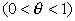

&nbsp;特别,当<i>x</i>0=0,<i>y</i>0=0时,得到

[马克劳林公式]

<i>f</i><i> </i>(<i>x</i>,<i>y</i>)=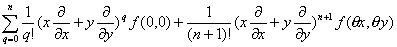&nbsp;&nbsp; 

对二元以上的多变量函数有类似的公式.

[泰勒级数]&nbsp; 在上面泰勒公式2°中,如果把展开式进行到(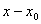)和(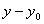)的任意高的乘幂,则有

<i>f</i><i> </i>(<i>x</i>,<i>y</i>)=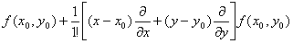

&nbsp;
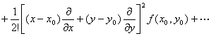

&nbsp;
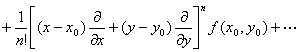

不论它是否收敛,以及它的和是否等于<i>f</i>(<i>x</i>,<i>y</i>),都称它为<i>f</i>(<i>x</i>,<i>y</i>)的泰勒级数.

[马克劳林级数]&nbsp; 在上面马克劳林公式中,如果把展开式进行到<i>x</i>,<i>y</i>的任意高的乘幂,则有

<i>f</i><i> </i>(<i>x</i>,<i>y</i>)=<i>
f</i><i> </i>(0,0)+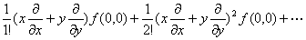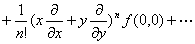

不论它是否收敛,以及它的和是否等于<i>f</i><i> </i>(<i>x</i>,<i>y</i>),都称它为<i>f</i><i> </i>(<i>x</i>,<i>y</i>)的马克劳林级数.

