

八、幂级数

1．单变量的幂级数

[定义]&nbsp; 下列形式的级数

<pre style='text-align:right' align=right>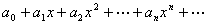&nbsp;&nbsp;&nbsp;&nbsp;&nbsp;&nbsp;&nbsp;&nbsp;&nbsp;&nbsp;&nbsp;&nbsp;&nbsp;&nbsp;&nbsp;&nbsp;&nbsp;&nbsp;&nbsp;&nbsp;&nbsp;&nbsp; &nbsp;&nbsp;&nbsp;&nbsp; （1）</pre>

（式中<i>a</i>0,<i>a</i>1,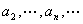都是实常数）称为<i>x</i>的幂级数.更一般地，级数

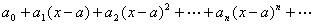

(式中<i>a</i>是一个实常数)也称为幂级数.

[绝对收敛]&nbsp; 如果级数（1）当<i>x</i>=时收敛，那末对于满足|<i>x</i>|&lt;||的任何<i>x</i>的值，级数（1）都绝对收敛.

[收敛半径与收敛区间]&nbsp; 对于任何一个幂级数，都有一个数<i>R</i>(0≤<i>R</i>&lt;+∞),使得当|<i>x</i>|&lt;<i>R</i>时，级数绝对收敛，当|<i>x</i>|&gt;<i>R</i>时，级数发散.这个数<i>R</i>称为给定级数的收敛半径，区间(－<i>R</i>,<i>R</i>)称为它的收敛区间，而在区间的两个端点<i>x</i>=<i>R</i>和<i>x</i>=－<i>R</i>，级数可能收敛也可能发散.

收敛半径<i>R</i>可按柯西-阿达玛公式

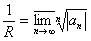

或公式&nbsp;&nbsp;&nbsp;&nbsp;
&nbsp;&nbsp;&nbsp;&nbsp;&nbsp;&nbsp;&nbsp;&nbsp;&nbsp;&nbsp;&nbsp;&nbsp;&nbsp;&nbsp;&nbsp;&nbsp;&nbsp;&nbsp;&nbsp;&nbsp;&nbsp;&nbsp;&nbsp;&nbsp;&nbsp;&nbsp;&nbsp;&nbsp;&nbsp;&nbsp;&nbsp;&nbsp;&nbsp;&nbsp;&nbsp;&nbsp;&nbsp;&nbsp;&nbsp;&nbsp;&nbsp;&nbsp;&nbsp;&nbsp;&nbsp; <i>R</i>=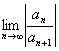

计算(若极限存在).

[阿贝尔定理]&nbsp; 若幂级数<i>S</i>(<i>x</i>)=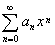( |<i>x</i>|&lt;<i>R</i>)在收敛区间的端点<i>x</i>=<i>R</i>处收敛，则

<i>S</i>(<i>R</i>)=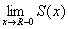

[内闭一致收敛]&nbsp; 若级数（1）的收敛半径等于<i>R</i>，则对任意满足0&lt;&lt;<i>R</i>的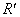，级数（1）在区间[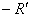，]上一致收敛.

[连续]&nbsp; 幂级数的和在收敛区间内的每一点处都连续.

[逐项积分]&nbsp; 在级数（1）的收敛区间内的任何一点<i>x</i>，都有

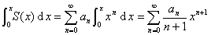

式中<i>S</i>(<i>x</i>)表示级数（1）的和.

[逐项微分]&nbsp; 幂级数（1）的和<i>S</i>(<i>x</i>)在这个级数的收敛区间内的任一点上都可微.逐项微分级数（1）得到的级数

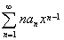

与（1）具有同样的收敛半径，并且这个级数的和就等于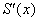.

[高阶导数]&nbsp; 若级数（1）有收敛半径<i>R</i>，则它的和<i>S</i>(<i>x</i>)在区间(,<i>R</i>)内的任何一点都有任意阶导数，并且函数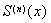（<i>n</i>=1,）就是逐项微分级数（1）<i>n</i>次所得到的那个级数（它的收敛半径也同样是<i>R</i>）的和

=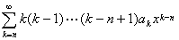&nbsp;&nbsp;&nbsp;&nbsp;&nbsp;&nbsp;&nbsp;&nbsp;&nbsp;&nbsp;&nbsp; （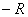&lt;<i>x</i>&lt;<i>R</i>）

