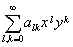
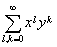
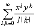
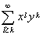
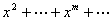
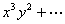
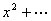
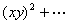
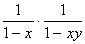

2．多变量的幂级数

[双变量的幂级数]&nbsp;
按变量<i>x</i>,<i>y</i>的正整数幂次排列的形如

<pre style='text-align:right' align=right>&nbsp;&nbsp;&nbsp;&nbsp; &nbsp;&nbsp;&nbsp;&nbsp;&nbsp;&nbsp;&nbsp;&nbsp;&nbsp;&nbsp;&nbsp;&nbsp;&nbsp;&nbsp;&nbsp;&nbsp;&nbsp;&nbsp;&nbsp;&nbsp;&nbsp;&nbsp;&nbsp;&nbsp;&nbsp;&nbsp;&nbsp;&nbsp;&nbsp;&nbsp;&nbsp;&nbsp;&nbsp;&nbsp;&nbsp;&nbsp;&nbsp;&nbsp;&nbsp;&nbsp;&nbsp;&nbsp;&nbsp;&nbsp;&nbsp;&nbsp; （2）</pre>

的重级数称为双变量<i>x</i>,<i>y</i>的幂级数.

多变量幂级数的收敛范围的研究有很多地方与单变量的不同，但仍有

定理&nbsp; 若在<i>x</i>=<i>x</i>0,<i>y</i>=<i>y</i>0时级数（2）收敛，则当

|<i>x</i>|&lt;|<i>x</i>0|,|<i>y</i>|&lt;|<i>y</i>0|

时，级数也收敛.

[收敛范围]&nbsp; 如果<i>M</i>是两个变数<i>x</i>,<i>y</i>的区域，在其中各点上幂级数（2）都收敛，而在其外各点上幂级数（2）发散，在边界点上可能发散，也可能收敛.那末区域<i>M</i>称为幂级数（2）的收敛范围.

双变量的幂级数的收敛范围并不一定是|<i>x</i>|&lt;<i>R</i>1，|<i>y</i>|&lt;<i>R</i>2的形式，例如

1°&nbsp; 级数

的收敛范围是|<i>x</i>|&lt;1，|<i>y</i>|&lt;1.

2°&nbsp;
级数

处处收敛.

3°&nbsp;
级数

=1+<i>x</i>++<i>xy</i>+<i>x</i>2<i>y</i>+<i>x</i>3<i>y</i>++<i>x</i>2<i>y</i>2+

(=(1+<i>x</i>+<i></i>)[1+<i>xy</i>+]=)

的收敛范围是|<i>x</i>|&lt;1，|<i>xy</i>|&lt;1.

以上结果容易推广到多变量的幂级数中去.

