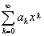
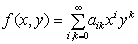
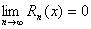
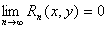

3．函数的幂级数展开式

[幂级数的唯一性定理]&nbsp;
如果函数<i>f</i>(<i>x</i>)(或<i>f</i>(<i>x</i>,<i>y</i>))在<i>x</i>=0(或<i>x</i>=0,<i>y</i>=0)可以展开成幂级数

<i>f</i>(<i>x</i>)=

或&nbsp;&nbsp;&nbsp;&nbsp;&nbsp;&nbsp;&nbsp;&nbsp;&nbsp;&nbsp;&nbsp;&nbsp;&nbsp;&nbsp;&nbsp;&nbsp;&nbsp;&nbsp;&nbsp;&nbsp;&nbsp;&nbsp;&nbsp;&nbsp;&nbsp;&nbsp;&nbsp;&nbsp;&nbsp;&nbsp;&nbsp;&nbsp;&nbsp;&nbsp;&nbsp;&nbsp;&nbsp;&nbsp;&nbsp;&nbsp;&nbsp;&nbsp;&nbsp;&nbsp; 

那末这个幂级数就是它的马克劳林级数.

[幂级数的存在性定理]

1°&nbsp;
若函数<i>f</i><i> </i>(<i>x</i>)在<i>x</i>=0具有任意阶导数，且当≤<i>x</i>≤<i>R</i>时

式中<i>Rn</i>(<i>x</i>)是马克劳林公式的余项，则函数<i>f</i>(<i>x</i>)在区间≤<i>x</i>≤<i>R</i>上可以展开成幂级数.实际上可以证明，存在由函数<i>f</i>(<i>x</i>)产生的马克劳林级数，它虽然收敛，但它的和却不等于<i>f</i><i> </i>(<i>x</i>).

2°&nbsp;
若函数<i>f</i><i> </i>(<i>x</i>,<i>y</i>)在点(0,0)具有任意阶偏导数，且当(<i>x</i>,<i>y</i>)是<i>xy</i>平面上某一区域<i>M</i>上的点时

式中<i>Rn</i>(<i>x</i>,<i>y</i>)是马克劳林公式的余项，则函数<i>f</i>(<i>x</i>,<i>y</i>)在区域<i>M</i>上可以展开成幂级数.

上述理论容易推广到二元以上的多变量函数的情形.

