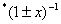
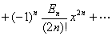
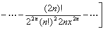

九、实数域上函数的幂级数展开式表

<table class=MsoNormalTable border=1 cellspacing=0 cellpadding=0
 style='border-collapse:collapse;border:none'>
 <tr>
  <td width=112 valign=top style='width:84.0pt;border:solid windowtext 1.0pt;
  border-left:none;padding:0mm 5.4pt 0mm 5.4pt'>
  
&nbsp; 函 数

  </td>
  <td width=385 valign=top style='width:288.75pt;border:solid windowtext 1.0pt;
  border-left:none;padding:0mm 5.4pt 0mm 5.4pt'>
  
幂 级 数 展 开 式

  </td>
  <td width=126 valign=top style='width:94.5pt;border-top:solid windowtext 1.0pt;
  border-left:none;border-bottom:solid windowtext 1.0pt;border-right:none;
  padding:0mm 5.4pt 0mm 5.4pt'>
  
收 敛 域

  </td>
 </tr>
 <tr>
  <td width=112 valign=top style='width:84.0pt;border-top:none;border-left:
  none;border-bottom:solid windowtext 1.0pt;border-right:solid windowtext 1.0pt;
  padding:0mm 5.4pt 0mm 5.4pt'>
  
[二项式]

  
&nbsp;

  
(<i>m</i>&gt;0)

  
&nbsp;&nbsp; 函 数

  </td>
  <td width=385 valign=top style='width:288.75pt;border-top:none;border-left:
  none;border-bottom:solid windowtext 1.0pt;border-right:solid windowtext 1.0pt;
  padding:0mm 5.4pt 0mm 5.4pt'>
  
&nbsp;&nbsp;&nbsp;&nbsp; 

  

  
(当<i>m</i>为正整数时，只包含<i>m</i>+1项)

  
幂 级 数 展 开 式

  </td>
  <td width=126 valign=top style='width:94.5pt;border:none;border-bottom:solid windowtext 1.0pt;
  padding:0mm 5.4pt 0mm 5.4pt'>
  
1

  
收 敛 域

  </td>
 </tr>
 <tr>
  <td width=112 valign=top style='width:84.0pt;border:none;border-right:solid windowtext 1.0pt;
  padding:0mm 5.4pt 0mm 5.4pt'>
  

  

  
(<i>m</i>&gt;0)

  </td>
  <td width=385 valign=top style='width:288.75pt;border:none;border-right:solid windowtext 1.0pt;
  padding:0mm 5.4pt 0mm 5.4pt'>
  

  

  
&nbsp;&nbsp; 

  

  </td>
  <td width=126 valign=top style='width:94.5pt;border:none;padding:0mm 5.4pt 0mm 5.4pt'>
  
1

  

  </td>
 </tr>
 <tr>
  <td width=112 valign=top style='width:84.0pt;border:none;border-right:solid windowtext 1.0pt;
  padding:0mm 5.4pt 0mm 5.4pt'>
  

  

  </td>
  <td width=385 valign=top style='width:288.75pt;border:none;border-right:solid windowtext 1.0pt;
  padding:0mm 5.4pt 0mm 5.4pt'>
  

  

  </td>
  <td width=126 valign=top style='width:94.5pt;border:none;padding:0mm 5.4pt 0mm 5.4pt'>
  
&lt;1

  </td>
 </tr>
 <tr>
  <td width=112 valign=top style='width:84.0pt;border:none;border-right:solid windowtext 1.0pt;
  padding:0mm 5.4pt 0mm 5.4pt'>
  

  </td>
  <td width=385 valign=top style='width:288.75pt;border:none;border-right:solid windowtext 1.0pt;
  padding:0mm 5.4pt 0mm 5.4pt'>
  

  </td>
  <td width=126 valign=top style='width:94.5pt;border:none;padding:0mm 5.4pt 0mm 5.4pt'>
  
&lt;1

  </td>
 </tr>
 <tr>
  <td width=112 valign=top style='width:84.0pt;border:none;border-right:solid windowtext 1.0pt;
  padding:0mm 5.4pt 0mm 5.4pt'>
  

  </td>
  <td width=385 valign=top style='width:288.75pt;border:none;border-right:solid windowtext 1.0pt;
  padding:0mm 5.4pt 0mm 5.4pt'>
  

  </td>
  <td width=126 valign=top style='width:94.5pt;border:none;padding:0mm 5.4pt 0mm 5.4pt'>
  
&lt;1

  </td>
 </tr>
 <tr>
  <td width=112 valign=top style='width:84.0pt;border:none;border-right:solid windowtext 1.0pt;
  padding:0mm 5.4pt 0mm 5.4pt'>
  

  </td>
  <td width=385 valign=top style='width:288.75pt;border:none;border-right:solid windowtext 1.0pt;
  padding:0mm 5.4pt 0mm 5.4pt'>
  

  </td>
  <td width=126 valign=top style='width:94.5pt;border:none;padding:0mm 5.4pt 0mm 5.4pt'>
  
&lt;1

  </td>
 </tr>
 <tr>
  <td width=112 valign=top style='width:84.0pt;border:none;border-right:solid windowtext 1.0pt;
  padding:0mm 5.4pt 0mm 5.4pt'>
  

  
(<i>m</i>&gt;0)

  </td>
  <td width=385 valign=top style='width:288.75pt;border:none;border-right:solid windowtext 1.0pt;
  padding:0mm 5.4pt 0mm 5.4pt'>
  

  
&nbsp;&nbsp; 

  
&nbsp;&nbsp;
  

  </td>
  <td width=126 valign=top style='width:94.5pt;border:none;padding:0mm 5.4pt 0mm 5.4pt'>
  
&lt;

  </td>
 </tr>
 <tr>
  <td width=112 valign=top style='width:84.0pt;border:none;border-right:solid windowtext 1.0pt;
  padding:0mm 5.4pt 0mm 5.4pt'>
  

  </td>
  <td width=385 valign=top style='width:288.75pt;border:none;border-right:solid windowtext 1.0pt;
  padding:0mm 5.4pt 0mm 5.4pt'>
  

  </td>
  <td width=126 valign=top style='width:94.5pt;border:none;padding:0mm 5.4pt 0mm 5.4pt'>
  
&lt;

  </td>
 </tr>
 <tr>
  <td width=112 valign=top style='width:84.0pt;border:none;border-right:solid windowtext 1.0pt;
  padding:0mm 5.4pt 0mm 5.4pt'>
  

  
(<i>p</i>&gt;0或<i>q</i>&gt;0)

  </td>
  <td width=385 valign=top style='width:288.75pt;border:none;border-right:solid windowtext 1.0pt;
  padding:0mm 5.4pt 0mm 5.4pt'>
  

  </td>
  <td width=126 valign=top style='width:94.5pt;border:none;padding:0mm 5.4pt 0mm 5.4pt'>
  
≤1

  </td>
 </tr>
 <tr>
  <td width=112 valign=top style='width:84.0pt;border:none;border-right:solid windowtext 1.0pt;
  padding:0mm 5.4pt 0mm 5.4pt'>
  
[三角函数]

  

  </td>
  <td width=385 valign=top style='width:288.75pt;border:none;border-right:solid windowtext 1.0pt;
  padding:0mm 5.4pt 0mm 5.4pt'>
  

  </td>
  <td width=126 valign=top style='width:94.5pt;border:none;padding:0mm 5.4pt 0mm 5.4pt'>
  
&lt;∞

  </td>
 </tr>
 <tr>
  <td width=112 valign=top style='width:84.0pt;border:none;border-right:solid windowtext 1.0pt;
  padding:0mm 5.4pt 0mm 5.4pt'>
  

  </td>
  <td width=385 valign=top style='width:288.75pt;border:none;border-right:solid windowtext 1.0pt;
  padding:0mm 5.4pt 0mm 5.4pt'>
  

  </td>
  <td width=126 valign=top style='width:94.5pt;border:none;padding:0mm 5.4pt 0mm 5.4pt'>
  
&lt;∞

  </td>
 </tr>
 <tr>
  <td width=112 valign=top style='width:84.0pt;border-top:none;border-left:
  none;border-bottom:solid windowtext 1.0pt;border-right:solid windowtext 1.0pt;
  padding:0mm 5.4pt 0mm 5.4pt'>
  

  </td>
  <td width=385 valign=top style='width:288.75pt;border-top:none;border-left:
  none;border-bottom:solid windowtext 1.0pt;border-right:solid windowtext 1.0pt;
  padding:0mm 5.4pt 0mm 5.4pt'>
  

  </td>
  <td width=126 valign=top style='width:94.5pt;border:none;border-bottom:solid windowtext 1.0pt;
  padding:0mm 5.4pt 0mm 5.4pt'>
  
&lt;∞

  </td>
 </tr>
 <tr>
  <td width=112 valign=top style='width:84.0pt;border-top:none;border-left:
  none;border-bottom:solid windowtext 1.0pt;border-right:solid windowtext 1.0pt;
  padding:0mm 5.4pt 0mm 5.4pt'>
  
函 数

  </td>
  <td width=385 valign=top style='width:288.75pt;border-top:none;border-left:
  none;border-bottom:solid windowtext 1.0pt;border-right:solid windowtext 1.0pt;
  padding:0mm 5.4pt 0mm 5.4pt'>
  
&nbsp;&nbsp;&nbsp;&nbsp;&nbsp;&nbsp;&nbsp;&nbsp;&nbsp;&nbsp;&nbsp;
  幂 级 数 展 开 式

  </td>
  <td width=126 valign=top style='width:94.5pt;border:none;border-bottom:solid windowtext 1.0pt;
  padding:0mm 5.4pt 0mm 5.4pt'>
  
收 敛 域

  </td>
 </tr>
 <tr>
  <td width=112 valign=top style='width:84.0pt;border:none;border-right:solid windowtext 1.0pt;
  padding:0mm 5.4pt 0mm 5.4pt'>
  

  

  </td>
  <td width=385 valign=top style='width:288.75pt;border:none;border-right:solid windowtext 1.0pt;
  padding:0mm 5.4pt 0mm 5.4pt'>
  

  

  

  
&nbsp;&nbsp;&nbsp;&nbsp;&nbsp;&nbsp;&nbsp;&nbsp;&nbsp;&nbsp;
  

  
(式中<i>Bn</i>为伯努利数，下同，见231页的附表)

  </td>
  <td width=126 valign=top style='width:94.5pt;border:none;padding:0mm 5.4pt 0mm 5.4pt'>
  
&lt;∞

  
&lt;

  </td>
 </tr>
 <tr>
  <td width=112 valign=top style='width:84.0pt;border:none;border-right:solid windowtext 1.0pt;
  padding:0mm 5.4pt 0mm 5.4pt'>
  

  </td>
  <td width=385 valign=top style='width:288.75pt;border:none;border-right:solid windowtext 1.0pt;
  padding:0mm 5.4pt 0mm 5.4pt'>
  

  
&nbsp;&nbsp;&nbsp;&nbsp;&nbsp;&nbsp;&nbsp;&nbsp;&nbsp;&nbsp;&nbsp;&nbsp;&nbsp;&nbsp;&nbsp;&nbsp;&nbsp;&nbsp;&nbsp;
  

  </td>
  <td width=126 valign=top style='width:94.5pt;border:none;padding:0mm 5.4pt 0mm 5.4pt'>
  
0&lt;&lt;

  </td>
 </tr>
 <tr>
  <td width=112 valign=top style='width:84.0pt;border:none;border-right:solid windowtext 1.0pt;
  padding:0mm 5.4pt 0mm 5.4pt'>
  

  </td>
  <td width=385 valign=top style='width:288.75pt;border:none;border-right:solid windowtext 1.0pt;
  padding:0mm 5.4pt 0mm 5.4pt'>
  

  
&nbsp;&nbsp;&nbsp;&nbsp;&nbsp;&nbsp;&nbsp;&nbsp;&nbsp;&nbsp;&nbsp;&nbsp;
  &nbsp;&nbsp;&nbsp;&nbsp;&nbsp;

  
(式中<i>En</i>为欧拉数，见231页的附表)

  </td>
  <td width=126 valign=top style='width:94.5pt;border:none;padding:0mm 5.4pt 0mm 5.4pt'>
  
&lt;

  </td>
 </tr>
 <tr>
  <td width=112 valign=top style='width:84.0pt;border:none;border-right:solid windowtext 1.0pt;
  padding:0mm 5.4pt 0mm 5.4pt'>
  

  </td>
  <td width=385 valign=top style='width:288.75pt;border:none;border-right:solid windowtext 1.0pt;
  padding:0mm 5.4pt 0mm 5.4pt'>
  

  

  </td>
  <td width=126 valign=top style='width:94.5pt;border:none;padding:0mm 5.4pt 0mm 5.4pt'>
  
0&lt;&lt;

  </td>
 </tr>
 <tr>
  <td width=112 valign=top style='width:84.0pt;border:none;border-right:solid windowtext 1.0pt;
  padding:0mm 5.4pt 0mm 5.4pt'>
  
[反三角函数]

  

  </td>
  <td width=385 valign=top style='width:288.75pt;border:none;border-right:solid windowtext 1.0pt;
  padding:0mm 5.4pt 0mm 5.4pt'>
  

  

  </td>
  <td width=126 valign=top style='width:94.5pt;border:none;padding:0mm 5.4pt 0mm 5.4pt'>
  
&lt;1

  </td>
 </tr>
 <tr>
  <td width=112 valign=top style='width:84.0pt;border:none;border-right:solid windowtext 1.0pt;
  padding:0mm 5.4pt 0mm 5.4pt'>
  

  </td>
  <td width=385 valign=top style='width:288.75pt;border:none;border-right:solid windowtext 1.0pt;
  padding:0mm 5.4pt 0mm 5.4pt'>
  

  

  </td>
  <td width=126 valign=top style='width:94.5pt;border:none;padding:0mm 5.4pt 0mm 5.4pt'>
  
&lt;1

  </td>
 </tr>
 <tr>
  <td width=112 valign=top style='width:84.0pt;border-top:none;border-left:
  none;border-bottom:solid windowtext 1.0pt;border-right:solid windowtext 1.0pt;
  padding:0mm 5.4pt 0mm 5.4pt'>
  

  </td>
  <td width=385 valign=top style='width:288.75pt;border-top:none;border-left:
  none;border-bottom:solid windowtext 1.0pt;border-right:solid windowtext 1.0pt;
  padding:0mm 5.4pt 0mm 5.4pt'>
  

  </td>
  <td width=126 valign=top style='width:94.5pt;border:none;border-bottom:solid windowtext 1.0pt;
  padding:0mm 5.4pt 0mm 5.4pt'>
  
&lt;1

  
1

  </td>
 </tr>
 <tr>
  <td width=112 valign=top style='width:84.0pt;border-top:none;border-left:
  none;border-bottom:solid windowtext 1.0pt;border-right:solid windowtext 1.0pt;
  padding:0mm 5.4pt 0mm 5.4pt'>
  
函 数

  </td>
  <td width=385 valign=top style='width:288.75pt;border-top:none;border-left:
  none;border-bottom:solid windowtext 1.0pt;border-right:solid windowtext 1.0pt;
  padding:0mm 5.4pt 0mm 5.4pt'>
  
幂 级 数 展 开 式

  </td>
  <td width=126 valign=top style='width:94.5pt;border:none;border-bottom:solid windowtext 1.0pt;
  padding:0mm 5.4pt 0mm 5.4pt'>
  
收 敛 域

  </td>
 </tr>
 <tr>
  <td width=112 valign=top style='width:84.0pt;border:none;border-right:solid windowtext 1.0pt;
  padding:0mm 5.4pt 0mm 5.4pt'>
  

  
[指数函数]

  

  </td>
  <td width=385 valign=top style='width:288.75pt;border:none;border-right:solid windowtext 1.0pt;
  padding:0mm 5.4pt 0mm 5.4pt'>
  

  

  </td>
  <td width=126 valign=top style='width:94.5pt;border:none;padding:0mm 5.4pt 0mm 5.4pt'>
  
&lt;1

  
&lt;∞

  </td>
 </tr>
 <tr>
  <td width=112 valign=top style='width:84.0pt;border:none;border-right:solid windowtext 1.0pt;
  padding:0mm 5.4pt 0mm 5.4pt'>
  

  </td>
  <td width=385 valign=top style='width:288.75pt;border:none;border-right:solid windowtext 1.0pt;
  padding:0mm 5.4pt 0mm 5.4pt'>
  

  </td>
  <td width=126 valign=top style='width:94.5pt;border:none;padding:0mm 5.4pt 0mm 5.4pt'>
  
&lt;∞

  </td>
 </tr>
 <tr>
  <td width=112 valign=top style='width:84.0pt;border:none;border-right:solid windowtext 1.0pt;
  padding:0mm 5.4pt 0mm 5.4pt'>
  

  </td>
  <td width=385 valign=top style='width:288.75pt;border:none;border-right:solid windowtext 1.0pt;
  padding:0mm 5.4pt 0mm 5.4pt'>
  

  
&nbsp;&nbsp;&nbsp;&nbsp;&nbsp;&nbsp;&nbsp;&nbsp;&nbsp;&nbsp;
  &nbsp;

  </td>
  <td width=126 valign=top style='width:94.5pt;border:none;padding:0mm 5.4pt 0mm 5.4pt'>
  
&lt;

  </td>
 </tr>
 <tr>
  <td width=112 valign=top style='width:84.0pt;border:none;border-right:solid windowtext 1.0pt;
  padding:0mm 5.4pt 0mm 5.4pt'>
  

  </td>
  <td width=385 valign=top style='width:288.75pt;border:none;border-right:solid windowtext 1.0pt;
  padding:0mm 5.4pt 0mm 5.4pt'>
  

  </td>
  <td width=126 valign=top style='width:94.5pt;border:none;padding:0mm 5.4pt 0mm 5.4pt'>
  
&lt;∞

  </td>
 </tr>
 <tr>
  <td width=112 valign=top style='width:84.0pt;border:none;border-right:solid windowtext 1.0pt;
  padding:0mm 5.4pt 0mm 5.4pt'>
  

  </td>
  <td width=385 valign=top style='width:288.75pt;border:none;border-right:solid windowtext 1.0pt;
  padding:0mm 5.4pt 0mm 5.4pt'>
  

  </td>
  <td width=126 valign=top style='width:94.5pt;border:none;padding:0mm 5.4pt 0mm 5.4pt'>
  
&lt;∞

  </td>
 </tr>
 <tr>
  <td width=112 valign=top style='width:84.0pt;border:none;border-right:solid windowtext 1.0pt;
  padding:0mm 5.4pt 0mm 5.4pt'>
  

  </td>
  <td width=385 valign=top style='width:288.75pt;border:none;border-right:solid windowtext 1.0pt;
  padding:0mm 5.4pt 0mm 5.4pt'>
  

  </td>
  <td width=126 valign=top style='width:94.5pt;border:none;padding:0mm 5.4pt 0mm 5.4pt'>
  
&lt;

  </td>
 </tr>
 <tr>
  <td width=112 valign=top style='width:84.0pt;border:none;border-right:solid windowtext 1.0pt;
  padding:0mm 5.4pt 0mm 5.4pt'>
  
[对数函数]

  
&nbsp;&nbsp;&nbsp;&nbsp; 

  </td>
  <td width=385 valign=top style='width:288.75pt;border:none;border-right:solid windowtext 1.0pt;
  padding:0mm 5.4pt 0mm 5.4pt'>
  

  </td>
  <td width=126 valign=top style='width:94.5pt;border:none;padding:0mm 5.4pt 0mm 5.4pt'>
  
<i>&nbsp;&nbsp;&nbsp;&nbsp; x</i>&gt;0

  </td>
 </tr>
 <tr>
  <td width=112 valign=top style='width:84.0pt;border:none;border-right:solid windowtext 1.0pt;
  padding:0mm 5.4pt 0mm 5.4pt'>
  

  </td>
  <td width=385 valign=top style='width:288.75pt;border:none;border-right:solid windowtext 1.0pt;
  padding:0mm 5.4pt 0mm 5.4pt'>
  

  </td>
  <td width=126 valign=top style='width:94.5pt;border:none;padding:0mm 5.4pt 0mm 5.4pt'>
  
0&lt;

  </td>
 </tr>
 <tr>
  <td width=112 valign=top style='width:84.0pt;border:none;border-right:solid windowtext 1.0pt;
  padding:0mm 5.4pt 0mm 5.4pt'>
  

  </td>
  <td width=385 valign=top style='width:288.75pt;border:none;border-right:solid windowtext 1.0pt;
  padding:0mm 5.4pt 0mm 5.4pt'>
  

  </td>
  <td width=126 valign=top style='width:94.5pt;border:none;padding:0mm 5.4pt 0mm 5.4pt'>
  
<i>x</i>&gt;

  </td>
 </tr>
 <tr>
  <td width=112 valign=top style='width:84.0pt;border:none;border-right:solid windowtext 1.0pt;
  padding:0mm 5.4pt 0mm 5.4pt'>
  

  </td>
  <td width=385 valign=top style='width:288.75pt;border:none;border-right:solid windowtext 1.0pt;
  padding:0mm 5.4pt 0mm 5.4pt'>
  

  </td>
  <td width=126 valign=top style='width:94.5pt;border:none;padding:0mm 5.4pt 0mm 5.4pt'>
  
<i></i>1

  </td>
 </tr>
 <tr>
  <td width=112 valign=top style='width:84.0pt;border:none;border-right:solid windowtext 1.0pt;
  padding:0mm 5.4pt 0mm 5.4pt'>
  

  </td>
  <td width=385 valign=top style='width:288.75pt;border:none;border-right:solid windowtext 1.0pt;
  padding:0mm 5.4pt 0mm 5.4pt'>
  

  </td>
  <td width=126 valign=top style='width:94.5pt;border:none;padding:0mm 5.4pt 0mm 5.4pt'>
  

  </td>
 </tr>
 <tr>
  <td width=112 valign=top style='width:84.0pt;border:none;border-right:solid windowtext 1.0pt;
  padding:0mm 5.4pt 0mm 5.4pt'>
  

  
&nbsp;&nbsp;
  (<i>a</i>&gt;0)

  </td>
  <td width=385 valign=top style='width:288.75pt;border:none;border-right:solid windowtext 1.0pt;
  padding:0mm 5.4pt 0mm 5.4pt'>
  

  </td>
  <td width=126 valign=top style='width:94.5pt;border:none;padding:0mm 5.4pt 0mm 5.4pt'>
  

  </td>
 </tr>
 <tr>
  <td width=112 valign=top style='width:84.0pt;border-top:none;border-left:
  none;border-bottom:solid windowtext 1.0pt;border-right:solid windowtext 1.0pt;
  padding:0mm 5.4pt 0mm 5.4pt'>
  

  </td>
  <td width=385 valign=top style='width:288.75pt;border-top:none;border-left:
  none;border-bottom:solid windowtext 1.0pt;border-right:solid windowtext 1.0pt;
  padding:0mm 5.4pt 0mm 5.4pt'>
  

  </td>
  <td width=126 valign=top style='width:94.5pt;border:none;border-bottom:solid windowtext 1.0pt;
  padding:0mm 5.4pt 0mm 5.4pt'>
  
&lt;1

  </td>
 </tr>
 <tr style='height:17.25pt'>
  <td width=112 valign=top style='width:84.0pt;border-top:none;border-left:
  none;border-bottom:solid windowtext 1.0pt;border-right:solid windowtext 1.0pt;
  padding:0mm 5.4pt 0mm 5.4pt;height:17.25pt'>
  
函 数

  </td>
  <td width=385 valign=top style='width:288.75pt;border-top:none;border-left:
  none;border-bottom:solid windowtext 1.0pt;border-right:solid windowtext 1.0pt;
  padding:0mm 5.4pt 0mm 5.4pt;height:17.25pt'>
  
幂 级 数 展 开 式

  </td>
  <td width=126 valign=top style='width:94.5pt;border:none;border-bottom:solid windowtext 1.0pt;
  padding:0mm 5.4pt 0mm 5.4pt;height:17.25pt'>
  
收 敛 域

  </td>
 </tr>
 <tr style='height:34.5pt'>
  <td width=112 valign=top style='width:84.0pt;border:none;border-right:solid windowtext 1.0pt;
  padding:0mm 5.4pt 0mm 5.4pt;height:34.5pt'>
  

  </td>
  <td width=385 valign=top style='width:288.75pt;border:none;border-right:solid windowtext 1.0pt;
  padding:0mm 5.4pt 0mm 5.4pt;height:34.5pt'>
  

  </td>
  <td width=126 valign=top style='width:94.5pt;border:none;padding:0mm 5.4pt 0mm 5.4pt;
  height:34.5pt'>
  
&gt;1

  </td>
 </tr>
 <tr>
  <td width=112 valign=top style='width:84.0pt;border:none;border-right:solid windowtext 1.0pt;
  padding:0mm 5.4pt 0mm 5.4pt'>
  

  </td>
  <td width=385 valign=top style='width:288.75pt;border:none;border-right:solid windowtext 1.0pt;
  padding:0mm 5.4pt 0mm 5.4pt'>
  

  
&nbsp;&nbsp;&nbsp;&nbsp;&nbsp;&nbsp;&nbsp;
  

  </td>
  <td width=126 valign=top style='width:94.5pt;border:none;padding:0mm 5.4pt 0mm 5.4pt'>
  
&gt;1

  </td>
 </tr>
 <tr>
  <td width=112 valign=top style='width:84.0pt;border:none;border-right:solid windowtext 1.0pt;
  padding:0mm 5.4pt 0mm 5.4pt'>
  

  </td>
  <td width=385 valign=top style='width:288.75pt;border:none;border-right:solid windowtext 1.0pt;
  padding:0mm 5.4pt 0mm 5.4pt'>
  

  </td>
  <td width=126 valign=top style='width:94.5pt;border:none;padding:0mm 5.4pt 0mm 5.4pt'>
  
0&lt;&lt;

  </td>
 </tr>
 <tr>
  <td width=112 valign=top style='width:84.0pt;border:none;border-right:solid windowtext 1.0pt;
  padding:0mm 5.4pt 0mm 5.4pt'>
  

  </td>
  <td width=385 valign=top style='width:288.75pt;border:none;border-right:solid windowtext 1.0pt;
  padding:0mm 5.4pt 0mm 5.4pt'>
  

  
&nbsp;&nbsp;&nbsp;&nbsp;&nbsp;&nbsp;&nbsp;
  

  </td>
  <td width=126 valign=top style='width:94.5pt;border:none;padding:0mm 5.4pt 0mm 5.4pt'>
  
&lt;

  </td>
 </tr>
 <tr>
  <td width=112 valign=top style='width:84.0pt;border:none;border-right:solid windowtext 1.0pt;
  padding:0mm 5.4pt 0mm 5.4pt'>
  

  </td>
  <td width=385 valign=top style='width:288.75pt;border:none;border-right:solid windowtext 1.0pt;
  padding:0mm 5.4pt 0mm 5.4pt'>
  

  
&nbsp;&nbsp;&nbsp;&nbsp;&nbsp;
  

  </td>
  <td width=126 valign=top style='width:94.5pt;border:none;padding:0mm 5.4pt 0mm 5.4pt'>
  
0&lt;&lt;

  </td>
 </tr>
 <tr>
  <td width=112 valign=top style='width:84.0pt;border:none;border-right:solid windowtext 1.0pt;
  padding:0mm 5.4pt 0mm 5.4pt'>
  
[双曲函数]

  
sh<i>x</i>

  </td>
  <td width=385 valign=top style='width:288.75pt;border:none;border-right:solid windowtext 1.0pt;
  padding:0mm 5.4pt 0mm 5.4pt'>
  

  </td>
  <td width=126 valign=top style='width:94.5pt;border:none;padding:0mm 5.4pt 0mm 5.4pt'>
  
&lt;

  </td>
 </tr>
 <tr>
  <td width=112 valign=top style='width:84.0pt;border:none;border-right:solid windowtext 1.0pt;
  padding:0mm 5.4pt 0mm 5.4pt'>
  
ch<i>x</i>

  </td>
  <td width=385 valign=top style='width:288.75pt;border:none;border-right:solid windowtext 1.0pt;
  padding:0mm 5.4pt 0mm 5.4pt'>
  

  </td>
  <td width=126 valign=top style='width:94.5pt;border:none;padding:0mm 5.4pt 0mm 5.4pt'>
  
&lt;

  </td>
 </tr>
 <tr>
  <td width=112 valign=top style='width:84.0pt;border:none;border-right:solid windowtext 1.0pt;
  padding:0mm 5.4pt 0mm 5.4pt'>
  
th<i>x</i>

  </td>
  <td width=385 valign=top style='width:288.75pt;border:none;border-right:solid windowtext 1.0pt;
  padding:0mm 5.4pt 0mm 5.4pt'>
  

  
&nbsp;&nbsp;&nbsp;&nbsp;
  

  </td>
  <td width=126 valign=top style='width:94.5pt;border:none;padding:0mm 5.4pt 0mm 5.4pt'>
  
&lt;

  </td>
 </tr>
 <tr>
  <td width=112 valign=top style='width:84.0pt;border:none;border-right:solid windowtext 1.0pt;
  padding:0mm 5.4pt 0mm 5.4pt'>
  
cth<i>x</i>

  </td>
  <td width=385 valign=top style='width:288.75pt;border:none;border-right:solid windowtext 1.0pt;
  padding:0mm 5.4pt 0mm 5.4pt'>
  

  
&nbsp;&nbsp;&nbsp;&nbsp;&nbsp;&nbsp;&nbsp;&nbsp;&nbsp;&nbsp;
  

  </td>
  <td width=126 valign=top style='width:94.5pt;border:none;padding:0mm 5.4pt 0mm 5.4pt'>
  
0&lt;&lt;

  </td>
 </tr>
 <tr>
  <td width=112 valign=top style='width:84.0pt;border:none;border-right:solid windowtext 1.0pt;
  padding:0mm 5.4pt 0mm 5.4pt'>
  
sech<i>x</i>

  </td>
  <td width=385 valign=top style='width:288.75pt;border:none;border-right:solid windowtext 1.0pt;
  padding:0mm 5.4pt 0mm 5.4pt'>
  

  

  </td>
  <td width=126 valign=top style='width:94.5pt;border:none;padding:0mm 5.4pt 0mm 5.4pt'>
  
&lt;

  </td>
 </tr>
 <tr style='height:13.5pt'>
  <td width=112 valign=top style='width:84.0pt;border-top:none;border-left:
  none;border-bottom:solid windowtext 1.0pt;border-right:solid windowtext 1.0pt;
  padding:0mm 5.4pt 0mm 5.4pt;height:13.5pt'>
  
&nbsp; 

  </td>
  <td width=385 valign=top style='width:288.75pt;border-top:none;border-left:
  none;border-bottom:solid windowtext 1.0pt;border-right:solid windowtext 1.0pt;
  padding:0mm 5.4pt 0mm 5.4pt;height:13.5pt'>
  
&nbsp; 

  </td>
  <td width=126 valign=top style='width:94.5pt;border:none;border-bottom:solid windowtext 1.0pt;
  padding:0mm 5.4pt 0mm 5.4pt;height:13.5pt'>
  
&nbsp; 

  </td>
 </tr>
 <tr style='height:15.0pt'>
  <td width=112 valign=top style='width:84.0pt;border-top:none;border-left:
  none;border-bottom:solid windowtext 1.0pt;border-right:solid windowtext 1.0pt;
  padding:0mm 5.4pt 0mm 5.4pt;height:15.0pt'>
  
函 数

  </td>
  <td width=385 valign=top style='width:288.75pt;border-top:none;border-left:
  none;border-bottom:solid windowtext 1.0pt;border-right:solid windowtext 1.0pt;
  padding:0mm 5.4pt 0mm 5.4pt;height:15.0pt'>
  
幂 级 数 展 开 式

  </td>
  <td width=126 valign=top style='width:94.5pt;border:none;border-bottom:solid windowtext 1.0pt;
  padding:0mm 5.4pt 0mm 5.4pt;height:15.0pt'>
  
收 敛 域

  </td>
 </tr>
 <tr style='height:142.5pt'>
  <td width=112 valign=top style='width:84.0pt;border:none;border-right:solid windowtext 1.0pt;
  padding:0mm 5.4pt 0mm 5.4pt;height:142.5pt'>
  
csch<i>x</i>

  
[反双曲函数]

  
Arsh<i>x</i>=

  

  </td>
  <td width=385 valign=top style='width:288.75pt;border:none;border-right:solid windowtext 1.0pt;
  padding:0mm 5.4pt 0mm 5.4pt;height:142.5pt'>
  

  

  

  
&nbsp;&nbsp;&nbsp;&nbsp;&nbsp;&nbsp;
  

  </td>
  <td width=126 valign=top style='width:94.5pt;border:none;padding:0mm 5.4pt 0mm 5.4pt;
  height:142.5pt'>
  
0&lt;&lt;

  
&lt;1

  </td>
 </tr>
 <tr>
  <td width=112 valign=top style='width:84.0pt;border:none;border-right:solid windowtext 1.0pt;
  padding:0mm 5.4pt 0mm 5.4pt'>
  
Arsh<i>x</i>

  </td>
  <td width=385 valign=top style='width:288.75pt;border:none;border-right:solid windowtext 1.0pt;
  padding:0mm 5.4pt 0mm 5.4pt'>
  

  

  </td>
  <td width=126 valign=top style='width:94.5pt;border:none;padding:0mm 5.4pt 0mm 5.4pt'>
  
&gt;1

  </td>
 </tr>
 <tr>
  <td width=112 valign=top style='width:84.0pt;border-top:none;border-left:
  none;border-bottom:solid windowtext 1.0pt;border-right:solid windowtext 1.0pt;
  padding:0mm 5.4pt 0mm 5.4pt'>
  
Arch<i>x</i>(双值)

  
Arth<i>x</i>=

  

  
Arcth<i>x</i>=

  

  </td>
  <td width=385 valign=top style='width:288.75pt;border-top:none;border-left:
  none;border-bottom:solid windowtext 1.0pt;border-right:solid windowtext 1.0pt;
  padding:0mm 5.4pt 0mm 5.4pt'>
  

  
&nbsp;&nbsp;&nbsp;&nbsp;&nbsp;&nbsp;&nbsp;&nbsp;&nbsp;&nbsp;&nbsp;&nbsp;&nbsp;
  

  

  

  

  </td>
  <td width=126 valign=top style='width:94.5pt;border:none;border-bottom:solid windowtext 1.0pt;
  padding:0mm 5.4pt 0mm 5.4pt'>
  
&gt;1

  
&lt;1

  
&gt;1

  </td>
 </tr>
</table>

表中标*者应记牢.

附：伯努利数<i>Bn</i>和欧拉数<i>En</i>表&nbsp;  

<table class=MsoNormalTable border=1 cellspacing=0 cellpadding=0
 style='border-collapse:collapse;border:none'>
 <tr style='height:27.45pt'>
  <td width=70 style='width:52.5pt;border:solid windowtext 1.0pt;border-left:
  none;padding:0mm 5.4pt 0mm 5.4pt;height:27.45pt'>
  
<i>n</i>

  </td>
  <td width=175 style='width:131.25pt;border:solid windowtext 1.0pt;border-left:
  none;padding:0mm 5.4pt 0mm 5.4pt;height:27.45pt'>
  
<i>Bn</i>

  </td>
  <td width=212 style='width:159.3pt;border-top:solid windowtext 1.0pt;
  border-left:none;border-bottom:solid windowtext 1.0pt;border-right:none;
  padding:0mm 5.4pt 0mm 5.4pt;height:27.45pt'>
  
<i>En</i>

  </td>
 </tr>
 <tr style='height:38.25pt'>
  <td width=70 style='width:52.5pt;border:none;border-right:solid windowtext 1.0pt;
  padding:0mm 5.4pt 0mm 5.4pt;height:38.25pt'>
  
1

  </td>
  <td width=175 style='width:131.25pt;border:none;border-right:solid windowtext 1.0pt;
  padding:0mm 5.4pt 0mm 5.4pt;height:38.25pt'>
  

  </td>
  <td width=212 style='width:159.3pt;border:none;padding:0mm 5.4pt 0mm 5.4pt;
  height:38.25pt'>
  
1

  </td>
 </tr>
 <tr style='height:38.25pt'>
  <td width=70 style='width:52.5pt;border:none;border-right:solid windowtext 1.0pt;
  padding:0mm 5.4pt 0mm 5.4pt;height:38.25pt'>
  
2

  </td>
  <td width=175 style='width:131.25pt;border:none;border-right:solid windowtext 1.0pt;
  padding:0mm 5.4pt 0mm 5.4pt;height:38.25pt'>
  

  </td>
  <td width=212 style='width:159.3pt;border:none;padding:0mm 5.4pt 0mm 5.4pt;
  height:38.25pt'>
  
5

  </td>
 </tr>
 <tr style='height:38.25pt'>
  <td width=70 style='width:52.5pt;border:none;border-right:solid windowtext 1.0pt;
  padding:0mm 5.4pt 0mm 5.4pt;height:38.25pt'>
  
3

  </td>
  <td width=175 style='width:131.25pt;border:none;border-right:solid windowtext 1.0pt;
  padding:0mm 5.4pt 0mm 5.4pt;height:38.25pt'>
  

  </td>
  <td width=212 style='width:159.3pt;border:none;padding:0mm 5.4pt 0mm 5.4pt;
  height:38.25pt'>
  
61

  </td>
 </tr>
 <tr style='height:38.25pt'>
  <td width=70 style='width:52.5pt;border:none;border-right:solid windowtext 1.0pt;
  padding:0mm 5.4pt 0mm 5.4pt;height:38.25pt'>
  
4

  </td>
  <td width=175 style='width:131.25pt;border:none;border-right:solid windowtext 1.0pt;
  padding:0mm 5.4pt 0mm 5.4pt;height:38.25pt'>
  

  </td>
  <td width=212 style='width:159.3pt;border:none;padding:0mm 5.4pt 0mm 5.4pt;
  height:38.25pt'>
  
1
  385

  </td>
 </tr>
 <tr style='height:38.25pt'>
  <td width=70 style='width:52.5pt;border-top:none;border-left:none;border-bottom:
  solid windowtext 1.0pt;border-right:solid windowtext 1.0pt;padding:0mm 5.4pt 0mm 5.4pt;
  height:38.25pt'>
  
5

  </td>
  <td width=175 style='width:131.25pt;border-top:none;border-left:none;
  border-bottom:solid windowtext 1.0pt;border-right:solid windowtext 1.0pt;
  padding:0mm 5.4pt 0mm 5.4pt;height:38.25pt'>
  

  </td>
  <td width=212 style='width:159.3pt;border:none;border-bottom:solid windowtext 1.0pt;
  padding:0mm 5.4pt 0mm 5.4pt;height:38.25pt'>
  
50
  521

  </td>
 </tr>
 <tr style='height:20.25pt'>
  <td width=70 style='width:52.5pt;border-top:none;border-left:none;border-bottom:
  solid windowtext 1.0pt;border-right:solid windowtext 1.0pt;padding:0mm 5.4pt 0mm 5.4pt;
  height:20.25pt'>
  
<i>n</i>

  </td>
  <td width=175 style='width:131.25pt;border-top:none;border-left:none;
  border-bottom:solid windowtext 1.0pt;border-right:solid windowtext 1.0pt;
  padding:0mm 5.4pt 0mm 5.4pt;height:20.25pt'>
  
<i>Bn</i>

  </td>
  <td width=212 style='width:159.3pt;border:none;border-bottom:solid windowtext 1.0pt;
  padding:0mm 5.4pt 0mm 5.4pt;height:20.25pt'>
  
<i>En</i>

  </td>
 </tr>
 <tr style='height:37.5pt'>
  <td width=70 style='width:52.5pt;border:none;border-right:solid windowtext 1.0pt;
  padding:0mm 5.4pt 0mm 5.4pt;height:37.5pt'>
  
6

  </td>
  <td width=175 style='width:131.25pt;border:none;border-right:solid windowtext 1.0pt;
  padding:0mm 5.4pt 0mm 5.4pt;height:37.5pt'>
  

  </td>
  <td width=212 style='width:159.3pt;border:none;padding:0mm 5.4pt 0mm 5.4pt;
  height:37.5pt'>
  
2
  702 765

  </td>
 </tr>
 <tr style='height:38.25pt'>
  <td width=70 style='width:52.5pt;border:none;border-right:solid windowtext 1.0pt;
  padding:0mm 5.4pt 0mm 5.4pt;height:38.25pt'>
  
7

  </td>
  <td width=175 style='width:131.25pt;border:none;border-right:solid windowtext 1.0pt;
  padding:0mm 5.4pt 0mm 5.4pt;height:38.25pt'>
  

  </td>
  <td width=212 style='width:159.3pt;border:none;padding:0mm 5.4pt 0mm 5.4pt;
  height:38.25pt'>
  
199
  360 981

  </td>
 </tr>
 <tr style='height:38.25pt'>
  <td width=70 style='width:52.5pt;border:none;border-right:solid windowtext 1.0pt;
  padding:0mm 5.4pt 0mm 5.4pt;height:38.25pt'>
  
8

  </td>
  <td width=175 style='width:131.25pt;border:none;border-right:solid windowtext 1.0pt;
  padding:0mm 5.4pt 0mm 5.4pt;height:38.25pt'>
  

  </td>
  <td width=212 style='width:159.3pt;border:none;padding:0mm 5.4pt 0mm 5.4pt;
  height:38.25pt'>
  
19
  391 512 145

  </td>
 </tr>
 <tr style='height:38.25pt'>
  <td width=70 style='width:52.5pt;border:none;border-right:solid windowtext 1.0pt;
  padding:0mm 5.4pt 0mm 5.4pt;height:38.25pt'>
  
9

  </td>
  <td width=175 style='width:131.25pt;border:none;border-right:solid windowtext 1.0pt;
  padding:0mm 5.4pt 0mm 5.4pt;height:38.25pt'>
  

  </td>
  <td width=212 style='width:159.3pt;border:none;padding:0mm 5.4pt 0mm 5.4pt;
  height:38.25pt'>
  
2
  404 879 675 441

  </td>
 </tr>
 <tr style='height:38.25pt'>
  <td width=70 style='width:52.5pt;border-top:none;border-left:none;border-bottom:
  solid windowtext 1.0pt;border-right:solid windowtext 1.0pt;padding:0mm 5.4pt 0mm 5.4pt;
  height:38.25pt'>
  
10

  </td>
  <td width=175 style='width:131.25pt;border-top:none;border-left:none;
  border-bottom:solid windowtext 1.0pt;border-right:solid windowtext 1.0pt;
  padding:0mm 5.4pt 0mm 5.4pt;height:38.25pt'>
  

  </td>
  <td width=212 style='width:159.3pt;border:none;border-bottom:solid windowtext 1.0pt;
  padding:0mm 5.4pt 0mm 5.4pt;height:38.25pt'>
  
370
  371 188 237 525

  </td>
 </tr>
</table>

