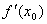
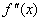
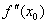
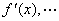
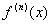
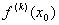
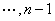
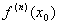

十、微分的应用（I）— 函数的极值

1．单变量函数的极值

[极值（极大值或极小值）]若函数<i>f</i><i> </i>(<i>x</i>)在点<i>x</i>0的双侧邻域中有定义，并且对于某邻域0&lt;|<i>x</i>-<i>x</i>0|&lt;<i>δ</i>内的一切点<i>x</i>，下面不等式成立：

<i>f</i><i> </i>(<i>x</i>)&lt;<i>
f</i><i> </i>(<i>x</i>0)&nbsp;&nbsp;&nbsp; (或<i>f</i><i> </i>(<i>x</i>)&gt;<i>
f</i><i> </i>(<i>x</i>0))

则称函数<i>f</i><i> </i>(<i>x</i>)在点<i>x</i>0处有极大值（或极小值）.

[极值存在的必要条件]假定函数<i>f</i><i> </i>(<i>x</i>)在区间(<i>a</i>,<i>b</i>)内存在有限导数.若在点<i>x</i>0(∈(<i>a</i>,<i>b</i>))处函数有极值，则必有

<pre style='text-align:right' align=right>=0&nbsp;&nbsp;&nbsp;&nbsp;&nbsp;&nbsp;&nbsp;&nbsp;&nbsp;&nbsp;&nbsp;&nbsp;&nbsp;&nbsp; &nbsp;&nbsp;&nbsp;&nbsp;&nbsp;&nbsp;&nbsp;&nbsp;&nbsp;&nbsp;&nbsp;&nbsp;&nbsp;&nbsp;&nbsp;&nbsp;&nbsp;&nbsp;&nbsp;&nbsp;&nbsp;&nbsp; &nbsp;&nbsp;&nbsp;&nbsp;&nbsp;&nbsp;&nbsp;&nbsp;&nbsp;&nbsp;&nbsp;&nbsp;&nbsp;&nbsp;&nbsp;&nbsp;&nbsp;&nbsp;&nbsp;&nbsp;&nbsp;&nbsp;&nbsp;&nbsp;&nbsp;&nbsp;&nbsp;&nbsp;&nbsp;&nbsp; (1)</pre>

所以可微函数的极值只能在使(1)式成立的点达到，这种点称为稳定点.

[极值存在的充分条件]

第一法则&nbsp; 若函数<i>f</i><i> </i>(<i>x</i>)满足条件：（i）在点<i>x</i>0的某邻域|<i>x</i>-<i>x</i>0|&lt;<i>δ</i>内有定义并且连续，且在点<i>x</i>0处，=0或不存在，（ii）在范围0&lt;|<i>x</i>-<i>x</i>0|&lt;<i>δ</i>内有有限的导数，（iii）在点<i>x</i>0的左右两侧有固定的符号，则函数<i>f</i><i> </i>(<i>x</i>)在点<i>x</i>0有无极值见下表：

<table class=MsoNormalTable border=1 cellspacing=0 cellpadding=0
 style='border-collapse:collapse;border:none'>
 <tr style='height:22.9pt'>
  <td width=123 style='width:92.55pt;border:solid windowtext 1.0pt;border-left:
  none;padding:0mm 5.4pt 0mm 5.4pt;height:22.9pt'>
  
<i>x</i>

  </td>
  <td width=123 style='width:92.55pt;border:solid windowtext 1.0pt;border-left:
  none;padding:0mm 5.4pt 0mm 5.4pt;height:22.9pt'>
  
<i>x &lt; x</i>0

  </td>
  <td width=123 style='width:92.55pt;border:solid windowtext 1.0pt;border-left:
  none;padding:0mm 5.4pt 0mm 5.4pt;height:22.9pt'>
  
<i>x</i> 0

  </td>
  <td width=123 style='width:92.55pt;border:solid windowtext 1.0pt;border-left:
  none;padding:0mm 5.4pt 0mm 5.4pt;height:22.9pt'>
  
<i>x&gt; x</i>0

  </td>
  <td width=123 style='width:92.55pt;border-top:solid windowtext 1.0pt;
  border-left:none;border-bottom:solid windowtext 1.0pt;border-right:none;
  padding:0mm 5.4pt 0mm 5.4pt;height:22.9pt'>
  
<i>f</i><i> </i>(<i>x</i>)

  </td>
 </tr>
 <tr style='height:76.85pt'>
  <td width=123 style='width:92.55pt;border-top:none;border-left:none;
  border-bottom:solid windowtext 1.0pt;border-right:solid windowtext 1.0pt;
  padding:0mm 5.4pt 0mm 5.4pt;height:76.85pt'>
  

  </td>
  <td width=123 style='width:92.55pt;border-top:none;border-left:none;
  border-bottom:solid windowtext 1.0pt;border-right:solid windowtext 1.0pt;
  padding:0mm 5.4pt 0mm 5.4pt;height:76.85pt'>
  
+

  
—

  
+

  
—

  </td>
  <td width=123 style='width:92.55pt;border-top:none;border-left:none;
  border-bottom:solid windowtext 1.0pt;border-right:solid windowtext 1.0pt;
  padding:0mm 5.4pt 0mm 5.4pt;height:76.85pt'>
  
0

  </td>
  <td width=123 style='width:92.55pt;border-top:none;border-left:none;
  border-bottom:solid windowtext 1.0pt;border-right:solid windowtext 1.0pt;
  padding:0mm 5.4pt 0mm 5.4pt;height:76.85pt'>
  
—

  
+

  
+

  
—

  </td>
  <td width=123 style='width:92.55pt;border:none;border-bottom:solid windowtext 1.0pt;
  padding:0mm 5.4pt 0mm 5.4pt;height:76.85pt'>
  
极大值

  
极小值

  
上升

  
下降

  </td>
 </tr>
</table>

第二法则&nbsp; 若函数<i>f</i><i> </i>(<i>x</i>)有二阶导数,并且在点<i>x</i>0处下列条件成立：

=0及≠0

则函数<i>f</i><i> </i>(<i>x</i>)在此点有极值，当&lt;0时，有极大值；当&gt;0时，有极小值.

第三法则&nbsp; 设函数<i>f</i><i> </i>(<i>x</i>)在某邻域|<i>x</i>-<i>x</i>0|&lt;<i>δ</i>内有导数,，且

=0&nbsp;&nbsp;&nbsp;&nbsp;&nbsp;&nbsp;&nbsp;&nbsp; （<i>k</i>=1,）

≠0&nbsp;&nbsp;&nbsp;&nbsp;&nbsp;&nbsp; 

若<i>n</i>为偶数，则函数<i>f</i><i> </i>(<i>x</i>)在点<i>x</i>0处有极值（当&lt;0时有极大值，当&gt;0时有极小值）;若<i>n</i>为奇数，则在点<i>x</i>0处无极值.

以上介绍的单变量函数的极值求法中，求稳定点时最后都归结为求方程

=0

的实根.有时上述方程的实根不易求得，就要求近似根.关于实根的近似计算法可参考第三章，§4.

