

2．多变量函数的极值

[极值(极大值或极小值)]&nbsp; 设函数

<i>y</i>=<i> f</i><i> </i>(<i>x</i>1,<i>x</i>2,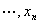)=<i> f</i><i> </i>(<b><i>x</i></b>)

定义于区域<i>D</i>中，且<b><i>x</i></b>0=(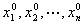)是这区域内的一点.

若点<b><i>x</i></b>0有一个邻域

0&lt;|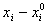|&lt;<i>δ</i>,<i>i</i>=1,2,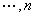

使对于其中一切点，下面不等式成立：

<i>f</i><i> </i>(<b><i>x</i></b>)&lt;<i>
f</i><i> </i>(<b><i>x</i></b>0)&nbsp;&nbsp;&nbsp; ( 或<i>f</i><i> </i>(<b><i>x</i></b>)&gt;<i>
f</i><i> </i>(<b><i>x</i></b>0))

则称函数<i>f</i><i> </i>(<b><i>x</i></b>)在点<b><i>x</i></b>0处有极大值（或极小值）.

[极值存在的必要条件]&nbsp; 假定函数<i>f</i><i> </i>(<b><i>x</i></b>)在区域<i>D</i>内存在有限偏导数.若在点<b><i>x</i></b>0(∈<i>D</i>)处函数有极值，则必有

<pre style='text-align:right' align=right>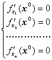&nbsp;&nbsp;&nbsp; &nbsp;&nbsp;&nbsp;&nbsp;&nbsp;&nbsp;&nbsp;&nbsp;&nbsp;&nbsp;&nbsp;&nbsp;&nbsp;&nbsp;&nbsp;&nbsp;&nbsp;&nbsp;&nbsp;&nbsp;&nbsp;&nbsp;&nbsp;&nbsp;&nbsp;&nbsp;&nbsp;&nbsp;&nbsp;&nbsp;&nbsp;&nbsp;&nbsp; &nbsp;&nbsp;&nbsp; （2）</pre>

所以极值只能在使（2）式成立的点达到，这种点称为稳定点.

[极值存在的充分条件(二元函数的情形)]&nbsp; 设点<b><i>x</i></b>0=（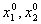）为函数<i>y</i>=<i> f</i><i> </i>(<i>x</i>1,<i>x</i>2)的稳定点，并且函数<i>f</i><i> </i>(<i>x</i>1,<i>x</i>2)在稳定点<b><i>x</i></b>0的邻域内有定义，连续，并有一阶及二阶连续偏导数.引进记号

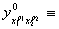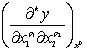，<i>k </i>= <i>p</i>1+<i>p</i>2

上指标“0”表示偏导数是在<b><i>x</i></b>0计算的.记

<i>D</i>1=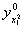,<i>D</i>2=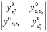

那末（i）稳定点<b><i>x</i></b>0是极小点的充分条件是：

<i>D</i>1&gt;0&nbsp; 和&nbsp; <i>D</i>2&gt;0

即&nbsp;&nbsp;&nbsp;&nbsp;&nbsp;&nbsp;&nbsp;&nbsp;&nbsp;&nbsp;&nbsp;&nbsp;&nbsp;&nbsp;&nbsp;&nbsp;&nbsp;&nbsp;&nbsp;&nbsp;&nbsp;&nbsp;&nbsp;&nbsp;&nbsp;&nbsp;&nbsp;&nbsp;&nbsp;&nbsp;&nbsp;&nbsp;&nbsp;&nbsp;&nbsp;&nbsp;&nbsp;&nbsp;&nbsp;&nbsp;&nbsp;&nbsp;&nbsp;&nbsp; &gt;0&nbsp; 和&nbsp; 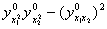&gt;0

（ii）稳定点<b><i>x</i></b>0是极大点的充分条件是：

<i>D</i>1&lt;0&nbsp; 和&nbsp; <i>D</i>2&gt;0

即&nbsp;&nbsp;&nbsp;&nbsp;&nbsp;&nbsp;&nbsp;&nbsp;&nbsp;&nbsp;&nbsp;&nbsp;&nbsp;&nbsp;&nbsp;&nbsp;&nbsp;&nbsp;&nbsp;&nbsp;&nbsp;&nbsp;&nbsp;&nbsp;&nbsp;&nbsp;&nbsp;&nbsp;&nbsp;&nbsp;&nbsp;&nbsp;&nbsp;&nbsp;&nbsp;&nbsp;&nbsp;&nbsp;&nbsp;&nbsp;&nbsp;&nbsp;&nbsp;&nbsp; &lt;0&nbsp; 和&nbsp; &gt;0

若<i>D</i>2&lt;0，则<b><i>x</i></b>0不是极值点，当<i>D</i>2=0时不能肯定<b><i>x</i></b>0是否极值点，必须考察更高阶的偏导数.

[极值存在的充分条件(一般情形)]&nbsp; 设点<b><i>x</i></b>0=()为函数<i>y</i>=<i> f</i><i> </i>(<b><i>x</i></b>)=<i> f</i><i> </i>(<i>x</i>1,<i>x</i>2,)的稳定点，并且函数<i>f</i><i> </i>(<b><i>x</i></b>)在稳定点<b><i>x</i></b>0的邻域内有定义，连续，并有一阶及二阶连续偏导数.引进记号

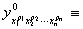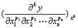&nbsp; <i>k </i>=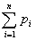

上指标“0”表示偏导数是在<b><i>x</i></b>0计算的.定义行列式<i>Di</i>为

<i>Di</i>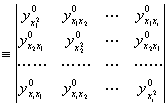

对<i>n</i>个变量依次计算<i>n</i>个行列式<i>D</i>1,<i>D</i>2,…,<i>Dn</i>.那末

（i）稳定点<b><i>x</i></b>0是极小点的充分条件是：所有的行列式都是正的，即

<i>Di</i>&gt;0,&nbsp; <i>i</i>=1,2,

（ii）稳定点<b><i>x</i></b>0是极大点的充分条件是：所有标号为偶数的行列式是正的，所有标号为奇数的行列式是负的，即

<i>Di</i>&lt;0,&nbsp; <i>i</i>=1,3,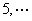

<i>Di</i>&gt;0,&nbsp; <i>i</i>=2,4,

如果上列两条件都不满足，那末稳定点可以不是极值点.如果所有的<i>Di</i>都是零，就必须考察更高阶的偏导数.

