

3．约束条件为等式的条件极值

&nbsp;&nbsp; 求函数

<i>y
</i>=<i> f</i><i> </i>(<b><i>x</i></b>),&nbsp; <b><i>x</i></b>=(<i>x</i>1,<i>x</i>2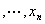)

在<i>m</i>(<i>m</i>&lt;<i>n</i>)个约束条件

<i>gk</i>(<b><i>x</i></b>)=0,&nbsp; <i>k </i>=1,2,

下的极值.

[直接代入法]&nbsp; 从约束条件的<i>m</i>个方程中将其<i>m</i>个变量解出，用其余<i>n</i>-<i>m</i>个变量表示，然后直接代入函数中去，这样就变为一个求<i>n</i>－<i>m</i>个变量的函数的无约束条件的极值问题.如果从约束方程能够将<i>m</i>个变量解出，这个方法是可行的.

[拉格朗日乘数法]&nbsp; 引进修正的系数

<i>F</i>=<i>y</i>+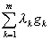

式中<i>λk</i>为待定常数.把<i>F</i>当作<i>n</i>+<i>m</i>个变量<i>x</i>1,<i>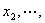xn</i>和<i>λ</i>1,<i>λ</i>2,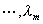的无约束的函数，对这些变量求一阶偏导数得稳定点所要满足的方程：

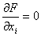，&nbsp; <i>i </i>=1,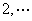,<i>n</i>

<i>gk</i>=0,&nbsp;&nbsp; <i>k </i>=1,2,

例1&nbsp; 求函数

<i>y
</i>=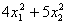

在约束条件

2<i>x</i>1+3<i>x</i>2=6

下的极值.

解&nbsp; 由于

<i>y
</i>=

和&nbsp;&nbsp; &nbsp;&nbsp;&nbsp;&nbsp;&nbsp;&nbsp;&nbsp; &nbsp;&nbsp;&nbsp;&nbsp;&nbsp;&nbsp;&nbsp;&nbsp;&nbsp;&nbsp;&nbsp;&nbsp;&nbsp;&nbsp;&nbsp;&nbsp;&nbsp;&nbsp;&nbsp;&nbsp;&nbsp;&nbsp;&nbsp;&nbsp;&nbsp;&nbsp;&nbsp;&nbsp;&nbsp;&nbsp;&nbsp;&nbsp;&nbsp;&nbsp;&nbsp;&nbsp;&nbsp;&nbsp;&nbsp;&nbsp; &nbsp;&nbsp;&nbsp;<i>g
</i>=2<i>x</i>1+3<i>x</i>2－6=0

可知修正的函数为

<i>F
</i>= ()+<i>λ</i>(2<i>x</i>1+3<i>x</i>2－6)

解方程组

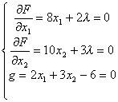

得&nbsp;&nbsp;&nbsp;&nbsp;&nbsp;&nbsp;&nbsp;&nbsp;&nbsp;&nbsp;&nbsp;&nbsp;&nbsp;&nbsp;&nbsp;&nbsp;&nbsp;&nbsp;&nbsp;&nbsp;&nbsp;&nbsp;&nbsp;&nbsp;&nbsp;&nbsp;&nbsp;&nbsp;&nbsp;&nbsp;&nbsp;&nbsp;&nbsp;&nbsp;&nbsp;&nbsp;&nbsp;&nbsp;&nbsp;&nbsp;&nbsp;&nbsp;&nbsp;&nbsp; <i>λ</i>＝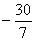，<i>x</i>1=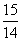,<i>x</i>2=

所以函数<i>F</i>的稳定点为

<i>x</i>1=,&nbsp;&nbsp;&nbsp; <i>x</i>2=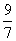

由于&nbsp;&nbsp;&nbsp;&nbsp;&nbsp;&nbsp;&nbsp;
&nbsp;&nbsp;&nbsp;&nbsp;&nbsp;&nbsp;&nbsp;&nbsp;&nbsp;&nbsp;&nbsp;&nbsp;&nbsp;&nbsp;&nbsp;&nbsp;&nbsp;&nbsp;&nbsp; <i>D</i>1=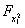= 8 &gt;0

<i>D</i>2=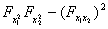=80&gt;0

这是一个极小点，函数<i>y</i>的极小值为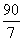.

［惩罚函数法］ 在搜索极小点时引进修正函数

<pre style='text-align:right' align=right><i>F </i>= <i>y</i>+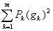&nbsp;&nbsp;&nbsp;&nbsp;&nbsp;&nbsp;&nbsp;&nbsp;&nbsp;&nbsp;&nbsp;&nbsp;&nbsp;&nbsp;&nbsp; &nbsp;&nbsp;&nbsp;&nbsp;&nbsp;&nbsp;&nbsp;&nbsp;&nbsp;&nbsp;&nbsp;&nbsp;&nbsp;&nbsp;&nbsp;&nbsp;&nbsp;&nbsp;&nbsp;&nbsp;&nbsp;&nbsp;&nbsp;&nbsp;&nbsp;&nbsp;&nbsp; (1)</pre>

式中<i>Pk</i>是任意大的正整数，称为惩罚函数.这样就可把问题化为新函数<i>F</i>的无条件极值问题，可以用不断增大<i>Pk</i>的数值来极小化.也可引进如下形式的新函数

<i>F
</i>= <i>y</i>+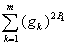&nbsp;&nbsp;&nbsp;&nbsp;&nbsp;&nbsp; 

式中<i>Pk</i>是任意大的正整数.

对搜索极大点时，惩罚函数前取负号，即引进新函数

<i>F
</i>= <i>y</i>－

或&nbsp;&nbsp; &nbsp;&nbsp;&nbsp; &nbsp;&nbsp;&nbsp;&nbsp;&nbsp;&nbsp;&nbsp;&nbsp;&nbsp;&nbsp;&nbsp;&nbsp;&nbsp;&nbsp;&nbsp;&nbsp;&nbsp;&nbsp;&nbsp;&nbsp;&nbsp;&nbsp;&nbsp;&nbsp;&nbsp;&nbsp;&nbsp;&nbsp;&nbsp;&nbsp;&nbsp;&nbsp;&nbsp;&nbsp;&nbsp;&nbsp;&nbsp;&nbsp;&nbsp;&nbsp;&nbsp;&nbsp;&nbsp;&nbsp; <i>F
</i>= <i>y</i>－&nbsp;&nbsp;&nbsp;&nbsp; 

例２　用惩罚函数法解例１.

解　利用方程（1）引进修正函数

<i>F
</i>= <i>y</i>+<i>P</i>(<i>g</i>)2=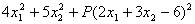

解方程组

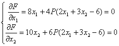

得&nbsp;&nbsp;&nbsp;&nbsp;&nbsp;&nbsp;&nbsp;&nbsp;&nbsp;&nbsp;&nbsp;&nbsp;&nbsp;&nbsp;&nbsp;&nbsp;&nbsp;&nbsp;&nbsp;&nbsp;&nbsp;&nbsp;&nbsp;&nbsp;&nbsp;&nbsp;&nbsp;&nbsp;&nbsp;&nbsp;&nbsp;&nbsp;&nbsp;&nbsp;&nbsp;&nbsp;&nbsp; <i>x</i>1=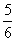<i>x</i>2，<i>x</i>2=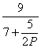

当<i>P</i>很大时，<i>x</i>2趋于，<i>x</i>1趋于，这就是稳定点.由于

<i>D</i>1==8(1+<i>P</i>)&gt;0

<i>D</i>2==16(5+14<i>P</i>)&gt;0

所以稳定点是一个极小点，这和例1的结果一致.

