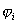
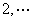

4．约束条件为不等式的条件极值

比前面所考虑的更一般的极值问题是求函数

<i>y
</i>=<i>f</i><i> </i>(<b><i>x</i></b>)，<b><i>x </i></b>= (<i>x</i>1,<i>x</i>2,…,<i>xn</i>)

在<i>m</i>个约束条件

<i>gk</i>(<b><i>x</i></b>)，<i>k </i>=1,2,…,<i>m</i>

下的极值问题，这里的<i>m</i>不必小于<i>n</i>.

[松弛变量法]&nbsp; 对每一约束不等式都引进一非负的松弛函数<i>Si</i>, 将它变为等式：

=<i>gi</i>+<i>Si</i>=0

每一松弛函数<i>Si</i>仅依赖于一个松弛变量<i>xn</i>+<i>i</i>,一般取

<i>Si</i>=

引进松弛函数后就把问题化为约束条件是等式的极值问题，前面的方法就可以应用了.

例3&nbsp;&nbsp;&nbsp;&nbsp;&nbsp;&nbsp;&nbsp;
例3&nbsp;&nbsp;&nbsp;&nbsp;&nbsp;&nbsp;&nbsp;&nbsp;&nbsp;
求函数

<i>y
</i>=

在约束条件

<i>x</i>1<i></i>

下的极值.

解&nbsp; 约束条件可写为

<i>g</i>1=1-<i> x</i>1<i></i>

利用松弛函数<i>S</i>1(<i>x</i>3)可将这个不等式约束化为等式

=<i>g</i>1+<i>S</i>1=<i>x</i>1+=0

利用直接代入法可在函数<i>y</i>中将<i>x</i>1消去得到

<i>y</i>=4(1+)2+5

这是一个无约束问题.

稳定点是<i>x</i>2=0,<i>x</i>3=0,所以<i>x</i>1=1.由于

<i>D</i>1==10&gt;0

<i>D</i>2===160&gt;0

所以稳定点是修改后的以及原来的函数的极小点，其极小值为4.

[拉格朗日乘数法]&nbsp;
引进松弛函数后，将约束不等式化为等式

=<i>gk</i>+<i>Sk</i>(<i>xn</i>+<i>k</i>)=0,&nbsp;&nbsp;&nbsp;&nbsp;&nbsp; <i>k</i>=1,,<i>m</i>

同等式约束的情形一样，引进新的目标函数

<i>F</i>=<i>y</i>+

这是一个<i>n</i>+2<i>m</i>个变量的无约束问题.稳定点可以由解下列方程组得到

=0，&nbsp;&nbsp;&nbsp;&nbsp;&nbsp; <i>j</i>=1,,(<i>n</i>+<i>m</i>)

=0,&nbsp;&nbsp;&nbsp; <i>k</i>=1,,<i>m</i>

以上介绍的多变量函数的极值和条件极值求法中，求稳定点时最后都归结为求实函数方程组

<i>fI
</i><i>&nbsp;</i>(<i>x</i>1,<i></i>,<i>xn</i>)=0,&nbsp; <i>i</i>=1,,<i>n</i>

的一组实根.有时上列方程组的实根不易求得，要求近似根.关于实根的近似计算法可参考第三章，§4.

