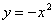

2、奇点

设 <i>P</i>0(<i>x</i>0,<i>y</i>0)是曲线

<i>F</i>(<i>x</i>,<i>y</i>)=0

上的一点，假定函数<i>F</i>(<i>x</i>,<i>y</i>)在点<i>P</i>0有连续的偏导数，并且满足条件

（<i>x</i>0,<i>y</i>0）=0,(<i>x</i>0,<i>y</i>0)=0

则称<i>P</i>0是曲线<i>F</i>(<i>x</i>,<i>y</i>)=0的一个奇点.

如果函数<i>F</i>(<i>x</i>,<i>y</i>)在点<i>P</i>0(<i>x</i>0,<i>y</i>0)的二阶偏导数不全为零，那末称<i>P</i>0为曲线的一个二重点.设

则根据判别式的符号在二重点中又可分出如下几种类型的奇点.

<table class=MsoNormalTable border=1 cellspacing=1 cellpadding=0 width=522
 style='width:391.5pt'>
 <tr style='height:42.75pt'>
  <td width="22%" style='width:22.0%;padding:5.25pt 5.25pt 5.25pt 5.25pt;
  height:42.75pt'>
  
名称与图形 

  </td>
  <td width="25%" style='width:25.0%;padding:5.25pt 5.25pt 5.25pt 5.25pt;
  height:42.75pt'>
  
条件与性质 

  </td>
  <td width="52%" colspan=5 style='width:52.0%;padding:5.25pt 5.25pt 5.25pt 5.25pt;
  height:42.75pt'>
  
举 例 

  </td>
 </tr>
 <tr style='height:42.75pt'>
  <td width="22%" style='width:22.0%;padding:5.25pt 5.25pt 5.25pt 5.25pt;
  height:42.75pt'>
  
结点

  

  </td>
  <td width="25%" style='width:25.0%;padding:5.25pt 5.25pt 5.25pt 5.25pt;
  height:42.75pt'>
  
(i)&lt;0

  
(ii)曲线有两支通过点<i>P</i>0，且具有不同切线 

  </td>
  <td width="52%" colspan=5 style='width:52.0%;padding:5.25pt 5.25pt 5.25pt 5.25pt;
  height:42.75pt'>
  
双纽线

  

  
是以原点(0,0)为其结点

  

  </td>
 </tr>
 <tr style='height:42.75pt'>
  <td width="22%" style='width:22.0%;padding:5.25pt 5.25pt 5.25pt 5.25pt;
  height:42.75pt'>
  
孤立点

  

  </td>
  <td width="25%" style='width:25.0%;padding:5.25pt 5.25pt 5.25pt 5.25pt;
  height:42.75pt'>
  
(i)&gt;0

  
(ii)在点<i>P</i>0的充分小的邻域里，除了点<i>P</i>0外，没有曲线上其他的点.

  </td>
  <td width="28%" colspan=2 style='width:28.0%;padding:5.25pt 5.25pt 5.25pt 5.25pt;
  height:42.75pt'>
  
曲线

  

  
的轨迹是由直线<i>x</i>=1和原点(0,0)组成的，原点就是它的一个孤立点 

  </td>
  <td width="24%" colspan=3 style='width:24.0%;padding:5.25pt 5.25pt 5.25pt 5.25pt;
  height:42.75pt'>
  

  </td>
 </tr>
 <tr style='height:31.5pt'>
  <td width="22%" style='width:22.0%;padding:5.25pt 5.25pt 5.25pt 5.25pt;
  height:31.5pt'>
  
第一种尖点

  

  
　

  
　

  
&nbsp; 

  </td>
  <td width="25%" style='width:25.0%;padding:5.25pt 5.25pt 5.25pt 5.25pt;
  height:31.5pt'>
  
(i)

  
(ii)曲线由两支组成，在点<i>P</i>0有公共切线，这两支在其公共法线的同侧，而在公共切线的异侧.

  
　

  
　

  
&nbsp; 

  </td>
  <td width="23%" style='width:23.0%;padding:5.25pt 5.25pt 5.25pt 5.25pt;
  height:31.5pt'>
  
半立方抛物线

  

  
是以原点(0,0)为其第一种尖点

  
　

  
　

  
　

  
&nbsp; 

  </td>
  <td width="29%" colspan=4 style='width:29.0%;padding:5.25pt 5.25pt 5.25pt 5.25pt;
  height:31.5pt'>
  

  </td>
 </tr>
 <tr style='height:42.75pt'>
  <td width="22%" style='width:22.0%;padding:5.25pt 5.25pt 5.25pt 5.25pt;
  height:42.75pt'>
  
第二种尖点

  

  </td>
  <td width="25%" style='width:25.0%;padding:5.25pt 5.25pt 5.25pt 5.25pt;
  height:42.75pt'>
  
(i)

  
(ii)曲线由两支组成，在点<i>P</i>0有公共切线，这两支在其公共法线的同侧，又在公共切线的同侧. 

  </td>
  <td width="34%" colspan=3 style='width:34.0%;padding:5.25pt 5.25pt 5.25pt 5.25pt;
  height:42.75pt'>
  
曲线

  

  
在原点的邻近有两支，即

  

  

  
它们在原点有公共切线，由于0&lt;<i>x</i>&lt;1,<i>y</i>总取正值，所以曲线在原点的邻近的两支都在公共切线和法线的同侧

  </td>
  <td width="18%" colspan=2 style='width:18.0%;padding:5.25pt 5.25pt 5.25pt 5.25pt;
  height:42.75pt'>
  

  </td>
 </tr>
 <tr style='height:42.75pt'>
  <td width="22%" style='width:22.0%;padding:5.25pt 5.25pt 5.25pt 5.25pt;
  height:42.75pt'>
  
自切点

  

  </td>
  <td width="25%" style='width:25.0%;padding:5.25pt 5.25pt 5.25pt 5.25pt;
  height:42.75pt'>
  
(i)

  
(ii)曲线由两支组成，而彼此在点<i>P</i>0相切 

  </td>
  <td width="34%" colspan=4 style='width:34.0%;padding:5.25pt 5.25pt 5.25pt 5.25pt;
  height:42.75pt'>
  
曲线

  

  
由两条抛物线

  

  

  
组成，它们在原点彼此相切

  </td>
  <td width="18%" style='width:18.0%;padding:5.25pt 5.25pt 5.25pt 5.25pt;
  height:42.75pt'>
  

  </td>
 </tr>
 <tr height=0>
  <td width=128 style='border:none'></td>
  <td width=119 style='border:none'></td>
  <td width=119 style='border:none'></td>
  <td width=27 style='border:none'></td>
  <td width=32 style='border:none'></td>
  <td width=2 style='border:none'></td>
  <td width=95 style='border:none'></td>
 </tr>
</table>

如果曲线由参数方程

<i>x </i>= <i>x</i>(<i>t</i>), <i>y </i>= <i>y</i>(<i>t</i>)

表示，那末当=0，=0时，由参数<i>t</i>0确定的点(<i>x</i>(<i>t</i>0),
<i>y</i>(<i>t</i>0))是曲线的奇点.

特别，曲线由极坐标方程

<pre ALIGN=CENTER>&nbsp;&nbsp;&nbsp;&nbsp;&nbsp;&nbsp;&nbsp;&nbsp;&nbsp;&nbsp;&nbsp;&nbsp;&nbsp;&nbsp;&nbsp;&nbsp;&nbsp;&nbsp;&nbsp;&nbsp;&nbsp;&nbsp;&nbsp;&nbsp;&nbsp;&nbsp;&nbsp;&nbsp;&nbsp;&nbsp;&nbsp;&nbsp;&nbsp;&nbsp;&nbsp;&nbsp;&nbsp;&nbsp;&nbsp;&nbsp;&nbsp;&nbsp;&nbsp;&nbsp;&nbsp;&nbsp;&nbsp;&nbsp;&nbsp;&nbsp;&nbsp;&nbsp;&nbsp;&nbsp;&nbsp;&nbsp;&nbsp;&nbsp;&nbsp;&nbsp;&nbsp;&nbsp;&nbsp;&nbsp; </pre><pre>&nbsp;&nbsp;&nbsp;&nbsp;&nbsp;&nbsp;&nbsp;&nbsp;&nbsp;&nbsp;&nbsp;&nbsp;&nbsp;&nbsp;&nbsp;&nbsp;&nbsp;&nbsp;&nbsp;&nbsp;&nbsp;&nbsp;&nbsp;&nbsp;&nbsp;&nbsp;&nbsp;&nbsp;&nbsp;&nbsp;&nbsp;&nbsp;&nbsp;&nbsp;&nbsp;&nbsp;&nbsp;&nbsp;&nbsp;&nbsp;&nbsp;&nbsp;&nbsp;&nbsp;&nbsp;&nbsp;&nbsp;&nbsp;&nbsp;&nbsp;&nbsp;&nbsp;&nbsp;&nbsp;&nbsp;&nbsp;&nbsp;&nbsp;&nbsp;&nbsp;&nbsp;&nbsp;&nbsp;&nbsp;&nbsp;&nbsp;&nbsp;&nbsp;&nbsp;&nbsp;&nbsp;&nbsp;&nbsp;&nbsp;&nbsp;&nbsp;&nbsp;&nbsp;&nbsp;&nbsp;&nbsp;&nbsp;&nbsp;&nbsp;图 5.9</pre>

表示，那末当==0时，点(,)是曲线的奇点.例如双曲螺线当∞时，=0，所以极点是奇点.当极角增大到无穷时，曲线上的点无限逼近于极点，但又不能达到（图5.9），所以这种奇点又称为渐近点.

　

