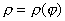

3、渐近线

&nbsp;&nbsp;&nbsp;&nbsp;&nbsp;&nbsp;&nbsp;&nbsp;&nbsp;&nbsp;&nbsp;

&nbsp;&nbsp;&nbsp;&nbsp;&nbsp;&nbsp;&nbsp;&nbsp;&nbsp;&nbsp;&nbsp;&nbsp;&nbsp;&nbsp;&nbsp;&nbsp;&nbsp;&nbsp;&nbsp;&nbsp;&nbsp;&nbsp;&nbsp;&nbsp;&nbsp;&nbsp;&nbsp;&nbsp;&nbsp;&nbsp;&nbsp;&nbsp;&nbsp;&nbsp;&nbsp;&nbsp;&nbsp;&nbsp;&nbsp;&nbsp;&nbsp; 曲线存在渐近线的条件及渐近线方程

<table class=MsoNormalTable border=1 cellspacing=0 cellpadding=0
 style='border-collapse:collapse;border:none'>
 <tr style='height:37.5pt'>
  <td width=84 style='width:63.0pt;border:solid windowtext 1.0pt;border-left:
  none;padding:0mm 5.4pt 0mm 5.4pt;height:37.5pt'>
  
曲线方程

  </td>
  <td width=346 style='width:259.2pt;border:solid windowtext 1.0pt;border-left:
  none;padding:0mm 5.4pt 0mm 5.4pt;height:37.5pt'>
  
条&nbsp;&nbsp; 件

  </td>
  <td width=161 style='width:120.5pt;border-top:solid windowtext 1.0pt;
  border-left:none;border-bottom:solid windowtext 1.0pt;border-right:none;
  padding:0mm 5.4pt 0mm 5.4pt;height:37.5pt'>
  
渐进线方程

  </td>
 </tr>
 <tr style='height:37.5pt'>
  <td width=84 style='width:63.0pt;border-top:none;border-left:none;border-bottom:
  solid windowtext 1.0pt;border-right:solid windowtext 1.0pt;padding:0mm 5.4pt 0mm 5.4pt;
  height:37.5pt'>
  
<i>F</i>(<i>x</i>,<i>y</i>)=0

  </td>
  <td width=346 style='width:259.2pt;border-top:none;border-left:none;
  border-bottom:solid windowtext 1.0pt;border-right:solid windowtext 1.0pt;
  padding:0mm 5.4pt 0mm 5.4pt;height:37.5pt'>
  
将<i>F</i>(<i>x</i>,<i>y</i>)的最高次数各项之和用表示，解方程=0，得

  
<i>x</i>=，<i>y</i>=

  
时，

  
时，

  
将<i>y </i>= <i>kx</i>+<i>b</i>代入<i>F</i>(<i>x</i>,<i>y</i>)后按<i>x</i>的幂次展开：

  
<i>F</i>(<i>x</i>,<i>kx</i>+<i>b</i>)=

  
解联立方程

  

  
得到<i>k</i>,<i>b</i>,即为渐近线的斜率和纵截距

  </td>
  <td width=161 style='width:120.5pt;border:none;border-bottom:solid windowtext 1.0pt;
  padding:0mm 5.4pt 0mm 5.4pt;height:37.5pt'>
  
<i>x </i>= <i>a</i>

  
<i>y </i>= <i>b</i>

  
<i>y=kx</i>+<i>b</i>

  </td>
 </tr>
 <tr style='height:37.5pt'>
  <td width=84 style='width:63.0pt;border-top:none;border-left:none;border-bottom:
  solid windowtext 1.0pt;border-right:solid windowtext 1.0pt;padding:0mm 5.4pt 0mm 5.4pt;
  height:37.5pt'>
  
<i>y</i>=<i>f</i><i> </i>(<i>x</i>)

  </td>
  <td width=346 style='width:259.2pt;border-top:none;border-left:none;
  border-bottom:solid windowtext 1.0pt;border-right:solid windowtext 1.0pt;
  padding:0mm 5.4pt 0mm 5.4pt;height:37.5pt'>
  
&nbsp;&nbsp;&nbsp; ，

  
时，(或时，)

  
时，(或时，)

  </td>
  <td width=161 style='width:120.5pt;border:none;border-bottom:solid windowtext 1.0pt;
  padding:0mm 5.4pt 0mm 5.4pt;height:37.5pt'>
  
<i>y</i>=<i>kx</i>+<i>b</i>

  
<i>x=a</i>

  
<i>y=b</i>

  </td>
 </tr>
 <tr style='height:37.5pt'>
  <td width=84 style='width:63.0pt;border-top:none;border-left:none;border-bottom:
  solid windowtext 1.0pt;border-right:solid windowtext 1.0pt;padding:0mm 5.4pt 0mm 5.4pt;
  height:37.5pt'>
  

  </td>
  <td width=346 style='width:259.2pt;border-top:none;border-left:none;
  border-bottom:solid windowtext 1.0pt;border-right:solid windowtext 1.0pt;
  padding:0mm 5.4pt 0mm 5.4pt;height:37.5pt'>
  
，

  
&nbsp;&nbsp;&nbsp;&nbsp;&nbsp;&nbsp;
  ，

  
，

  
，

  </td>
  <td width=161 style='width:120.5pt;border:none;border-bottom:solid windowtext 1.0pt;
  padding:0mm 5.4pt 0mm 5.4pt;height:37.5pt'>
  
<i>y</i>=<i>kx</i>+<i>b</i>

  
<i>x=a</i>

  
<i>y=b</i>

  </td>
 </tr>
 <tr style='height:37.5pt'>
  <td width=84 style='width:63.0pt;border-top:none;border-left:none;border-bottom:
  solid windowtext 1.0pt;border-right:solid windowtext 1.0pt;padding:0mm 5.4pt 0mm 5.4pt;
  height:37.5pt'>
  

  </td>
  <td width=346 style='width:259.2pt;border-top:none;border-left:none;
  border-bottom:solid windowtext 1.0pt;border-right:solid windowtext 1.0pt;
  padding:0mm 5.4pt 0mm 5.4pt;height:37.5pt'>
  
，

  </td>
  <td width=161 style='width:120.5pt;border:none;border-bottom:solid windowtext 1.0pt;
  padding:0mm 5.4pt 0mm 5.4pt;height:37.5pt'>
  

  </td>
 </tr>
</table>

&nbsp;

