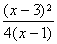
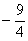
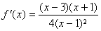
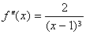
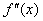
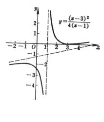
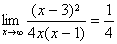
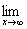
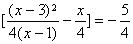
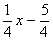

4、作图

作函数

<i>y
</i>= <i>f</i>(<i>x</i>)

的图形的步骤大致有以下几点：

（1）&nbsp;&nbsp;&nbsp;
（1）确定自变量<i>x</i>的改变区间，讨论函数的一些基本性质，如奇偶性、对称性和周期性等；

（2）&nbsp;&nbsp;&nbsp;
（2）确定曲线与坐标轴的交点；

（3）&nbsp;&nbsp;&nbsp;
（3）确定曲线的顶点（极大点、极小点）；

（4）&nbsp;&nbsp;&nbsp;
（4）确定曲线的凸部，凹部与拐点；

（5）&nbsp;&nbsp;&nbsp;
（5）确定曲线的渐近线；

（6）&nbsp;&nbsp;&nbsp;
（6）描点作图.

当然，具体问题要具体分析，以上几点不一定都要讨论.

例&nbsp;
画曲线

<i>y</i>=

(1)&nbsp;&nbsp;
(1)<i>x</i>可以在区间(－∞,∞)上改变，不对称，也无奇偶性和周期性.

(2)&nbsp;&nbsp;
(2)&nbsp;&nbsp; 让<i>x</i>=0,得到<i>y</i>=；让<i>y</i>=0,得到<i>x</i>=3；就是，曲线与坐标轴交于点(0,),(3,0) (图5.10).

(3)&nbsp;&nbsp;
(3)&nbsp;&nbsp; 求出一阶与二阶导数,,得到顶点(3,0)(极小点)和

(－1,－2)(极大点).

(4)&nbsp;&nbsp;
(4)&nbsp;&nbsp; 二阶导数当<i>x</i>&gt;1时为正，当<i>x</i>&lt;1时为负.因此，在区间(1, ∞)内曲线是凹的，在区间(-∞,1)内曲线是凸的.因为只当<i>x</i>=1时变号，而<i>x</i>的这个值对应于一条平行于<i>y</i>轴的渐近线，所以没有拐点.

(5)&nbsp;&nbsp;
(5)&nbsp;&nbsp; 当<i>x</i>=1时，<i>y</i>成为无穷大，于是这曲线有一条渐近线<i>x</i>=1.

再求不平行于<i>y</i>轴的渐近线.

<table cellspacing=0 cellpadding=0 hspace=0 vspace=0 width=229 height=266
 align=left>
 <tr>
  <td valign=top align=left height=266 style='padding-top:0mm;padding-right:
  9.0pt;padding-bottom:0mm;padding-left:9.0pt'>
  

  

  
图5.10

  

  </td>
 </tr>
</table>

<i>k</i>=

<i>b</i>=

所以

<pre align=left>&nbsp;&nbsp;&nbsp;&nbsp;&nbsp;&nbsp;&nbsp;&nbsp;&nbsp;&nbsp;&nbsp;&nbsp;&nbsp;&nbsp;&nbsp;&nbsp;&nbsp;&nbsp;&nbsp;&nbsp;&nbsp;&nbsp;&nbsp;&nbsp;&nbsp;&nbsp;&nbsp;&nbsp;&nbsp;&nbsp;&nbsp;&nbsp;&nbsp;&nbsp;&nbsp;&nbsp;&nbsp;&nbsp;&nbsp;&nbsp;&nbsp;&nbsp;&nbsp;&nbsp;&nbsp; <i>y</i>=</pre>

是一条不平行于<i>y</i>轴的渐近线.

由这些性质描出曲线（图5.10）.

