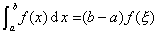
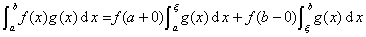

<h1 align=center style='text-align:center'>第六章
积 分
学</h1>

这一章综述了单变量函数的常义积分、广义积分、含参数积分的基本概念、性质和计算方法，收集了求不定积分、定积分、多重积分、曲线积分、曲面积分的有关公式，主要的积分不等式以及积分的某些近似计算公式，简要地列举了积分在实际中的各种应用；编制了不定积分表和定积分表.

<h2 align=center style='text-align:center'>§１单变量函数的积分 </h2>
<h3>一、积分基本概念
</h3>

［不定积分（原函数）］ 如果在给定的区间[<i>a</i> ,<i>b</i>]上

&nbsp;&nbsp;&nbsp;&nbsp;&nbsp;&nbsp;&nbsp;&nbsp;&nbsp;&nbsp;&nbsp;&nbsp;&nbsp; &nbsp;

那末<i>F </i>(<i>x</i>)称为<i>f</i>(<i>x</i>)在区间[<i>a</i>,<i>b</i>]上的一个原函数.

如果<i>f</i>(<i>x</i>)有一个原函数<i>F </i>(<i>x</i>)，那末它一定有无穷多个原函数，它们是形如

&nbsp;&nbsp;&nbsp;&nbsp; &nbsp;&nbsp;&nbsp;&nbsp;&nbsp;&nbsp;&nbsp;&nbsp;&nbsp;&nbsp;&nbsp;&nbsp;&nbsp;&nbsp;&nbsp;&nbsp;&nbsp;&nbsp;&nbsp;&nbsp; 

（式中<i>C</i>是任意常数）的函数族，所以用记号

&nbsp;&nbsp;&nbsp;&nbsp;&nbsp;&nbsp;&nbsp;&nbsp;&nbsp;&nbsp;&nbsp;&nbsp;&nbsp;&nbsp;&nbsp;&nbsp;&nbsp;&nbsp;&nbsp;&nbsp;&nbsp;&nbsp;&nbsp;&nbsp;&nbsp;&nbsp;&nbsp;&nbsp;&nbsp;&nbsp;&nbsp;&nbsp;&nbsp;&nbsp; 

<pre>表示<i>f</i>(<i>x</i>)的原函数全体，称为<i>f</i>(<i>x</i>)的不定积分.</pre>

［定积分·黎曼积分］ 设在区间[<i>a</i>,<i>b</i>]上给定了函数<i>f</i>(<i>x</i>).用任意方法把区间[<i>a</i>,<i>b</i>]分成若干部分，其分点为，并设λ是 (<i>i</i>=0,1,2,…,n－1)中最大的.在每一个小区间[]上任取一点 (<i>i</i>=0,1,2,…,n－1),作和（图6.1）.当<i>λ</i>→0时，如果极限

&nbsp;&nbsp;&nbsp;&nbsp;&nbsp;&nbsp;&nbsp;&nbsp;&nbsp;&nbsp;&nbsp;&nbsp;&nbsp;&nbsp;&nbsp;&nbsp;&nbsp;&nbsp;&nbsp;&nbsp;&nbsp;&nbsp;&nbsp;&nbsp;&nbsp;&nbsp;&nbsp;&nbsp;&nbsp;&nbsp;&nbsp;&nbsp;&nbsp;&nbsp; 

存在，那末这个极限称为函数<i>f</i>(<i>x</i>)在区间[<i>a</i>,<i>b</i>]上的定积分，记作

&nbsp;&nbsp;&nbsp;&nbsp;&nbsp;&nbsp;&nbsp;&nbsp;&nbsp;&nbsp;&nbsp;&nbsp;&nbsp;&nbsp;&nbsp;&nbsp;&nbsp;&nbsp;&nbsp;&nbsp;&nbsp;&nbsp;&nbsp;&nbsp;&nbsp;&nbsp;&nbsp;&nbsp;&nbsp;&nbsp;&nbsp;&nbsp;&nbsp;&nbsp; 

此时，函数<i>f</i>(<i>x</i>)称为区间[<i>a</i>,<i>b</i>]上的可积函数（黎曼可积），<i>a</i>和<i>b</i>分别称为积分的下限和上限，<i>f</i>(<i>x</i>)称为被积函数，<i>x</i>是积分变量，“”是积分号.

［牛顿－莱布尼茨公式］ 若函数<i>f</i>(<i>x</i>)在区间[<i>a</i>,<i>b</i>]上连续，或分段连续，则<i>f</i>(<i>x</i>)在[<i>a</i>,<i>b</i>]上有原函数，设<i>F</i>(<i>x</i>)是<i>f</i>(<i>x</i>)在[<i>a</i>,<i>b</i>]上的一个原函数，则

&nbsp;&nbsp;&nbsp;&nbsp;&nbsp;&nbsp;&nbsp;&nbsp;&nbsp;&nbsp;&nbsp;&nbsp;&nbsp;&nbsp;&nbsp;&nbsp;&nbsp;&nbsp;&nbsp;&nbsp;&nbsp;&nbsp;&nbsp;&nbsp;&nbsp;&nbsp;&nbsp;&nbsp;&nbsp;&nbsp;&nbsp;&nbsp;&nbsp;&nbsp; &nbsp;&nbsp;&nbsp;&nbsp;&nbsp;&nbsp;&nbsp;&nbsp;&nbsp;&nbsp;&nbsp;&nbsp;&nbsp;&nbsp; 

这称为牛顿－莱布尼茨公式，或微积分学基本定理，它指出了定积分与不定积分的内在联系.

［可积函数及其性质］

(１) 若函数<i>f</i>(<i>x</i>)在区间[<i>a</i>,<i>b</i>]上连续，则<i>f</i>(<i>x</i>)是可积的.

(２) 若函数<i>f</i>(<i>x</i>)在[<i>a</i>,<i>b</i>]上有界，且只有有限多个间断点，则<i>f</i>(<i>x</i>)是可积的.

(３) 单调有界函数一定是可积的.

(４) 可积函数一定是有界的.

(５) 若函数<i>f</i>(<i>x</i>)可积，则|<i>f</i>(<i>x</i>)|与<i>k</i><i>f</i>(<i>x</i>)（<i>k</i>为常数）也可积.

(６) 若函数<i>f</i>(<i>x</i>)，<i>g</i>(<i>x</i>)可积，则其和、差、乘积也可积.

(７) 若函数<i>f</i>(<i>x</i>)在[<i>a</i>,<i>b</i>]上可积，则<i>f</i>(<i>x</i>)在[<i>a</i>,<i>b</i>]中的任一部分区间[<i>α</i>,<i>β</i>]上也可积.反之，若把[<i>a</i>,<i>b</i>]分割成若干部分区间，并分别在每个部分区间上<i>f</i>(<i>x</i>)可积，则它在整个区间[<i>a</i>,<i>b</i>]上可积.

［积分中值定理］儍儍儍儍

(１) 若函数<i>f</i>(<i>x</i>)在区间[<i>a</i>,<i>b</i>]上连续（图6.2），则在区间[<i>a</i>,<i>b</i>]内至少存在一个数<i>ξ</i>(<i>a</i>&lt;<i>ξ</i>&lt;<i>b</i>)，使得

&nbsp;&nbsp;&nbsp;&nbsp;&nbsp;&nbsp;&nbsp;&nbsp;&nbsp;&nbsp;&nbsp;&nbsp;&nbsp;&nbsp;&nbsp;&nbsp;&nbsp;&nbsp;&nbsp;&nbsp;&nbsp;&nbsp;&nbsp;&nbsp;&nbsp;&nbsp;&nbsp;&nbsp;&nbsp;&nbsp;&nbsp;&nbsp;&nbsp;&nbsp; 

(２) 若函数<i>f</i>(<i>x</i>)，<i>g</i>(<i>x</i>)在区间[<i>a</i>,<i>b</i>]上有界且可积，<i>f</i>(<i>x</i>)连续，<i>g</i>(<i>x</i>)在区间[<i>a</i>,<i>b</i>]内不变号，则在区间[<i>a</i>,<i>b</i>]内至少存在一个数<i>ξ</i>(<i>a</i>&lt;<i>ξ</i>&lt;<i>b</i>)，使得

&nbsp;&nbsp;&nbsp;&nbsp;&nbsp;&nbsp;&nbsp;&nbsp;&nbsp;&nbsp;&nbsp;&nbsp;&nbsp;&nbsp;&nbsp;&nbsp;&nbsp;&nbsp;&nbsp;&nbsp;&nbsp;&nbsp;&nbsp;&nbsp;&nbsp;&nbsp;&nbsp;&nbsp;&nbsp;&nbsp;&nbsp;&nbsp;&nbsp;&nbsp; 

这称为关于积分的第一中值定理.

(３) 若函数<i>f</i>(<i>x</i>)，<i>g</i>(<i>x</i>)在区间[<i>a</i>,<i>b</i>]上有界且可积，而<i>f</i>(<i>x</i>)在[<i>a</i>,<i>b</i>]上是单调的，则在区间[<i>a</i>,<i>b</i>]内至少存在一个数<i>ξ</i>(<i>a</i>&lt;<i>ξ</i>&lt;<i>b</i>)，使得

这称为关于积分的第二中值定理.

(４) 除此条件而外，若<i>f</i>(<i>x</i>)非负单调下降（广义的），则

&nbsp;&nbsp;&nbsp;&nbsp;&nbsp;&nbsp;&nbsp;&nbsp;&nbsp;&nbsp;&nbsp;&nbsp;&nbsp;&nbsp;&nbsp;&nbsp;&nbsp;&nbsp;&nbsp;&nbsp;&nbsp;&nbsp;&nbsp;&nbsp;&nbsp;&nbsp;&nbsp;&nbsp;&nbsp;&nbsp;&nbsp;&nbsp;&nbsp;&nbsp; &nbsp;(<i>a</i>&lt;<i>ξ</i>&lt;<i>b</i>)

若<i>f</i>(<i>x</i>)非负单调上升（广义的），则

&nbsp;&nbsp;&nbsp;&nbsp;&nbsp;&nbsp;&nbsp;&nbsp;&nbsp;&nbsp;&nbsp;&nbsp;&nbsp;&nbsp;&nbsp;&nbsp;&nbsp;&nbsp;&nbsp;&nbsp;&nbsp;&nbsp;&nbsp;&nbsp;&nbsp;&nbsp;&nbsp;&nbsp;&nbsp;&nbsp;&nbsp;&nbsp;&nbsp;&nbsp; &nbsp;(<i>a</i>&lt;<i>ξ</i>&lt;<i>b</i>)

