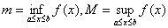

<h3>二、积分不等式 </h3>

&nbsp;&nbsp;&nbsp;&nbsp;&nbsp;&nbsp; 设<i>f</i>(<i>x</i>),<i>g</i>(<i>x</i>)在区间[<i>a</i>,<i>b</i>]上可积，则有下列不等式：

&nbsp;&nbsp;&nbsp;&nbsp;&nbsp;&nbsp; (１) 若在区间[<i>a</i>,<i>b</i>]上，<i>f</i>(<i>x</i>)≤<i>g</i>(<i>x</i>)，则

&nbsp;&nbsp;&nbsp;&nbsp;&nbsp;&nbsp;&nbsp;&nbsp;&nbsp;&nbsp;&nbsp;&nbsp;&nbsp;&nbsp;&nbsp;&nbsp;&nbsp;&nbsp;&nbsp;&nbsp;&nbsp;&nbsp;&nbsp;&nbsp;&nbsp;&nbsp;&nbsp;&nbsp;&nbsp;&nbsp;&nbsp;&nbsp;&nbsp;&nbsp; ≤

&nbsp;&nbsp;&nbsp;&nbsp;&nbsp;&nbsp; (２) 设，则

&nbsp;&nbsp;&nbsp;&nbsp;&nbsp;&nbsp;&nbsp;&nbsp;&nbsp;&nbsp;&nbsp;&nbsp;&nbsp;&nbsp;&nbsp;&nbsp;&nbsp;&nbsp;&nbsp;&nbsp;&nbsp;&nbsp;&nbsp;&nbsp;&nbsp;&nbsp;&nbsp;&nbsp;&nbsp;&nbsp;&nbsp;&nbsp;&nbsp;&nbsp; <i>m</i>≤≤<i>M</i>

&nbsp;&nbsp;&nbsp;&nbsp;&nbsp;&nbsp; (３) ≤

&nbsp;&nbsp;&nbsp;&nbsp;&nbsp;&nbsp; (４) 施瓦兹不等式

&nbsp;&nbsp;&nbsp;&nbsp;&nbsp;&nbsp;&nbsp;&nbsp;&nbsp;&nbsp;&nbsp;&nbsp;&nbsp;&nbsp;&nbsp;&nbsp;&nbsp;&nbsp;&nbsp;&nbsp;&nbsp;&nbsp;&nbsp;&nbsp;&nbsp;&nbsp;&nbsp;&nbsp;&nbsp;&nbsp;&nbsp;&nbsp;&nbsp;&nbsp; 

&nbsp;&nbsp;&nbsp;&nbsp;&nbsp;&nbsp; (５) 赫尔德不等式　　设<i>ｋ</i>&gt;1，&gt;１，，则

&nbsp;&nbsp;&nbsp;&nbsp;&nbsp;&nbsp;&nbsp;&nbsp;&nbsp;&nbsp;&nbsp;&nbsp;&nbsp;&nbsp;&nbsp;&nbsp;&nbsp;&nbsp;&nbsp;&nbsp;&nbsp;&nbsp;&nbsp;&nbsp;&nbsp;&nbsp;&nbsp;&nbsp;&nbsp;&nbsp;&nbsp;&nbsp;&nbsp;&nbsp; 

等号只当<i>f</i>(<i>x</i>)<i>g</i>(<i>x</i>)符号固定且（<i>ｃ</i>为正常数）时成立，当<i>ｋ</i>＝<i>ｋ</i>＇＝２时，就是施瓦兹不等式.

&nbsp;&nbsp;&nbsp;&nbsp;&nbsp;&nbsp; (６) 闵可夫斯基不等式　设<i>r</i>&gt;0，则

&nbsp;&nbsp;&nbsp;&nbsp;&nbsp;&nbsp;&nbsp;&nbsp;&nbsp;&nbsp;&nbsp;&nbsp;&nbsp; ≤ (<i>r</i>≥1)

&nbsp;&nbsp;&nbsp;&nbsp;&nbsp;&nbsp;&nbsp;&nbsp;&nbsp;&nbsp;&nbsp;&nbsp;&nbsp; ≥

&nbsp;&nbsp;&nbsp;&nbsp;&nbsp;&nbsp;&nbsp;&nbsp;&nbsp;&nbsp;&nbsp;&nbsp;&nbsp;&nbsp;&nbsp;&nbsp;&nbsp;&nbsp;&nbsp;&nbsp;&nbsp;&nbsp;&nbsp;&nbsp;&nbsp;&nbsp;&nbsp;&nbsp;&nbsp;&nbsp;&nbsp;&nbsp;&nbsp;&nbsp;&nbsp;&nbsp;&nbsp;&nbsp;&nbsp;&nbsp;&nbsp;&nbsp;&nbsp;&nbsp;&nbsp;&nbsp;&nbsp;&nbsp; &nbsp;（<i>r</i>&lt;1,
<i>f</i>(<i>x</i>)与<i>g</i>(<i>x</i>)在[<i>a</i>,<i>b</i>]上同号）

等号只当<i>f</i>(<i>x</i>)=<i>cg</i>(<i>x</i>)(<i>c</i>为常数)时成立. 

&nbsp;&nbsp;&nbsp;&nbsp;&nbsp;&nbsp; (７) 贝塞耳不等式　设（<i>n</i>为正整数）在[<i>a</i>,<i>b</i>]上为一正规正交系：

&nbsp;&nbsp;&nbsp;&nbsp;&nbsp;&nbsp;&nbsp;&nbsp;&nbsp;&nbsp;&nbsp;&nbsp;&nbsp;&nbsp;&nbsp;&nbsp;&nbsp;&nbsp;&nbsp;&nbsp;&nbsp;&nbsp;&nbsp;&nbsp;&nbsp;&nbsp;&nbsp;&nbsp;&nbsp;&nbsp;&nbsp;&nbsp;&nbsp;&nbsp; 

则

&nbsp;&nbsp;&nbsp;&nbsp;&nbsp;&nbsp;&nbsp;&nbsp;&nbsp;&nbsp;&nbsp;&nbsp;&nbsp;&nbsp;&nbsp;&nbsp;&nbsp;&nbsp;&nbsp;&nbsp;&nbsp;&nbsp;&nbsp;&nbsp;&nbsp;&nbsp;&nbsp;&nbsp;&nbsp;&nbsp;&nbsp;&nbsp;&nbsp;&nbsp; ≤

&nbsp;&nbsp;&nbsp;&nbsp;&nbsp;&nbsp; (８) 哈代不等式　设<i>f</i>(<i>x</i>)在［0，∞）上可微且上升，<i>f </i>'(<i>x</i>)连续，<i>f</i>(0)=0，<i>p</i>&gt;１，则

&nbsp;&nbsp;&nbsp;&nbsp;&nbsp;&nbsp;&nbsp;&nbsp;&nbsp;&nbsp;&nbsp;&nbsp;&nbsp;&nbsp;&nbsp;&nbsp;&nbsp;&nbsp;&nbsp;&nbsp;&nbsp;&nbsp;&nbsp;&nbsp;&nbsp;&nbsp;&nbsp;&nbsp;&nbsp;&nbsp;&nbsp;&nbsp;&nbsp;&nbsp; 

等号只当<i>f</i>(<i>x</i>)≡０时成立.

