

<b>２．</b>有理分式的积分

&nbsp;&nbsp;&nbsp;&nbsp;&nbsp;&nbsp; ［化成基本真分式法］　设<i>R</i>(<i>x</i>)是一个具有实系数的真分式，则<i>R</i>(<i>x</i>)的积分可化成它分解出的基本真分式（第一章，§１）的积分，并且

&nbsp;&nbsp;&nbsp;&nbsp;&nbsp;&nbsp;&nbsp;&nbsp;&nbsp;&nbsp;&nbsp;&nbsp;&nbsp;&nbsp;&nbsp;&nbsp;
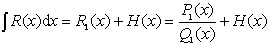

式中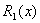仍为一有理函数，并且还是真分式，<i>H</i>(<i>x</i>)一般是超越函数（对数函数和反正切函数）.

&nbsp;&nbsp;&nbsp;&nbsp;&nbsp;&nbsp; ［奥斯特洛格拉特斯基方法］　任一真分式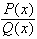的积分可以写为

&nbsp;&nbsp;&nbsp;&nbsp;&nbsp;&nbsp;&nbsp;&nbsp;&nbsp;&nbsp;&nbsp;&nbsp;&nbsp;&nbsp;&nbsp;&nbsp;&nbsp;&nbsp;&nbsp;&nbsp;
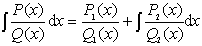

式中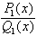，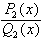为真分式，

&nbsp;&nbsp;&nbsp;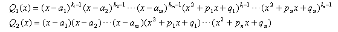

&nbsp;&nbsp;&nbsp; &nbsp;

&nbsp;&nbsp;&nbsp;&nbsp;&nbsp;&nbsp;&nbsp;&nbsp;&nbsp;&nbsp;&nbsp;&nbsp;&nbsp;&nbsp;&nbsp;&nbsp;&nbsp;&nbsp;&nbsp;&nbsp;
&nbsp;&nbsp;&nbsp;&nbsp;&nbsp;&nbsp;&nbsp;&nbsp;&nbsp;&nbsp;
&nbsp;&nbsp;&nbsp;&nbsp;&nbsp; 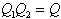

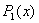和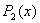的系数可利用待定系数法从关系式

&nbsp;&nbsp;&nbsp;&nbsp;&nbsp;&nbsp;&nbsp;&nbsp;&nbsp;&nbsp;&nbsp;&nbsp;&nbsp;&nbsp;&nbsp;&nbsp;&nbsp;&nbsp;&nbsp;&nbsp;&nbsp;&nbsp;&nbsp;&nbsp;&nbsp;&nbsp;&nbsp;
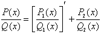

中求出.

