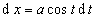

&nbsp;&nbsp;&nbsp;&nbsp;&nbsp;&nbsp; <b>３</b>．有理函数积分的变量替换公式表

&nbsp;&nbsp;&nbsp;&nbsp;&nbsp;&nbsp; 表中<i>R</i>表示有理函数

<table class=MsoNormalTable border=1 cellspacing=1 cellpadding=0 width=581
 style='width:435.75pt'>
 <tr style='height:22.5pt'>
  <td width="34%" valign=top style='width:34.0%;padding:5.25pt 5.25pt 5.25pt 5.25pt;
  height:22.5pt'>
  
积分类型 

  </td>
  <td width="30%" valign=top style='width:30.0%;padding:5.25pt 5.25pt 5.25pt 5.25pt;
  height:22.5pt'>
  
变量替换公式 

  </td>
  <td width="36%" valign=top style='width:36.0%;padding:5.25pt 5.25pt 5.25pt 5.25pt;
  height:22.5pt'>
  

  </td>
 </tr>
 <tr style='height:22.5pt'>
  <td width="34%" valign=top style='width:34.0%;padding:5.25pt 5.25pt 5.25pt 5.25pt;
  height:22.5pt'>
  

  
（<i>n</i>为整数）

  

  
（<i>m</i>,<i>n</i>为整数） 

  </td>
  <td width="30%" valign=top style='width:30.0%;padding:5.25pt 5.25pt 5.25pt 5.25pt;
  height:22.5pt'>
  

  

  
式中<i>r</i>为<i>n</i>,<i>m</i><i>,</i>…的最小公倍数 

  </td>
  <td width="36%" valign=top style='width:36.0%;padding:5.25pt 5.25pt 5.25pt 5.25pt;
  height:22.5pt'>
  

  
　

  

  </td>
 </tr>
 <tr>
  <td width="34%" valign=top style='width:34.0%;padding:5.25pt 5.25pt 5.25pt 5.25pt'>
  

  
<i>a</i>&gt;0时

  
　

  
　

  
<i>c</i>&gt;0时 

  </td>
  <td width="30%" valign=top style='width:30.0%;padding:5.25pt 5.25pt 5.25pt 5.25pt'>
  
　

  
　

  

  

  </td>
  <td width="36%" valign=top style='width:36.0%;padding:5.25pt 5.25pt 5.25pt 5.25pt'>
  
　

  
　

  

  

  </td>
 </tr>
 <tr>
  <td width="34%" valign=top style='width:34.0%;padding:5.25pt 5.25pt 5.25pt 5.25pt'>
  

  </td>
  <td width="30%" valign=top style='width:30.0%;padding:5.25pt 5.25pt 5.25pt 5.25pt'>
  

  </td>
  <td width="36%" valign=top style='width:36.0%;padding:5.25pt 5.25pt 5.25pt 5.25pt'>
  

  </td>
 </tr>
 <tr>
  <td width="34%" valign=top style='width:34.0%;padding:5.25pt 5.25pt 5.25pt 5.25pt'>
  

  
　

  
　

  
　

  
　

  

  
　

  
　

  

  
　

  
　

  
　

  
　 

  </td>
  <td width="30%" valign=top style='width:30.0%;padding:5.25pt 5.25pt 5.25pt 5.25pt'>
  

  
（或<i>x</i>=<i>a</i>sh<i>t</i>,

  
)

  

  
(或<i>x</i>=<i>a</i>cos<i>t</i>,

  
)

  

  
(或<i>x</i>=<i>a</i>ch<i>t</i>,

  
) 

  </td>
  <td width="36%" valign=top style='width:36.0%;padding:5.25pt 5.25pt 5.25pt 5.25pt'>
  

  
（或d<i>x</i>=<i>a</i>ch<i>t</i>d<i>t</i>）

  
　

  
　

  
　

  

  
（或d<i>x</i>=-<i>a</i>sin<i>t</i>d<i>t</i>）

  
　

  
　

  
　

  

  
（或d<i>x</i>=-<i>a</i>sh<i>t</i>d<i>t</i>）

  
　 

  </td>
 </tr>
 <tr style='height:15.75pt'>
  <td width="34%" valign=top style='width:34.0%;padding:5.25pt 5.25pt 5.25pt 5.25pt;
  height:15.75pt'>
  
积分类型 

  </td>
  <td width="30%" valign=top style='width:30.0%;padding:5.25pt 5.25pt 5.25pt 5.25pt;
  height:15.75pt'>
  
变量替换公式 

  </td>
  <td width="36%" valign=top style='width:36.0%;padding:5.25pt 5.25pt 5.25pt 5.25pt;
  height:15.75pt'>
  

  </td>
 </tr>
 <tr style='height:93.0pt'>
  <td width="34%" valign=top style='width:34.0%;padding:5.25pt 5.25pt 5.25pt 5.25pt;
  height:93.0pt'>
  

  
（式中为分数） 

  </td>
  <td width="30%" valign=top style='width:30.0%;padding:5.25pt 5.25pt 5.25pt 5.25pt;
  height:93.0pt'>
  
设<i>m</i>为的分母的最小公倍数,

  

  </td>
  <td width="36%" valign=top style='width:36.0%;padding:5.25pt 5.25pt 5.25pt 5.25pt;
  height:93.0pt'>
  

  </td>
 </tr>
 <tr style='height:22.5pt'>
  <td width="34%" valign=top style='width:34.0%;padding:5.25pt 5.25pt 5.25pt 5.25pt;
  height:22.5pt'>
  

  </td>
  <td width="30%" valign=top style='width:30.0%;padding:5.25pt 5.25pt 5.25pt 5.25pt;
  height:22.5pt'>
  

  </td>
  <td width="36%" valign=top style='width:36.0%;padding:5.25pt 5.25pt 5.25pt 5.25pt;
  height:22.5pt'>
  

  </td>
 </tr>
 <tr>
  <td width="34%" valign=top style='width:34.0%;padding:5.25pt 5.25pt 5.25pt 5.25pt'>
  

  </td>
  <td width="30%" valign=top style='width:30.0%;padding:5.25pt 5.25pt 5.25pt 5.25pt'>
  

  </td>
  <td width="36%" valign=top style='width:36.0%;padding:5.25pt 5.25pt 5.25pt 5.25pt'>
  

  </td>
 </tr>
</table>

&nbsp;

