

4．不定积分表

<b>&nbsp;&nbsp; </b>表中略去积分常数，ln <i>g</i>(<i>x</i>)是指ln |<i>g</i>(<i>x</i>)|.

&nbsp;&nbsp;&nbsp; [基本积分表]

<table class=MsoNormalTable border=0 cellspacing=0 cellpadding=0
 style='border-collapse:collapse'>
 <tr>
  <td width=175 valign=top style='width:131.25pt;border-top:solid windowtext 1.0pt;
  border-left:none;border-bottom:solid black 1.0pt;border-right:solid windowtext 1.0pt;
  padding:0mm 5.4pt 0mm 5.4pt'>
  
<i></i>

  </td>
  <td width=406 valign=top style='width:304.5pt;border-top:solid windowtext 1.0pt;
  border-left:none;border-bottom:solid black 1.0pt;border-right:none;
  padding:0mm 5.4pt 0mm 5.4pt'>
  
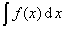

  </td>
 </tr>
 <tr>
  <td width=175 valign=top style='width:131.25pt;border:none;border-right:solid windowtext 1.0pt;
  padding:0mm 5.4pt 0mm 5.4pt'>
  
&nbsp;&nbsp;&nbsp;&nbsp;&nbsp;&nbsp;&nbsp;&nbsp;&nbsp;&nbsp;&nbsp;
  (常数)

  </td>
  <td width=406 valign=top style='width:304.5pt;border:none;padding:0mm 5.4pt 0mm 5.4pt'>
  

  </td>
 </tr>
 <tr>
  <td width=175 valign=top style='width:131.25pt;border:none;border-right:solid windowtext 1.0pt;
  padding:0mm 5.4pt 0mm 5.4pt'>
  
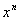&nbsp;&nbsp;&nbsp;&nbsp;&nbsp;&nbsp;&nbsp;&nbsp;&nbsp; 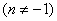

  </td>
  <td width=406 valign=top style='width:304.5pt;border:none;padding:0mm 5.4pt 0mm 5.4pt'>
  

  </td>
 </tr>
 <tr>
  <td width=175 valign=top style='width:131.25pt;border:none;border-right:solid windowtext 1.0pt;
  padding:0mm 5.4pt 0mm 5.4pt'>
  

  </td>
  <td width=406 valign=top style='width:304.5pt;border:none;padding:0mm 5.4pt 0mm 5.4pt'>
  
ln<i>x</i>

  </td>
 </tr>
 <tr>
  <td width=175 valign=top style='width:131.25pt;border:none;border-right:solid windowtext 1.0pt;
  padding:0mm 5.4pt 0mm 5.4pt'>
  

  </td>
  <td width=406 valign=top style='width:304.5pt;border:none;padding:0mm 5.4pt 0mm 5.4pt'>
  
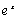

  </td>
 </tr>
 <tr>
  <td width=175 valign=top style='width:131.25pt;border:none;border-right:solid windowtext 1.0pt;
  padding:0mm 5.4pt 0mm 5.4pt'>
  
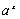&nbsp;&nbsp;&nbsp;&nbsp;&nbsp;&nbsp;&nbsp;&nbsp;&nbsp;&nbsp;&nbsp;
  (<i>a</i>&gt;0)

  </td>
  <td width=406 valign=top style='width:304.5pt;border:none;padding:0mm 5.4pt 0mm 5.4pt'>
  
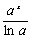

  </td>
 </tr>
 <tr style='height:27.5pt'>
  <td width=175 valign=top style='width:131.25pt;border:none;border-right:solid windowtext 1.0pt;
  padding:0mm 5.4pt 0mm 5.4pt;height:27.5pt'>
  
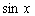

  

  </td>
  <td width=406 valign=top style='width:304.5pt;border:none;padding:0mm 5.4pt 0mm 5.4pt;
  height:27.5pt'>
  

  

  </td>
 </tr>
 <tr>
  <td width=175 valign=top style='width:131.25pt;border:none;border-right:solid windowtext 1.0pt;
  padding:0mm 5.4pt 0mm 5.4pt'>
  

  </td>
  <td width=406 valign=top style='width:304.5pt;border:none;padding:0mm 5.4pt 0mm 5.4pt'>
  

  </td>
 </tr>
 <tr>
  <td width=175 valign=top style='width:131.25pt;border:none;border-right:solid windowtext 1.0pt;
  padding:0mm 5.4pt 0mm 5.4pt'>
  

  </td>
  <td width=406 valign=top style='width:304.5pt;border:none;padding:0mm 5.4pt 0mm 5.4pt'>
  

  </td>
 </tr>
 <tr>
  <td width=175 valign=top style='width:131.25pt;border:none;border-right:solid windowtext 1.0pt;
  padding:0mm 5.4pt 0mm 5.4pt'>
  

  </td>
  <td width=406 valign=top style='width:304.5pt;border:none;padding:0mm 5.4pt 0mm 5.4pt'>
  
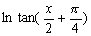或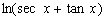

  </td>
 </tr>
 <tr>
  <td width=175 valign=top style='width:131.25pt;border:none;border-right:solid windowtext 1.0pt;
  padding:0mm 5.4pt 0mm 5.4pt'>
  
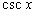

  </td>
  <td width=406 valign=top style='width:304.5pt;border:none;padding:0mm 5.4pt 0mm 5.4pt'>
  
或

  </td>
 </tr>
 <tr>
  <td width=175 valign=top style='width:131.25pt;border:none;border-right:solid windowtext 1.0pt;
  padding:0mm 5.4pt 0mm 5.4pt'>
  
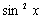

  </td>
  <td width=406 valign=top style='width:304.5pt;border:none;padding:0mm 5.4pt 0mm 5.4pt'>
  
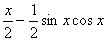

  </td>
 </tr>
 <tr>
  <td width=175 valign=top style='width:131.25pt;border-top:none;border-left:
  none;border-bottom:solid windowtext 1.0pt;border-right:solid windowtext 1.0pt;
  padding:0mm 5.4pt 0mm 5.4pt'>
  
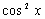

  

  
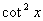

  
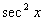

  
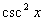

  
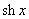

  </td>
  <td width=406 valign=top style='width:304.5pt;border:none;border-bottom:solid windowtext 1.0pt;
  padding:0mm 5.4pt 0mm 5.4pt'>
  
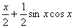

  
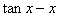

  
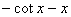

  

  

  
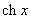

  </td>
 </tr>
 <tr>
  <td width=175 valign=top style='width:131.25pt;border-top:none;border-left:
  none;border-bottom:solid windowtext 1.0pt;border-right:solid windowtext 1.0pt;
  padding:0mm 5.4pt 0mm 5.4pt'>
  
<i></i>

  </td>
  <td width=406 valign=top style='width:304.5pt;border:none;border-bottom:solid windowtext 1.0pt;
  padding:0mm 5.4pt 0mm 5.4pt'>
  

  </td>
 </tr>
 <tr>
  <td width=175 valign=top style='width:131.25pt;border:none;border-right:solid windowtext 1.0pt;
  padding:0mm 5.4pt 0mm 5.4pt'>
  

  </td>
  <td width=406 valign=top style='width:304.5pt;border:none;padding:0mm 5.4pt 0mm 5.4pt'>
  

  </td>
 </tr>
 <tr>
  <td width=175 valign=top style='width:131.25pt;border:none;border-right:solid windowtext 1.0pt;
  padding:0mm 5.4pt 0mm 5.4pt'>
  
th<i>x</i>

  </td>
  <td width=406 valign=top style='width:304.5pt;border:none;padding:0mm 5.4pt 0mm 5.4pt'>
  
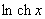

  </td>
 </tr>
 <tr>
  <td width=175 valign=top style='width:131.25pt;border:none;border-right:solid windowtext 1.0pt;
  padding:0mm 5.4pt 0mm 5.4pt'>
  
cth<i>x</i>

  </td>
  <td width=406 valign=top style='width:304.5pt;border:none;padding:0mm 5.4pt 0mm 5.4pt'>
  
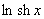

  </td>
 </tr>
 <tr>
  <td width=175 valign=top style='width:131.25pt;border:none;border-right:solid windowtext 1.0pt;
  padding:0mm 5.4pt 0mm 5.4pt'>
  
sech<i>x</i>

  </td>
  <td width=406 valign=top style='width:304.5pt;border:none;padding:0mm 5.4pt 0mm 5.4pt'>
  

  </td>
 </tr>
 <tr>
  <td width=175 valign=top style='width:131.25pt;border:none;border-right:solid windowtext 1.0pt;
  padding:0mm 5.4pt 0mm 5.4pt'>
  
csch<i>x</i>

  </td>
  <td width=406 valign=top style='width:304.5pt;border:none;padding:0mm 5.4pt 0mm 5.4pt'>
  
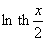

  </td>
 </tr>
 <tr>
  <td width=175 valign=top style='width:131.25pt;border:none;border-right:solid windowtext 1.0pt;
  padding:0mm 5.4pt 0mm 5.4pt'>
  
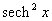

  </td>
  <td width=406 valign=top style='width:304.5pt;border:none;padding:0mm 5.4pt 0mm 5.4pt'>
  
th<i>x</i>

  </td>
 </tr>
 <tr>
  <td width=175 valign=top style='width:131.25pt;border:none;border-right:solid windowtext 1.0pt;
  padding:0mm 5.4pt 0mm 5.4pt'>
  
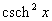

  </td>
  <td width=406 valign=top style='width:304.5pt;border:none;padding:0mm 5.4pt 0mm 5.4pt'>
  
-cth<i>x</i>

  </td>
 </tr>
 <tr>
  <td width=175 valign=top style='width:131.25pt;border:none;border-right:solid windowtext 1.0pt;
  padding:0mm 5.4pt 0mm 5.4pt'>
  
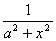&nbsp;&nbsp;&nbsp;&nbsp;&nbsp;&nbsp;&nbsp; (<i>a</i>&gt;0)

  </td>
  <td width=406 valign=top style='width:304.5pt;border:none;padding:0mm 5.4pt 0mm 5.4pt'>
  
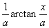

  </td>
 </tr>
 <tr>
  <td width=175 valign=top style='width:131.25pt;border:none;border-right:solid windowtext 1.0pt;
  padding:0mm 5.4pt 0mm 5.4pt'>
  
&nbsp;&nbsp;&nbsp; (|<i>x</i>|&lt;|<i>a</i>|)

  </td>
  <td width=406 valign=top style='width:304.5pt;border:none;padding:0mm 5.4pt 0mm 5.4pt'>
  
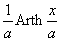&nbsp;或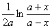

  </td>
 </tr>
 <tr>
  <td width=175 valign=top style='width:131.25pt;border:none;border-right:solid windowtext 1.0pt;
  padding:0mm 5.4pt 0mm 5.4pt'>
  
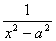&nbsp;&nbsp;&nbsp; (|<i>x</i>|&gt;|<i>a</i>|)

  </td>
  <td width=406 valign=top style='width:304.5pt;border:none;padding:0mm 5.4pt 0mm 5.4pt'>
  
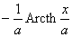&nbsp;或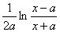

  </td>
 </tr>
 <tr>
  <td width=175 valign=top style='width:131.25pt;border:none;border-right:solid windowtext 1.0pt;
  padding:0mm 5.4pt 0mm 5.4pt'>
  
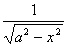

  </td>
  <td width=406 valign=top style='width:304.5pt;border:none;padding:0mm 5.4pt 0mm 5.4pt'>
  
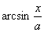

  </td>
 </tr>
 <tr>
  <td width=175 valign=top style='width:131.25pt;border:none;border-right:solid windowtext 1.0pt;
  padding:0mm 5.4pt 0mm 5.4pt'>
  

  </td>
  <td width=406 valign=top style='width:304.5pt;border:none;padding:0mm 5.4pt 0mm 5.4pt'>
  
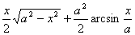

  </td>
 </tr>
 <tr>
  <td width=175 valign=top style='width:131.25pt;border:none;border-right:solid windowtext 1.0pt;
  padding:0mm 5.4pt 0mm 5.4pt'>
  
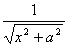

  </td>
  <td width=406 valign=top style='width:304.5pt;border:none;padding:0mm 5.4pt 0mm 5.4pt'>
  
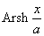或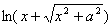

  </td>
 </tr>
 <tr>
  <td width=175 valign=top style='width:131.25pt;border:none;border-right:solid windowtext 1.0pt;
  padding:0mm 5.4pt 0mm 5.4pt'>
  
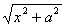

  </td>
  <td width=406 valign=top style='width:304.5pt;border:none;padding:0mm 5.4pt 0mm 5.4pt'>
  
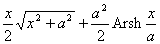

  
或

  </td>
 </tr>
 <tr>
  <td width=175 valign=top style='width:131.25pt;border:none;border-right:solid windowtext 1.0pt;
  padding:0mm 5.4pt 0mm 5.4pt'>
  
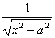

  </td>
  <td width=406 valign=top style='width:304.5pt;border:none;padding:0mm 5.4pt 0mm 5.4pt'>
  
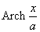或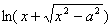

  </td>
 </tr>
 <tr>
  <td width=175 valign=top style='width:131.25pt;border:none;border-right:solid windowtext 1.0pt;
  padding:0mm 5.4pt 0mm 5.4pt'>
  
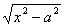

  </td>
  <td width=406 valign=top style='width:304.5pt;border:none;padding:0mm 5.4pt 0mm 5.4pt'>
  
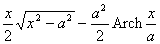

  
或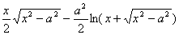

  </td>
 </tr>
 <tr>
  <td width=175 valign=top style='width:131.25pt;border:none;border-right:solid windowtext 1.0pt;
  padding:0mm 5.4pt 0mm 5.4pt'>
  
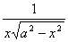

  </td>
  <td width=406 valign=top style='width:304.5pt;border:none;padding:0mm 5.4pt 0mm 5.4pt'>
  
或 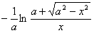

  </td>
 </tr>
 <tr>
  <td width=175 valign=top style='width:131.25pt;border-top:none;border-left:
  none;border-bottom:solid windowtext 1.0pt;border-right:solid windowtext 1.0pt;
  padding:0mm 5.4pt 0mm 5.4pt'>
  
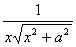

  

  

  

  </td>
  <td width=406 valign=top style='width:304.5pt;border:none;border-bottom:solid windowtext 1.0pt;
  padding:0mm 5.4pt 0mm 5.4pt'>
  
或

  
或

  
或

  

  </td>
 </tr>
</table>

&nbsp;&nbsp;&nbsp;&nbsp;
[含<i>ax</i>+<i>b</i>的有理式的积分]&nbsp;&nbsp;&nbsp; （）

<table class=MsoNormalTable border=0 cellspacing=0 cellpadding=0
 style='border-collapse:collapse'>
 <tr>
  <td width=192 valign=top style='width:144.0pt;border:solid windowtext 1.0pt;
  border-left:none;padding:0mm 5.4pt 0mm 5.4pt'>
  
<i></i>

  </td>
  <td width=414 valign=top style='width:310.5pt;border-top:solid windowtext 1.0pt;
  border-left:none;border-bottom:solid windowtext 1.0pt;border-right:none;
  padding:0mm 5.4pt 0mm 5.4pt'>
  

  </td>
 </tr>
 <tr>
  <td width=192 valign=top style='width:144.0pt;border:none;border-right:solid windowtext 1.0pt;
  padding:0mm 5.4pt 0mm 5.4pt'>
  
&nbsp;&nbsp;&nbsp;&nbsp;&nbsp; 

  </td>
  <td width=414 valign=top style='width:310.5pt;border:none;padding:0mm 5.4pt 0mm 5.4pt'>
  

  </td>
 </tr>
 <tr>
  <td width=192 valign=top style='width:144.0pt;border:none;border-right:solid windowtext 1.0pt;
  padding:0mm 5.4pt 0mm 5.4pt'>
  

  </td>
  <td width=414 valign=top style='width:310.5pt;border:none;padding:0mm 5.4pt 0mm 5.4pt'>
  

  </td>
 </tr>
 <tr>
  <td width=192 valign=top style='width:144.0pt;border:none;border-right:solid windowtext 1.0pt;
  padding:0mm 5.4pt 0mm 5.4pt'>
  

  </td>
  <td width=414 valign=top style='width:310.5pt;border:none;padding:0mm 5.4pt 0mm 5.4pt'>
  

  </td>
 </tr>
 <tr>
  <td width=192 valign=top style='width:144.0pt;border:none;border-right:solid windowtext 1.0pt;
  padding:0mm 5.4pt 0mm 5.4pt'>
  

  </td>
  <td width=414 valign=top style='width:310.5pt;border:none;padding:0mm 5.4pt 0mm 5.4pt'>
  

  </td>
 </tr>
 <tr>
  <td width=192 valign=top style='width:144.0pt;border:none;border-right:solid windowtext 1.0pt;
  padding:0mm 5.4pt 0mm 5.4pt'>
  

  </td>
  <td width=414 valign=top style='width:310.5pt;border:none;padding:0mm 5.4pt 0mm 5.4pt'>
  

  </td>
 </tr>
 <tr>
  <td width=192 valign=top style='width:144.0pt;border:none;border-right:solid windowtext 1.0pt;
  padding:0mm 5.4pt 0mm 5.4pt'>
  

  </td>
  <td width=414 valign=top style='width:310.5pt;border:none;padding:0mm 5.4pt 0mm 5.4pt'>
  

  </td>
 </tr>
 <tr>
  <td width=192 valign=top style='width:144.0pt;border:none;border-right:solid windowtext 1.0pt;
  padding:0mm 5.4pt 0mm 5.4pt'>
  

  </td>
  <td width=414 valign=top style='width:310.5pt;border:none;padding:0mm 5.4pt 0mm 5.4pt'>
  

  </td>
 </tr>
 <tr>
  <td width=192 valign=top style='width:144.0pt;border:none;border-right:solid windowtext 1.0pt;
  padding:0mm 5.4pt 0mm 5.4pt'>
  

  </td>
  <td width=414 valign=top style='width:310.5pt;border:none;padding:0mm 5.4pt 0mm 5.4pt'>
  

  </td>
 </tr>
 <tr>
  <td width=192 valign=top style='width:144.0pt;border:none;border-right:solid windowtext 1.0pt;
  padding:0mm 5.4pt 0mm 5.4pt'>
  

  
()

  </td>
  <td width=414 valign=top style='width:310.5pt;border:none;padding:0mm 5.4pt 0mm 5.4pt'>
  

  </td>
 </tr>
 <tr>
  <td width=192 valign=top style='width:144.0pt;border:none;border-right:solid windowtext 1.0pt;
  padding:0mm 5.4pt 0mm 5.4pt'>
  

  </td>
  <td width=414 valign=top style='width:310.5pt;border:none;padding:0mm 5.4pt 0mm 5.4pt'>
  

  </td>
 </tr>
 <tr>
  <td width=192 valign=top style='width:144.0pt;border:none;border-right:solid windowtext 1.0pt;
  padding:0mm 5.4pt 0mm 5.4pt'>
  

  </td>
  <td width=414 valign=top style='width:310.5pt;border:none;padding:0mm 5.4pt 0mm 5.4pt'>
  

  </td>
 </tr>
 <tr>
  <td width=192 valign=top style='width:144.0pt;border-top:none;border-left:
  none;border-bottom:solid windowtext 1.0pt;border-right:solid windowtext 1.0pt;
  padding:0mm 5.4pt 0mm 5.4pt'>
  

  

  
（）

  

  

  </td>
  <td width=414 valign=top style='width:310.5pt;border:none;border-bottom:solid windowtext 1.0pt;
  padding:0mm 5.4pt 0mm 5.4pt'>
  

  

  
或&nbsp;&nbsp; 

  
或&nbsp;&nbsp; 

  

  

  </td>
 </tr>
 <tr>
  <td width=192 valign=top style='width:144.0pt;border-top:none;border-left:
  none;border-bottom:solid windowtext 1.0pt;border-right:solid windowtext 1.0pt;
  padding:0mm 5.4pt 0mm 5.4pt'>
  

  </td>
  <td width=414 valign=top style='width:310.5pt;border:none;border-bottom:solid windowtext 1.0pt;
  padding:0mm 5.4pt 0mm 5.4pt'>
  

  </td>
 </tr>
 <tr>
  <td width=192 valign=top style='width:144.0pt;border:none;border-right:solid windowtext 1.0pt;
  padding:0mm 5.4pt 0mm 5.4pt'>
  

  </td>
  <td width=414 valign=top style='width:310.5pt;border:none;padding:0mm 5.4pt 0mm 5.4pt'>
  

  </td>
 </tr>
 <tr>
  <td width=192 valign=top style='width:144.0pt;border:none;border-right:solid windowtext 1.0pt;
  padding:0mm 5.4pt 0mm 5.4pt'>
  

  </td>
  <td width=414 valign=top style='width:310.5pt;border:none;padding:0mm 5.4pt 0mm 5.4pt'>
  

  </td>
 </tr>
 <tr>
  <td width=192 valign=top style='width:144.0pt;border:none;border-right:solid windowtext 1.0pt;
  padding:0mm 5.4pt 0mm 5.4pt'>
  

  </td>
  <td width=414 valign=top style='width:310.5pt;border:none;padding:0mm 5.4pt 0mm 5.4pt'>
  

  </td>
 </tr>
 <tr>
  <td width=192 valign=top style='width:144.0pt;border-top:none;border-left:
  none;border-bottom:solid black 1.0pt;border-right:solid windowtext 1.0pt;
  padding:0mm 5.4pt 0mm 5.4pt'>
  

  </td>
  <td width=414 valign=top style='width:310.5pt;border:none;border-bottom:solid black 1.0pt;
  padding:0mm 5.4pt 0mm 5.4pt'>
  

  </td>
 </tr>
</table>

&nbsp;&nbsp;&nbsp; &nbsp;&nbsp;
[含的积分]&nbsp; （）

<table class=MsoNormalTable border=0 cellspacing=0 cellpadding=0
 style='border-collapse:collapse'>
 <tr>
  <td width=192 valign=top style='width:144.0pt;border:solid windowtext 1.0pt;
  border-left:none;padding:0mm 5.4pt 0mm 5.4pt'>
  

  </td>
  <td width=414 valign=top style='width:310.5pt;border-top:solid windowtext 1.0pt;
  border-left:none;border-bottom:solid windowtext 1.0pt;border-right:none;
  padding:0mm 5.4pt 0mm 5.4pt'>
  

  </td>
 </tr>
 <tr>
  <td width=192 valign=top style='width:144.0pt;border:none;border-right:solid windowtext 1.0pt;
  padding:0mm 5.4pt 0mm 5.4pt'>
  

  

  

  

  

  </td>
  <td width=414 valign=top style='width:310.5pt;border:none;padding:0mm 5.4pt 0mm 5.4pt'>
  

  

  

  

  

  
或

  </td>
 </tr>
 <tr>
  <td width=192 valign=top style='width:144.0pt;border:none;border-right:solid windowtext 1.0pt;
  padding:0mm 5.4pt 0mm 5.4pt'>
  

  </td>
  <td width=414 valign=top style='width:310.5pt;border:none;padding:0mm 5.4pt 0mm 5.4pt'>
  

  </td>
 </tr>
 <tr>
  <td width=192 valign=top style='width:144.0pt;border:none;border-right:solid windowtext 1.0pt;
  padding:0mm 5.4pt 0mm 5.4pt'>
  

  </td>
  <td width=414 valign=top style='width:310.5pt;border:none;padding:0mm 5.4pt 0mm 5.4pt'>
  

  </td>
 </tr>
 <tr>
  <td width=192 valign=top style='width:144.0pt;border:none;border-right:solid windowtext 1.0pt;
  padding:0mm 5.4pt 0mm 5.4pt'>
  

  </td>
  <td width=414 valign=top style='width:310.5pt;border:none;padding:0mm 5.4pt 0mm 5.4pt'>
  

  </td>
 </tr>
 <tr>
  <td width=192 valign=top style='width:144.0pt;border:none;border-right:solid windowtext 1.0pt;
  padding:0mm 5.4pt 0mm 5.4pt'>
  

  </td>
  <td width=414 valign=top style='width:310.5pt;border:none;padding:0mm 5.4pt 0mm 5.4pt'>
  

  </td>
 </tr>
 <tr>
  <td width=192 valign=top style='width:144.0pt;border:none;border-right:solid windowtext 1.0pt;
  padding:0mm 5.4pt 0mm 5.4pt'>
  

  </td>
  <td width=414 valign=top style='width:310.5pt;border:none;padding:0mm 5.4pt 0mm 5.4pt'>
  

  
或

  

  </td>
 </tr>
 <tr>
  <td width=192 valign=top style='width:144.0pt;border:none;border-right:solid windowtext 1.0pt;
  padding:0mm 5.4pt 0mm 5.4pt'>
  
&nbsp;&nbsp;&nbsp;&nbsp; （）

  </td>
  <td width=414 valign=top style='width:310.5pt;border:none;padding:0mm 5.4pt 0mm 5.4pt'>
  

  </td>
 </tr>
 <tr>
  <td width=192 valign=top style='width:144.0pt;border:none;border-right:solid windowtext 1.0pt;
  padding:0mm 5.4pt 0mm 5.4pt'>
  
&nbsp;&nbsp;&nbsp; （）

  </td>
  <td width=414 valign=top style='width:310.5pt;border:none;padding:0mm 5.4pt 0mm 5.4pt'>
  

  </td>
 </tr>
 <tr>
  <td width=192 valign=top style='width:144.0pt;border-top:none;border-left:
  none;border-bottom:solid windowtext 1.0pt;border-right:solid windowtext 1.0pt;
  padding:0mm 5.4pt 0mm 5.4pt'>
  

  </td>
  <td width=414 valign=top style='width:310.5pt;border:none;border-bottom:solid windowtext 1.0pt;
  padding:0mm 5.4pt 0mm 5.4pt'>
  

  </td>
 </tr>
 <tr style='height:17.25pt'>
  <td width=192 valign=top style='width:144.0pt;border-top:none;border-left:
  none;border-bottom:solid windowtext 1.0pt;border-right:solid windowtext 1.0pt;
  padding:0mm 5.4pt 0mm 5.4pt;height:17.25pt'>
  

  </td>
  <td width=414 valign=top style='width:310.5pt;border:none;border-bottom:solid windowtext 1.0pt;
  padding:0mm 5.4pt 0mm 5.4pt;height:17.25pt'>
  

  </td>
 </tr>
 <tr style='height:33.75pt'>
  <td width=192 valign=top style='width:144.0pt;border:none;border-right:solid windowtext 1.0pt;
  padding:0mm 5.4pt 0mm 5.4pt;height:33.75pt'>
  

  </td>
  <td width=414 valign=top style='width:310.5pt;border:none;padding:0mm 5.4pt 0mm 5.4pt;
  height:33.75pt'>
  

  </td>
 </tr>
 <tr>
  <td width=192 valign=top style='width:144.0pt;border:none;border-right:solid windowtext 1.0pt;
  padding:0mm 5.4pt 0mm 5.4pt'>
  
&nbsp;&nbsp;&nbsp; 

  </td>
  <td width=414 valign=top style='width:310.5pt;border:none;padding:0mm 5.4pt 0mm 5.4pt'>
  

  </td>
 </tr>
 <tr>
  <td width=192 valign=top style='width:144.0pt;border:none;border-right:solid windowtext 1.0pt;
  padding:0mm 5.4pt 0mm 5.4pt'>
  

  </td>
  <td width=414 valign=top style='width:310.5pt;border:none;padding:0mm 5.4pt 0mm 5.4pt'>
  

  </td>
 </tr>
 <tr>
  <td width=192 valign=top style='width:144.0pt;border:none;border-right:solid windowtext 1.0pt;
  padding:0mm 5.4pt 0mm 5.4pt'>
  
&nbsp;&nbsp;&nbsp;&nbsp; 

  </td>
  <td width=414 valign=top style='width:310.5pt;border:none;padding:0mm 5.4pt 0mm 5.4pt'>
  

  </td>
 </tr>
 <tr>
  <td width=192 valign=top style='width:144.0pt;border:none;border-right:solid windowtext 1.0pt;
  padding:0mm 5.4pt 0mm 5.4pt'>
  

  </td>
  <td width=414 valign=top style='width:310.5pt;border:none;padding:0mm 5.4pt 0mm 5.4pt'>
  

  </td>
 </tr>
 <tr>
  <td width=192 valign=top style='width:144.0pt;border:none;border-right:solid windowtext 1.0pt;
  padding:0mm 5.4pt 0mm 5.4pt'>
  

  </td>
  <td width=414 valign=top style='width:310.5pt;border:none;padding:0mm 5.4pt 0mm 5.4pt'>
  

  </td>
 </tr>
 <tr>
  <td width=192 valign=top style='width:144.0pt;border:none;border-right:solid windowtext 1.0pt;
  padding:0mm 5.4pt 0mm 5.4pt'>
  

  

  </td>
  <td width=414 valign=top style='width:310.5pt;border:none;padding:0mm 5.4pt 0mm 5.4pt'>
  

  

  </td>
 </tr>
 <tr>
  <td width=192 valign=top style='width:144.0pt;border:none;border-right:solid windowtext 1.0pt;
  padding:0mm 5.4pt 0mm 5.4pt'>
  

  </td>
  <td width=414 valign=top style='width:310.5pt;border:none;padding:0mm 5.4pt 0mm 5.4pt'>
  

  </td>
 </tr>
 <tr>
  <td width=192 valign=top style='width:144.0pt;border-top:none;border-left:
  none;border-bottom:solid black 1.0pt;border-right:solid windowtext 1.0pt;
  padding:0mm 5.4pt 0mm 5.4pt'>
  

  </td>
  <td width=414 valign=top style='width:310.5pt;border:none;border-bottom:solid black 1.0pt;
  padding:0mm 5.4pt 0mm 5.4pt'>
  

  </td>
 </tr>
</table>

&nbsp;&nbsp;&nbsp; &nbsp;&nbsp;
[含的积分]

<table class=MsoNormalTable border=0 cellspacing=0 cellpadding=0
 style='border-collapse:collapse'>
 <tr>
  <td width=192 valign=top style='width:144.0pt;border:solid windowtext 1.0pt;
  border-left:none;padding:0mm 5.4pt 0mm 5.4pt'>
  

  </td>
  <td width=414 valign=top style='width:310.5pt;border-top:solid windowtext 1.0pt;
  border-left:none;border-bottom:solid windowtext 1.0pt;border-right:none;
  padding:0mm 5.4pt 0mm 5.4pt'>
  

  </td>
 </tr>
 <tr>
  <td width=192 valign=top style='width:144.0pt;border:none;border-right:solid windowtext 1.0pt;
  padding:0mm 5.4pt 0mm 5.4pt'>
  

  </td>
  <td width=414 valign=top style='width:310.5pt;border:none;padding:0mm 5.4pt 0mm 5.4pt'>
  

  </td>
 </tr>
 <tr>
  <td width=192 valign=top style='width:144.0pt;border:none;border-right:solid windowtext 1.0pt;
  padding:0mm 5.4pt 0mm 5.4pt'>
  

  </td>
  <td width=414 valign=top style='width:310.5pt;border:none;padding:0mm 5.4pt 0mm 5.4pt'>
  

  </td>
 </tr>
 <tr>
  <td width=192 valign=top style='width:144.0pt;border:none;border-right:solid windowtext 1.0pt;
  padding:0mm 5.4pt 0mm 5.4pt'>
  

  </td>
  <td width=414 valign=top style='width:310.5pt;border:none;padding:0mm 5.4pt 0mm 5.4pt'>
  

  </td>
 </tr>
 <tr>
  <td width=192 valign=top style='width:144.0pt;border-top:none;border-left:
  none;border-bottom:solid windowtext 1.0pt;border-right:solid windowtext 1.0pt;
  padding:0mm 5.4pt 0mm 5.4pt'>
  

  </td>
  <td width=414 valign=top style='width:310.5pt;border:none;border-bottom:solid windowtext 1.0pt;
  padding:0mm 5.4pt 0mm 5.4pt'>
  

  </td>
 </tr>
 <tr style='height:16.5pt'>
  <td width=192 valign=top style='width:144.0pt;border-top:none;border-left:
  none;border-bottom:solid windowtext 1.0pt;border-right:solid windowtext 1.0pt;
  padding:0mm 5.4pt 0mm 5.4pt;height:16.5pt'>
  

  </td>
  <td width=414 valign=top style='width:310.5pt;border:none;border-bottom:solid windowtext 1.0pt;
  padding:0mm 5.4pt 0mm 5.4pt;height:16.5pt'>
  

  </td>
 </tr>
 <tr>
  <td width=192 valign=top style='width:144.0pt;border:none;border-right:solid windowtext 1.0pt;
  padding:0mm 5.4pt 0mm 5.4pt'>
  

  

  </td>
  <td width=414 valign=top style='width:310.5pt;border:none;padding:0mm 5.4pt 0mm 5.4pt'>
  

  
或

  

  

  </td>
 </tr>
 <tr>
  <td width=192 valign=top style='width:144.0pt;border:none;border-right:solid windowtext 1.0pt;
  padding:0mm 5.4pt 0mm 5.4pt'>
  

  </td>
  <td width=414 valign=top style='width:310.5pt;border:none;padding:0mm 5.4pt 0mm 5.4pt'>
  

  </td>
 </tr>
 <tr>
  <td width=192 valign=top style='width:144.0pt;border:none;border-right:solid windowtext 1.0pt;
  padding:0mm 5.4pt 0mm 5.4pt'>
  

  </td>
  <td width=414 valign=top style='width:310.5pt;border:none;padding:0mm 5.4pt 0mm 5.4pt'>
  

  </td>
 </tr>
 <tr>
  <td width=192 valign=top style='width:144.0pt;border:none;border-right:solid windowtext 1.0pt;
  padding:0mm 5.4pt 0mm 5.4pt'>
  

  </td>
  <td width=414 valign=top style='width:310.5pt;border:none;padding:0mm 5.4pt 0mm 5.4pt'>
  

  </td>
 </tr>
 <tr>
  <td width=192 valign=top style='width:144.0pt;border:none;border-right:solid windowtext 1.0pt;
  padding:0mm 5.4pt 0mm 5.4pt'>
  

  </td>
  <td width=414 valign=top style='width:310.5pt;border:none;padding:0mm 5.4pt 0mm 5.4pt'>
  

  </td>
 </tr>
 <tr>
  <td width=192 valign=top style='width:144.0pt;border:none;border-right:solid windowtext 1.0pt;
  padding:0mm 5.4pt 0mm 5.4pt'>
  

  </td>
  <td width=414 valign=top style='width:310.5pt;border:none;padding:0mm 5.4pt 0mm 5.4pt'>
  

  </td>
 </tr>
 <tr>
  <td width=192 valign=top style='width:144.0pt;border:none;border-right:solid windowtext 1.0pt;
  padding:0mm 5.4pt 0mm 5.4pt'>
  

  </td>
  <td width=414 valign=top style='width:310.5pt;border:none;padding:0mm 5.4pt 0mm 5.4pt'>
  

  </td>
 </tr>
 <tr>
  <td width=192 valign=top style='width:144.0pt;border:none;border-right:solid windowtext 1.0pt;
  padding:0mm 5.4pt 0mm 5.4pt'>
  

  </td>
  <td width=414 valign=top style='width:310.5pt;border:none;padding:0mm 5.4pt 0mm 5.4pt'>
  

  </td>
 </tr>
 <tr>
  <td width=192 valign=top style='width:144.0pt;border:none;border-right:solid windowtext 1.0pt;
  padding:0mm 5.4pt 0mm 5.4pt'>
  

  </td>
  <td width=414 valign=top style='width:310.5pt;border:none;padding:0mm 5.4pt 0mm 5.4pt'>
  

  </td>
 </tr>
 <tr>
  <td width=192 valign=top style='width:144.0pt;border:none;border-right:solid windowtext 1.0pt;
  padding:0mm 5.4pt 0mm 5.4pt'>
  

  </td>
  <td width=414 valign=top style='width:310.5pt;border:none;padding:0mm 5.4pt 0mm 5.4pt'>
  

  </td>
 </tr>
 <tr>
  <td width=192 valign=top style='width:144.0pt;border-top:none;border-left:
  none;border-bottom:solid windowtext 1.0pt;border-right:solid windowtext 1.0pt;
  padding:0mm 5.4pt 0mm 5.4pt'>
  

  </td>
  <td width=414 valign=top style='width:310.5pt;border:none;border-bottom:solid windowtext 1.0pt;
  padding:0mm 5.4pt 0mm 5.4pt'>
  

  </td>
 </tr>
 <tr style='height:15.75pt'>
  <td width=192 valign=top style='width:144.0pt;border-top:none;border-left:
  none;border-bottom:solid windowtext 1.0pt;border-right:solid windowtext 1.0pt;
  padding:0mm 5.4pt 0mm 5.4pt;height:15.75pt'>
  
<i></i>

  </td>
  <td width=414 valign=top style='width:310.5pt;border:none;border-bottom:solid windowtext 1.0pt;
  padding:0mm 5.4pt 0mm 5.4pt;height:15.75pt'>
  

  </td>
 </tr>
 <tr style='height:34.5pt'>
  <td width=192 valign=top style='width:144.0pt;border:none;border-right:solid windowtext 1.0pt;
  padding:0mm 5.4pt 0mm 5.4pt;height:34.5pt'>
  

  </td>
  <td width=414 valign=top style='width:310.5pt;border:none;padding:0mm 5.4pt 0mm 5.4pt;
  height:34.5pt'>
  

  </td>
 </tr>
 <tr>
  <td width=192 valign=top style='width:144.0pt;border:none;border-right:solid windowtext 1.0pt;
  padding:0mm 5.4pt 0mm 5.4pt'>
  

  </td>
  <td width=414 valign=top style='width:310.5pt;border:none;padding:0mm 5.4pt 0mm 5.4pt'>
  

  </td>
 </tr>
 <tr>
  <td width=192 valign=top style='width:144.0pt;border-top:none;border-left:
  none;border-bottom:solid windowtext 1.0pt;border-right:solid windowtext 1.0pt;
  padding:0mm 5.4pt 0mm 5.4pt'>
  

  

  

  </td>
  <td width=414 valign=top style='width:310.5pt;border:none;border-bottom:solid windowtext 1.0pt;
  padding:0mm 5.4pt 0mm 5.4pt'>
  

  

  

  </td>
 </tr>
</table>

&nbsp;&nbsp;&nbsp; &nbsp;&nbsp;
[含的有理式的积分]

<table class=MsoNormalTable border=0 cellspacing=0 cellpadding=0
 style='border-collapse:collapse'>
 <tr>
  <td width=192 valign=top style='width:144.0pt;border:solid windowtext 1.0pt;
  border-left:none;padding:0mm 5.4pt 0mm 5.4pt'>
  
<i></i>

  </td>
  <td width=414 valign=top style='width:310.5pt;border-top:solid windowtext 1.0pt;
  border-left:none;border-bottom:solid windowtext 1.0pt;border-right:none;
  padding:0mm 5.4pt 0mm 5.4pt'>
  

  </td>
 </tr>
 <tr>
  <td width=192 valign=top style='width:144.0pt;border:none;border-right:solid windowtext 1.0pt;
  padding:0mm 5.4pt 0mm 5.4pt'>
  

  </td>
  <td width=414 valign=top style='width:310.5pt;border:none;padding:0mm 5.4pt 0mm 5.4pt'>
  

  </td>
 </tr>
 <tr>
  <td width=192 valign=top style='width:144.0pt;border:none;border-right:solid windowtext 1.0pt;
  padding:0mm 5.4pt 0mm 5.4pt'>
  

  </td>
  <td width=414 valign=top style='width:310.5pt;border:none;padding:0mm 5.4pt 0mm 5.4pt'>
  

  </td>
 </tr>
 <tr>
  <td width=192 valign=top style='width:144.0pt;border:none;border-right:solid windowtext 1.0pt;
  padding:0mm 5.4pt 0mm 5.4pt'>
  

  </td>
  <td width=414 valign=top style='width:310.5pt;border:none;padding:0mm 5.4pt 0mm 5.4pt'>
  

  </td>
 </tr>
 <tr>
  <td width=192 valign=top style='width:144.0pt;border:none;border-right:solid windowtext 1.0pt;
  padding:0mm 5.4pt 0mm 5.4pt'>
  

  </td>
  <td width=414 valign=top style='width:310.5pt;border:none;padding:0mm 5.4pt 0mm 5.4pt'>
  

  </td>
 </tr>
 <tr>
  <td width=192 valign=top style='width:144.0pt;border:none;border-right:solid windowtext 1.0pt;
  padding:0mm 5.4pt 0mm 5.4pt'>
  

  </td>
  <td width=414 valign=top style='width:310.5pt;border:none;padding:0mm 5.4pt 0mm 5.4pt'>
  

  </td>
 </tr>
 <tr>
  <td width=192 valign=top style='width:144.0pt;border:none;border-right:solid windowtext 1.0pt;
  padding:0mm 5.4pt 0mm 5.4pt'>
  

  </td>
  <td width=414 valign=top style='width:310.5pt;border:none;padding:0mm 5.4pt 0mm 5.4pt'>
  

  </td>
 </tr>
 <tr>
  <td width=192 valign=top style='width:144.0pt;border:none;border-right:solid windowtext 1.0pt;
  padding:0mm 5.4pt 0mm 5.4pt'>
  

  </td>
  <td width=414 valign=top style='width:310.5pt;border:none;padding:0mm 5.4pt 0mm 5.4pt'>
  

  </td>
 </tr>
 <tr>
  <td width=192 valign=top style='width:144.0pt;border:none;border-right:solid windowtext 1.0pt;
  padding:0mm 5.4pt 0mm 5.4pt'>
  

  </td>
  <td width=414 valign=top style='width:310.5pt;border:none;padding:0mm 5.4pt 0mm 5.4pt'>
  

  </td>
 </tr>
 <tr>
  <td width=192 valign=top style='width:144.0pt;border:none;border-right:solid windowtext 1.0pt;
  padding:0mm 5.4pt 0mm 5.4pt'>
  

  </td>
  <td width=414 valign=top style='width:310.5pt;border:none;padding:0mm 5.4pt 0mm 5.4pt'>
  

  </td>
 </tr>
 <tr>
  <td width=192 valign=top style='width:144.0pt;border:none;border-right:solid windowtext 1.0pt;
  padding:0mm 5.4pt 0mm 5.4pt'>
  

  </td>
  <td width=414 valign=top style='width:310.5pt;border:none;padding:0mm 5.4pt 0mm 5.4pt'>
  

  </td>
 </tr>
 <tr>
  <td width=192 valign=top style='width:144.0pt;border:none;border-right:solid windowtext 1.0pt;
  padding:0mm 5.4pt 0mm 5.4pt'>
  

  </td>
  <td width=414 valign=top style='width:310.5pt;border:none;padding:0mm 5.4pt 0mm 5.4pt'>
  

  </td>
 </tr>
 <tr>
  <td width=192 valign=top style='width:144.0pt;border-top:none;border-left:
  none;border-bottom:solid black 1.0pt;border-right:solid windowtext 1.0pt;
  padding:0mm 5.4pt 0mm 5.4pt'>
  

  </td>
  <td width=414 valign=top style='width:310.5pt;border:none;border-bottom:solid black 1.0pt;
  padding:0mm 5.4pt 0mm 5.4pt'>
  

  </td>
 </tr>
</table>

&nbsp;&nbsp;&nbsp;&nbsp;&nbsp;&nbsp;
[含的积分]

<table class=MsoNormalTable border=0 cellspacing=0 cellpadding=0
 style='border-collapse:collapse'>
 <tr>
  <td width=192 valign=top style='width:144.0pt;border:solid black 1.0pt;
  border-left:none;padding:0mm 1.4pt 0mm 1.4pt'>
  

  </td>
  <td width=407 valign=top style='width:305.25pt;border-top:solid black 1.0pt;
  border-left:none;border-bottom:solid black 1.0pt;border-right:none;
  padding:0mm 1.4pt 0mm 1.4pt'>
  

  </td>
 </tr>
 <tr>
  <td width=192 valign=top style='width:144.0pt;border:none;border-right:solid black 1.0pt;
  padding:0mm 1.4pt 0mm 1.4pt'>
  
&nbsp;&nbsp;&nbsp;&nbsp;&nbsp;&nbsp; (<i>a</i>&gt;0)

  </td>
  <td width=407 valign=top style='width:305.25pt;border:none;padding:0mm 1.4pt 0mm 1.4pt'>
  

  </td>
 </tr>
 <tr>
  <td width=192 valign=top style='width:144.0pt;border:none;border-right:solid black 1.0pt;
  padding:0mm 1.4pt 0mm 1.4pt'>
  
&nbsp;&nbsp;&nbsp;&nbsp;&nbsp;&nbsp; (<i>a</i>&lt;0)

  </td>
  <td width=407 valign=top style='width:305.25pt;border:none;padding:0mm 1.4pt 0mm 1.4pt'>
  

  </td>
 </tr>
 <tr>
  <td width=192 valign=top style='width:144.0pt;border:none;border-right:solid black 1.0pt;
  padding:0mm 1.4pt 0mm 1.4pt'>
  
&nbsp;&nbsp;&nbsp;&nbsp; (<i>a</i>&gt;0)

  </td>
  <td width=407 valign=top style='width:305.25pt;border:none;padding:0mm 1.4pt 0mm 1.4pt'>
  

  </td>
 </tr>
 <tr>
  <td width=192 valign=top style='width:144.0pt;border:none;border-right:solid black 1.0pt;
  padding:0mm 1.4pt 0mm 1.4pt'>
  
&nbsp;&nbsp;&nbsp;&nbsp; (<i>a</i>&lt;0)

  </td>
  <td width=407 valign=top style='width:305.25pt;border:none;padding:0mm 1.4pt 0mm 1.4pt'>
  

  </td>
 </tr>
 <tr>
  <td width=192 valign=top style='width:144.0pt;border:none;border-right:solid black 1.0pt;
  padding:0mm 1.4pt 0mm 1.4pt'>
  

  </td>
  <td width=407 valign=top style='width:305.25pt;border:none;padding:0mm 1.4pt 0mm 1.4pt'>
  

  </td>
 </tr>
 <tr>
  <td width=192 valign=top style='width:144.0pt;border:none;border-right:solid black 1.0pt;
  padding:0mm 1.4pt 0mm 1.4pt'>
  
&nbsp;&nbsp;&nbsp;&nbsp;&nbsp; (<i>a</i>&gt;0)

  </td>
  <td width=407 valign=top style='width:305.25pt;border:none;padding:0mm 1.4pt 0mm 1.4pt'>
  

  </td>
 </tr>
 <tr>
  <td width=192 valign=top style='width:144.0pt;border:none;border-right:solid black 1.0pt;
  padding:0mm 1.4pt 0mm 1.4pt'>
  
&nbsp;&nbsp;&nbsp;&nbsp;&nbsp;&nbsp; (<i>a</i>&lt;0)

  </td>
  <td width=407 valign=top style='width:305.25pt;border:none;padding:0mm 1.4pt 0mm 1.4pt'>
  

  </td>
 </tr>
 <tr>
  <td width=192 valign=top style='width:144.0pt;border:none;border-right:solid black 1.0pt;
  padding:0mm 1.4pt 0mm 1.4pt'>
  
&nbsp;&nbsp;&nbsp;&nbsp;&nbsp; (<i>n</i>&gt;0)

  </td>
  <td width=407 valign=top style='width:305.25pt;border:none;padding:0mm 1.4pt 0mm 1.4pt'>
  

  </td>
 </tr>
 <tr>
  <td width=192 valign=top style='width:144.0pt;border:none;border-right:solid black 1.0pt;
  padding:0mm 1.4pt 0mm 1.4pt'>
  

  </td>
  <td width=407 valign=top style='width:305.25pt;border:none;padding:0mm 1.4pt 0mm 1.4pt'>
  

  </td>
 </tr>
 <tr>
  <td width=192 valign=top style='width:144.0pt;border:none;border-right:solid black 1.0pt;
  padding:0mm 1.4pt 0mm 1.4pt'>
  

  </td>
  <td width=407 valign=top style='width:305.25pt;border:none;padding:0mm 1.4pt 0mm 1.4pt'>
  

  </td>
 </tr>
 <tr>
  <td width=192 valign=top style='width:144.0pt;border:none;border-right:solid black 1.0pt;
  padding:0mm 1.4pt 0mm 1.4pt'>
  
&nbsp;&nbsp;&nbsp; (<i>n</i>&gt;0)

  </td>
  <td width=407 valign=top style='width:305.25pt;border:none;padding:0mm 1.4pt 0mm 1.4pt'>
  

  </td>
 </tr>
 <tr>
  <td width=192 valign=top style='width:144.0pt;border:none;border-right:solid black 1.0pt;
  padding:0mm 1.4pt 0mm 1.4pt'>
  
&nbsp;&nbsp;&nbsp;&nbsp;&nbsp;&nbsp;&nbsp; (<i>c</i>&gt;0)

  </td>
  <td width=407 valign=top style='width:305.25pt;border:none;padding:0mm 1.4pt 0mm 1.4pt'>
  

  </td>
 </tr>
 <tr>
  <td width=192 valign=top style='width:144.0pt;border:none;border-right:solid black 1.0pt;
  padding:0mm 1.4pt 0mm 1.4pt'>
  
&nbsp;&nbsp;&nbsp;&nbsp;&nbsp;&nbsp;&nbsp; (<i>c</i>&lt;0)

  </td>
  <td width=407 valign=top style='width:305.25pt;border:none;padding:0mm 1.4pt 0mm 1.4pt'>
  

  </td>
 </tr>
 <tr>
  <td width=192 valign=top style='width:144.0pt;border:none;border-right:solid black 1.0pt;
  padding:0mm 1.4pt 0mm 1.4pt'>
  
&nbsp;&nbsp;&nbsp;&nbsp;&nbsp;&nbsp;&nbsp; (<i>n</i>&gt;1)

  </td>
  <td width=407 valign=top style='width:305.25pt;border:none;padding:0mm 1.4pt 0mm 1.4pt'>
  

  </td>
 </tr>
 <tr>
  <td width=192 valign=top style='width:144.0pt;border:none;border-right:solid black 1.0pt;
  padding:0mm 1.4pt 0mm 1.4pt'>
  
&nbsp;&nbsp;&nbsp;&nbsp;&nbsp;&nbsp;&nbsp; (<i>a</i>&gt;0)

  </td>
  <td width=407 valign=top style='width:305.25pt;border:none;padding:0mm 1.4pt 0mm 1.4pt'>
  

  </td>
 </tr>
 <tr>
  <td width=192 valign=top style='width:144.0pt;border:none;border-right:solid black 1.0pt;
  padding:0mm 1.4pt 0mm 1.4pt'>
  
&nbsp;&nbsp;&nbsp;&nbsp;&nbsp;&nbsp;&nbsp; (<i>a</i>&lt;0)

  </td>
  <td width=407 valign=top style='width:305.25pt;border:none;padding:0mm 1.4pt 0mm 1.4pt'>
  

  </td>
 </tr>
 <tr>
  <td width=192 valign=top style='width:144.0pt;border-top:none;border-left:
  none;border-bottom:solid black 1.0pt;border-right:solid black 1.0pt;
  padding:0mm 1.4pt 0mm 1.4pt'>
  

  </td>
  <td width=407 valign=top style='width:305.25pt;border:none;border-bottom:
  solid black 1.0pt;padding:0mm 1.4pt 0mm 1.4pt'>
  

  </td>
 </tr>
 <tr style='height:15.75pt'>
  <td width=192 valign=top style='width:144.0pt;border-top:none;border-left:
  none;border-bottom:solid windowtext 1.0pt;border-right:solid black 1.0pt;
  padding:0mm 1.4pt 0mm 1.4pt;height:15.75pt'>
  

  </td>
  <td width=407 valign=top style='width:305.25pt;border:none;border-bottom:
  solid windowtext 1.0pt;padding:0mm 1.4pt 0mm 1.4pt;height:15.75pt'>
  

  </td>
 </tr>
 <tr style='height:33.0pt'>
  <td width=192 valign=top style='width:144.0pt;border:none;border-right:solid black 1.0pt;
  padding:0mm 1.4pt 0mm 1.4pt;height:33.0pt'>
  

  </td>
  <td width=407 valign=top style='width:305.25pt;border:none;padding:0mm 1.4pt 0mm 1.4pt;
  height:33.0pt'>
  

  </td>
 </tr>
 <tr>
  <td width=192 valign=top style='width:144.0pt;border:none;border-right:solid black 1.0pt;
  padding:0mm 1.4pt 0mm 1.4pt'>
  

  </td>
  <td width=407 valign=top style='width:305.25pt;border:none;padding:0mm 1.4pt 0mm 1.4pt'>
  

  </td>
 </tr>
 <tr>
  <td width=192 valign=top style='width:144.0pt;border:none;border-right:solid black 1.0pt;
  padding:0mm 1.4pt 0mm 1.4pt'>
  
&nbsp;&nbsp;&nbsp;&nbsp;&nbsp;&nbsp;&nbsp; (<i>n</i>&gt;0)

  </td>
  <td width=407 valign=top style='width:305.25pt;border:none;padding:0mm 1.4pt 0mm 1.4pt'>
  

  </td>
 </tr>
 <tr>
  <td width=192 valign=top style='width:144.0pt;border:none;border-right:solid black 1.0pt;
  padding:0mm 1.4pt 0mm 1.4pt'>
  

  </td>
  <td width=407 valign=top style='width:305.25pt;border:none;padding:0mm 1.4pt 0mm 1.4pt'>
  

  </td>
 </tr>
 <tr>
  <td width=192 valign=top style='width:144.0pt;border:none;border-right:solid black 1.0pt;
  padding:0mm 1.4pt 0mm 1.4pt'>
  
&nbsp;&nbsp;&nbsp;&nbsp;&nbsp; (<i>a</i>&gt;0)

  </td>
  <td width=407 valign=top style='width:305.25pt;border:none;padding:0mm 1.4pt 0mm 1.4pt'>
  

  </td>
 </tr>
 <tr>
  <td width=192 valign=top style='width:144.0pt;border:none;border-right:solid black 1.0pt;
  padding:0mm 1.4pt 0mm 1.4pt'>
  
&nbsp;&nbsp;&nbsp;&nbsp;&nbsp; (<i>a</i>&lt;0)

  </td>
  <td width=407 valign=top style='width:305.25pt;border:none;padding:0mm 1.4pt 0mm 1.4pt'>
  

  </td>
 </tr>
 <tr>
  <td width=192 valign=top style='width:144.0pt;border:none;border-right:solid black 1.0pt;
  padding:0mm 1.4pt 0mm 1.4pt'>
  

  </td>
  <td width=407 valign=top style='width:305.25pt;border:none;padding:0mm 1.4pt 0mm 1.4pt'>
  

  </td>
 </tr>
 <tr>
  <td width=192 valign=top style='width:144.0pt;border:none;border-right:solid black 1.0pt;
  padding:0mm 1.4pt 0mm 1.4pt'>
  
&nbsp;&nbsp;&nbsp;&nbsp;&nbsp; (<i>c</i>&gt;0)

  </td>
  <td width=407 valign=top style='width:305.25pt;border:none;padding:0mm 1.4pt 0mm 1.4pt'>
  

  </td>
 </tr>
 <tr>
  <td width=192 valign=top style='width:144.0pt;border:none;border-right:solid black 1.0pt;
  padding:0mm 1.4pt 0mm 1.4pt'>
  
&nbsp;&nbsp; (<i>a</i>&gt;0,<i>c</i><i>&lt;</i>0)

  </td>
  <td width=407 valign=top style='width:305.25pt;border:none;padding:0mm 1.4pt 0mm 1.4pt'>
  

  </td>
 </tr>
 <tr>
  <td width=192 valign=top style='width:144.0pt;border:none;border-right:solid black 1.0pt;
  padding:0mm 1.4pt 0mm 1.4pt'>
  

  </td>
  <td width=407 valign=top style='width:305.25pt;border:none;padding:0mm 1.4pt 0mm 1.4pt'>
  

  </td>
 </tr>
 <tr>
  <td width=192 valign=top style='width:144.0pt;border-top:none;border-left:
  none;border-bottom:solid black 1.0pt;border-right:solid black 1.0pt;
  padding:0mm 1.4pt 0mm 1.4pt'>
  
&nbsp;&nbsp;&nbsp;&nbsp;&nbsp; (<i>n</i>&gt;1)

  </td>
  <td width=407 valign=top style='width:305.25pt;border:none;border-bottom:
  solid black 1.0pt;padding:0mm 1.4pt 0mm 1.4pt'>
  

  </td>
 </tr>
</table>

&nbsp;&nbsp;&nbsp; &nbsp;&nbsp;
[含的积分]

<table class=MsoNormalTable border=0 cellspacing=0 cellpadding=0
 style='border-collapse:collapse'>
 <tr>
  <td width=192 valign=top style='width:144.0pt;border:solid black 1.0pt;
  border-left:none;padding:0mm 1.4pt 0mm 1.4pt'>
  

  </td>
  <td width=407 valign=top style='width:305.25pt;border-top:solid black 1.0pt;
  border-left:none;border-bottom:solid black 1.0pt;border-right:none;
  padding:0mm 1.4pt 0mm 1.4pt'>
  

  </td>
 </tr>
 <tr>
  <td width=192 valign=top style='width:144.0pt;border:none;border-right:solid black 1.0pt;
  padding:0mm 1.4pt 0mm 1.4pt'>
  
&nbsp;&nbsp;&nbsp;&nbsp;&nbsp;&nbsp; (<i>n</i>&gt;0)

  </td>
  <td width=407 valign=top style='width:305.25pt;border:none;padding:0mm 1.4pt 0mm 1.4pt'>
  

  </td>
 </tr>
 <tr>
  <td width=192 valign=top style='width:144.0pt;border:none;border-right:solid black 1.0pt;
  padding:0mm 1.4pt 0mm 1.4pt'>
  
&nbsp;&nbsp;&nbsp; (<i>n</i>&gt;0,<i>c</i>&gt;0)

  </td>
  <td width=407 valign=top style='width:305.25pt;border:none;padding:0mm 1.4pt 0mm 1.4pt'>
  

  </td>
 </tr>
 <tr>
  <td width=192 valign=top style='width:144.0pt;border:none;border-right:solid black 1.0pt;
  padding:0mm 1.4pt 0mm 1.4pt'>
  
&nbsp;&nbsp;&nbsp; (<i>n</i>&gt;0,<i>c</i>&lt;0)

  </td>
  <td width=407 valign=top style='width:305.25pt;border:none;padding:0mm 1.4pt 0mm 1.4pt'>
  

  </td>
 </tr>
 <tr>
  <td width=192 valign=top style='width:144.0pt;border-top:none;border-left:
  none;border-bottom:solid black 1.0pt;border-right:solid black 1.0pt;
  padding:0mm 1.4pt 0mm 1.4pt'>
  

  
&nbsp;&nbsp;&nbsp; ()

  </td>
  <td width=407 valign=top style='width:305.25pt;border:none;border-bottom:
  solid black 1.0pt;padding:0mm 1.4pt 0mm 1.4pt'>
  

  

  </td>
 </tr>
 <tr style='height:23.0pt'>
  <td width=192 valign=top style='width:144.0pt;border-top:none;border-left:
  none;border-bottom:solid windowtext 1.0pt;border-right:solid black 1.0pt;
  padding:0mm 1.4pt 0mm 1.4pt;height:23.0pt'>
  

  </td>
  <td width=407 valign=top style='width:305.25pt;border:none;border-bottom:
  solid windowtext 1.0pt;padding:0mm 1.4pt 0mm 1.4pt;height:23.0pt'>
  

  </td>
 </tr>
 <tr style='height:5.25pt'>
  <td width=192 valign=top style='width:144.0pt;border:none;border-right:solid black 1.0pt;
  padding:0mm 1.4pt 0mm 1.4pt;height:5.25pt'>
  
&nbsp; 

  </td>
  <td width=407 valign=top style='width:305.25pt;border:none;padding:0mm 1.4pt 0mm 1.4pt;
  height:5.25pt'>
  
&nbsp; 

  </td>
 </tr>
 <tr>
  <td width=192 valign=top style='width:144.0pt;border:none;border-right:solid black 1.0pt;
  padding:0mm 1.4pt 0mm 1.4pt'>
  
&nbsp;&nbsp;&nbsp;&nbsp;&nbsp;&nbsp; (<i>n</i>&gt;0,<i>p</i>&gt;1)

  </td>
  <td width=407 valign=top style='width:305.25pt;border:none;padding:0mm 1.4pt 0mm 1.4pt'>
  

  </td>
 </tr>
 <tr>
  <td width=192 valign=top style='width:144.0pt;border:none;border-right:solid black 1.0pt;
  padding:0mm 1.4pt 0mm 1.4pt'>
  

  </td>
  <td width=407 valign=top style='width:305.25pt;border:none;padding:0mm 1.4pt 0mm 1.4pt'>
  

  </td>
 </tr>
 <tr>
  <td width=192 valign=top style='width:144.0pt;border-top:none;border-left:
  none;border-bottom:solid black 1.0pt;border-right:solid black 1.0pt;
  padding:0mm 1.4pt 0mm 1.4pt'>
  
&nbsp; 

  
(<i>n</i>&gt;0,<i>p</i>&gt;1)

  </td>
  <td width=407 valign=top style='width:305.25pt;border:none;border-bottom:
  solid black 1.0pt;padding:0mm 1.4pt 0mm 1.4pt'>
  

  </td>
 </tr>
</table>

&nbsp;&nbsp;&nbsp; &nbsp;&nbsp;
[含)的有理式的积分]

<table class=MsoNormalTable border=0 cellspacing=0 cellpadding=0
 style='border-collapse:collapse'>
 <tr>
  <td width=192 valign=top style='width:144.0pt;border-top:solid windowtext 1.0pt;
  border-left:none;border-bottom:none;border-right:solid windowtext 1.0pt;
  padding:0mm 1.4pt 0mm 1.4pt'>
  

  </td>
  <td width=407 valign=top style='width:305.25pt;border:none;border-top:solid windowtext 1.0pt;
  padding:0mm 1.4pt 0mm 1.4pt'>
  

  </td>
 </tr>
 <tr>
  <td width=192 valign=top style='width:144.0pt;border-top:solid windowtext 1.0pt;
  border-left:none;border-bottom:none;border-right:solid windowtext 1.0pt;
  padding:0mm 1.4pt 0mm 1.4pt'>
  
&nbsp;

  </td>
  <td width=407 valign=top style='width:305.25pt;border:none;border-top:solid windowtext 1.0pt;
  padding:0mm 1.4pt 0mm 1.4pt'>
  

  </td>
 </tr>
 <tr>
  <td width=192 valign=top style='width:144.0pt;border:none;border-right:solid windowtext 1.0pt;
  padding:0mm 1.4pt 0mm 1.4pt'>
  
&nbsp;

  </td>
  <td width=407 valign=top style='width:305.25pt;border:none;padding:0mm 1.4pt 0mm 1.4pt'>
  

  </td>
 </tr>
 <tr>
  <td width=192 valign=top style='width:144.0pt;border:none;border-right:solid windowtext 1.0pt;
  padding:0mm 1.4pt 0mm 1.4pt'>
  
&nbsp;

  </td>
  <td width=407 valign=top style='width:305.25pt;border:none;padding:0mm 1.4pt 0mm 1.4pt'>
  

  </td>
 </tr>
 <tr>
  <td width=192 valign=top style='width:144.0pt;border:none;border-right:solid windowtext 1.0pt;
  padding:0mm 1.4pt 0mm 1.4pt'>
  
&nbsp;

  </td>
  <td width=407 valign=top style='width:305.25pt;border:none;padding:0mm 1.4pt 0mm 1.4pt'>
  

  </td>
 </tr>
 <tr>
  <td width=192 valign=top style='width:144.0pt;border:none;border-right:solid windowtext 1.0pt;
  padding:0mm 1.4pt 0mm 1.4pt'>
  
&nbsp;

  </td>
  <td width=407 valign=top style='width:305.25pt;border:none;padding:0mm 1.4pt 0mm 1.4pt'>
  

  </td>
 </tr>
 <tr>
  <td width=192 valign=top style='width:144.0pt;border:none;border-right:solid windowtext 1.0pt;
  padding:0mm 1.4pt 0mm 1.4pt'>
  
&nbsp;

  </td>
  <td width=407 valign=top style='width:305.25pt;border:none;padding:0mm 1.4pt 0mm 1.4pt'>
  

  </td>
 </tr>
 <tr>
  <td width=192 valign=top style='width:144.0pt;border-top:none;border-left:
  none;border-bottom:solid black 1.0pt;border-right:solid windowtext 1.0pt;
  padding:0mm 1.4pt 0mm 1.4pt'>
  
&nbsp;

  

  </td>
  <td width=407 valign=top style='width:305.25pt;border:none;border-bottom:
  solid black 1.0pt;padding:0mm 1.4pt 0mm 1.4pt'>
  

  

  </td>
 </tr>
 <tr style='height:17.25pt'>
  <td width=192 valign=top style='width:144.0pt;border-top:none;border-left:
  none;border-bottom:solid windowtext 1.0pt;border-right:solid windowtext 1.0pt;
  padding:0mm 1.4pt 0mm 1.4pt;height:17.25pt'>
  
<i>f</i>(<i>x</i>)

  </td>
  <td width=407 valign=top style='width:305.25pt;border:none;border-bottom:
  solid windowtext 1.0pt;padding:0mm 1.4pt 0mm 1.4pt;height:17.25pt'>
  

  </td>
 </tr>
 <tr style='height:120.75pt'>
  <td width=192 valign=top style='width:144.0pt;border:none;border-right:solid windowtext 1.0pt;
  padding:0mm 1.4pt 0mm 1.4pt;height:120.75pt'>
  

  </td>
  <td width=407 valign=top style='width:305.25pt;border:none;padding:0mm 1.4pt 0mm 1.4pt;
  height:120.75pt'>
  

  </td>
 </tr>
 <tr>
  <td width=192 valign=top style='width:144.0pt;border:none;border-right:solid windowtext 1.0pt;
  padding:0mm 1.4pt 0mm 1.4pt'>
  

  </td>
  <td width=407 valign=top style='width:305.25pt;border:none;padding:0mm 1.4pt 0mm 1.4pt'>
  

  </td>
 </tr>
 <tr>
  <td width=192 valign=top style='width:144.0pt;border:none;border-right:solid windowtext 1.0pt;
  padding:0mm 1.4pt 0mm 1.4pt'>
  

  </td>
  <td width=407 valign=top style='width:305.25pt;border:none;padding:0mm 1.4pt 0mm 1.4pt'>
  

  </td>
 </tr>
 <tr>
  <td width=192 valign=top style='width:144.0pt;border:none;border-right:solid windowtext 1.0pt;
  padding:0mm 1.4pt 0mm 1.4pt'>
  

  </td>
  <td width=407 valign=top style='width:305.25pt;border:none;padding:0mm 1.4pt 0mm 1.4pt'>
  

  </td>
 </tr>
 <tr>
  <td width=192 valign=top style='width:144.0pt;border-top:none;border-left:
  none;border-bottom:solid windowtext 1.0pt;border-right:solid windowtext 1.0pt;
  padding:0mm 1.4pt 0mm 1.4pt'>
  

  </td>
  <td width=407 valign=top style='width:305.25pt;border:none;border-bottom:
  solid windowtext 1.0pt;padding:0mm 1.4pt 0mm 1.4pt'>
  

  </td>
 </tr>
</table>

&nbsp;&nbsp;&nbsp; &nbsp;&nbsp;
[含的积分]

<table class=MsoNormalTable border=1 cellspacing=0 cellpadding=0
 style='border-collapse:collapse;border:none'>
 <tr>
  <td width=200 valign=top style='width:150.0pt;border-top:solid windowtext 1.0pt;
  border-left:none;border-bottom:none;border-right:solid windowtext 1.0pt;
  padding:0mm 1.4pt 0mm 1.4pt'>
  
<i>f</i>(<i>x</i>)

  </td>
  <td width=399 valign=top style='width:299.25pt;border:none;border-top:solid windowtext 1.0pt;
  padding:0mm 1.4pt 0mm 1.4pt'>
  

  </td>
 </tr>
 <tr>
  <td width=200 valign=top style='width:150.0pt;border-top:solid windowtext 1.0pt;
  border-left:none;border-bottom:none;border-right:solid windowtext 1.0pt;
  padding:0mm 1.4pt 0mm 1.4pt'>
  
<i></i>

  </td>
  <td width=399 valign=top style='width:299.25pt;border:none;border-top:solid windowtext 1.0pt;
  padding:0mm 1.4pt 0mm 1.4pt'>
  

  </td>
 </tr>
 <tr>
  <td width=200 valign=top style='width:150.0pt;border:none;border-right:solid windowtext 1.0pt;
  padding:0mm 1.4pt 0mm 1.4pt'>
  
<i></i>

  </td>
  <td width=399 valign=top style='width:299.25pt;border:none;padding:0mm 1.4pt 0mm 1.4pt'>
  

  </td>
 </tr>
 <tr>
  <td width=200 valign=top style='width:150.0pt;border:none;border-right:solid windowtext 1.0pt;
  padding:0mm 1.4pt 0mm 1.4pt'>
  
<i></i>

  </td>
  <td width=399 valign=top style='width:299.25pt;border:none;padding:0mm 1.4pt 0mm 1.4pt'>
  

  </td>
 </tr>
 <tr>
  <td width=200 valign=top style='width:150.0pt;border-top:none;border-left:
  none;border-bottom:solid black 1.0pt;border-right:solid windowtext 1.0pt;
  padding:0mm 1.4pt 0mm 1.4pt'>
  
<i></i>

  
<i></i>

  
<i></i>

  </td>
  <td width=399 valign=top style='width:299.25pt;border:none;border-bottom:
  solid black 1.0pt;padding:0mm 1.4pt 0mm 1.4pt'>
  

  

  

  </td>
 </tr>
 <tr style='height:14.25pt'>
  <td width=200 valign=top style='width:150.0pt;border-top:none;border-left:
  none;border-bottom:solid windowtext 1.0pt;border-right:solid windowtext 1.0pt;
  padding:0mm 1.4pt 0mm 1.4pt;height:14.25pt'>
  
<i>f</i>(<i>x</i>)

  </td>
  <td width=399 valign=top style='width:299.25pt;border:none;border-bottom:
  solid windowtext 1.0pt;padding:0mm 1.4pt 0mm 1.4pt;height:14.25pt'>
  

  </td>
 </tr>
 <tr>
  <td width=200 valign=top style='width:150.0pt;border:none;border-right:solid windowtext 1.0pt;
  padding:0mm 1.4pt 0mm 1.4pt'>
  
<i></i>

  
<i></i>

  
<i></i>

  
<i></i>

  </td>
  <td width=399 valign=top style='width:299.25pt;border:none;padding:0mm 1.4pt 0mm 1.4pt'>
  

  

  

  

  </td>
 </tr>
 <tr>
  <td width=200 valign=top style='width:150.0pt;border:none;border-right:solid windowtext 1.0pt;
  padding:0mm 1.4pt 0mm 1.4pt'>
  
<i></i><i>&nbsp;</i>(<i>n&gt;</i>1)

  </td>
  <td width=399 valign=top style='width:299.25pt;border:none;padding:0mm 1.4pt 0mm 1.4pt'>
  

  </td>
 </tr>
 <tr>
  <td width=200 valign=top style='width:150.0pt;border:none;border-right:solid windowtext 1.0pt;
  padding:0mm 1.4pt 0mm 1.4pt'>
  

  </td>
  <td width=399 valign=top style='width:299.25pt;border:none;padding:0mm 1.4pt 0mm 1.4pt'>
  

  </td>
 </tr>
 <tr>
  <td width=200 valign=top style='width:150.0pt;border:none;border-right:solid windowtext 1.0pt;
  padding:0mm 1.4pt 0mm 1.4pt'>
  

  </td>
  <td width=399 valign=top style='width:299.25pt;border:none;padding:0mm 1.4pt 0mm 1.4pt'>
  

  </td>
 </tr>
 <tr>
  <td width=200 valign=top style='width:150.0pt;border:none;border-right:solid windowtext 1.0pt;
  padding:0mm 1.4pt 0mm 1.4pt'>
  

  </td>
  <td width=399 valign=top style='width:299.25pt;border:none;padding:0mm 1.4pt 0mm 1.4pt'>
  

  </td>
 </tr>
 <tr>
  <td width=200 valign=top style='width:150.0pt;border-top:none;border-left:
  none;border-bottom:solid black 1.0pt;border-right:solid windowtext 1.0pt;
  padding:0mm 1.4pt 0mm 1.4pt'>
  

  

  </td>
  <td width=399 valign=top style='width:299.25pt;border:none;border-bottom:
  solid black 1.0pt;padding:0mm 1.4pt 0mm 1.4pt'>
  

  

  </td>
 </tr>
 <tr>
  <td width=200 valign=top style='width:150.0pt;border-top:none;border-left:
  none;border-bottom:solid windowtext 1.0pt;border-right:solid windowtext 1.0pt;
  padding:0mm 1.4pt 0mm 1.4pt'>
  

  </td>
  <td width=399 valign=top style='width:299.25pt;border:none;border-bottom:
  solid windowtext 1.0pt;padding:0mm 1.4pt 0mm 1.4pt'>
  

  </td>
 </tr>
 <tr>
  <td width=200 valign=top style='width:150.0pt;border:none;border-right:solid windowtext 1.0pt;
  padding:0mm 1.4pt 0mm 1.4pt'>
  

  </td>
  <td width=399 valign=top style='width:299.25pt;border:none;padding:0mm 1.4pt 0mm 1.4pt'>
  

  </td>
 </tr>
 <tr>
  <td width=200 valign=top style='width:150.0pt;border:none;border-right:solid windowtext 1.0pt;
  padding:0mm 1.4pt 0mm 1.4pt'>
  

  </td>
  <td width=399 valign=top style='width:299.25pt;border:none;padding:0mm 1.4pt 0mm 1.4pt'>
  

  </td>
 </tr>
 <tr>
  <td width=200 valign=top style='width:150.0pt;border-top:none;border-left:
  none;border-bottom:solid black 1.0pt;border-right:solid windowtext 1.0pt;
  padding:0mm 1.4pt 0mm 1.4pt'>
  

  </td>
  <td width=399 valign=top style='width:299.25pt;border:none;border-bottom:
  solid black 1.0pt;padding:0mm 1.4pt 0mm 1.4pt'>
  

  </td>
 </tr>
</table>

&nbsp;&nbsp;&nbsp; [含的积分]

<table class=MsoNormalTable border=0 cellspacing=0 cellpadding=0
 style='border-collapse:collapse'>
 <tr>
  <td width=192 valign=top style='width:144.0pt;border:solid black 1.0pt;
  border-left:none;padding:0mm 1.4pt 0mm 1.4pt'>
  

  </td>
  <td width=407 valign=top style='width:305.25pt;border-top:solid black 1.0pt;
  border-left:none;border-bottom:solid black 1.0pt;border-right:none;
  padding:0mm 1.4pt 0mm 1.4pt'>
  

  </td>
 </tr>
 <tr>
  <td width=192 valign=top style='width:144.0pt;border:none;border-right:solid black 1.0pt;
  padding:0mm 1.4pt 0mm 1.4pt'>
  

  </td>
  <td width=407 valign=top style='width:305.25pt;border:none;padding:0mm 1.4pt 0mm 1.4pt'>
  

  </td>
 </tr>
 <tr>
  <td width=192 valign=top style='width:144.0pt;border:none;border-right:solid black 1.0pt;
  padding:0mm 1.4pt 0mm 1.4pt'>
  

  </td>
  <td width=407 valign=top style='width:305.25pt;border:none;padding:0mm 1.4pt 0mm 1.4pt'>
  

  </td>
 </tr>
 <tr>
  <td width=192 valign=top style='width:144.0pt;border:none;border-right:solid black 1.0pt;
  padding:0mm 1.4pt 0mm 1.4pt'>
  

  </td>
  <td width=407 valign=top style='width:305.25pt;border:none;padding:0mm 1.4pt 0mm 1.4pt'>
  

  </td>
 </tr>
 <tr>
  <td width=192 valign=top style='width:144.0pt;border:none;border-right:solid black 1.0pt;
  padding:0mm 1.4pt 0mm 1.4pt'>
  

  </td>
  <td width=407 valign=top style='width:305.25pt;border:none;padding:0mm 1.4pt 0mm 1.4pt'>
  

  </td>
 </tr>
 <tr>
  <td width=192 valign=top style='width:144.0pt;border:none;border-right:solid black 1.0pt;
  padding:0mm 1.4pt 0mm 1.4pt'>
  

  
&nbsp;&nbsp;&nbsp;
  (<i>n</i>为正整数)

  </td>
  <td width=407 valign=top style='width:305.25pt;border:none;padding:0mm 1.4pt 0mm 1.4pt'>
  

  </td>
 </tr>
 <tr>
  <td width=192 valign=top style='width:144.0pt;border:none;border-right:solid black 1.0pt;
  padding:0mm 1.4pt 0mm 1.4pt'>
  

  
&nbsp;&nbsp;
  (<i>n</i>为正整数)

  </td>
  <td width=407 valign=top style='width:305.25pt;border:none;padding:0mm 1.4pt 0mm 1.4pt'>
  

  </td>
 </tr>
 <tr>
  <td width=192 valign=top style='width:144.0pt;border:none;border-right:solid black 1.0pt;
  padding:0mm 1.4pt 0mm 1.4pt'>
  

  
&nbsp;&nbsp;
  (<i>n</i>为正整数)

  </td>
  <td width=407 valign=top style='width:305.25pt;border:none;padding:0mm 1.4pt 0mm 1.4pt'>
  

  </td>
 </tr>
 <tr>
  <td width=192 valign=top style='width:144.0pt;border:none;border-right:solid black 1.0pt;
  padding:0mm 1.4pt 0mm 1.4pt'>
  

  </td>
  <td width=407 valign=top style='width:305.25pt;border:none;padding:0mm 1.4pt 0mm 1.4pt'>
  
&nbsp;或 

  </td>
 </tr>
 <tr>
  <td width=192 valign=top style='width:144.0pt;border:none;border-right:solid black 1.0pt;
  padding:0mm 1.4pt 0mm 1.4pt'>
  

  </td>
  <td width=407 valign=top style='width:305.25pt;border:none;padding:0mm 1.4pt 0mm 1.4pt'>
  
&nbsp;

  </td>
 </tr>
 <tr>
  <td width=192 valign=top style='width:144.0pt;border-top:none;border-left:
  none;border-bottom:solid black 1.0pt;border-right:solid black 1.0pt;
  padding:0mm 1.4pt 0mm 1.4pt'>
  
(<i>n</i>为的整数)

  

  
(<i>n</i>为正整数)

  

  
(<i>n</i>为正整数)

  

  

  </td>
  <td width=407 valign=top style='width:305.25pt;border:none;border-bottom:
  solid black 1.0pt;padding:0mm 1.4pt 0mm 1.4pt'>
  
&nbsp;

  

  

  

  

  </td>
 </tr>
 <tr style='height:18.0pt'>
  <td width=192 valign=top style='width:144.0pt;border-top:none;border-left:
  none;border-bottom:solid windowtext 1.0pt;border-right:solid black 1.0pt;
  padding:0mm 1.4pt 0mm 1.4pt;height:18.0pt'>
  

  </td>
  <td width=407 valign=top style='width:305.25pt;border:none;border-bottom:
  solid windowtext 1.0pt;padding:0mm 1.4pt 0mm 1.4pt;height:18.0pt'>
  

  </td>
 </tr>
 <tr style='height:47.25pt'>
  <td width=192 valign=top style='width:144.0pt;border:none;border-right:solid black 1.0pt;
  padding:0mm 1.4pt 0mm 1.4pt;height:47.25pt'>
  

  </td>
  <td width=407 valign=top style='width:305.25pt;border:none;padding:0mm 1.4pt 0mm 1.4pt;
  height:47.25pt'>
  

  </td>
 </tr>
 <tr>
  <td width=192 valign=top style='width:144.0pt;border:none;border-right:solid black 1.0pt;
  padding:0mm 1.4pt 0mm 1.4pt'>
  

  </td>
  <td width=407 valign=top style='width:305.25pt;border:none;padding:0mm 1.4pt 0mm 1.4pt'>
  

  </td>
 </tr>
 <tr>
  <td width=192 valign=top style='width:144.0pt;border:none;border-right:solid black 1.0pt;
  padding:0mm 1.4pt 0mm 1.4pt'>
  

  </td>
  <td width=407 valign=top style='width:305.25pt;border:none;padding:0mm 1.4pt 0mm 1.4pt'>
  
&nbsp; (当

  
&nbsp;&nbsp;&nbsp;&nbsp;&nbsp;&nbsp;&nbsp;&nbsp;&nbsp;
  时，取正号；否则取负号.<i>k</i>为整数 )

  </td>
 </tr>
 <tr>
  <td width=192 valign=top style='width:144.0pt;border-top:none;border-left:
  none;border-bottom:solid black 1.0pt;border-right:solid black 1.0pt;
  padding:0mm 1.4pt 0mm 1.4pt'>
  

  </td>
  <td width=407 valign=top style='width:305.25pt;border:none;border-bottom:
  solid black 1.0pt;padding:0mm 1.4pt 0mm 1.4pt'>
  
&nbsp; (当

  
&nbsp;&nbsp;&nbsp;&nbsp;&nbsp;&nbsp;&nbsp;&nbsp;&nbsp;
  时，取正号；否则取负号.<i>k</i>为整数 )

  </td>
 </tr>
</table>

&nbsp;&nbsp;&nbsp; [含的积分]

<table class=MsoNormalTable border=0 cellspacing=0 cellpadding=0
 style='border-collapse:collapse'>
 <tr>
  <td width=192 valign=top style='width:144.0pt;border:solid black 1.0pt;
  border-left:none;padding:0mm 1.4pt 0mm 1.4pt'>
  

  </td>
  <td width=407 valign=top style='width:305.25pt;border-top:solid black 1.0pt;
  border-left:none;border-bottom:solid black 1.0pt;border-right:none;
  padding:0mm 1.4pt 0mm 1.4pt'>
  

  </td>
 </tr>
 <tr>
  <td width=192 valign=top style='width:144.0pt;border:none;border-right:solid black 1.0pt;
  padding:0mm 1.4pt 0mm 1.4pt'>
  

  </td>
  <td width=407 valign=top style='width:305.25pt;border:none;padding:0mm 1.4pt 0mm 1.4pt'>
  

  </td>
 </tr>
 <tr>
  <td width=192 valign=top style='width:144.0pt;border:none;border-right:solid black 1.0pt;
  padding:0mm 1.4pt 0mm 1.4pt'>
  

  </td>
  <td width=407 valign=top style='width:305.25pt;padding:0mm 1.4pt 0mm 1.4pt'>
  

  </td>
 </tr>
 <tr>
  <td width=192 valign=top style='width:144.0pt;border:none;border-right:solid black 1.0pt;
  padding:0mm 1.4pt 0mm 1.4pt'>
  

  </td>
  <td width=407 valign=top style='width:305.25pt;padding:0mm 1.4pt 0mm 1.4pt'>
  

  </td>
 </tr>
 <tr>
  <td width=192 valign=top style='width:144.0pt;border:none;border-right:solid black 1.0pt;
  padding:0mm 1.4pt 0mm 1.4pt'>
  

  </td>
  <td width=407 valign=top style='width:305.25pt;padding:0mm 1.4pt 0mm 1.4pt'>
  

  </td>
 </tr>
 <tr>
  <td width=192 valign=top style='width:144.0pt;border:none;border-right:solid black 1.0pt;
  padding:0mm 1.4pt 0mm 1.4pt'>
  

  
(<i>n</i>为正整数)

  </td>
  <td width=407 valign=top style='width:305.25pt;padding:0mm 1.4pt 0mm 1.4pt'>
  

  </td>
 </tr>
 <tr>
  <td width=192 valign=top style='width:144.0pt;border:none;border-right:solid black 1.0pt;
  padding:0mm 1.4pt 0mm 1.4pt'>
  

  
(<i>n</i>为正整数)

  </td>
  <td width=407 valign=top style='width:305.25pt;padding:0mm 1.4pt 0mm 1.4pt'>
  

  </td>
 </tr>
 <tr>
  <td width=192 valign=top style='width:144.0pt;border-top:none;border-left:
  none;border-bottom:solid black 1.0pt;border-right:solid black 1.0pt;
  padding:0mm 1.4pt 0mm 1.4pt'>
  

  
(<i>n</i>为正整数)

  

  

  

  
&nbsp;&nbsp;
  (<i>n</i>为的整数)

  

  
&nbsp;&nbsp;
  (<i>n</i>为正整数)

  

  
&nbsp;&nbsp;
  (<i>n</i>为正整数)

  

  

  </td>
  <td width=407 valign=top style='width:305.25pt;border:none;border-bottom:
  solid black 1.0pt;padding:0mm 1.4pt 0mm 1.4pt'>
  

  
&nbsp;或 

  

  

  

  

  

  

  </td>
 </tr>
 <tr>
  <td width=192 valign=top style='width:144.0pt;border-top:none;border-left:
  none;border-bottom:solid windowtext 1.0pt;border-right:solid black 1.0pt;
  padding:0mm 1.4pt 0mm 1.4pt'>
  

  </td>
  <td width=407 valign=top style='width:305.25pt;border:none;border-bottom:
  solid windowtext 1.0pt;padding:0mm 1.4pt 0mm 1.4pt'>
  

  </td>
 </tr>
 <tr>
  <td width=192 valign=top style='width:144.0pt;border:none;border-right:solid black 1.0pt;
  padding:0mm 1.4pt 0mm 1.4pt'>
  

  </td>
  <td width=407 valign=top style='width:305.25pt;border:none;padding:0mm 1.4pt 0mm 1.4pt'>
  
&nbsp; (当

  
&nbsp;&nbsp;&nbsp;&nbsp;&nbsp;&nbsp;&nbsp;&nbsp;&nbsp;
  时，取正号；否则取负号.<i>k</i>为整数 )

  </td>
 </tr>
 <tr>
  <td width=192 valign=top style='width:144.0pt;border:none;border-right:solid black 1.0pt;
  padding:0mm 1.4pt 0mm 1.4pt'>
  

  </td>
  <td width=407 valign=top style='width:305.25pt;padding:0mm 1.4pt 0mm 1.4pt'>
  
&nbsp; (当

  
&nbsp;&nbsp;&nbsp;&nbsp;&nbsp;&nbsp;&nbsp;&nbsp;&nbsp;
  时，取负号；否则取正号.<i>k</i>为整数 )

  </td>
 </tr>
 <tr>
  <td width=192 valign=top style='width:144.0pt;border:none;border-right:solid black 1.0pt;
  padding:0mm 1.4pt 0mm 1.4pt'>
  

  </td>
  <td width=407 valign=top style='width:305.25pt;padding:0mm 1.4pt 0mm 1.4pt'>
  

  </td>
 </tr>
 <tr>
  <td width=192 valign=top style='width:144.0pt;border:none;border-right:solid black 1.0pt;
  padding:0mm 1.4pt 0mm 1.4pt'>
  

  </td>
  <td width=407 valign=top style='width:305.25pt;padding:0mm 1.4pt 0mm 1.4pt'>
  

  </td>
 </tr>
 <tr>
  <td width=192 valign=top style='width:144.0pt;border-top:none;border-left:
  none;border-bottom:solid black 1.0pt;border-right:solid black 1.0pt;
  padding:0mm 1.4pt 0mm 1.4pt'>
  

  </td>
  <td width=407 valign=top style='width:305.25pt;border:none;border-bottom:
  solid black 1.0pt;padding:0mm 1.4pt 0mm 1.4pt'>
  

  </td>
 </tr>
</table>

&nbsp;&nbsp;&nbsp; &nbsp;&nbsp;
[含和的积分]

<table class=MsoNormalTable border=0 cellspacing=0 cellpadding=0
 style='border-collapse:collapse'>
 <tr>
  <td width=192 valign=top style='width:144.0pt;border:solid black 1.0pt;
  border-left:none;padding:0mm 1.4pt 0mm 1.4pt'>
  

  </td>
  <td width=407 valign=top style='width:305.25pt;border-top:solid black 1.0pt;
  border-left:none;border-bottom:solid black 1.0pt;border-right:none;
  padding:0mm 1.4pt 0mm 1.4pt'>
  

  </td>
 </tr>
 <tr>
  <td width=192 valign=top style='width:144.0pt;border:none;border-right:solid black 1.0pt;
  padding:0mm 1.4pt 0mm 1.4pt'>
  

  

  

  

  </td>
  <td width=407 valign=top style='width:305.25pt;padding:0mm 1.4pt 0mm 1.4pt'>
  

  

  

  

  </td>
 </tr>
 <tr>
  <td width=192 valign=top style='width:144.0pt;border:none;border-right:solid black 1.0pt;
  padding:0mm 1.4pt 0mm 1.4pt'>
  

  </td>
  <td width=407 valign=top style='width:305.25pt;padding:0mm 1.4pt 0mm 1.4pt'>
  

  </td>
 </tr>
 <tr>
  <td width=192 valign=top style='width:144.0pt;border:none;border-right:solid black 1.0pt;
  padding:0mm 1.4pt 0mm 1.4pt'>
  

  </td>
  <td width=407 valign=top style='width:305.25pt;padding:0mm 1.4pt 0mm 1.4pt'>
  

  </td>
 </tr>
 <tr>
  <td width=192 valign=top style='width:144.0pt;border:none;border-right:solid black 1.0pt;
  padding:0mm 1.4pt 0mm 1.4pt'>
  

  </td>
  <td width=407 valign=top style='width:305.25pt;padding:0mm 1.4pt 0mm 1.4pt'>
  

  </td>
 </tr>
 <tr>
  <td width=192 valign=top style='width:144.0pt;border:none;border-right:solid black 1.0pt;
  padding:0mm 1.4pt 0mm 1.4pt'>
  

  </td>
  <td width=407 valign=top style='width:305.25pt;padding:0mm 1.4pt 0mm 1.4pt'>
  

  </td>
 </tr>
 <tr>
  <td width=192 valign=top style='width:144.0pt;border:none;border-right:solid black 1.0pt;
  padding:0mm 1.4pt 0mm 1.4pt'>
  

  </td>
  <td width=407 valign=top style='width:305.25pt;padding:0mm 1.4pt 0mm 1.4pt'>
  

  </td>
 </tr>
 <tr>
  <td width=192 valign=top style='width:144.0pt;border:none;border-right:solid black 1.0pt;
  padding:0mm 1.4pt 0mm 1.4pt'>
  

  </td>
  <td width=407 valign=top style='width:305.25pt;padding:0mm 1.4pt 0mm 1.4pt'>
  

  </td>
 </tr>
 <tr>
  <td width=192 valign=top style='width:144.0pt;border:none;border-right:solid black 1.0pt;
  padding:0mm 1.4pt 0mm 1.4pt'>
  

  </td>
  <td width=407 valign=top style='width:305.25pt;padding:0mm 1.4pt 0mm 1.4pt'>
  

  </td>
 </tr>
 <tr>
  <td width=192 valign=top style='width:144.0pt;border:none;border-right:solid black 1.0pt;
  padding:0mm 1.4pt 0mm 1.4pt'>
  

  </td>
  <td width=407 valign=top style='width:305.25pt;padding:0mm 1.4pt 0mm 1.4pt'>
  

  </td>
 </tr>
 <tr>
  <td width=192 valign=top style='width:144.0pt;border:none;border-right:solid black 1.0pt;
  padding:0mm 1.4pt 0mm 1.4pt'>
  

  </td>
  <td width=407 valign=top style='width:305.25pt;padding:0mm 1.4pt 0mm 1.4pt'>
  

  </td>
 </tr>
 <tr>
  <td width=192 valign=top style='width:144.0pt;border-top:none;border-left:
  none;border-bottom:solid windowtext 1.0pt;border-right:solid black 1.0pt;
  padding:0mm 1.4pt 0mm 1.4pt'>
  

  </td>
  <td width=407 valign=top style='width:305.25pt;border:none;border-bottom:
  solid windowtext 1.0pt;padding:0mm 1.4pt 0mm 1.4pt'>
  

  </td>
 </tr>
 <tr style='height:15.0pt'>
  <td width=192 valign=top style='width:144.0pt;border-top:none;border-left:
  none;border-bottom:solid windowtext 1.0pt;border-right:solid black 1.0pt;
  padding:0mm 1.4pt 0mm 1.4pt;height:15.0pt'>
  

  </td>
  <td width=407 valign=top style='width:305.25pt;border:none;border-bottom:
  solid windowtext 1.0pt;padding:0mm 1.4pt 0mm 1.4pt;height:15.0pt'>
  

  </td>
 </tr>
 <tr style='height:31.5pt'>
  <td width=192 valign=top style='width:144.0pt;border:none;border-right:solid black 1.0pt;
  padding:0mm 1.4pt 0mm 1.4pt;height:31.5pt'>
  

  </td>
  <td width=407 valign=top style='width:305.25pt;border:none;padding:0mm 1.4pt 0mm 1.4pt;
  height:31.5pt'>
  

  </td>
 </tr>
 <tr>
  <td width=192 valign=top style='width:144.0pt;border:none;border-right:solid black 1.0pt;
  padding:0mm 1.4pt 0mm 1.4pt'>
  

  </td>
  <td width=407 valign=top style='width:305.25pt;padding:0mm 1.4pt 0mm 1.4pt'>
  

  </td>
 </tr>
 <tr>
  <td width=192 valign=top style='width:144.0pt;border:none;border-right:solid black 1.0pt;
  padding:0mm 1.4pt 0mm 1.4pt'>
  

  </td>
  <td width=407 valign=top style='width:305.25pt;padding:0mm 1.4pt 0mm 1.4pt'>
  
或

  
式中

  

  </td>
 </tr>
 <tr>
  <td width=192 valign=top style='width:144.0pt;border:none;border-right:solid black 1.0pt;
  padding:0mm 1.4pt 0mm 1.4pt'>
  

  </td>
  <td width=407 valign=top style='width:305.25pt;padding:0mm 1.4pt 0mm 1.4pt'>
  

  </td>
 </tr>
 <tr>
  <td width=192 valign=top style='width:144.0pt;border:none;border-right:solid black 1.0pt;
  padding:0mm 1.4pt 0mm 1.4pt'>
  

  </td>
  <td width=407 valign=top style='width:305.25pt;padding:0mm 1.4pt 0mm 1.4pt'>
  

  </td>
 </tr>
 <tr>
  <td width=192 valign=top style='width:144.0pt;border:none;border-right:solid black 1.0pt;
  padding:0mm 1.4pt 0mm 1.4pt'>
  

  </td>
  <td width=407 valign=top style='width:305.25pt;border:none;padding:0mm 1.4pt 0mm 1.4pt'>
  

  </td>
 </tr>
 <tr>
  <td width=192 valign=top style='width:144.0pt;border:none;border-right:solid black 1.0pt;
  padding:0mm 1.4pt 0mm 1.4pt'>
  

  </td>
  <td width=407 valign=top style='width:305.25pt;border:none;padding:0mm 1.4pt 0mm 1.4pt'>
  

  </td>
 </tr>
 <tr>
  <td width=192 valign=top style='width:144.0pt;border:none;border-right:solid black 1.0pt;
  padding:0mm 1.4pt 0mm 1.4pt'>
  

  </td>
  <td width=407 valign=top style='width:305.25pt;border:none;padding:0mm 1.4pt 0mm 1.4pt'>
  

  </td>
 </tr>
 <tr>
  <td width=192 valign=top style='width:144.0pt;border:none;border-right:solid black 1.0pt;
  padding:0mm 1.4pt 0mm 1.4pt'>
  

  </td>
  <td width=407 valign=top style='width:305.25pt;border:none;padding:0mm 1.4pt 0mm 1.4pt'>
  

  </td>
 </tr>
 <tr>
  <td width=192 valign=top style='width:144.0pt;border:none;border-right:solid black 1.0pt;
  padding:0mm 1.4pt 0mm 1.4pt'>
  

  </td>
  <td width=407 valign=top style='width:305.25pt;border:none;padding:0mm 1.4pt 0mm 1.4pt'>
  

  
或

  </td>
 </tr>
 <tr>
  <td width=192 valign=top style='width:144.0pt;border-top:none;border-left:
  none;border-bottom:solid windowtext 1.0pt;border-right:solid black 1.0pt;
  padding:0mm 1.4pt 0mm 1.4pt'>
  

  </td>
  <td width=407 valign=top style='width:305.25pt;border:none;border-bottom:
  solid windowtext 1.0pt;padding:0mm 1.4pt 0mm 1.4pt'>
  

  
或

  </td>
 </tr>
 <tr style='height:17.25pt'>
  <td width=192 valign=top style='width:144.0pt;border-top:none;border-left:
  none;border-bottom:solid windowtext 1.0pt;border-right:solid black 1.0pt;
  padding:0mm 1.4pt 0mm 1.4pt;height:17.25pt'>
  
<i>f</i>(<i>x</i>)

  </td>
  <td width=407 valign=top style='width:305.25pt;border:none;border-bottom:
  solid windowtext 1.0pt;padding:0mm 1.4pt 0mm 1.4pt;height:17.25pt'>
  

  </td>
 </tr>
 <tr style='height:129.75pt'>
  <td width=192 valign=top style='width:144.0pt;border-top:none;border-left:
  none;border-bottom:solid black 1.0pt;border-right:solid black 1.0pt;
  padding:0mm 1.4pt 0mm 1.4pt;height:129.75pt'>
  

  </td>
  <td width=407 valign=top style='width:305.25pt;border:none;border-bottom:
  solid black 1.0pt;padding:0mm 1.4pt 0mm 1.4pt;height:129.75pt'>
  
&nbsp; 

  
&nbsp;&nbsp;
  

  </td>
 </tr>
</table>

&nbsp;&nbsp;&nbsp;&nbsp;&nbsp;
[含和的积分]

<table class=MsoNormalTable border=0 cellspacing=0 cellpadding=0
 style='border-collapse:collapse'>
 <tr>
  <td width=192 valign=top style='width:144.0pt;border:solid black 1.0pt;
  border-left:none;padding:0mm 1.4pt 0mm 1.4pt'>
  
<i>f</i>(<i>x</i>)

  </td>
  <td width=407 valign=top style='width:305.25pt;border-top:solid black 1.0pt;
  border-left:none;border-bottom:solid black 1.0pt;border-right:none;
  padding:0mm 1.4pt 0mm 1.4pt'>
  

  </td>
 </tr>
 <tr>
  <td width=192 valign=top style='width:144.0pt;border:none;border-right:solid black 1.0pt;
  padding:0mm 1.4pt 0mm 1.4pt'>
  

  

  

  

  
(<i>n</i>为的整数)

  </td>
  <td width=407 valign=top style='width:305.25pt;padding:0mm 1.4pt 0mm 1.4pt'>
  

  

  

  

  </td>
 </tr>
 <tr>
  <td width=192 valign=top style='width:144.0pt;border:none;border-right:solid black 1.0pt;
  padding:0mm 1.4pt 0mm 1.4pt'>
  

  </td>
  <td width=407 valign=top style='width:305.25pt;padding:0mm 1.4pt 0mm 1.4pt'>
  

  </td>
 </tr>
 <tr>
  <td width=192 valign=top style='width:144.0pt;border:none;border-right:solid black 1.0pt;
  padding:0mm 1.4pt 0mm 1.4pt'>
  

  </td>
  <td width=407 valign=top style='width:305.25pt;padding:0mm 1.4pt 0mm 1.4pt'>
  

  </td>
 </tr>
 <tr>
  <td width=192 valign=top style='width:144.0pt;border:none;border-right:solid black 1.0pt;
  padding:0mm 1.4pt 0mm 1.4pt'>
  

  </td>
  <td width=407 valign=top style='width:305.25pt;padding:0mm 1.4pt 0mm 1.4pt'>
  

  </td>
 </tr>
 <tr>
  <td width=192 valign=top style='width:144.0pt;border:none;border-right:solid black 1.0pt;
  padding:0mm 1.4pt 0mm 1.4pt'>
  

  
(<i>n</i>为的整数)

  </td>
  <td width=407 valign=top style='width:305.25pt;padding:0mm 1.4pt 0mm 1.4pt'>
  

  </td>
 </tr>
 <tr>
  <td width=192 valign=top style='width:144.0pt;border:none;border-right:solid black 1.0pt;
  padding:0mm 1.4pt 0mm 1.4pt'>
  

  </td>
  <td width=407 valign=top style='width:305.25pt;padding:0mm 1.4pt 0mm 1.4pt'>
  

  </td>
 </tr>
 <tr>
  <td width=192 valign=top style='width:144.0pt;border:none;border-right:solid black 1.0pt;
  padding:0mm 1.4pt 0mm 1.4pt'>
  

  </td>
  <td width=407 valign=top style='width:305.25pt;padding:0mm 1.4pt 0mm 1.4pt'>
  

  </td>
 </tr>
 <tr>
  <td width=192 valign=top style='width:144.0pt;border:none;border-right:solid black 1.0pt;
  padding:0mm 1.4pt 0mm 1.4pt'>
  

  </td>
  <td width=407 valign=top style='width:305.25pt;padding:0mm 1.4pt 0mm 1.4pt'>
  

  </td>
 </tr>
 <tr>
  <td width=192 valign=top style='width:144.0pt;border:none;border-right:solid black 1.0pt;
  padding:0mm 1.4pt 0mm 1.4pt'>
  

  </td>
  <td width=407 valign=top style='width:305.25pt;padding:0mm 1.4pt 0mm 1.4pt'>
  

  </td>
 </tr>
 <tr>
  <td width=192 valign=top style='width:144.0pt;border:none;border-right:solid black 1.0pt;
  padding:0mm 1.4pt 0mm 1.4pt'>
  

  </td>
  <td width=407 valign=top style='width:305.25pt;padding:0mm 1.4pt 0mm 1.4pt'>
  

  </td>
 </tr>
 <tr>
  <td width=192 valign=top style='width:144.0pt;border:none;border-right:solid black 1.0pt;
  padding:0mm 1.4pt 0mm 1.4pt'>
  

  </td>
  <td width=407 valign=top style='width:305.25pt;padding:0mm 1.4pt 0mm 1.4pt'>
  

  </td>
 </tr>
 <tr>
  <td width=192 valign=top style='width:144.0pt;border:none;border-right:solid black 1.0pt;
  padding:0mm 1.4pt 0mm 1.4pt'>
  

  </td>
  <td width=407 valign=top style='width:305.25pt;padding:0mm 1.4pt 0mm 1.4pt'>
  

  </td>
 </tr>
 <tr>
  <td width=192 valign=top style='width:144.0pt;border-top:none;border-left:
  none;border-bottom:solid windowtext 1.0pt;border-right:solid black 1.0pt;
  padding:0mm 1.4pt 0mm 1.4pt'>
  

  </td>
  <td width=407 valign=top style='width:305.25pt;border:none;border-bottom:
  solid windowtext 1.0pt;padding:0mm 1.4pt 0mm 1.4pt'>
  

  </td>
 </tr>
 <tr style='height:14.25pt'>
  <td width=192 valign=top style='width:144.0pt;border-top:none;border-left:
  none;border-bottom:solid windowtext 1.0pt;border-right:solid black 1.0pt;
  padding:0mm 1.4pt 0mm 1.4pt;height:14.25pt'>
  

  </td>
  <td width=407 valign=top style='width:305.25pt;border:none;border-bottom:
  solid windowtext 1.0pt;padding:0mm 1.4pt 0mm 1.4pt;height:14.25pt'>
  

  </td>
 </tr>
 <tr style='height:36.75pt'>
  <td width=192 valign=top style='width:144.0pt;border:none;border-right:solid black 1.0pt;
  padding:0mm 1.4pt 0mm 1.4pt;height:36.75pt'>
  

  </td>
  <td width=407 valign=top style='width:305.25pt;border:none;padding:0mm 1.4pt 0mm 1.4pt;
  height:36.75pt'>
  

  </td>
 </tr>
 <tr>
  <td width=192 valign=top style='width:144.0pt;border-top:none;border-left:
  none;border-bottom:solid black 1.0pt;border-right:solid black 1.0pt;
  padding:0mm 1.4pt 0mm 1.4pt'>
  

  </td>
  <td width=407 valign=top style='width:305.25pt;border:none;border-bottom:
  solid black 1.0pt;padding:0mm 1.4pt 0mm 1.4pt'>
  

  </td>
 </tr>
</table>

&nbsp;&nbsp;&nbsp; &nbsp;&nbsp;
[含和的积分]

<table class=MsoNormalTable border=0 cellspacing=0 cellpadding=0
 style='border-collapse:collapse'>
 <tr>
  <td width=192 valign=top style='width:144.0pt;border:solid black 1.0pt;
  border-left:none;padding:0mm 1.4pt 0mm 1.4pt'>
  

  </td>
  <td width=407 valign=top style='width:305.25pt;border-top:solid black 1.0pt;
  border-left:none;border-bottom:solid black 1.0pt;border-right:none;
  padding:0mm 1.4pt 0mm 1.4pt'>
  

  </td>
 </tr>
 <tr>
  <td width=192 valign=top style='width:144.0pt;border:none;border-right:solid black 1.0pt;
  padding:0mm 1.4pt 0mm 1.4pt'>
  

  

  

  </td>
  <td width=407 valign=top style='width:305.25pt;padding:0mm 1.4pt 0mm 1.4pt'>
  

  

  

  </td>
 </tr>
 <tr>
  <td width=192 valign=top style='width:144.0pt;border:none;border-right:solid black 1.0pt;
  padding:0mm 1.4pt 0mm 1.4pt'>
  

  </td>
  <td width=407 valign=top style='width:305.25pt;padding:0mm 1.4pt 0mm 1.4pt'>
  

  </td>
 </tr>
 <tr>
  <td width=192 valign=top style='width:144.0pt;border:none;border-right:solid black 1.0pt;
  padding:0mm 1.4pt 0mm 1.4pt'>
  

  </td>
  <td width=407 valign=top style='width:305.25pt;padding:0mm 1.4pt 0mm 1.4pt'>
  

  </td>
 </tr>
 <tr>
  <td width=192 valign=top style='width:144.0pt;border:none;border-right:solid black 1.0pt;
  padding:0mm 1.4pt 0mm 1.4pt'>
  

  </td>
  <td width=407 valign=top style='width:305.25pt;padding:0mm 1.4pt 0mm 1.4pt'>
  

  </td>
 </tr>
 <tr>
  <td width=192 valign=top style='width:144.0pt;border:none;border-right:solid black 1.0pt;
  padding:0mm 1.4pt 0mm 1.4pt'>
  

  </td>
  <td width=407 valign=top style='width:305.25pt;padding:0mm 1.4pt 0mm 1.4pt'>
  

  </td>
 </tr>
 <tr>
  <td width=192 valign=top style='width:144.0pt;border:none;border-right:solid black 1.0pt;
  padding:0mm 1.4pt 0mm 1.4pt'>
  

  </td>
  <td width=407 valign=top style='width:305.25pt;padding:0mm 1.4pt 0mm 1.4pt'>
  

  
或

  

  </td>
 </tr>
 <tr>
  <td width=192 valign=top style='width:144.0pt;border:none;border-right:solid black 1.0pt;
  padding:0mm 1.4pt 0mm 1.4pt'>
  

  </td>
  <td width=407 valign=top style='width:305.25pt;padding:0mm 1.4pt 0mm 1.4pt'>
  

  </td>
 </tr>
 <tr>
  <td width=192 valign=top style='width:144.0pt;border:none;border-right:solid black 1.0pt;
  padding:0mm 1.4pt 0mm 1.4pt'>
  

  </td>
  <td width=407 valign=top style='width:305.25pt;padding:0mm 1.4pt 0mm 1.4pt'>
  

  </td>
 </tr>
 <tr>
  <td width=192 valign=top style='width:144.0pt;border:none;border-right:solid black 1.0pt;
  padding:0mm 1.4pt 0mm 1.4pt'>
  

  </td>
  <td width=407 valign=top style='width:305.25pt;padding:0mm 1.4pt 0mm 1.4pt'>
  

  </td>
 </tr>
 <tr>
  <td width=192 valign=top style='width:144.0pt;border:none;border-right:solid black 1.0pt;
  padding:0mm 1.4pt 0mm 1.4pt'>
  

  </td>
  <td width=407 valign=top style='width:305.25pt;padding:0mm 1.4pt 0mm 1.4pt'>
  

  </td>
 </tr>
 <tr>
  <td width=192 valign=top style='width:144.0pt;border:none;border-right:solid black 1.0pt;
  padding:0mm 1.4pt 0mm 1.4pt'>
  

  </td>
  <td width=407 valign=top style='width:305.25pt;padding:0mm 1.4pt 0mm 1.4pt'>
  

  </td>
 </tr>
 <tr>
  <td width=192 valign=top style='width:144.0pt;border-top:none;border-left:
  none;border-bottom:solid windowtext 1.0pt;border-right:solid black 1.0pt;
  padding:0mm 1.4pt 0mm 1.4pt'>
  

  </td>
  <td width=407 valign=top style='width:305.25pt;border:none;border-bottom:
  solid windowtext 1.0pt;padding:0mm 1.4pt 0mm 1.4pt'>
  

  </td>
 </tr>
 <tr style='height:15.0pt'>
  <td width=192 valign=top style='width:144.0pt;border-top:none;border-left:
  none;border-bottom:solid windowtext 1.0pt;border-right:solid black 1.0pt;
  padding:0mm 1.4pt 0mm 1.4pt;height:15.0pt'>
  

  </td>
  <td width=407 valign=top style='width:305.25pt;border:none;border-bottom:
  solid windowtext 1.0pt;padding:0mm 1.4pt 0mm 1.4pt;height:15.0pt'>
  

  </td>
 </tr>
 <tr style='height:33.0pt'>
  <td width=192 valign=top style='width:144.0pt;border:none;border-right:solid black 1.0pt;
  padding:0mm 1.4pt 0mm 1.4pt;height:33.0pt'>
  

  </td>
  <td width=407 valign=top style='width:305.25pt;border:none;padding:0mm 1.4pt 0mm 1.4pt;
  height:33.0pt'>
  

  </td>
 </tr>
 <tr>
  <td width=192 valign=top style='width:144.0pt;border:none;border-right:solid black 1.0pt;
  padding:0mm 1.4pt 0mm 1.4pt'>
  

  </td>
  <td width=407 valign=top style='width:305.25pt;padding:0mm 1.4pt 0mm 1.4pt'>
  

  </td>
 </tr>
 <tr>
  <td width=192 valign=top style='width:144.0pt;border:none;border-right:solid black 1.0pt;
  padding:0mm 1.4pt 0mm 1.4pt'>
  

  </td>
  <td width=407 valign=top style='width:305.25pt;padding:0mm 1.4pt 0mm 1.4pt'>
  

  </td>
 </tr>
 <tr>
  <td width=192 valign=top style='width:144.0pt;border:none;border-right:solid black 1.0pt;
  padding:0mm 1.4pt 0mm 1.4pt'>
  

  </td>
  <td width=407 valign=top style='width:305.25pt;padding:0mm 1.4pt 0mm 1.4pt'>
  

  
或

  

  </td>
 </tr>
 <tr>
  <td width=192 valign=top style='width:144.0pt;border:none;border-right:solid black 1.0pt;
  padding:0mm 1.4pt 0mm 1.4pt'>
  

  </td>
  <td width=407 valign=top style='width:305.25pt;padding:0mm 1.4pt 0mm 1.4pt'>
  

  </td>
 </tr>
 <tr>
  <td width=192 valign=top style='width:144.0pt;border-top:none;border-left:
  none;border-bottom:solid black 1.0pt;border-right:solid black 1.0pt;
  padding:0mm 1.4pt 0mm 1.4pt'>
  

  </td>
  <td width=407 valign=top style='width:305.25pt;border:none;border-bottom:
  solid black 1.0pt;padding:0mm 1.4pt 0mm 1.4pt'>
  

  </td>
 </tr>
</table>

&nbsp;&nbsp;&nbsp;&nbsp;&nbsp;&nbsp;
[含的积分]

<table class=MsoNormalTable border=0 cellspacing=0 cellpadding=0
 style='border-collapse:collapse'>
 <tr>
  <td width=192 valign=top style='width:144.0pt;border:solid black 1.0pt;
  border-left:none;padding:0mm 1.4pt 0mm 1.4pt'>
  

  </td>
  <td width=407 valign=top style='width:305.25pt;border-top:solid black 1.0pt;
  border-left:none;border-bottom:solid black 1.0pt;border-right:none;
  padding:0mm 1.4pt 0mm 1.4pt'>
  

  </td>
 </tr>
 <tr>
  <td width=192 valign=top style='width:144.0pt;border:none;border-right:solid black 1.0pt;
  padding:0mm 1.4pt 0mm 1.4pt'>
  

  </td>
  <td width=407 valign=top style='width:305.25pt;border:none;padding:0mm 1.4pt 0mm 1.4pt'>
  

  </td>
 </tr>
 <tr>
  <td width=192 valign=top style='width:144.0pt;border:none;border-right:solid black 1.0pt;
  padding:0mm 1.4pt 0mm 1.4pt'>
  

  </td>
  <td width=407 valign=top style='width:305.25pt;padding:0mm 1.4pt 0mm 1.4pt'>
  

  </td>
 </tr>
 <tr>
  <td width=192 valign=top style='width:144.0pt;border:none;border-right:solid black 1.0pt;
  padding:0mm 1.4pt 0mm 1.4pt'>
  

  </td>
  <td width=407 valign=top style='width:305.25pt;padding:0mm 1.4pt 0mm 1.4pt'>
  

  </td>
 </tr>
 <tr>
  <td width=192 valign=top style='width:144.0pt;border:none;border-right:solid black 1.0pt;
  padding:0mm 1.4pt 0mm 1.4pt'>
  

  </td>
  <td width=407 valign=top style='width:305.25pt;padding:0mm 1.4pt 0mm 1.4pt'>
  

  </td>
 </tr>
 <tr>
  <td width=192 valign=top style='width:144.0pt;border:none;border-right:solid black 1.0pt;
  padding:0mm 1.4pt 0mm 1.4pt'>
  

  </td>
  <td width=407 valign=top style='width:305.25pt;padding:0mm 1.4pt 0mm 1.4pt'>
  

  </td>
 </tr>
 <tr>
  <td width=192 valign=top style='width:144.0pt;border:none;border-right:solid black 1.0pt;
  padding:0mm 1.4pt 0mm 1.4pt'>
  
&nbsp;&nbsp;&nbsp;&nbsp;&nbsp;&nbsp;&nbsp;&nbsp; (<i>n</i>&gt;0)

  </td>
  <td width=407 valign=top style='width:305.25pt;padding:0mm 1.4pt 0mm 1.4pt'>
  

  </td>
 </tr>
 <tr>
  <td width=192 valign=top style='width:144.0pt;border:none;border-right:solid black 1.0pt;
  padding:0mm 1.4pt 0mm 1.4pt'>
  

  
(<i>n</i>为正整数)

  </td>
  <td width=407 valign=top style='width:305.25pt;padding:0mm 1.4pt 0mm 1.4pt'>
  

  </td>
 </tr>
 <tr>
  <td width=192 valign=top style='width:144.0pt;border:none;border-right:solid black 1.0pt;
  padding:0mm 1.4pt 0mm 1.4pt'>
  

  
(<i>n</i>为正整数)

  </td>
  <td width=407 valign=top style='width:305.25pt;padding:0mm 1.4pt 0mm 1.4pt'>
  

  </td>
 </tr>
 <tr>
  <td width=192 valign=top style='width:144.0pt;border:none;border-right:solid black 1.0pt;
  padding:0mm 1.4pt 0mm 1.4pt'>
  
&nbsp;&nbsp;&nbsp;&nbsp;&nbsp;&nbsp;&nbsp;&nbsp; (<i>n</i>&gt;0)

  </td>
  <td width=407 valign=top style='width:305.25pt;padding:0mm 1.4pt 0mm 1.4pt'>
  

  </td>
 </tr>
 <tr>
  <td width=192 valign=top style='width:144.0pt;border:none;border-right:solid black 1.0pt;
  padding:0mm 1.4pt 0mm 1.4pt'>
  

  </td>
  <td width=407 valign=top style='width:305.25pt;padding:0mm 1.4pt 0mm 1.4pt'>
  

  </td>
 </tr>
 <tr>
  <td width=192 valign=top style='width:144.0pt;border-top:none;border-left:
  none;border-bottom:solid black 1.0pt;border-right:solid black 1.0pt;
  padding:0mm 1.4pt 0mm 1.4pt'>
  
&nbsp;&nbsp;&nbsp; (<i>n</i>为的整数)

  </td>
  <td width=407 valign=top style='width:305.25pt;border:none;border-bottom:
  solid black 1.0pt;padding:0mm 1.4pt 0mm 1.4pt'>
  

  </td>
 </tr>
 <tr style='height:16.5pt'>
  <td width=192 valign=top style='width:144.0pt;border-top:none;border-left:
  none;border-bottom:solid windowtext 1.0pt;border-right:solid black 1.0pt;
  padding:0mm 1.4pt 0mm 1.4pt;height:16.5pt'>
  

  </td>
  <td width=407 valign=top style='width:305.25pt;border:none;border-bottom:
  solid windowtext 1.0pt;padding:0mm 1.4pt 0mm 1.4pt;height:16.5pt'>
  

  </td>
 </tr>
 <tr style='height:33.75pt'>
  <td width=192 valign=top style='width:144.0pt;border:none;border-right:solid black 1.0pt;
  padding:0mm 1.4pt 0mm 1.4pt;height:33.75pt'>
  

  </td>
  <td width=407 valign=top style='width:305.25pt;border:none;padding:0mm 1.4pt 0mm 1.4pt;
  height:33.75pt'>
  

  </td>
 </tr>
 <tr>
  <td width=192 valign=top style='width:144.0pt;border:none;border-right:solid black 1.0pt;
  padding:0mm 1.4pt 0mm 1.4pt'>
  

  </td>
  <td width=407 valign=top style='width:305.25pt;padding:0mm 1.4pt 0mm 1.4pt'>
  

  </td>
 </tr>
 <tr>
  <td width=192 valign=top style='width:144.0pt;border:none;border-right:solid black 1.0pt;
  padding:0mm 1.4pt 0mm 1.4pt'>
  
&nbsp;&nbsp;&nbsp; 

  </td>
  <td width=407 valign=top style='width:305.25pt;padding:0mm 1.4pt 0mm 1.4pt'>
  

  </td>
 </tr>
 <tr>
  <td width=192 valign=top style='width:144.0pt;border:none;border-right:solid black 1.0pt;
  padding:0mm 1.4pt 0mm 1.4pt'>
  
&nbsp;&nbsp;&nbsp; (<i>b</i>,<i>c</i>&gt;0)

  </td>
  <td width=407 valign=top style='width:305.25pt;padding:0mm 1.4pt 0mm 1.4pt'>
  

  </td>
 </tr>
 <tr>
  <td width=192 valign=top style='width:144.0pt;border:none;border-right:solid black 1.0pt;
  padding:0mm 1.4pt 0mm 1.4pt'>
  
&nbsp;&nbsp;&nbsp; (<i>b</i>,<i>c</i>&gt;0)

  </td>
  <td width=407 valign=top style='width:305.25pt;padding:0mm 1.4pt 0mm 1.4pt'>
  

  
或 

  </td>
 </tr>
 <tr>
  <td width=192 style='width:144.0pt;border:none;border-right:solid black 1.0pt;
  padding:0mm 1.4pt 0mm 1.4pt'>
  

  </td>
  <td width=407 valign=top style='width:305.25pt;padding:0mm 1.4pt 0mm 1.4pt'>
  

  </td>
 </tr>
 <tr>
  <td width=192 style='width:144.0pt;border:none;border-right:solid black 1.0pt;
  padding:0mm 1.4pt 0mm 1.4pt'>
  

  </td>
  <td width=407 valign=top style='width:305.25pt;padding:0mm 1.4pt 0mm 1.4pt'>
  

  </td>
 </tr>
 <tr>
  <td width=192 style='width:144.0pt;border:none;border-right:solid black 1.0pt;
  padding:0mm 1.4pt 0mm 1.4pt'>
  

  </td>
  <td width=407 valign=top style='width:305.25pt;padding:0mm 1.4pt 0mm 1.4pt'>
  

  </td>
 </tr>
 <tr>
  <td width=192 valign=top style='width:144.0pt;border:none;border-right:solid black 1.0pt;
  padding:0mm 1.4pt 0mm 1.4pt'>
  

  </td>
  <td width=407 valign=top style='width:305.25pt;padding:0mm 1.4pt 0mm 1.4pt'>
  

  </td>
 </tr>
 <tr>
  <td width=192 valign=top style='width:144.0pt;border:none;border-right:solid black 1.0pt;
  padding:0mm 1.4pt 0mm 1.4pt'>
  

  </td>
  <td width=407 valign=top style='width:305.25pt;padding:0mm 1.4pt 0mm 1.4pt'>
  

  </td>
 </tr>
 <tr>
  <td width=192 valign=top style='width:144.0pt;border:none;border-right:solid black 1.0pt;
  padding:0mm 1.4pt 0mm 1.4pt'>
  

  </td>
  <td width=407 valign=top style='width:305.25pt;padding:0mm 1.4pt 0mm 1.4pt'>
  

  </td>
 </tr>
 <tr>
  <td width=192 valign=top style='width:144.0pt;border:none;border-right:solid black 1.0pt;
  padding:0mm 1.4pt 0mm 1.4pt'>
  

  </td>
  <td width=407 valign=top style='width:305.25pt;padding:0mm 1.4pt 0mm 1.4pt'>
  

  </td>
 </tr>
 <tr>
  <td width=192 valign=top style='width:144.0pt;border:none;border-right:solid black 1.0pt;
  padding:0mm 1.4pt 0mm 1.4pt'>
  

  </td>
  <td width=407 valign=top style='width:305.25pt;padding:0mm 1.4pt 0mm 1.4pt'>
  

  </td>
 </tr>
 <tr>
  <td width=192 valign=top style='width:144.0pt;border-top:none;border-left:
  none;border-bottom:solid black 1.0pt;border-right:solid black 1.0pt;
  padding:0mm 1.4pt 0mm 1.4pt'>
  

  

  </td>
  <td width=407 valign=top style='width:305.25pt;border:none;border-bottom:
  solid black 1.0pt;padding:0mm 1.4pt 0mm 1.4pt'>
  

  

  </td>
 </tr>
 <tr style='height:14.25pt'>
  <td width=192 valign=top style='width:144.0pt;border-top:none;border-left:
  none;border-bottom:solid windowtext 1.0pt;border-right:solid black 1.0pt;
  padding:0mm 1.4pt 0mm 1.4pt;height:14.25pt'>
  

  </td>
  <td width=407 valign=top style='width:305.25pt;border:none;border-bottom:
  solid windowtext 1.0pt;padding:0mm 1.4pt 0mm 1.4pt;height:14.25pt'>
  

  </td>
 </tr>
 <tr style='height:69.0pt'>
  <td width=192 valign=top style='width:144.0pt;border:none;border-right:solid black 1.0pt;
  padding:0mm 1.4pt 0mm 1.4pt;height:69.0pt'>
  

  </td>
  <td width=407 valign=top style='width:305.25pt;border:none;padding:0mm 1.4pt 0mm 1.4pt;
  height:69.0pt'>
  

  </td>
 </tr>
 <tr>
  <td width=192 valign=top style='width:144.0pt;border:none;border-right:solid black 1.0pt;
  padding:0mm 1.4pt 0mm 1.4pt'>
  

  </td>
  <td width=407 valign=top style='width:305.25pt;padding:0mm 1.4pt 0mm 1.4pt'>
  

  </td>
 </tr>
 <tr>
  <td width=192 valign=top style='width:144.0pt;border-top:none;border-left:
  none;border-bottom:solid black 1.0pt;border-right:solid black 1.0pt;
  padding:0mm 1.4pt 0mm 1.4pt'>
  

  </td>
  <td width=407 valign=top style='width:305.25pt;border:none;border-bottom:
  solid black 1.0pt;padding:0mm 1.4pt 0mm 1.4pt'>
  

  </td>
 </tr>
</table>

&nbsp;&nbsp;&nbsp; &nbsp;&nbsp;
[含的积分]

<table class=MsoNormalTable border=0 cellspacing=0 cellpadding=0
 style='border-collapse:collapse'>
 <tr>
  <td width=192 valign=top style='width:144.0pt;border:solid black 1.0pt;
  border-left:none;padding:0mm 1.4pt 0mm 1.4pt'>
  

  </td>
  <td width=407 valign=top style='width:305.25pt;border-top:solid black 1.0pt;
  border-left:none;border-bottom:solid black 1.0pt;border-right:none;
  padding:0mm 1.4pt 0mm 1.4pt'>
  

  </td>
 </tr>
 <tr>
  <td width=192 valign=top style='width:144.0pt;border:none;border-right:solid black 1.0pt;
  padding:0mm 1.4pt 0mm 1.4pt'>
  

  </td>
  <td width=407 valign=top style='width:305.25pt;border:none;padding:0mm 1.4pt 0mm 1.4pt'>
  

  </td>
 </tr>
 <tr>
  <td width=192 valign=top style='width:144.0pt;border:none;border-right:solid black 1.0pt;
  padding:0mm 1.4pt 0mm 1.4pt'>
  

  </td>
  <td width=407 valign=top style='width:305.25pt;padding:0mm 1.4pt 0mm 1.4pt'>
  

  </td>
 </tr>
 <tr>
  <td width=192 valign=top style='width:144.0pt;border:none;border-right:solid black 1.0pt;
  padding:0mm 1.4pt 0mm 1.4pt'>
  

  </td>
  <td width=407 valign=top style='width:305.25pt;padding:0mm 1.4pt 0mm 1.4pt'>
  

  </td>
 </tr>
 <tr>
  <td width=192 valign=top style='width:144.0pt;border:none;border-right:solid black 1.0pt;
  padding:0mm 1.4pt 0mm 1.4pt'>
  

  </td>
  <td width=407 valign=top style='width:305.25pt;padding:0mm 1.4pt 0mm 1.4pt'>
  

  </td>
 </tr>
 <tr>
  <td width=192 valign=top style='width:144.0pt;border:none;border-right:solid black 1.0pt;
  padding:0mm 1.4pt 0mm 1.4pt'>
  

  </td>
  <td width=407 valign=top style='width:305.25pt;padding:0mm 1.4pt 0mm 1.4pt'>
  

  
或 

  </td>
 </tr>
 <tr>
  <td width=192 valign=top style='width:144.0pt;border:none;border-right:solid black 1.0pt;
  padding:0mm 1.4pt 0mm 1.4pt'>
  

  </td>
  <td width=407 valign=top style='width:305.25pt;padding:0mm 1.4pt 0mm 1.4pt'>
  

  </td>
 </tr>
 <tr>
  <td width=192 valign=top style='width:144.0pt;border:none;border-right:solid black 1.0pt;
  padding:0mm 1.4pt 0mm 1.4pt'>
  

  </td>
  <td width=407 valign=top style='width:305.25pt;padding:0mm 1.4pt 0mm 1.4pt'>
  

  
或 

  </td>
 </tr>
 <tr>
  <td width=192 valign=top style='width:144.0pt;border-top:none;border-left:
  none;border-bottom:solid black 1.0pt;border-right:solid black 1.0pt;
  padding:0mm 1.4pt 0mm 1.4pt'>
  

  

  

  

  

  </td>
  <td width=407 valign=top style='width:305.25pt;border:none;border-bottom:
  solid black 1.0pt;padding:0mm 1.4pt 0mm 1.4pt'>
  

  

  

  

  

  </td>
 </tr>
 <tr>
  <td width=192 valign=top style='width:144.0pt;border-top:none;border-left:
  none;border-bottom:solid windowtext 1.0pt;border-right:solid black 1.0pt;
  padding:0mm 1.4pt 0mm 1.4pt'>
  

  </td>
  <td width=407 valign=top style='width:305.25pt;border:none;border-bottom:
  solid windowtext 1.0pt;padding:0mm 1.4pt 0mm 1.4pt'>
  

  </td>
 </tr>
 <tr>
  <td width=192 style='width:144.0pt;border:none;border-right:solid black 1.0pt;
  padding:0mm 1.4pt 0mm 1.4pt'>
  

  </td>
  <td width=407 valign=top style='width:305.25pt;border:none;padding:0mm 1.4pt 0mm 1.4pt'>
  

  </td>
 </tr>
 <tr>
  <td width=192 style='width:144.0pt;border:none;border-right:solid black 1.0pt;
  padding:0mm 1.4pt 0mm 1.4pt'>
  

  </td>
  <td width=407 valign=top style='width:305.25pt;padding:0mm 1.4pt 0mm 1.4pt'>
  

  </td>
 </tr>
 <tr>
  <td width=192 style='width:144.0pt;border-top:none;border-left:none;
  border-bottom:solid black 1.0pt;border-right:solid black 1.0pt;padding:0mm 1.4pt 0mm 1.4pt'>
  

  </td>
  <td width=407 valign=top style='width:305.25pt;border:none;border-bottom:
  solid black 1.0pt;padding:0mm 1.4pt 0mm 1.4pt'>
  

  </td>
 </tr>
</table>

&nbsp;&nbsp;&nbsp; &nbsp;&nbsp;
[含的积分]

<table class=MsoNormalTable border=0 cellspacing=0 cellpadding=0
 style='border-collapse:collapse'>
 <tr>
  <td width=192 valign=top style='width:144.0pt;border:solid black 1.0pt;
  border-left:none;padding:0mm 1.4pt 0mm 1.4pt'>
  

  </td>
  <td width=407 valign=top style='width:305.25pt;border-top:solid black 1.0pt;
  border-left:none;border-bottom:solid black 1.0pt;border-right:none;
  padding:0mm 1.4pt 0mm 1.4pt'>
  

  </td>
 </tr>
 <tr>
  <td width=192 style='width:144.0pt;border:none;border-right:solid black 1.0pt;
  padding:0mm 1.4pt 0mm 1.4pt'>
  

  </td>
  <td width=407 valign=top style='width:305.25pt;border:none;padding:0mm 1.4pt 0mm 1.4pt'>
  

  </td>
 </tr>
 <tr>
  <td width=192 style='width:144.0pt;border:none;border-right:solid black 1.0pt;
  padding:0mm 1.4pt 0mm 1.4pt'>
  

  </td>
  <td width=407 valign=top style='width:305.25pt;padding:0mm 1.4pt 0mm 1.4pt'>
  

  </td>
 </tr>
 <tr>
  <td width=192 style='width:144.0pt;border:none;border-right:solid black 1.0pt;
  padding:0mm 1.4pt 0mm 1.4pt'>
  

  </td>
  <td width=407 valign=top style='width:305.25pt;padding:0mm 1.4pt 0mm 1.4pt'>
  

  </td>
 </tr>
 <tr>
  <td width=192 style='width:144.0pt;border:none;border-right:solid black 1.0pt;
  padding:0mm 1.4pt 0mm 1.4pt'>
  

  </td>
  <td width=407 valign=top style='width:305.25pt;padding:0mm 1.4pt 0mm 1.4pt'>
  

  </td>
 </tr>
 <tr>
  <td width=192 style='width:144.0pt;border:none;border-right:solid black 1.0pt;
  padding:0mm 1.4pt 0mm 1.4pt'>
  

  </td>
  <td width=407 valign=top style='width:305.25pt;padding:0mm 1.4pt 0mm 1.4pt'>
  

  </td>
 </tr>
 <tr>
  <td width=192 style='width:144.0pt;border:none;border-right:solid black 1.0pt;
  padding:0mm 1.4pt 0mm 1.4pt'>
  

  </td>
  <td width=407 valign=top style='width:305.25pt;padding:0mm 1.4pt 0mm 1.4pt'>
  

  </td>
 </tr>
 <tr>
  <td width=192 style='width:144.0pt;border:none;border-right:solid black 1.0pt;
  padding:0mm 1.4pt 0mm 1.4pt'>
  

  </td>
  <td width=407 valign=top style='width:305.25pt;padding:0mm 1.4pt 0mm 1.4pt'>
  

  </td>
 </tr>
 <tr>
  <td width=192 valign=top style='width:144.0pt;border:none;border-right:solid black 1.0pt;
  padding:0mm 1.4pt 0mm 1.4pt'>
  

  </td>
  <td width=407 valign=top style='width:305.25pt;padding:0mm 1.4pt 0mm 1.4pt'>
  

  </td>
 </tr>
 <tr>
  <td width=192 style='width:144.0pt;border-top:none;border-left:none;
  border-bottom:solid black 1.0pt;border-right:solid black 1.0pt;padding:0mm 1.4pt 0mm 1.4pt'>
  

  

  

  

  

  

  

  

  </td>
  <td width=407 valign=top style='width:305.25pt;border:none;border-bottom:
  solid black 1.0pt;padding:0mm 1.4pt 0mm 1.4pt'>
  

  

  

  

  

  

  

  

  </td>
 </tr>
 <tr style='height:15.0pt'>
  <td width=192 valign=top style='width:144.0pt;border-top:none;border-left:
  none;border-bottom:solid windowtext 1.0pt;border-right:solid black 1.0pt;
  padding:0mm 1.4pt 0mm 1.4pt;height:15.0pt'>
  

  </td>
  <td width=407 valign=top style='width:305.25pt;border:none;border-bottom:
  solid windowtext 1.0pt;padding:0mm 1.4pt 0mm 1.4pt;height:15.0pt'>
  

  </td>
 </tr>
 <tr style='height:31.5pt'>
  <td width=192 style='width:144.0pt;border:none;border-right:solid black 1.0pt;
  padding:0mm 1.4pt 0mm 1.4pt;height:31.5pt'>
  

  </td>
  <td width=407 valign=top style='width:305.25pt;border:none;padding:0mm 1.4pt 0mm 1.4pt;
  height:31.5pt'>
  

  </td>
 </tr>
 <tr>
  <td width=192 valign=top style='width:144.0pt;border:none;border-right:solid black 1.0pt;
  padding:0mm 1.4pt 0mm 1.4pt'>
  

  </td>
  <td width=407 valign=top style='width:305.25pt;padding:0mm 1.4pt 0mm 1.4pt'>
  

  </td>
 </tr>
 <tr>
  <td width=192 style='width:144.0pt;border:none;border-right:solid black 1.0pt;
  padding:0mm 1.4pt 0mm 1.4pt'>
  

  </td>
  <td width=407 valign=top style='width:305.25pt;padding:0mm 1.4pt 0mm 1.4pt'>
  

  </td>
 </tr>
 <tr>
  <td width=192 style='width:144.0pt;border:none;border-right:solid black 1.0pt;
  padding:0mm 1.4pt 0mm 1.4pt'>
  

  </td>
  <td width=407 valign=top style='width:305.25pt;padding:0mm 1.4pt 0mm 1.4pt'>
  

  </td>
 </tr>
 <tr>
  <td width=192 style='width:144.0pt;border:none;border-right:solid black 1.0pt;
  padding:0mm 1.4pt 0mm 1.4pt'>
  

  </td>
  <td width=407 valign=top style='width:305.25pt;padding:0mm 1.4pt 0mm 1.4pt'>
  

  
&nbsp;&nbsp;&nbsp;&nbsp;&nbsp;&nbsp; (当时，取正号；

  
&nbsp;&nbsp;&nbsp;&nbsp;&nbsp;&nbsp;&nbsp; 当时，取负号)

  </td>
 </tr>
 <tr>
  <td width=192 style='width:144.0pt;border:none;border-right:solid black 1.0pt;
  padding:0mm 1.4pt 0mm 1.4pt'>
  

  </td>
  <td width=407 valign=top style='width:305.25pt;padding:0mm 1.4pt 0mm 1.4pt'>
  

  </td>
 </tr>
 <tr>
  <td width=192 valign=top style='width:144.0pt;border-top:none;border-left:
  none;border-bottom:solid black 1.0pt;border-right:solid black 1.0pt;
  padding:0mm 1.4pt 0mm 1.4pt'>
  

  </td>
  <td width=407 valign=top style='width:305.25pt;border:none;border-bottom:
  solid black 1.0pt;padding:0mm 1.4pt 0mm 1.4pt'>
  

  
(当时，取正号；

  
当时，取负号)

  </td>
 </tr>
</table>

&nbsp;

