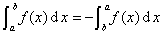
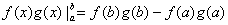
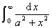
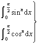
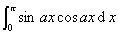
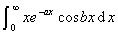

<h3>四、定积分的求法 </h3>

[定积分的性质]

&nbsp;&nbsp;&nbsp;&nbsp;&nbsp;&nbsp;&nbsp;&nbsp;&nbsp;&nbsp;&nbsp;&nbsp;&nbsp; 

&nbsp;&nbsp;&nbsp;&nbsp;&nbsp;&nbsp;&nbsp;&nbsp;&nbsp;&nbsp;&nbsp;&nbsp;&nbsp; &nbsp;&nbsp;&nbsp;&nbsp;&nbsp;&nbsp;&nbsp;&nbsp; 

&nbsp;&nbsp;&nbsp;&nbsp;&nbsp;&nbsp;&nbsp;&nbsp;&nbsp;&nbsp;&nbsp;&nbsp;&nbsp; 

&nbsp;&nbsp;&nbsp;&nbsp;&nbsp;&nbsp;&nbsp;&nbsp;&nbsp;&nbsp;&nbsp;&nbsp;&nbsp; 

[分部积分法]

式中

[变量替换法] 设函数在区间[]上有连续的导数，同时函数在区间上连续，并且从单调地变到，则

&nbsp;&nbsp;&nbsp;&nbsp;&nbsp;&nbsp; &nbsp;

［利用函数奇偶性求积法］ 
&nbsp;&nbsp;&nbsp;&nbsp;&nbsp;&nbsp; 若为偶函数，则

&nbsp;&nbsp;&nbsp;&nbsp;&nbsp;&nbsp; 若为奇函数，则

［利用积分对参数求导法］　设<i>f</i>(<i>x</i>,<i>t</i>)在有界区域上连续，并且存在连续偏导数，则当时，有 
&nbsp;&nbsp;&nbsp;&nbsp;&nbsp;&nbsp;&nbsp;&nbsp;&nbsp;&nbsp;&nbsp;&nbsp;&nbsp; 

&nbsp;&nbsp;&nbsp;&nbsp;&nbsp;&nbsp; 例　计算积分

&nbsp;&nbsp;&nbsp;&nbsp;&nbsp;&nbsp; 解　设

则　　.因

&nbsp;&nbsp;&nbsp;&nbsp;&nbsp; 

所以︳.

&nbsp;&nbsp;&nbsp;&nbsp;&nbsp;&nbsp; ［定积分表］

<table class=MsoNormalTable border=1 cellspacing=1 cellpadding=0 width=596
 style='width:447.0pt;border:outset black 1.0pt'>
 <tr>
  <td width="34%" valign=top style='width:34.0%;border:inset black 1.0pt;
  padding:.75pt .75pt .75pt .75pt'>
  
定 积 分 

  </td>
  <td width="66%" valign=top style='width:66.0%;border:inset black 1.0pt;
  padding:.75pt .75pt .75pt .75pt'>
  
定 积 分 值 

  </td>
 </tr>
 <tr>
  <td width="34%" valign=top style='width:34.0%;border:inset black 1.0pt;
  padding:.75pt .75pt .75pt .75pt'>
  

  </td>
  <td width="66%" valign=top style='width:66.0%;border:inset black 1.0pt;
  padding:.75pt .75pt .75pt .75pt'>
  

  </td>
 </tr>
 <tr>
  <td width="34%" valign=top style='width:34.0%;border:inset black 1.0pt;
  padding:.75pt .75pt .75pt .75pt'>
  

  </td>
  <td width="66%" valign=top style='width:66.0%;border:inset black 1.0pt;
  padding:.75pt .75pt .75pt .75pt'>
  

  </td>
 </tr>
 <tr>
  <td width="34%" valign=top style='width:34.0%;border:inset black 1.0pt;
  padding:.75pt .75pt .75pt .75pt'>
  

  </td>
  <td width="66%" valign=top style='width:66.0%;border:inset black 1.0pt;
  padding:.75pt .75pt .75pt .75pt'>
  

  </td>
 </tr>
 <tr style='height:13.5pt'>
  <td width="34%" valign=top style='width:34.0%;border:inset black 1.0pt;
  padding:.75pt .75pt .75pt .75pt;height:13.5pt'>
  
定 积 分 

  </td>
  <td width="66%" valign=top style='width:66.0%;border:inset black 1.0pt;
  padding:.75pt .75pt .75pt .75pt;height:13.5pt'>
  
定 积 分 值 

  </td>
 </tr>
 <tr style='height:30.75pt'>
  <td width="34%" valign=top style='width:34.0%;border:inset black 1.0pt;
  padding:.75pt .75pt .75pt .75pt;height:30.75pt'>
  

  </td>
  <td width="66%" valign=top style='width:66.0%;border:inset black 1.0pt;
  padding:.75pt .75pt .75pt .75pt;height:30.75pt'>
  

  </td>
 </tr>
 <tr>
  <td width="34%" valign=top style='width:34.0%;border:inset black 1.0pt;
  padding:.75pt .75pt .75pt .75pt'>
  

  </td>
  <td width="66%" valign=top style='width:66.0%;border:inset black 1.0pt;
  padding:.75pt .75pt .75pt .75pt'>
  

  </td>
 </tr>
 <tr>
  <td width="34%" valign=top style='width:34.0%;border:inset black 1.0pt;
  padding:.75pt .75pt .75pt .75pt'>
  

  </td>
  <td width="66%" valign=top style='width:66.0%;border:inset black 1.0pt;
  padding:.75pt .75pt .75pt .75pt'>
  

  </td>
 </tr>
 <tr>
  <td width="34%" valign=top style='width:34.0%;border:inset black 1.0pt;
  padding:.75pt .75pt .75pt .75pt'>
  

  </td>
  <td width="66%" valign=top style='width:66.0%;border:inset black 1.0pt;
  padding:.75pt .75pt .75pt .75pt'>
  

  </td>
 </tr>
 <tr>
  <td width="34%" valign=top style='width:34.0%;border:inset black 1.0pt;
  padding:.75pt .75pt .75pt .75pt'>
  

  </td>
  <td width="66%" valign=top style='width:66.0%;border:inset black 1.0pt;
  padding:.75pt .75pt .75pt .75pt'>
  

  </td>
 </tr>
 <tr>
  <td width="34%" valign=top style='width:34.0%;border:inset black 1.0pt;
  padding:.75pt .75pt .75pt .75pt'>
  

  </td>
  <td width="66%" valign=top style='width:66.0%;border:inset black 1.0pt;
  padding:.75pt .75pt .75pt .75pt'>
  

  </td>
 </tr>
 <tr>
  <td width="34%" valign=top style='width:34.0%;border:inset black 1.0pt;
  padding:.75pt .75pt .75pt .75pt'>
  

  </td>
  <td width="66%" valign=top style='width:66.0%;border:inset black 1.0pt;
  padding:.75pt .75pt .75pt .75pt'>
  

  </td>
 </tr>
 <tr>
  <td width="34%" valign=top style='width:34.0%;border:inset black 1.0pt;
  padding:.75pt .75pt .75pt .75pt'>
  

  </td>
  <td width="66%" valign=top style='width:66.0%;border:inset black 1.0pt;
  padding:.75pt .75pt .75pt .75pt'>
  

  </td>
 </tr>
 <tr>
  <td width="34%" valign=top style='width:34.0%;border:inset black 1.0pt;
  padding:.75pt .75pt .75pt .75pt'>
  

  </td>
  <td width="66%" valign=top style='width:66.0%;border:inset black 1.0pt;
  padding:.75pt .75pt .75pt .75pt'>
  

  </td>
 </tr>
 <tr>
  <td width="34%" valign=top style='width:34.0%;border:inset black 1.0pt;
  padding:.75pt .75pt .75pt .75pt'>
  

  </td>
  <td width="66%" valign=top style='width:66.0%;border:inset black 1.0pt;
  padding:.75pt .75pt .75pt .75pt'>
  

  </td>
 </tr>
 <tr>
  <td width="34%" valign=top style='width:34.0%;border:inset black 1.0pt;
  padding:.75pt .75pt .75pt .75pt'>
  

  </td>
  <td width="66%" valign=top style='width:66.0%;border:inset black 1.0pt;
  padding:.75pt .75pt .75pt .75pt'>
  

  </td>
 </tr>
 <tr>
  <td width="34%" valign=top style='width:34.0%;border:inset black 1.0pt;
  padding:.75pt .75pt .75pt .75pt'>
  

  </td>
  <td width="66%" style='width:66.0%;border:inset black 1.0pt;padding:.75pt .75pt .75pt .75pt'>
  

  </td>
 </tr>
 <tr>
  <td width="34%" valign=top style='width:34.0%;border:inset black 1.0pt;
  padding:.75pt .75pt .75pt .75pt'>
  

  </td>
  <td width="66%" style='width:66.0%;border:inset black 1.0pt;padding:.75pt .75pt .75pt .75pt'>
  

  </td>
 </tr>
 <tr>
  <td width="34%" valign=top style='width:34.0%;border:inset black 1.0pt;
  padding:.75pt .75pt .75pt .75pt'>
  

  </td>
  <td width="66%" style='width:66.0%;border:inset black 1.0pt;padding:.75pt .75pt .75pt .75pt'>
  

  </td>
 </tr>
 <tr>
  <td width="34%" valign=top style='width:34.0%;border:inset black 1.0pt;
  padding:.75pt .75pt .75pt .75pt'>
  

  </td>
  <td width="66%" style='width:66.0%;border:inset black 1.0pt;padding:.75pt .75pt .75pt .75pt'>
  

  </td>
 </tr>
 <tr>
  <td width="34%" valign=top style='width:34.0%;border:inset black 1.0pt;
  padding:.75pt .75pt .75pt .75pt'>
  

  
　

  
　 

  </td>
  <td width="66%" valign=top style='width:66.0%;border:inset black 1.0pt;
  padding:.75pt .75pt .75pt .75pt'>
  

  </td>
 </tr>
 <tr style='height:13.5pt'>
  <td width="34%" valign=top style='width:34.0%;border:inset black 1.0pt;
  padding:.75pt .75pt .75pt .75pt;height:13.5pt'>
  
定 积 分 

  </td>
  <td width="66%" valign=top style='width:66.0%;border:inset black 1.0pt;
  padding:.75pt .75pt .75pt .75pt;height:13.5pt'>
  
定 积 分 值 

  </td>
 </tr>
 <tr style='height:98.25pt'>
  <td width="34%" valign=top style='width:34.0%;border:inset black 1.0pt;
  padding:.75pt .75pt .75pt .75pt;height:98.25pt'>
  

  </td>
  <td width="66%" valign=top style='width:66.0%;border:inset black 1.0pt;
  padding:.75pt .75pt .75pt .75pt;height:98.25pt'>
  

  </td>
 </tr>
 <tr>
  <td width="34%" valign=top style='width:34.0%;border:inset black 1.0pt;
  padding:.75pt .75pt .75pt .75pt'>
  

  </td>
  <td width="66%" valign=top style='width:66.0%;border:inset black 1.0pt;
  padding:.75pt .75pt .75pt .75pt'>
  

  </td>
 </tr>
 <tr>
  <td width="34%" valign=top style='width:34.0%;border:inset black 1.0pt;
  padding:.75pt .75pt .75pt .75pt'>
  

  </td>
  <td width="66%" valign=top style='width:66.0%;border:inset black 1.0pt;
  padding:.75pt .75pt .75pt .75pt'>
  

  </td>
 </tr>
 <tr>
  <td width="34%" valign=top style='width:34.0%;border:inset black 1.0pt;
  padding:.75pt .75pt .75pt .75pt'>
  

  </td>
  <td width="66%" valign=top style='width:66.0%;border:inset black 1.0pt;
  padding:.75pt .75pt .75pt .75pt'>
  

  </td>
 </tr>
 <tr>
  <td width="34%" valign=top style='width:34.0%;border:inset black 1.0pt;
  padding:.75pt .75pt .75pt .75pt'>
  

  </td>
  <td width="66%" valign=top style='width:66.0%;border:inset black 1.0pt;
  padding:.75pt .75pt .75pt .75pt'>
  

  </td>
 </tr>
 <tr>
  <td width="34%" valign=top style='width:34.0%;border:inset black 1.0pt;
  padding:.75pt .75pt .75pt .75pt'>
  

  </td>
  <td width="66%" valign=top style='width:66.0%;border:inset black 1.0pt;
  padding:.75pt .75pt .75pt .75pt'>
  

  </td>
 </tr>
 <tr>
  <td width="34%" valign=top style='width:34.0%;border:inset black 1.0pt;
  padding:.75pt .75pt .75pt .75pt'>
  

  </td>
  <td width="66%" valign=top style='width:66.0%;border:inset black 1.0pt;
  padding:.75pt .75pt .75pt .75pt'>
  

  </td>
 </tr>
 <tr>
  <td width="34%" valign=top style='width:34.0%;border:inset black 1.0pt;
  padding:.75pt .75pt .75pt .75pt'>
  

  </td>
  <td width="66%" valign=top style='width:66.0%;border:inset black 1.0pt;
  padding:.75pt .75pt .75pt .75pt'>
  

  </td>
 </tr>
 <tr>
  <td width="34%" valign=top style='width:34.0%;border:inset black 1.0pt;
  padding:.75pt .75pt .75pt .75pt'>
  

  </td>
  <td width="66%" valign=top style='width:66.0%;border:inset black 1.0pt;
  padding:.75pt .75pt .75pt .75pt'>
  

  </td>
 </tr>
 <tr>
  <td width="34%" valign=top style='width:34.0%;border:inset black 1.0pt;
  padding:.75pt .75pt .75pt .75pt'>
  

  </td>
  <td width="66%" valign=top style='width:66.0%;border:inset black 1.0pt;
  padding:.75pt .75pt .75pt .75pt'>
  
为正整数,<i>a</i>&gt;0) 

  </td>
 </tr>
 <tr>
  <td width="34%" valign=top style='width:34.0%;border:inset black 1.0pt;
  padding:.75pt .75pt .75pt .75pt'>
  

  </td>
  <td width="66%" valign=top style='width:66.0%;border:inset black 1.0pt;
  padding:.75pt .75pt .75pt .75pt'>
  

  </td>
 </tr>
 <tr>
  <td width="34%" valign=top style='width:34.0%;border:inset black 1.0pt;
  padding:.75pt .75pt .75pt .75pt'>
  

  </td>
  <td width="66%" valign=top style='width:66.0%;border:inset black 1.0pt;
  padding:.75pt .75pt .75pt .75pt'>
  

  </td>
 </tr>
 <tr>
  <td width="34%" valign=top style='width:34.0%;border:inset black 1.0pt;
  padding:.75pt .75pt .75pt .75pt'>
  

  </td>
  <td width="66%" valign=top style='width:66.0%;border:inset black 1.0pt;
  padding:.75pt .75pt .75pt .75pt'>
  

  </td>
 </tr>
 <tr>
  <td width="34%" valign=top style='width:34.0%;border:inset black 1.0pt;
  padding:.75pt .75pt .75pt .75pt'>
  

  </td>
  <td width="66%" valign=top style='width:66.0%;border:inset black 1.0pt;
  padding:.75pt .75pt .75pt .75pt'>
  

  </td>
 </tr>
 <tr>
  <td width="34%" valign=top style='width:34.0%;border:inset black 1.0pt;
  padding:.75pt .75pt .75pt .75pt'>
  

  </td>
  <td width="66%" valign=top style='width:66.0%;border:inset black 1.0pt;
  padding:.75pt .75pt .75pt .75pt'>
  

  </td>
 </tr>
 <tr>
  <td width="34%" valign=top style='width:34.0%;border:inset black 1.0pt;
  padding:.75pt .75pt .75pt .75pt'>
  

  </td>
  <td width="66%" valign=top style='width:66.0%;border:inset black 1.0pt;
  padding:.75pt .75pt .75pt .75pt'>
  

  </td>
 </tr>
 <tr>
  <td width="34%" valign=top style='width:34.0%;border:inset black 1.0pt;
  padding:.75pt .75pt .75pt .75pt'>
  

  </td>
  <td width="66%" style='width:66.0%;border:inset black 1.0pt;padding:.75pt .75pt .75pt .75pt'>
  

  </td>
 </tr>
 <tr>
  <td width="34%" valign=top style='width:34.0%;border:inset black 1.0pt;
  padding:.75pt .75pt .75pt .75pt'>
  

  </td>
  <td width="66%" valign=top style='width:66.0%;border:inset black 1.0pt;
  padding:.75pt .75pt .75pt .75pt'>
  

  </td>
 </tr>
 <tr>
  <td width="34%" valign=top style='width:34.0%;border:inset black 1.0pt;
  padding:.75pt .75pt .75pt .75pt'>
  

  </td>
  <td width="66%" valign=top style='width:66.0%;border:inset black 1.0pt;
  padding:.75pt .75pt .75pt .75pt'>
  

  </td>
 </tr>
 <tr style='height:12.75pt'>
  <td width="34%" valign=top style='width:34.0%;border:inset black 1.0pt;
  padding:.75pt .75pt .75pt .75pt;height:12.75pt'>
  
定 积 分 

  </td>
  <td width="66%" valign=top style='width:66.0%;border:inset black 1.0pt;
  padding:.75pt .75pt .75pt .75pt;height:12.75pt'>
  
定 积 分 值 

  </td>
 </tr>
 <tr style='height:43.5pt'>
  <td width="34%" valign=top style='width:34.0%;border:inset black 1.0pt;
  padding:.75pt .75pt .75pt .75pt;height:43.5pt'>
  

  </td>
  <td width="66%" valign=top style='width:66.0%;border:inset black 1.0pt;
  padding:.75pt .75pt .75pt .75pt;height:43.5pt'>
  

  </td>
 </tr>
 <tr>
  <td width="34%" valign=top style='width:34.0%;border:inset black 1.0pt;
  padding:.75pt .75pt .75pt .75pt'>
  

  </td>
  <td width="66%" valign=top style='width:66.0%;border:inset black 1.0pt;
  padding:.75pt .75pt .75pt .75pt'>
  

  </td>
 </tr>
 <tr>
  <td width="34%" valign=top style='width:34.0%;border:inset black 1.0pt;
  padding:.75pt .75pt .75pt .75pt'>
  

  </td>
  <td width="66%" valign=top style='width:66.0%;border:inset black 1.0pt;
  padding:.75pt .75pt .75pt .75pt'>
  
(<i>n</i>为正整数) 

  </td>
 </tr>
 <tr>
  <td width="34%" valign=top style='width:34.0%;border:inset black 1.0pt;
  padding:.75pt .75pt .75pt .75pt'>
  

  </td>
  <td width="66%" valign=top style='width:66.0%;border:inset black 1.0pt;
  padding:.75pt .75pt .75pt .75pt'>
  

  </td>
 </tr>
 <tr>
  <td width="34%" valign=top style='width:34.0%;border:inset black 1.0pt;
  padding:.75pt .75pt .75pt .75pt'>
  

  </td>
  <td width="66%" valign=top style='width:66.0%;border:inset black 1.0pt;
  padding:.75pt .75pt .75pt .75pt'>
  

  </td>
 </tr>
 <tr>
  <td width="34%" valign=top style='width:34.0%;border:inset black 1.0pt;
  padding:.75pt .75pt .75pt .75pt'>
  

  </td>
  <td width="66%" valign=top style='width:66.0%;border:inset black 1.0pt;
  padding:.75pt .75pt .75pt .75pt'>
  

  </td>
 </tr>
 <tr>
  <td width="34%" valign=top style='width:34.0%;border:inset black 1.0pt;
  padding:.75pt .75pt .75pt .75pt'>
  

  </td>
  <td width="66%" valign=top style='width:66.0%;border:inset black 1.0pt;
  padding:.75pt .75pt .75pt .75pt'>
  

  </td>
 </tr>
 <tr>
  <td width="34%" valign=top style='width:34.0%;border:inset black 1.0pt;
  padding:.75pt .75pt .75pt .75pt'>
  

  </td>
  <td width="66%" valign=top style='width:66.0%;border:inset black 1.0pt;
  padding:.75pt .75pt .75pt .75pt'>
  

  </td>
 </tr>
 <tr>
  <td width="34%" valign=top style='width:34.0%;border:inset black 1.0pt;
  padding:.75pt .75pt .75pt .75pt'>
  

  </td>
  <td width="66%" valign=top style='width:66.0%;border:inset black 1.0pt;
  padding:.75pt .75pt .75pt .75pt'>
  

  </td>
 </tr>
 <tr>
  <td width="34%" valign=top style='width:34.0%;border:inset black 1.0pt;
  padding:.75pt .75pt .75pt .75pt'>
  

  </td>
  <td width="66%" valign=top style='width:66.0%;border:inset black 1.0pt;
  padding:.75pt .75pt .75pt .75pt'>
  

  </td>
 </tr>
 <tr>
  <td width="34%" valign=top style='width:34.0%;border:inset black 1.0pt;
  padding:.75pt .75pt .75pt .75pt'>
  

  </td>
  <td width="66%" valign=top style='width:66.0%;border:inset black 1.0pt;
  padding:.75pt .75pt .75pt .75pt'>
  

  </td>
 </tr>
 <tr>
  <td width="34%" valign=top style='width:34.0%;border:inset black 1.0pt;
  padding:.75pt .75pt .75pt .75pt'>
  

  </td>
  <td width="66%" style='width:66.0%;border:inset black 1.0pt;padding:.75pt .75pt .75pt .75pt'>
  

  </td>
 </tr>
 <tr>
  <td width="34%" valign=top style='width:34.0%;border:inset black 1.0pt;
  padding:.75pt .75pt .75pt .75pt'>
  

  </td>
  <td width="66%" valign=top style='width:66.0%;border:inset black 1.0pt;
  padding:.75pt .75pt .75pt .75pt'>
  

  </td>
 </tr>
 <tr>
  <td width="34%" valign=top style='width:34.0%;border:inset black 1.0pt;
  padding:.75pt .75pt .75pt .75pt'>
  

  </td>
  <td width="66%" valign=top style='width:66.0%;border:inset black 1.0pt;
  padding:.75pt .75pt .75pt .75pt'>
  

  </td>
 </tr>
 <tr>
  <td width="34%" valign=top style='width:34.0%;border:inset black 1.0pt;
  padding:.75pt .75pt .75pt .75pt'>
  

  </td>
  <td width="66%" valign=top style='width:66.0%;border:inset black 1.0pt;
  padding:.75pt .75pt .75pt .75pt'>
  

  </td>
 </tr>
 <tr>
  <td width="34%" valign=top style='width:34.0%;border:inset black 1.0pt;
  padding:.75pt .75pt .75pt .75pt'>
  

  </td>
  <td width="66%" valign=top style='width:66.0%;border:inset black 1.0pt;
  padding:.75pt .75pt .75pt .75pt'>
  

  </td>
 </tr>
 <tr>
  <td width="34%" valign=top style='width:34.0%;border:inset black 1.0pt;
  padding:.75pt .75pt .75pt .75pt'>
  

  
　 

  </td>
  <td width="66%" valign=top style='width:66.0%;border:inset black 1.0pt;
  padding:.75pt .75pt .75pt .75pt'>
  

  </td>
 </tr>
 <tr>
  <td width="34%" valign=top style='width:34.0%;border:inset black 1.0pt;
  padding:.75pt .75pt .75pt .75pt'>
  

  </td>
  <td width="66%" valign=top style='width:66.0%;border:inset black 1.0pt;
  padding:.75pt .75pt .75pt .75pt'>
  

  </td>
 </tr>
 <tr>
  <td width="34%" valign=top style='width:34.0%;border:inset black 1.0pt;
  padding:.75pt .75pt .75pt .75pt'>
  

  </td>
  <td width="66%" style='width:66.0%;border:inset black 1.0pt;padding:.75pt .75pt .75pt .75pt'>
  

  </td>
 </tr>
 <tr>
  <td width="34%" valign=top style='width:34.0%;border:inset black 1.0pt;
  padding:.75pt .75pt .75pt .75pt'>
  

  </td>
  <td width="66%" valign=top style='width:66.0%;border:inset black 1.0pt;
  padding:.75pt .75pt .75pt .75pt'>
  
(欧拉常数，下同)

  
　 

  </td>
 </tr>
 <tr style='height:13.5pt'>
  <td width="34%" valign=top style='width:34.0%;border:inset black 1.0pt;
  padding:.75pt .75pt .75pt .75pt;height:13.5pt'>
  
定 积 分 

  </td>
  <td width="66%" valign=top style='width:66.0%;border:inset black 1.0pt;
  padding:.75pt .75pt .75pt .75pt;height:13.5pt'>
  
定 积 分 值 

  </td>
 </tr>
 <tr style='height:27.75pt'>
  <td width="34%" valign=top style='width:34.0%;border:inset black 1.0pt;
  padding:.75pt .75pt .75pt .75pt;height:27.75pt'>
  

  </td>
  <td width="66%" style='width:66.0%;border:inset black 1.0pt;padding:.75pt .75pt .75pt .75pt;
  height:27.75pt'>
  

  </td>
 </tr>
 <tr>
  <td width="34%" valign=top style='width:34.0%;border:inset black 1.0pt;
  padding:.75pt .75pt .75pt .75pt'>
  

  </td>
  <td width="66%" style='width:66.0%;border:inset black 1.0pt;padding:.75pt .75pt .75pt .75pt'>
  

  </td>
 </tr>
 <tr>
  <td width="34%" valign=top style='width:34.0%;border:inset black 1.0pt;
  padding:.75pt .75pt .75pt .75pt'>
  

  </td>
  <td width="66%" style='width:66.0%;border:inset black 1.0pt;padding:.75pt .75pt .75pt .75pt'>
  

  </td>
 </tr>
 <tr>
  <td width="34%" valign=top style='width:34.0%;border:inset black 1.0pt;
  padding:.75pt .75pt .75pt .75pt'>
  

  </td>
  <td width="66%" style='width:66.0%;border:inset black 1.0pt;padding:.75pt .75pt .75pt .75pt'>
  

  </td>
 </tr>
 <tr>
  <td width="34%" valign=top style='width:34.0%;border:inset black 1.0pt;
  padding:.75pt .75pt .75pt .75pt'>
  

  </td>
  <td width="66%" valign=top style='width:66.0%;border:inset black 1.0pt;
  padding:.75pt .75pt .75pt .75pt'>
  

  </td>
 </tr>
 <tr>
  <td width="34%" valign=top style='width:34.0%;border:inset black 1.0pt;
  padding:.75pt .75pt .75pt .75pt'>
  

  </td>
  <td width="66%" valign=top style='width:66.0%;border:inset black 1.0pt;
  padding:.75pt .75pt .75pt .75pt'>
  

  </td>
 </tr>
 <tr>
  <td width="34%" valign=top style='width:34.0%;border:inset black 1.0pt;
  padding:.75pt .75pt .75pt .75pt'>
  

  </td>
  <td width="66%" valign=top style='width:66.0%;border:inset black 1.0pt;
  padding:.75pt .75pt .75pt .75pt'>
  

  </td>
 </tr>
 <tr>
  <td width="34%" valign=top style='width:34.0%;border:inset black 1.0pt;
  padding:.75pt .75pt .75pt .75pt'>
  

  </td>
  <td width="66%" valign=top style='width:66.0%;border:inset black 1.0pt;
  padding:.75pt .75pt .75pt .75pt'>
  

  </td>
 </tr>
 <tr>
  <td width="34%" valign=top style='width:34.0%;border:inset black 1.0pt;
  padding:.75pt .75pt .75pt .75pt'>
  

  </td>
  <td width="66%" valign=top style='width:66.0%;border:inset black 1.0pt;
  padding:.75pt .75pt .75pt .75pt'>
  

  </td>
 </tr>
 <tr>
  <td width="34%" valign=top style='width:34.0%;border:inset black 1.0pt;
  padding:.75pt .75pt .75pt .75pt'>
  

  </td>
  <td width="66%" valign=top style='width:66.0%;border:inset black 1.0pt;
  padding:.75pt .75pt .75pt .75pt'>
  

  </td>
 </tr>
 <tr>
  <td width="34%" valign=top style='width:34.0%;border:inset black 1.0pt;
  padding:.75pt .75pt .75pt .75pt'>
  

  </td>
  <td width="66%" valign=top style='width:66.0%;border:inset black 1.0pt;
  padding:.75pt .75pt .75pt .75pt'>
  

  </td>
 </tr>
 <tr>
  <td width="34%" valign=top style='width:34.0%;border:inset black 1.0pt;
  padding:.75pt .75pt .75pt .75pt'>
  

  </td>
  <td width="66%" valign=top style='width:66.0%;border:inset black 1.0pt;
  padding:.75pt .75pt .75pt .75pt'>
  

  </td>
 </tr>
 <tr>
  <td width="34%" valign=top style='width:34.0%;border:inset black 1.0pt;
  padding:.75pt .75pt .75pt .75pt'>
  

  </td>
  <td width="66%" valign=top style='width:66.0%;border:inset black 1.0pt;
  padding:.75pt .75pt .75pt .75pt'>
  

  </td>
 </tr>
 <tr style='height:98.25pt'>
  <td width="34%" valign=top style='width:34.0%;border:inset black 1.0pt;
  padding:.75pt .75pt .75pt .75pt;height:98.25pt'>
  

  </td>
  <td width="66%" valign=top style='width:66.0%;border:inset black 1.0pt;
  padding:.75pt .75pt .75pt .75pt;height:98.25pt'>
  

  </td>
 </tr>
</table>

　

