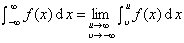

五、广义积分

&nbsp;&nbsp;&nbsp;&nbsp;&nbsp;&nbsp; １. 广义积分的概念

&nbsp;&nbsp;&nbsp;&nbsp;&nbsp;&nbsp; ［无穷限广义积分］&nbsp; 设函数<i>f</i>(<i>x</i>)在[<i>a</i>,<i>b</i>]上可积，<i>u</i>&gt;<i>a</i>,<i></i>&lt;<i>b</i>,<i>u</i>&gt;<i></i>,当下列各式右边的极限存在时，

&nbsp;&nbsp;&nbsp;&nbsp;&nbsp;&nbsp;&nbsp;&nbsp;&nbsp;&nbsp;&nbsp;&nbsp;&nbsp;
&nbsp;&nbsp;&nbsp;&nbsp;&nbsp;&nbsp; &nbsp;&nbsp;&nbsp;&nbsp;<i></i>&nbsp;&nbsp;&nbsp;&nbsp;

&nbsp;&nbsp;&nbsp;&nbsp;&nbsp;&nbsp;&nbsp;&nbsp;&nbsp;&nbsp;&nbsp;&nbsp;&nbsp;&nbsp;&nbsp;&nbsp;&nbsp;

&nbsp;&nbsp;&nbsp;&nbsp;&nbsp;&nbsp;&nbsp;&nbsp;&nbsp;&nbsp;&nbsp;&nbsp;&nbsp;&nbsp;&nbsp;&nbsp;&nbsp;

这时称无穷限广义积分收敛，否则称为发散.

&nbsp;&nbsp;&nbsp;&nbsp;&nbsp;&nbsp; [无界函数的广义积分]&nbsp; 设函数<i>f</i>(<i>x</i>)在给定区间[<i>a</i>,<i>b</i>]上只有一个瑕点<i>x</i>=<i>c</i>,即函数<i>f</i>(<i>x</i>)在<i>x</i>=<i>c</i>点的邻域内无界，而在[<i>a</i>,<i>c</i>-<i>ε</i>]及[<i>c</i>+<i>ε</i>',<i>b</i>]上可积，<i>ε</i>，<i>ε</i>'为任意小的正数，当<i>ε</i>和<i>ε</i>'独立地趋于零，极限

&nbsp;&nbsp;&nbsp;&nbsp;&nbsp;&nbsp;&nbsp;&nbsp;&nbsp;&nbsp;&nbsp;&nbsp;&nbsp;&nbsp;&nbsp;&nbsp;&nbsp;
&nbsp;&nbsp;&nbsp;&nbsp;&nbsp;&nbsp;&nbsp;&nbsp;&nbsp;&nbsp;&nbsp;&nbsp;&nbsp;&nbsp;&nbsp;&nbsp;&nbsp;&nbsp;&nbsp;&nbsp;&nbsp;&nbsp;&nbsp;&nbsp;&nbsp;(1)

存在时，则用上式定义无界函数<i>f</i>(<i>x</i>)从<i>a</i>到<i>b</i>的瑕积分，记作

&nbsp;&nbsp;&nbsp;&nbsp;&nbsp;&nbsp;&nbsp;&nbsp;&nbsp;&nbsp;&nbsp;&nbsp;&nbsp;&nbsp;&nbsp;&nbsp;&nbsp;

&nbsp;&nbsp;&nbsp;&nbsp;&nbsp;&nbsp; [柯西主值] &nbsp;有时极限（1）不存在，但如果设<i>ε</i>'=<i>ε</i>→0，这个极限（1）存在，就称它为瑕积分的主值，记作

&nbsp;&nbsp;&nbsp;&nbsp;&nbsp;&nbsp;&nbsp;&nbsp;&nbsp;&nbsp;&nbsp;&nbsp;&nbsp;

这时称无界函数广义积分在主值意义下收敛，否则称为发散.

&nbsp;&nbsp;&nbsp;&nbsp;&nbsp;&nbsp; [绝对收敛与条件收敛] &nbsp;如果<i>f</i>(<i>x</i>)的广义积分与|<i>f</i>(<i>x</i>)|的广义积分同时收敛，那末称<i>f</i>(<i>x</i>)的广义积分是绝对收敛, <i>f</i>(<i>x</i>)称为绝对可积；如果仅前者收敛，后者不收敛，那末称<i>f</i>(<i>x</i>)的广义积分是条件收敛.

