

2. 广义积分收敛判别法

&nbsp;&nbsp;&nbsp;&nbsp;&nbsp;&nbsp; 1° 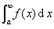收敛的充分必要条件是：对任意给定的<i>ε</i>&gt;0,都存在<i>N</i>=<i>N</i>(<i>ε</i>)&gt;0,只要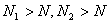,就有|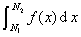|&lt;<i>ε</i>.

&nbsp;&nbsp;&nbsp;&nbsp;&nbsp;&nbsp; 2° 设<i>f</i>(<i>x</i>)是非负的，则收敛的充分必要条件是：

&nbsp;&nbsp;&nbsp;&nbsp;&nbsp;&nbsp;&nbsp;&nbsp;&nbsp;&nbsp;&nbsp;&nbsp;&nbsp;
<i>F</i>(<i>u</i>)=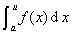是有界函数.

&nbsp;&nbsp;&nbsp;&nbsp;&nbsp;&nbsp; 3° 设当x→∞时，<i>f</i>(<i>x</i>)=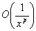.若<i>p</i>&gt;1,则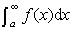收敛；若<i>p</i>≤1,则发散.

&nbsp;&nbsp;&nbsp;&nbsp;&nbsp;&nbsp; 4° 若收敛，<i>g</i>(<i>x</i>)单调有界(<i>x</i>≥<i>a</i>),则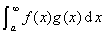收敛.

&nbsp;&nbsp;&nbsp;&nbsp;&nbsp;&nbsp; 5° 设<i>f</i>(<i>x</i>)≥0,<i>g</i>(<i>x</i>)≥0,且<i>f</i>(<i>x</i>)≤<i>cg</i>(<i>x</i>)(<i>x</i>≥<i>a</i>,<i>c</i>是一个大于零的常数）.若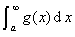收敛，则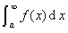也收敛；若发散，则也发散.

&nbsp;&nbsp;&nbsp;&nbsp;&nbsp;&nbsp; 6° 无穷级数与广义积分的关系：设<i>f</i>(<i>x</i>)是定义在区间[<i>a</i>,∞)上的一个正的非增连续函数，则级数<i>f</i>(<i>a</i>)+<i>f</i>(<i>a</i>+1)+··+<i>f</i>(<i>a</i>+<i>k</i>)+··与积分同时收敛或同时发散.

&nbsp;&nbsp;&nbsp;&nbsp;&nbsp;&nbsp; 7°广义积分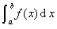（以<i>a</i>为瑕点）收敛的充分必要条件是：对任意给定的<i>ε</i>&gt;0,都存在<i>δ</i>(<i>a</i>&lt;<i>δ</i>&lt;<i>b</i>),使当<i>a</i>&lt;<i>u</i>'&lt;<i>u</i>''&lt;<i>δ</i>时|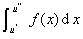|&lt;<i>ε</i>.

&nbsp;&nbsp;&nbsp;&nbsp;&nbsp;&nbsp; 8° 设<i>g</i>(<i>x</i>）有连续的导数，并是恒正的、单调下降的函数，且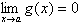.若有常数<i>M</i>,使对一切<i>u</i>&gt;<i>a</i>,都有|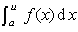|&lt;<i>M</i>,则广义积分收敛.

