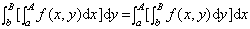

六、含参数积分

&nbsp;&nbsp;&nbsp;&nbsp;&nbsp;&nbsp; 1. 含参数常义积分

&nbsp;&nbsp;&nbsp;&nbsp;&nbsp;&nbsp; [连续性]&nbsp; 若二元函数<i>f</i>(<i>x</i>,<i>y</i>)在有界区域<i>R</i>(<i>a</i>≤<i>x</i>≤<i>A</i>,<i>b</i>≤<i>y</i>≤<i>B</i>)上有定义且连续，则

&nbsp;&nbsp;&nbsp;&nbsp;&nbsp;&nbsp;&nbsp;&nbsp;&nbsp;&nbsp;&nbsp;&nbsp;&nbsp;
&nbsp;&nbsp;&nbsp;&nbsp;&nbsp;&nbsp;&nbsp;&nbsp;&nbsp;&nbsp;&nbsp;&nbsp;&nbsp;&nbsp;

是闭区间[<i>b</i>,<i>B</i>]上的连续函数.

&nbsp;&nbsp;&nbsp;&nbsp;&nbsp;&nbsp; [积分号下的微分法]&nbsp;&nbsp; 若<i>f</i>(<i>x</i>,<i>y</i>)在有界区域<i>R</i>(<i>a</i>≤<i>x</i>≤<i>A</i>,<i>b</i>≤<i>y</i>≤<i>B</i>)上连续，并且存在连续偏导数(x,y)，则当<i>b</i>&lt;<i>y</i>&lt;<i>B</i>时，

&nbsp;&nbsp;&nbsp;&nbsp;&nbsp;&nbsp;&nbsp;&nbsp;&nbsp;&nbsp;&nbsp;&nbsp;&nbsp;
&nbsp;&nbsp;&nbsp;&nbsp;&nbsp;&nbsp;&nbsp;&nbsp;&nbsp;&nbsp;&nbsp;&nbsp;&nbsp;&nbsp;

&nbsp;&nbsp;&nbsp;&nbsp;&nbsp;&nbsp; 一般情况下，当积分限为参数<i>y</i>的可微函数<i></i>和<i></i>, 且当<i>b</i>≤<i>y</i>≤<i>B</i>，<i> a</i>≤≤<i>A</i>,

<i>a</i>≤≤<i>A</i>时，

&nbsp;&nbsp;&nbsp;&nbsp;&nbsp;&nbsp;
(1)

&nbsp;&nbsp;&nbsp;&nbsp;&nbsp;&nbsp; [积分的求导运算] 以下公式为(1)的特殊情况.

&nbsp;&nbsp;&nbsp;&nbsp;&nbsp;&nbsp; [积分号下的积分法］若函数在有界区域[<i>a</i>≤x≤<i>A</i>,<i>b</i>≤<i>y</i>≤<i>B</i>]上连续，则

&nbsp;&nbsp;&nbsp;&nbsp;&nbsp;&nbsp;&nbsp;&nbsp; 

