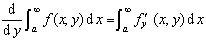

2 . 含参数广义积分

[一致收敛性]设函数<i>f</i>(<i>x</i>,<i>y</i>)是定义在区域<i>R</i>(<i>a</i>≤<i>x&lt;</i>∞, <i>y</i>1&lt;<i>y</i>&lt;<i>y</i>2)上的连续函数，若对任意给定的<i>ε</i>&gt;0，都存在只与<i>ε</i>有关的正数<i>B</i>=<i>B</i>(<i>ε</i>),使得当<i>b</i>≥<i>B</i>时，对区间(<i>y</i>1，<i>y</i>2)内一切<i>y</i>不等式

&nbsp;&nbsp;&nbsp;&nbsp;&nbsp;&nbsp;&nbsp;&nbsp;&nbsp;&nbsp;&nbsp;&nbsp;&nbsp;
&nbsp;&nbsp;&nbsp;&nbsp;&nbsp;&nbsp;&nbsp; 

都成立，则称广义积分在区间(<i>y</i>1，<i>y</i>2)内一致收敛，并且在该区间内是参数<i>y</i>的连续函数.

[一致收敛判别法]

1°柯西判别积分

&nbsp;&nbsp;&nbsp;&nbsp;&nbsp;&nbsp;&nbsp;
&nbsp;&nbsp;&nbsp;&nbsp;&nbsp;&nbsp;&nbsp;&nbsp;&nbsp;&nbsp;&nbsp;&nbsp; 

在区间(<i>y</i>1，<i>y</i>2)内一致收敛的充分必要条件是：对任意<i>ε</i>&gt;0，都存在正数<i>B</i>=<i>B</i>(<i>ε</i>),使得当<i>b</i>'&gt;<i>B</i>,<i>b</i>''&gt;<i>B</i>时，对区间(<i>y</i>1，<i>y</i>2)内的一切<i>y</i>,都有

&nbsp;&nbsp;&nbsp;&nbsp;&nbsp;&nbsp;&nbsp;&nbsp;&nbsp;&nbsp;&nbsp;&nbsp;&nbsp;
&nbsp;&nbsp;&nbsp;&nbsp;&nbsp;&nbsp;&nbsp;&nbsp; 

2°外尔斯特拉斯判别法 &nbsp;设函数<i>f</i>(<i>x</i>,<i>y</i>)(<i>x</i>的函数)在任一有限区间[<i>a</i>,<i>A</i>]上可积，若存在与参数<i>y</i>无关的函数<i>F</i>(<i>x</i>)，它在区间[<i>a</i>,∞)上可积，并且对于区间(<i>y</i>1，<i>y</i>2)内的一切<i>y</i>

&nbsp;&nbsp;&nbsp;&nbsp;&nbsp;&nbsp;&nbsp;&nbsp;&nbsp;&nbsp;&nbsp;&nbsp;&nbsp;
&nbsp;&nbsp;&nbsp;&nbsp;&nbsp;&nbsp;&nbsp;&nbsp;&nbsp;&nbsp;&nbsp;&nbsp;&nbsp;&nbsp;&nbsp;&nbsp;
|<i>f</i>(<i>x,y</i>)|≤<i>F</i>(x)&nbsp;&nbsp;&nbsp;&nbsp;&nbsp;&nbsp;&nbsp;&nbsp;&nbsp;&nbsp;&nbsp;&nbsp;&nbsp;&nbsp;
(<i>x</i>≥<i>a</i>)

则积分

&nbsp;&nbsp;&nbsp;&nbsp;&nbsp;&nbsp;
&nbsp;&nbsp;&nbsp;&nbsp;&nbsp;&nbsp;&nbsp;&nbsp;&nbsp;&nbsp;&nbsp;&nbsp;&nbsp;&nbsp;&nbsp;&nbsp;&nbsp;
&nbsp;&nbsp;&nbsp;&nbsp;&nbsp; 

在区间(<i>y</i>1，<i>y</i>2)内一致收敛.

[对参数的微分法]若(i)函数<i>f</i>(<i>x</i>,<i>y</i>)在区域<i>R</i>(<i>a</i>≤<i>x</i>&lt;∞,<i>y</i>1&lt;<i>y</i>&lt;<i>y</i>2)内连续，并对参数<i>y</i>可微，(ii)积分收敛，(iii)积分在区间(<i>y</i>1，<i>y</i>2)内一致收敛,则当<i>y</i>1&lt;<i>y</i>&lt;<i>y</i>2时，

&nbsp;&nbsp;&nbsp;&nbsp;&nbsp;&nbsp;&nbsp;&nbsp;&nbsp;&nbsp;&nbsp;&nbsp;&nbsp;
&nbsp;&nbsp;&nbsp;&nbsp;&nbsp;&nbsp;&nbsp;&nbsp;&nbsp;&nbsp;&nbsp;&nbsp;&nbsp;&nbsp;&nbsp;&nbsp;

[对参数的积分法]若函数<i>f</i><i> </i>(<i>x</i>,<i>y</i>)在区域<i>R</i>(<i>a</i>≤<i>x</i>&lt;∞, <i>y</i>1&lt;<i>y</i>&lt;<i>y</i>2)内连续 ，并且在区间(<i>y</i>1，<i>y</i>2)内一致收敛，则

&nbsp;&nbsp;&nbsp;&nbsp;&nbsp;&nbsp;&nbsp;&nbsp;&nbsp;&nbsp;&nbsp;&nbsp;&nbsp;
&nbsp;&nbsp;&nbsp;&nbsp;&nbsp;&nbsp;&nbsp;&nbsp;&nbsp;&nbsp;&nbsp;&nbsp;&nbsp;&nbsp;

