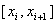
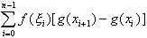
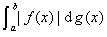

七、斯蒂尔吉斯积分

[定义]&nbsp; 设在区间[<i>a</i>,<i>b</i>]上给定两个有界函数<i>f</i>(<i>x</i>)和<i>g</i>(<i>x</i>).用任意方法把区间[<i>a</i>,<i>b</i>]分成若干部分，其分点为

<i>a</i>=<i>x</i>0&lt;<i>x</i>1&lt;<i>x</i>2&lt;…&lt;<i>
x</i>i&lt;<i>xi+</i>1&lt;…&lt;<i>xn</i>=<i>b</i>

并设λ是Δ<i>xi</i>=<i>xi+</i>1-<i>xi</i>(<i>t</i>=0,1,…,<i>n</i>－1)中最大的.在每个小区间上任取一点,作和

σ=

当<i>λ</i>→0时，如果极限存在，那末这个极限称为函数<i>f</i>(<i>x</i>)对函数<i>g</i>(<i>x</i>)的斯蒂尔吉斯积分，记作

&nbsp;&nbsp;&nbsp;&nbsp;&nbsp;&nbsp; 特别是，当函数<i>g</i>(<i>x</i>)在区间上连续可微时，函数<i>f</i>(<i>x</i>)对<i>g</i>(<i>x</i>)的斯蒂尔吉斯积分就是通常的黎曼积分

[可积性]

&nbsp;&nbsp;&nbsp;&nbsp;&nbsp;&nbsp; 1°若函数<i>f</i>(<i>x</i>)连续，函数<i>g</i>(<i>x</i>)有有界变差，则积分

&nbsp;&nbsp;&nbsp;&nbsp;&nbsp;&nbsp;&nbsp;&nbsp;&nbsp;&nbsp;&nbsp;&nbsp;&nbsp;&nbsp;&nbsp;&nbsp;&nbsp;&nbsp;&nbsp;
&nbsp;&nbsp;&nbsp;&nbsp;&nbsp;&nbsp;&nbsp;&nbsp;&nbsp;&nbsp;&nbsp;&nbsp;&nbsp;&nbsp;&nbsp;&nbsp;&nbsp;&nbsp;&nbsp;&nbsp;&nbsp;&nbsp;&nbsp;&nbsp;&nbsp;&nbsp;&nbsp;
&nbsp;&nbsp;&nbsp;&nbsp;&nbsp;&nbsp;&nbsp;&nbsp;&nbsp;&nbsp;&nbsp;&nbsp;&nbsp;&nbsp;&nbsp;
（1）

存在.

&nbsp;&nbsp;&nbsp;&nbsp;&nbsp;&nbsp; 2°若函数<i>f</i>(<i>x</i>)在区间[<i>a</i>,<i>b</i>]上黎曼可积，函数<i>g</i>(<i>x</i>)满足李普希茨条件：

|<i>g</i>(<i>x</i>')-<i>g</i>(<i>x</i>'')|≤<i>L</i>(<i>x</i>'－<i>x</i>'')

(<i>L</i>为常数，<i>a</i>≤<i>x</i>''&lt;<i>x</i>'≤<i>b</i>)

则积分(1)存在.

&nbsp;&nbsp;&nbsp;&nbsp;&nbsp;&nbsp; 3°若函数<i>f</i>(<i>x</i>)在区间[<i>a</i>,<i>b</i>]上黎曼可积，函数<i>g</i>(<i>x</i>)可表示成

&nbsp;&nbsp;&nbsp;&nbsp;&nbsp;&nbsp;
&nbsp;&nbsp;&nbsp;&nbsp;&nbsp;&nbsp;&nbsp;&nbsp;&nbsp;&nbsp;&nbsp;&nbsp; &nbsp;
<i>g</i>(<i>x</i>)=<i>C</i>+

式中<i>C</i>为常数，函数<i></i>在区间[<i>a</i>,<i>b</i>]上绝对可积，则积分(1)存在.

[积分法则与不等式]

&nbsp;&nbsp;&nbsp;&nbsp;&nbsp;&nbsp; 1°积分法则

&nbsp;&nbsp;&nbsp;&nbsp;&nbsp;&nbsp;&nbsp;&nbsp;&nbsp;&nbsp;&nbsp;&nbsp;&nbsp;

&nbsp;&nbsp;&nbsp;&nbsp;&nbsp;&nbsp;&nbsp;&nbsp;&nbsp;&nbsp;&nbsp;&nbsp;&nbsp;

&nbsp;&nbsp;&nbsp;&nbsp;&nbsp;&nbsp;&nbsp;&nbsp;&nbsp;&nbsp;&nbsp;&nbsp;&nbsp;

&nbsp;&nbsp;&nbsp;&nbsp;&nbsp;&nbsp;&nbsp;&nbsp;&nbsp;&nbsp;&nbsp;&nbsp;&nbsp;
(<i>k</i>,<i>l</i>为常数)

&nbsp;&nbsp;&nbsp;&nbsp;&nbsp;&nbsp;&nbsp;&nbsp;&nbsp;&nbsp;&nbsp;&nbsp;&nbsp;

&nbsp;&nbsp;&nbsp;&nbsp;&nbsp;&nbsp;&nbsp;&nbsp;&nbsp;&nbsp;&nbsp;&nbsp;&nbsp;&nbsp;&nbsp;&nbsp;&nbsp;&nbsp;&nbsp;&nbsp;
&nbsp;&nbsp;&nbsp;&nbsp;&nbsp;&nbsp;&nbsp;&nbsp;&nbsp;&nbsp;&nbsp;&nbsp;&nbsp;&nbsp;&nbsp;&nbsp;
(<i>a</i>&lt;<i>c</i>&lt;<i>b</i>,三个积分都存在，当上式右边两个积分存在时，一般不能推出积分存在）

&nbsp;&nbsp;&nbsp;&nbsp;&nbsp;&nbsp;&nbsp;&nbsp;&nbsp;&nbsp;&nbsp;&nbsp;&nbsp;
&nbsp;&nbsp;&nbsp;&nbsp;&nbsp;&nbsp; (分部积分公式)

&nbsp;&nbsp;&nbsp;&nbsp;&nbsp;&nbsp; 2° 若<i>g</i>(<i>x</i>)在区间[<i>a</i>,<i>b</i>]上为一非减函数，则

&nbsp;&nbsp;&nbsp;&nbsp;&nbsp;&nbsp;&nbsp;&nbsp;&nbsp;&nbsp;&nbsp;&nbsp;&nbsp;
≤

&nbsp;&nbsp;&nbsp;&nbsp;&nbsp;&nbsp; 3° 若<i>g</i>(<i>x</i>)在区间[<i>a</i>,<i>b</i>]上为一非减函数，则<i>f</i>(<i>x</i>)≤<i>F</i>(<i>x</i>),则

&nbsp;&nbsp;&nbsp;&nbsp;&nbsp;&nbsp;
&nbsp;&nbsp;&nbsp;&nbsp;&nbsp;&nbsp;&nbsp;&nbsp;&nbsp; ≤

