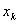
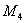
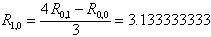
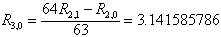
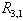
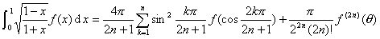

八、积分的近似计算

&nbsp;&nbsp;&nbsp;&nbsp;&nbsp;&nbsp; 1. 内插求积公式

&nbsp;&nbsp;&nbsp;&nbsp;&nbsp;&nbsp; [等距内插求积一般公式（柯斯特公式）]

≈(<i>b</i>－<i>a</i>)

式中为等距节点：

=<i>a</i>+<i>kh</i>&nbsp;&nbsp;&nbsp;&nbsp;&nbsp;&nbsp;&nbsp;&nbsp;&nbsp;&nbsp;&nbsp;&nbsp;
<i>k</i>=0,1,2,…,<i>n</i>

&nbsp;&nbsp;&nbsp;&nbsp;&nbsp;&nbsp;&nbsp;&nbsp;&nbsp;&nbsp;&nbsp;&nbsp;&nbsp;&nbsp;&nbsp;&nbsp;&nbsp;&nbsp;&nbsp;&nbsp;&nbsp;&nbsp;&nbsp;&nbsp;&nbsp;&nbsp;&nbsp;

为柯特斯系数（见下表）.

柯特斯系数表

&nbsp;&nbsp;&nbsp;&nbsp;&nbsp;&nbsp; 当区间[<i>a</i>,<i>b</i>]愈小，柯特斯公式所给出的结果愈精确.因此，当区间[<i>a</i>,<i>b</i>]较大时，为了避免采用<i>n</i>值较大的柯特斯公式，常把[<i>a</i>,<i>b</i>]<i>N</i>等分，对其中各个等份应用<i>n</i>值较小的柯特斯公式求积，然后再把各个等份的积分值相加，即得到区间[<i>a</i>,<i>b</i>]上的积分值，如下述的梯形公式(<i>n</i>=1)和辛卜生公式(<i>n</i>=2).

&nbsp;&nbsp;&nbsp;&nbsp;&nbsp;&nbsp; [梯形公式]

&nbsp;&nbsp;&nbsp;&nbsp;&nbsp;&nbsp;&nbsp;&nbsp;&nbsp;&nbsp;&nbsp;&nbsp;&nbsp;
&nbsp;&nbsp;&nbsp;&nbsp;&nbsp;&nbsp;&nbsp;&nbsp;&nbsp; ≈

&nbsp;&nbsp;&nbsp;&nbsp;&nbsp;&nbsp;
&nbsp;&nbsp;&nbsp;&nbsp;&nbsp;&nbsp;&nbsp;&nbsp;&nbsp;&nbsp;&nbsp;&nbsp;&nbsp;
&nbsp;&nbsp;&nbsp;&nbsp;&nbsp;&nbsp; =<i>a</i>+<i>kh</i>,&nbsp; <i>k</i>=1,2,…,<i>N</i>－1&nbsp;&nbsp;&nbsp;&nbsp;&nbsp;&nbsp;

&nbsp;&nbsp; 若≤<i>M</i>2,则截断误差为

&nbsp;&nbsp;&nbsp;&nbsp;&nbsp;&nbsp;&nbsp;&nbsp;&nbsp;&nbsp;&nbsp;&nbsp;&nbsp;
≤

&nbsp;&nbsp;&nbsp;&nbsp;&nbsp;&nbsp; [辛卜生公式]

&nbsp;&nbsp;&nbsp;&nbsp;&nbsp;&nbsp;&nbsp;&nbsp;&nbsp;&nbsp;&nbsp;&nbsp;&nbsp;
≈

&nbsp;&nbsp;&nbsp;&nbsp;&nbsp;&nbsp;&nbsp;&nbsp;&nbsp;&nbsp;&nbsp;&nbsp;&nbsp;&nbsp;&nbsp;&nbsp;&nbsp;&nbsp;&nbsp;&nbsp;
=<i>a</i>+<i>k</i>,&nbsp;&nbsp;&nbsp;&nbsp;&nbsp;&nbsp;

若≤,则截断误差为

<i></i>≤

&nbsp;&nbsp;&nbsp;&nbsp;&nbsp;&nbsp; [龙贝公式] &nbsp;&nbsp;设

&nbsp;&nbsp;&nbsp;&nbsp;&nbsp;&nbsp;&nbsp;&nbsp;&nbsp;&nbsp;&nbsp;&nbsp;&nbsp;

&nbsp;&nbsp;&nbsp;&nbsp;&nbsp;&nbsp;&nbsp;&nbsp;&nbsp;&nbsp;&nbsp;&nbsp;&nbsp;

&nbsp;&nbsp;&nbsp;&nbsp;&nbsp;&nbsp;&nbsp;&nbsp;&nbsp;&nbsp;&nbsp;&nbsp;&nbsp;
&nbsp;&nbsp;&nbsp;&nbsp;&nbsp;&nbsp;&nbsp; =

&nbsp;&nbsp;&nbsp;&nbsp;&nbsp;&nbsp;&nbsp;&nbsp;&nbsp;&nbsp;&nbsp;&nbsp;&nbsp;

则

&nbsp;&nbsp;&nbsp;&nbsp;&nbsp;&nbsp;&nbsp;&nbsp;&nbsp;&nbsp;&nbsp;&nbsp;&nbsp;

&nbsp;&nbsp;&nbsp;&nbsp;&nbsp;&nbsp; 一般地，可适当选取<i>m</i>,使之固定，再增大<i>k</i>,使近似截断误差

&nbsp;&nbsp;&nbsp;&nbsp;&nbsp;&nbsp;&nbsp;&nbsp;
&nbsp;&nbsp;&nbsp;&nbsp;&nbsp;&nbsp;&nbsp;&nbsp;&nbsp; 

在允许误差范围内即可，这时

&nbsp;&nbsp;&nbsp;&nbsp;&nbsp;&nbsp;&nbsp;&nbsp;&nbsp;&nbsp;&nbsp;&nbsp;&nbsp;
&nbsp;&nbsp;&nbsp;&nbsp;&nbsp; ≈

&nbsp;&nbsp;&nbsp;&nbsp;&nbsp;&nbsp; 具体计算过程可按下表自左而右，自上而下进行（表中箭头方向表示计算顺序）.

&nbsp;  

&nbsp;&nbsp;&nbsp;&nbsp;&nbsp;&nbsp; 例 用龙贝公式计算积分

&nbsp;&nbsp;&nbsp;&nbsp;&nbsp;&nbsp;&nbsp;&nbsp;&nbsp;&nbsp;&nbsp;&nbsp;&nbsp;
&nbsp;

误差不超过0.0000001.

&nbsp;&nbsp;&nbsp;&nbsp;&nbsp;&nbsp; 解 这里,<i>a</i>=0,<i>b</i>=1.可按五步进行计算，结果如下：

&nbsp;&nbsp;&nbsp;&nbsp;&nbsp;&nbsp; (1) 

&nbsp;&nbsp;&nbsp;&nbsp;&nbsp;&nbsp; (2) 

&nbsp;&nbsp;&nbsp;&nbsp;&nbsp;&nbsp;&nbsp;&nbsp;&nbsp;&nbsp;&nbsp;&nbsp;&nbsp;

&nbsp;&nbsp;&nbsp;&nbsp;&nbsp;&nbsp; (3) 

&nbsp;&nbsp;&nbsp;&nbsp;&nbsp;&nbsp; &nbsp;&nbsp; &nbsp;

&nbsp;&nbsp;&nbsp;&nbsp;&nbsp;&nbsp; &nbsp;&nbsp;&nbsp; &nbsp; 

&nbsp;&nbsp;&nbsp;&nbsp;&nbsp;&nbsp; (4) 

&nbsp;&nbsp;&nbsp;&nbsp;&nbsp;&nbsp; &nbsp; &nbsp;&nbsp;

&nbsp;&nbsp;&nbsp;&nbsp;&nbsp;&nbsp; &nbsp;&nbsp;&nbsp; 

&nbsp;&nbsp;&nbsp;&nbsp;&nbsp;&nbsp; &nbsp;&nbsp; &nbsp;

&nbsp;&nbsp;&nbsp;&nbsp;&nbsp;&nbsp; (5) 可以继续算出

&nbsp;&nbsp;&nbsp;&nbsp;&nbsp;&nbsp; &nbsp;&nbsp; &nbsp;3.140941614&nbsp;&nbsp;&nbsp;&nbsp;&nbsp;&nbsp;&nbsp;&nbsp;&nbsp;&nbsp;&nbsp;&nbsp;&nbsp;
3.141592655

&nbsp;&nbsp;&nbsp;&nbsp;&nbsp;&nbsp; &nbsp;&nbsp; &nbsp;3.141592665&nbsp;
&nbsp;&nbsp;&nbsp;&nbsp;&nbsp;&nbsp;&nbsp;&nbsp;&nbsp;&nbsp;&nbsp;&nbsp;3.141592643

因为

&nbsp;&nbsp;&nbsp;&nbsp;&nbsp;&nbsp; &nbsp;&nbsp; |-|=|3.141592643－3.141592665|&lt;0.0000001

所以

&nbsp;&nbsp;&nbsp;&nbsp;&nbsp;&nbsp;
&nbsp;&nbsp;&nbsp;&nbsp;&nbsp;&nbsp;&nbsp;&nbsp;&nbsp;&nbsp;&nbsp;&nbsp;&nbsp; ≈3.14159264&nbsp;&nbsp;&nbsp;&nbsp;&nbsp;

而准确值为

&nbsp;&nbsp;&nbsp;&nbsp;&nbsp;&nbsp;&nbsp;&nbsp;&nbsp;&nbsp;&nbsp;&nbsp;&nbsp;

&nbsp;&nbsp;&nbsp;&nbsp;&nbsp;&nbsp; 在等距内插求积公式中，以辛卜生公式和龙贝公式为好，计算简单 ，便于在电子计算机上实现(都有标准程序)，精确度也相当高.特别龙贝公式是采用区间逐次分半的方法,前一次分割得到的函数值在区间分半后仍可利用，具有计算有规律，不需存储柯特斯系数和节点等优点.

&nbsp;&nbsp;&nbsp;&nbsp;&nbsp;&nbsp; 但等距内插求积公式不能计算广义积分.广义积分只能用下面的高斯型求积公式来计算.

&nbsp;&nbsp;&nbsp;&nbsp;&nbsp;&nbsp; [不等距内插求积公式（高斯型求积公式 ）]

&nbsp;&nbsp;&nbsp;&nbsp;&nbsp;&nbsp; 高斯型求积公式为

&nbsp;&nbsp;&nbsp;&nbsp;&nbsp;&nbsp;&nbsp;&nbsp;&nbsp;&nbsp;&nbsp;&nbsp;&nbsp;
≈&nbsp;&nbsp;&nbsp;&nbsp; <i>n</i>=1,2,…

式中(<i>a</i>,<i>b</i>)区间可以是有限或无限，<i>w</i>(<i>x</i>)为(<i>a</i>,<i>b</i>)区间内的非负权函数.

&nbsp;&nbsp;&nbsp;&nbsp;&nbsp;&nbsp;&nbsp;&nbsp;&nbsp;&nbsp;&nbsp;&nbsp;&nbsp;
－∞≤<i>a</i>≤&lt;&lt;…&lt;&lt;<i>b</i>≤∞

为求积节点（相应的正交多项式的根），(<i>k</i>=1,2,…,<i>n</i>)为求积系数.<i>f</i>(<i>x</i>)为不超过2<i>n</i>－1次的多项式时，上述求积公式(1)成为等式.

&nbsp;&nbsp;&nbsp; 下面列出几种特例.

&nbsp;&nbsp;&nbsp;&nbsp;&nbsp;&nbsp; 1°

&nbsp;&nbsp;&nbsp;&nbsp;&nbsp;&nbsp;&nbsp;&nbsp;&nbsp;&nbsp;&nbsp;&nbsp;&nbsp;&nbsp;&nbsp;&nbsp;&nbsp;&nbsp;&nbsp;&nbsp;&nbsp;&nbsp;&nbsp;&nbsp;&nbsp;&nbsp;&nbsp;&nbsp;&nbsp;&nbsp;&nbsp;&nbsp;&nbsp;&nbsp;&nbsp;&nbsp;&nbsp;&nbsp;&nbsp;&nbsp;&nbsp;
(－1&lt;<i>θ</i>&lt;1)

式中为勒让德多项式(见第十二章，§2，一）的根.

&nbsp;&nbsp;&nbsp;&nbsp;&nbsp;&nbsp; 2°

&nbsp;&nbsp;&nbsp;&nbsp;&nbsp;&nbsp;&nbsp;&nbsp;&nbsp;&nbsp;&nbsp;&nbsp;&nbsp;&nbsp;&nbsp;&nbsp;&nbsp;&nbsp;&nbsp;&nbsp;&nbsp;&nbsp;&nbsp;&nbsp;&nbsp;&nbsp;&nbsp;&nbsp;&nbsp;&nbsp;&nbsp;&nbsp;&nbsp;&nbsp;&nbsp;&nbsp;&nbsp;&nbsp;&nbsp;&nbsp;&nbsp;
(－1&lt;<i>θ</i>&lt;1)

式中为第一类契贝谢夫多项式(见第十二章，§2，二）的根.

它也可表为

&nbsp;&nbsp;&nbsp;&nbsp;&nbsp;&nbsp; 3°

<pre style='text-align:justify;text-justify:inter-ideograph'>&nbsp;&nbsp;&nbsp;&nbsp;&nbsp;&nbsp;&nbsp;&nbsp;&nbsp;&nbsp;&nbsp;&nbsp; </pre>

(－1&lt;<i>θ</i>&lt;1)

式中为第二类契贝谢夫多项式(见第十二章，§2，三）的根.

&nbsp;&nbsp;&nbsp;&nbsp;&nbsp;&nbsp; 4°

<pre style='text-align:justify;text-justify:inter-ideograph'>&nbsp;&nbsp;&nbsp;&nbsp; </pre>

(－1&lt;<i>θ</i>&lt;1)

&nbsp;&nbsp;&nbsp;&nbsp;&nbsp;&nbsp; 5°

<pre style='text-align:justify;text-justify:inter-ideograph'>&nbsp;&nbsp;&nbsp;&nbsp;&nbsp;&nbsp;&nbsp; </pre>
