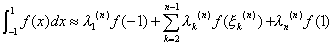

&nbsp;&nbsp;&nbsp;&nbsp;&nbsp;&nbsp; 2. 高斯型求积公式的求积节点和求积系数表

[高斯求积公式]

&nbsp;&nbsp;&nbsp;&nbsp;&nbsp;&nbsp;&nbsp;&nbsp;&nbsp;&nbsp;&nbsp;&nbsp;&nbsp;&nbsp;&nbsp;&nbsp;&nbsp;

式中为勒让德多项式的根.

<table class=MsoNormalTable border=1 cellspacing=0 cellpadding=0>
 <tr>
  <td width=119 valign=top style='width:89.25pt;padding:0mm 0mm 0mm 0mm'>
  
<i>n</i>

  </td>
  <td width=196 valign=top style='width:147.0pt;padding:0mm 0mm 0mm 0mm'>
  
求积节点

  </td>
  <td width=294 valign=top style='width:220.5pt;padding:0mm 0mm 0mm 0mm'>
  
求积系数

  </td>
 </tr>
 <tr>
  <td width=119 valign=top style='width:89.25pt;padding:0mm 0mm 0mm 0mm'>
  
2

  </td>
  <td width=196 valign=top style='width:147.0pt;padding:0mm 0mm 0mm 0mm'>
  
0.57735
  02692

  </td>
  <td width=294 valign=top style='width:220.5pt;padding:0mm 0mm 0mm 0mm'>
  
1

  </td>
 </tr>
 <tr>
  <td width=119 valign=top style='width:89.25pt;padding:0mm 0mm 0mm 0mm'>
  
3

  </td>
  <td width=196 valign=top style='width:147.0pt;padding:0mm 0mm 0mm 0mm'>
  
0

  
0.77459
  66692

  </td>
  <td width=294 valign=top style='width:220.5pt;padding:0mm 0mm 0mm 0mm'>
  
&nbsp;&nbsp;&nbsp;&nbsp;&nbsp;&nbsp;
  &nbsp;&nbsp;&nbsp;&nbsp;&nbsp;0.88888 88889

  
&nbsp;&nbsp;&nbsp;&nbsp;&nbsp;&nbsp;&nbsp;
  &nbsp;&nbsp;&nbsp;&nbsp;0.55555 55556

  </td>
 </tr>
 <tr>
  <td width=119 valign=top style='width:89.25pt;padding:0mm 0mm 0mm 0mm'>
  
4

  </td>
  <td width=196 valign=top style='width:147.0pt;padding:0mm 0mm 0mm 0mm'>
  
0.33998 10436

  
0.86113 63116

  </td>
  <td width=294 valign=top style='width:220.5pt;padding:0mm 0mm 0mm 0mm'>
  
&nbsp;&nbsp;&nbsp;&nbsp;&nbsp;&nbsp;&nbsp;
  &nbsp;&nbsp;&nbsp;&nbsp;0.65214 51549

  
&nbsp;&nbsp;&nbsp;&nbsp;&nbsp;&nbsp;&nbsp;
  &nbsp;&nbsp;&nbsp;&nbsp;0.34785 48451

  </td>
 </tr>
 <tr>
  <td width=119 valign=top style='width:89.25pt;padding:0mm 0mm 0mm 0mm'>
  
5

  </td>
  <td width=196 valign=top style='width:147.0pt;padding:0mm 0mm 0mm 0mm'>
  
0

  
0.53846 93101

  
0.90617 98459

  </td>
  <td width=294 valign=top style='width:220.5pt;padding:0mm 0mm 0mm 0mm'>
  
0.56888
  88889

  
0.47862
  86705

  
0.23692
  68851

  </td>
 </tr>
 <tr>
  <td width=119 valign=top style='width:89.25pt;padding:0mm 0mm 0mm 0mm'>
  
6

  </td>
  <td width=196 valign=top style='width:147.0pt;padding:0mm 0mm 0mm 0mm'>
  
0.23861 91861

  
0.66120 93865

  
0.93246 95142

  </td>
  <td width=294 valign=top style='width:220.5pt;padding:0mm 0mm 0mm 0mm'>
  
0.46791
  39346

  
0.36076
  15731

  
0.17132
  44924

  </td>
 </tr>
 <tr>
  <td width=119 valign=top style='width:89.25pt;padding:0mm 0mm 0mm 0mm'>
  
7

  </td>
  <td width=196 valign=top style='width:147.0pt;padding:0mm 0mm 0mm 0mm'>
  
0

  
0.40584 51514

  
0.74153 11856

  
0.94910 79123

  </td>
  <td width=294 valign=top style='width:220.5pt;padding:0mm 0mm 0mm 0mm'>
  
0.41795
  91837

  
0.38183
  00505

  
0.27970
  53915

  
0.12948
  49662

  </td>
 </tr>
 <tr>
  <td width=119 valign=top style='width:89.25pt;padding:0mm 0mm 0mm 0mm'>
  
8

  </td>
  <td width=196 valign=top style='width:147.0pt;padding:0mm 0mm 0mm 0mm'>
  
0.18343 46425

  
0.52553 24099

  
0.79666 64774

  
0.96028 98565

  </td>
  <td width=294 valign=top style='width:220.5pt;padding:0mm 0mm 0mm 0mm'>
  
0.36268
  37834

  
0.31370
  66459

  
0.22238
  10345

  
0.10122
  85363

  </td>
 </tr>
 <tr>
  <td width=119 valign=top style='width:89.25pt;padding:0mm 0mm 0mm 0mm'>
  
<i>n</i>

  </td>
  <td width=196 valign=top style='width:147.0pt;padding:0mm 0mm 0mm 0mm'>
  
求积节点

  </td>
  <td width=294 valign=top style='width:220.5pt;padding:0mm 0mm 0mm 0mm'>
  
求积系数

  </td>
 </tr>
 <tr>
  <td width=119 valign=top style='width:89.25pt;padding:0mm 0mm 0mm 0mm'>
  
9

  </td>
  <td width=196 valign=top style='width:147.0pt;padding:0mm 0mm 0mm 0mm'>
  
0

  
0.32425 34234

  
0.61337 14327

  
0.83603 11073

  
0.96816 02395

  </td>
  <td width=294 valign=top style='width:220.5pt;padding:0mm 0mm 0mm 0mm'>
  
0.33023
  93550

  
0.31234
  70770

  
0.26061
  06964

  
0.18064
  81607

  
0.08127
  43884

  </td>
 </tr>
 <tr>
  <td width=119 valign=top style='width:89.25pt;padding:0mm 0mm 0mm 0mm'>
  
10

  </td>
  <td width=196 valign=top style='width:147.0pt;padding:0mm 0mm 0mm 0mm'>
  
0.14887 43390

  
0.43339 53941

  
0.67940 95683

  
0.86506 33667

  
0.97390 65285

  </td>
  <td width=294 valign=top style='width:220.5pt;padding:0mm 0mm 0mm 0mm'>
  
0.29552
  42247

  
0.26926
  67193

  
0.21908
  63625

  
0.14945
  13492

  
0.06667
  13443

  </td>
 </tr>
</table>

[勒贝陶求积公式]

&nbsp;&nbsp;&nbsp;&nbsp;&nbsp;&nbsp;&nbsp;&nbsp;&nbsp;&nbsp;&nbsp;&nbsp;&nbsp;

式中为的根.

<table class=MsoNormalTable border=1 cellspacing=0 cellpadding=0>
 <tr>
  <td width=119 valign=top style='width:89.25pt;padding:0mm 0mm 0mm 0mm'>
  
<i>n</i>

  </td>
  <td width=196 valign=top style='width:147.0pt;padding:0mm 0mm 0mm 0mm'>
  
求积节点

  </td>
  <td width=294 valign=top style='width:220.5pt;padding:0mm 0mm 0mm 0mm'>
  
求积系数

  </td>
 </tr>
 <tr>
  <td width=119 valign=top style='width:89.25pt;padding:0mm 0mm 0mm 0mm'>
  
3

  </td>
  <td width=196 valign=top style='width:147.0pt;padding:0mm 0mm 0mm 0mm'>
  
&nbsp;&nbsp;&nbsp;&nbsp; 1

  
&nbsp;&nbsp;&nbsp;&nbsp;&nbsp; 0

  </td>
  <td width=294 valign=top style='width:220.5pt;padding:0mm 0mm 0mm 0mm'>
  
0.33333
  333

  
1.33333
  333

  </td>
 </tr>
 <tr>
  <td width=119 valign=top style='width:89.25pt;padding:0mm 0mm 0mm 0mm'>
  
4

  </td>
  <td width=196 valign=top style='width:147.0pt;padding:0mm 0mm 0mm 0mm'>
  
&nbsp;&nbsp;&nbsp;&nbsp;&nbsp; 1

  
0.44721 360

  </td>
  <td width=294 valign=top style='width:220.5pt;padding:0mm 0mm 0mm 0mm'>
  
0.16666
  667

  
0.83333
  333

  </td>
 </tr>
 <tr>
  <td width=119 valign=top style='width:89.25pt;padding:0mm 0mm 0mm 0mm'>
  
5

  </td>
  <td width=196 valign=top style='width:147.0pt;padding:0mm 0mm 0mm 0mm'>
  
&nbsp;&nbsp;&nbsp;&nbsp; 1

  
0.65465 367

  
&nbsp;&nbsp;&nbsp;&nbsp;&nbsp;&nbsp; 0

  </td>
  <td width=294 valign=top style='width:220.5pt;padding:0mm 0mm 0mm 0mm'>
  
0.10000
  000

  
0.54444
  444

  
0.71111
  111

  </td>
 </tr>
 <tr>
  <td width=119 valign=top style='width:89.25pt;padding:0mm 0mm 0mm 0mm'>
  
6

  </td>
  <td width=196 valign=top style='width:147.0pt;padding:0mm 0mm 0mm 0mm'>
  
&nbsp;&nbsp;&nbsp;&nbsp; 1

  
0.76505 532

  
0.28523 152

  </td>
  <td width=294 valign=top style='width:220.5pt;padding:0mm 0mm 0mm 0mm'>
  
0.06666
  667

  
0.37847
  496

  
0.55485
  838

  </td>
 </tr>
 <tr>
  <td width=119 valign=top style='width:89.25pt;padding:0mm 0mm 0mm 0mm'>
  
7

  </td>
  <td width=196 valign=top style='width:147.0pt;padding:0mm 0mm 0mm 0mm'>
  
&nbsp;&nbsp;&nbsp;&nbsp; 1

  
0.83022 390

  
0.46884 879

  
&nbsp;&nbsp;&nbsp;&nbsp;&nbsp; 0

  </td>
  <td width=294 valign=top style='width:220.5pt;padding:0mm 0mm 0mm 0mm'>
  
0.04761
  904

  
0.27682
  604

  
0.43174
  538

  
0.48761
  904

  </td>
 </tr>
 <tr>
  <td width=119 valign=top style='width:89.25pt;padding:0mm 0mm 0mm 0mm'>
  
8

  </td>
  <td width=196 valign=top style='width:147.0pt;padding:0mm 0mm 0mm 0mm'>
  
&nbsp;&nbsp;&nbsp;&nbsp; 1

  
0.87174 015

  
0.59170 018

  
0.20929 922

  </td>
  <td width=294 valign=top style='width:220.5pt;padding:0mm 0mm 0mm 0mm'>
  
0.03571
  428

  
0.21070
  422

  
0.34112
  270

  
0.41245
  880

  </td>
 </tr>
 <tr>
  <td width=119 valign=top style='width:89.25pt;padding:0mm 0mm 0mm 0mm'>
  
9

  </td>
  <td width=196 valign=top style='width:147.0pt;padding:0mm 0mm 0mm 0mm'>
  
&nbsp;&nbsp;&nbsp;&nbsp; 1

  
0.87174 015

  
0.67718 62795

  
0.36311 74638

  
&nbsp;&nbsp;&nbsp;&nbsp;&nbsp; 0

  </td>
  <td width=294 valign=top style='width:220.5pt;padding:0mm 0mm 0mm 0mm'>
  
0.02777
  77778

  
0.16549
  53616

  
0.27453
  87126

  
0.34642
  85110

  
0.37151
  92744

  </td>
 </tr>
 <tr>
  <td width=119 valign=top style='width:89.25pt;padding:0mm 0mm 0mm 0mm'>
  
10

  </td>
  <td width=196 valign=top style='width:147.0pt;padding:0mm 0mm 0mm 0mm'>
  
&nbsp;&nbsp;&nbsp;&nbsp; 1

  
0.91953 39082

  
0.73877 38651

  
0.47792 49498

  
0.16527 89577

  </td>
  <td width=294 valign=top style='width:220.5pt;padding:0mm 0mm 0mm 0mm'>
  
0.02222
  22222

  
0.13330
  59908

  
0.22488
  93420

  
0.29204
  26836

  
0.32753
  97612

  </td>
 </tr>
</table>

&nbsp;&nbsp;&nbsp;&nbsp;&nbsp;&nbsp; [拉盖尔求积公式]

&nbsp;&nbsp;&nbsp;&nbsp;&nbsp;&nbsp;&nbsp;&nbsp;&nbsp;&nbsp;&nbsp;&nbsp;&nbsp;

&nbsp;&nbsp;&nbsp;&nbsp;&nbsp;&nbsp;&nbsp;&nbsp;&nbsp;&nbsp;&nbsp;&nbsp;&nbsp;

式中为拉盖尔多项式（见第十二章，§2，四）的根.

<table class=MsoNormalTable border=1 cellspacing=0 cellpadding=0>
 <tr>
  <td width=98 valign=top style='width:73.5pt;padding:0mm 0mm 0mm 0mm'>
  
<i>n</i>

  </td>
  <td width=140 valign=top style='width:105.0pt;padding:0mm 0mm 0mm 0mm'>
  
求积节点

  </td>
  <td width=168 valign=top style='width:126.0pt;padding:0mm 0mm 0mm 0mm'>
  
求积系数

  </td>
  <td width=203 valign=top style='width:152.25pt;padding:0mm 0mm 0mm 0mm'>
  

  </td>
 </tr>
 <tr>
  <td width=98 valign=top style='width:73.5pt;padding:0mm 0mm 0mm 0mm'>
  
2

  </td>
  <td width=140 valign=top style='width:105.0pt;padding:0mm 0mm 0mm 0mm'>
  
0.58578
  64376

  
3.41421
  35624

  </td>
  <td width=168 valign=top style='width:126.0pt;padding:0mm 0mm 0mm 0mm'>
  
(-1)8.53553
  39059*

  
(-1)1.46446
  60941

  </td>
  <td width=203 valign=top style='width:152.25pt;padding:0mm 0mm 0mm 0mm'>
  
1.53332
  60331

  
4.45095
  73351

  </td>
 </tr>
 <tr>
  <td width=98 valign=top style='width:73.5pt;padding:0mm 0mm 0mm 0mm'>
  
3

  </td>
  <td width=140 valign=top style='width:105.0pt;padding:0mm 0mm 0mm 0mm'>
  
0.41577
  45568

  
2.29428
  03603

  
6.28994
  50829

  </td>
  <td width=168 valign=top style='width:126.0pt;padding:0mm 0mm 0mm 0mm'>
  
(-1)7.11093
  00993

  
(-1)2.78517
  73357

  
(-1)1.03892
  56502

  </td>
  <td width=203 valign=top style='width:152.25pt;padding:0mm 0mm 0mm 0mm'>
  
1.07769
  28593

  
2.76214
  29619

  
5.60109
  46254

  </td>
 </tr>
 <tr>
  <td width=98 valign=top style='width:73.5pt;padding:0mm 0mm 0mm 0mm'>
  
4

  </td>
  <td width=140 valign=top style='width:105.0pt;padding:0mm 0mm 0mm 0mm'>
  
0.32254
  76896

  
1.74576
  11012

  
4.53662
  02969

  
9.39507
  09123

  </td>
  <td width=168 valign=top style='width:126.0pt;padding:0mm 0mm 0mm 0mm'>
  
(-1)6.03154
  10434

  
(-1)3.57418
  69244

  
(-2)3.88879
  08515

  
(-4)5.39294
  70556

  </td>
  <td width=203 valign=top style='width:152.25pt;padding:0mm 0mm 0mm 0mm'>
  
0.83273
  91238

  
2.04810
  24385

  
3.63114
  63058

  
6.48714
  50844

  </td>
 </tr>
 <tr>
  <td width=98 valign=top style='width:73.5pt;padding:0mm 0mm 0mm 0mm'>
  
5

  </td>
  <td width=140 valign=top style='width:105.0pt;padding:0mm 0mm 0mm 0mm'>
  
0.26356
  03197

  
1.41340
  30591

  
3.59642
  57710

  
7.08581
  00059

  
12.64080
  08443

  </td>
  <td width=168 valign=top style='width:126.0pt;padding:0mm 0mm 0mm 0mm'>
  
(-1)5.21755
  61058

  
(-1)3.98666
  81108

  
(-2)7.59424
  49582

  
(-3)3.61175
  86799

  
(-5)2.33699
  72386

  </td>
  <td width=203 valign=top style='width:152.25pt;padding:0mm 0mm 0mm 0mm'>
  
0.67909
  40422

  
1.63848
  78736

  
2.76944
  32424

  
4.31565
  69009

  
7.21918
  63544

  </td>
 </tr>
 <tr>
  <td width=98 valign=top style='width:73.5pt;padding:0mm 0mm 0mm 0mm'>
  
6

  </td>
  <td width=140 valign=top style='width:105.0pt;padding:0mm 0mm 0mm 0mm'>
  
0.22284
  66042

  
1.18893
  21017

  
2.99273
  63261

  
5.77514
  35691

  
9.8374674184

  
15.98287
  39806

  </td>
  <td width=168 valign=top style='width:126.0pt;padding:0mm 0mm 0mm 0mm'>
  
(-1)
  4.58964 67395

  
(-1)4.17000
  83077

  
(-1)1.13373
  38207

  
(-2)1.03991
  97453

  
(-4)2.61017
  20282

  
(-7)8.98547
  90643

  </td>
  <td width=203 valign=top style='width:152.25pt;padding:0mm 0mm 0mm 0mm'>
  
0.57353
  55074

  
1.36925 25907

  
2.26068
  45934

  
3.35052
  45824

  
4.88682
  68002

  
7.84901
  59456

  </td>
 </tr>
 <tr>
  <td width=98 valign=top style='width:73.5pt;padding:0mm 0mm 0mm 0mm'>
  
7

  </td>
  <td width=140 valign=top style='width:105.0pt;padding:0mm 0mm 0mm 0mm'>
  
0.19304
  36766

  
1.02666
  48953

  
2.56787
  67450

  
4.90035
  30845

  
8.18215
  34446

  
12.73418
  02918

  
19.39572
  78623

  </td>
  <td width=168 valign=top style='width:126.0pt;padding:0mm 0mm 0mm 0mm'>
  
(-1)4.09318
  95170

  
(-1)4.21831
  27786

  
(-1)1.47126
  34866

  
(-2)2.06335
  14469

  
(-3)1.07401
  01433

  
(-5)1.58654
  64349

  
(-8)3.17031
  54790

  </td>
  <td width=203 valign=top style='width:152.25pt;padding:0mm 0mm 0mm 0mm'>
  
0.49647
  75975

  
1.17764
  30609

  
1.91824
  97817

  
2.77184
  86362

  
3.84124
  91225

  
5.38067
  82079

  
8.40543
  24868

  </td>
 </tr>
 <tr>
  <td width=98 valign=top style='width:73.5pt;padding:0mm 0mm 0mm 0mm'>
  
8

  </td>
  <td width=140 valign=top style='width:105.0pt;padding:0mm 0mm 0mm 0mm'>
  
0.17027
  96323

  
0.90370
  17768

  
2.25108
  66299

  
4.26670
  01703

  
7.04560
  54024

  
10.75851
  60102

  
15.74067
  86413

  
22.86313
  17369

  </td>
  <td width=168 valign=top style='width:126.0pt;padding:0mm 0mm 0mm 0mm'>
  
(-1)3.69188
  58934

  
(-1)4.18786
  78081

  
(-1)1.75794
  98664

  
(-2)3.33434
  92261

  
(-3)2.79453
  62352

  
(-5)9.07650
  87734

  
(-7)8.48574
  67163

  
(-9)1.04800
  11749

  </td>
  <td width=203 valign=top style='width:152.25pt;padding:0mm 0mm 0mm 0mm'>
  
0.43772
  34105

  
1.03386
  93477

  
1.66970
  97657

  
2.37692
  47018

  
3.20854
  09134

  
4.26857
  55108

  
5.81808
  33687

  
8.90622
  62153

  </td>
 </tr>
 <tr>
  <td width=98 valign=top style='width:73.5pt;padding:0mm 0mm 0mm 0mm'>
  
9

  </td>
  <td width=140 valign=top style='width:105.0pt;padding:0mm 0mm 0mm 0mm'>
  
0.15232
  22277

  
0.80722
  00227

  
2.00513
  51556

  
3.78347
  39733

  
6.20495
  67779

  
9.37298
  52517

  
13.46623
  69111

  
18.83359
  77890

  
26.37407
  18909

  </td>
  <td width=168 valign=top style='width:126.0pt;padding:0mm 0mm 0mm 0mm'>
  
(-1)3.36126
  42180

  
(-1)4.11213
  98042

  
(-1)1.99287
  52537

  
(-2)4.74605
  62766

  
(-3)5.59962
  66108

  
(-4)3.05249
  76709

  
(-6)6.59212
  30261

  
(-8)4.11076
  93304

  
(-11)3.29087
  40304

  </td>
  <td width=203 valign=top style='width:152.25pt;padding:0mm 0mm 0mm 0mm'>
  
0.39143
  11243

  
0.92180
  50285

  
1.48012
  79099

  
2.08677
  08076

  
2.77292
  13897

  
3.59162
  60681

  
4.64876
  60021

  
6.21227
  54198

  
9.36321
  82377

  </td>
 </tr>
</table>

*表示数，其他类同，.

&nbsp;&nbsp;&nbsp;&nbsp;&nbsp;&nbsp; [埃尔米特求积公式]

&nbsp;&nbsp;&nbsp;&nbsp;&nbsp;&nbsp;&nbsp;&nbsp;&nbsp;&nbsp;&nbsp;&nbsp;&nbsp;

&nbsp;&nbsp;&nbsp;&nbsp;&nbsp;&nbsp;&nbsp;&nbsp;&nbsp;&nbsp;&nbsp;&nbsp;&nbsp;

式中为埃尔米特多项式（见第十二章，§2，五）的根.

<table class=MsoNormalTable border=1 cellspacing=0 cellpadding=0>
 <tr>
  <td width=91 valign=top style='width:68.25pt;padding:0mm 0mm 0mm 0mm'>
  
<i>n</i>

  </td>
  <td width=183 valign=top style='width:137.25pt;padding:0mm 0mm 0mm 0mm'>
  
求积节点

  </td>
  <td width=189 valign=top style='width:50.0mm;padding:0mm 0mm 0mm 0mm'>
  
求积系数

  </td>
  <td width=180 valign=top style='width:135.0pt;padding:0mm 0mm 0mm 0mm'>
  

  </td>
 </tr>
 <tr>
  <td width=91 valign=top style='width:68.25pt;padding:0mm 0mm 0mm 0mm'>
  
2

  </td>
  <td width=183 valign=top style='width:137.25pt;padding:0mm 0mm 0mm 0mm'>
  
0.70710 67812

  </td>
  <td width=189 valign=top style='width:50.0mm;padding:0mm 0mm 0mm 0mm'>
  
(-1)8.86226
  92545*

  </td>
  <td width=180 valign=top style='width:135.0pt;padding:0mm 0mm 0mm 0mm'>
  
1.46114
  11827

  </td>
 </tr>
 <tr>
  <td width=91 valign=top style='width:68.25pt;padding:0mm 0mm 0mm 0mm'>
  
3

  </td>
  <td width=183 valign=top style='width:137.25pt;padding:0mm 0mm 0mm 0mm'>
  
&nbsp;&nbsp;&nbsp; 0

  
1.22474 48714

  </td>
  <td width=189 valign=top style='width:50.0mm;padding:0mm 0mm 0mm 0mm'>
  
(0)1.18163
  59006

  
(-1)2.95408
  97515

  </td>
  <td width=180 valign=top style='width:135.0pt;padding:0mm 0mm 0mm 0mm'>
  
1.18163
  59006

  
1.32393
  11752

  </td>
 </tr>
 <tr>
  <td width=91 valign=top style='width:68.25pt;padding:0mm 0mm 0mm 0mm'>
  
4

  </td>
  <td width=183 valign=top style='width:137.25pt;padding:0mm 0mm 0mm 0mm'>
  
0.52464 76233

  
1.65068 01239

  </td>
  <td width=189 valign=top style='width:50.0mm;padding:0mm 0mm 0mm 0mm'>
  
(-1)8.04914
  09001

  
(-2)8.13128
  35447

  </td>
  <td width=180 valign=top style='width:135.0pt;padding:0mm 0mm 0mm 0mm'>
  
1.05996
  44829

  
1.24022
  58177

  </td>
 </tr>
 <tr>
  <td width=91 valign=top style='width:68.25pt;padding:0mm 0mm 0mm 0mm'>
  
5

  </td>
  <td width=183 valign=top style='width:137.25pt;padding:0mm 0mm 0mm 0mm'>
  
&nbsp;&nbsp;&nbsp;&nbsp; 0

  
0.95857 24646

  
2.02018 28705

  </td>
  <td width=189 valign=top style='width:50.0mm;padding:0mm 0mm 0mm 0mm'>
  
(-1)9.45308
  72048

  
(-1)3.93619
  32315

  
(-2)1.99532
  42059

  </td>
  <td width=180 valign=top style='width:135.0pt;padding:0mm 0mm 0mm 0mm'>
  
0.94530
  87205

  
0.98658
  09968

  
1.18148
  86255

  </td>
 </tr>
 <tr>
  <td width=91 valign=top style='width:68.25pt;padding:0mm 0mm 0mm 0mm'>
  
6

  </td>
  <td width=183 valign=top style='width:137.25pt;padding:0mm 0mm 0mm 0mm'>
  
0.43607 74119

  
1.33584 90740

  
2.35060 49737

  </td>
  <td width=189 valign=top style='width:50.0mm;padding:0mm 0mm 0mm 0mm'>
  
(-1)7.24629
  59522

  
(-1)1.57067
  32032

  
(-3)4.53000
  99055

  </td>
  <td width=180 valign=top style='width:135.0pt;padding:0mm 0mm 0mm 0mm'>
  
0.87640
  13344

  
0.93558
  05576

  
1.13690
  83327

  </td>
 </tr>
 <tr>
  <td width=91 valign=top style='width:68.25pt;padding:0mm 0mm 0mm 0mm'>
  
7

  </td>
  <td width=183 valign=top style='width:137.25pt;padding:0mm 0mm 0mm 0mm'>
  
&nbsp;&nbsp;&nbsp; 0

  
0.81628 78829

  
1.67355 16288

  
2.65196 13568

  </td>
  <td width=189 valign=top style='width:50.0mm;padding:0mm 0mm 0mm 0mm'>
  
(-1)8.10264
  61756

  
(-1)4.25607
  25261

  
(-2)5.45155
  82819

  
(-4)9.7178124510

  </td>
  <td width=180 valign=top style='width:135.0pt;padding:0mm 0mm 0mm 0mm'>
  
0.81026
  46176

  
0.82868
  73033

  
0.89718
  46002

  
1.10133 07296

  </td>
 </tr>
 <tr>
  <td width=91 valign=top style='width:68.25pt;padding:0mm 0mm 0mm 0mm'>
  
8

  </td>
  <td width=183 valign=top style='width:137.25pt;padding:0mm 0mm 0mm 0mm'>
  
0.38118 69902

  
1.15719 37125

  
1.98165 67567

  
2.93063 74203

  </td>
  <td width=189 valign=top style='width:50.0mm;padding:0mm 0mm 0mm 0mm'>
  
(-1)6.61147
  01256

  
(-1)2.07802
  32582

  
(-2)1.70779
  83007

  
(-4)1.99604
  07221

  </td>
  <td width=180 valign=top style='width:135.0pt;padding:0mm 0mm 0mm 0mm'>
  
0.76454
  41287

  
0.79289
  00484

  
0.86675
  26066

  
1.07193
  01443

  </td>
 </tr>
 <tr>
  <td width=91 valign=top style='width:68.25pt;padding:0mm 0mm 0mm 0mm'>
  
9

  </td>
  <td width=183 valign=top style='width:137.25pt;padding:0mm 0mm 0mm 0mm'>
  
&nbsp;&nbsp;&nbsp; 0

  
0.72355 10188

  
1.46855 32892

  
2.26658 05845

  
3.19099 32018

  </td>
  <td width=189 valign=top style='width:50.0mm;padding:0mm 0mm 0mm 0mm'>
  
(-1)7.20235
  21561

  
(-1)4.32651
  55900

  
(-2)8.84745
  27394

  
(-3)4.94362
  42755

  
(-5)3.96069
  77263

  </td>
  <td width=180 valign=top style='width:135.0pt;padding:0mm 0mm 0mm 0mm'>
  
0.72023
  52156

  
0.73030
  24528

  
0.76460
  81251

  
0.84175
  27015

  
1.04700
  35810

  </td>
 </tr>
 <tr>
  <td width=91 valign=top style='width:68.25pt;padding:0mm 0mm 0mm 0mm'>
  
10

  </td>
  <td width=183 valign=top style='width:137.25pt;padding:0mm 0mm 0mm 0mm'>
  
0.34290 13272

  
1.03661 08298

  
1.75668 36493

  
2.53273 16742

  
3.43615 91188

  </td>
  <td width=189 valign=top style='width:50.0mm;padding:0mm 0mm 0mm 0mm'>
  
(-1)6.10862
  63374

  
(-1)2.40138
  61108

  
(-2)3.38743
  94456

  
(-3)1.34364
  57468

  
(-6)7.64043
  28552

  </td>
  <td width=180 valign=top style='width:135.0pt;padding:0mm 0mm 0mm 0mm'>
  
0.68708
  18540

  
0.70329
  63231

  
0.74144
  19319

  
0.82066
  61264

  
1.02545
  16914

  </td>
 </tr>
</table>

* 表示数其他类同.

