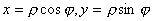
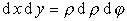

<h2 align=center style='text-align:center'>§2 多重积分、曲线积分与曲面积分</h2>
<h3 style='text-align:justify;text-justify:inter-ideograph'>一、&nbsp;&nbsp;&nbsp;&nbsp;&nbsp;&nbsp;&nbsp; 多重积分</h3>

&nbsp;&nbsp;&nbsp;&nbsp;&nbsp;&nbsp; 1. 二重积分

&nbsp;&nbsp;&nbsp;&nbsp;&nbsp;&nbsp; 连续函数<i>f</i>(<i>x</i>,<i>y</i>)在有限可求积的平面区域<i>Ω</i>内的二重积分

&nbsp;&nbsp;&nbsp;&nbsp;&nbsp;&nbsp;&nbsp;&nbsp;&nbsp;&nbsp;&nbsp;&nbsp;&nbsp;

式中,,是对<i>Ω</i>中的所有<i></i>的下标<i>i</i>，<i>j</i>求和.

&nbsp;&nbsp;&nbsp;&nbsp;&nbsp;&nbsp; &nbsp;&nbsp; [特定区域内二重积分的计算公式]

<table class=MsoNormalTable border=1 cellspacing=0 cellpadding=0>
 <tr>
  <td width=252 valign=top style='width:189.0pt;padding:0mm 0mm 0mm 0mm'>
  
积分区域<i>Ω</i>

  </td>
  <td width=397 valign=top style='width:297.75pt;padding:0mm 0mm 0mm 0mm'>
  
计算公式（积分限应从小到大）

  </td>
 </tr>
 <tr>
  <td width=252 valign=top style='width:189.0pt;padding:0mm 0mm 0mm 0mm'>
  

  
&nbsp; 

  
&nbsp;&nbsp;&nbsp; 

  
&nbsp;&nbsp;&nbsp;&nbsp; 

  </td>
  <td width=397 valign=top style='width:297.75pt;padding:0mm 0mm 0mm 0mm'>
  

  

  
设，则

  

  

  

  </td>
 </tr>
</table>

&nbsp;&nbsp;&nbsp;&nbsp;&nbsp;&nbsp; [二重积分的变量替换(雅可比式)] 若连续可微分的函数

&nbsp;&nbsp;&nbsp;&nbsp;&nbsp;&nbsp;&nbsp;&nbsp;&nbsp;&nbsp;&nbsp;&nbsp;&nbsp;

把平面<i>Oxy</i>上的有界闭区域<i>Ω</i>单值映射到平面<i></i>上的闭区域<i>Ω</i>'，其雅可比式为

则

&nbsp;&nbsp;&nbsp;&nbsp;&nbsp;&nbsp; 例
&nbsp;&nbsp;&nbsp;&nbsp;&nbsp;&nbsp;&nbsp;&nbsp;&nbsp;&nbsp;若&nbsp;&nbsp;&nbsp;&nbsp;

则

所以

&nbsp;&nbsp;&nbsp;&nbsp;&nbsp;&nbsp;
&nbsp;&nbsp;&nbsp;&nbsp;&nbsp; 

