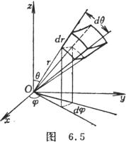

2. 三重积分

&nbsp;&nbsp;&nbsp;&nbsp;&nbsp;&nbsp; [直角坐标下的三重积分] &nbsp;假设有界区域<i>V</i>由下列不等式

&nbsp;&nbsp;&nbsp;&nbsp;&nbsp;&nbsp;&nbsp;&nbsp;&nbsp;&nbsp;&nbsp;&nbsp;&nbsp;
<i>a</i>≤<i>x</i>≤<i>b</i>,<i> </i>≤<i>y</i>≤<i></i>, <i></i>≤<i>z</i>≤<i></i>

&nbsp;确定，其中<i></i>,<i></i>,<i></i>,<i></i>都是连续函数，且函数<i>f</i>(<i>x</i>,<i>y</i>,<i>z</i>)在<i>V</i>上是连续的，则函数<i>f</i>(<i>x</i>,<i>y</i>,<i>z</i>)在有界区域<i>V</i>上的三重积分

&nbsp;&nbsp;&nbsp;&nbsp;&nbsp;&nbsp;&nbsp;&nbsp;&nbsp;&nbsp;&nbsp;&nbsp;&nbsp;

&nbsp;&nbsp; 有时采用下面公式计算：

&nbsp;&nbsp;&nbsp;&nbsp;&nbsp;&nbsp;&nbsp;&nbsp;&nbsp;&nbsp;&nbsp;&nbsp;&nbsp;

式中是用平行于O<i>yz</i>的平面截区域<i>V</i>所得的截断面(图6.3).

&nbsp;&nbsp;&nbsp;&nbsp;&nbsp;&nbsp; 例 设<i>V</i>表示在第一卦限中由曲面和坐标平面所围成的封闭区域，则当一切常数都是正的时候，有

&nbsp;&nbsp;&nbsp;&nbsp;&nbsp;&nbsp;&nbsp;&nbsp;&nbsp;&nbsp;&nbsp;&nbsp;&nbsp;
&nbsp;

这种类型的积分称为狄利克莱积分，它在计算重积分时经常用到.

&nbsp;&nbsp;&nbsp;&nbsp;&nbsp;&nbsp;
&nbsp;&nbsp;&nbsp;&nbsp;&nbsp;&nbsp;

&nbsp;&nbsp;&nbsp;&nbsp;&nbsp;&nbsp; [圆柱坐标下的三重积分] &nbsp;(图6.4)

&nbsp;&nbsp;&nbsp;&nbsp;&nbsp;&nbsp;
&nbsp;

&nbsp;&nbsp;&nbsp;&nbsp;&nbsp;&nbsp;&nbsp;&nbsp;&nbsp;&nbsp;&nbsp;&nbsp;&nbsp;&nbsp;&nbsp;&nbsp;&nbsp;&nbsp;&nbsp;&nbsp;&nbsp;&nbsp;&nbsp;&nbsp;&nbsp;&nbsp;&nbsp;&nbsp;&nbsp;&nbsp;&nbsp;&nbsp;&nbsp;&nbsp;
（一般地，0≤<i></i>≤2<i>π</i>)

式中<i>V</i>为直角坐标中的有界区域，<i>V</i>'是区域<i>V</i>在圆柱坐标系中的表达式.

&nbsp;&nbsp;&nbsp;&nbsp;&nbsp;&nbsp; [球面坐标下的三重积分] &nbsp;(图6.5)

&nbsp;&nbsp;&nbsp;&nbsp;&nbsp;&nbsp;&nbsp;&nbsp;&nbsp;&nbsp;&nbsp;&nbsp;&nbsp;&nbsp;&nbsp;&nbsp;&nbsp;&nbsp;&nbsp;&nbsp;&nbsp;&nbsp;&nbsp;&nbsp;
（一般地，0≤≤2<i>π</i>,0≤<i>θ</i>≤<i>π</i>)

式中<i>V</i>'是区域<i>V</i>在球面坐标系中的表达式.

&nbsp;&nbsp;&nbsp;&nbsp;&nbsp;&nbsp; [三重积分的变量替换(雅可比式)] 若连续可微函数

把<i>Oxyz</i>空间的有界三维闭区域双方单值地映射到<i>O'uw</i>空间的闭区域<i>V</i>'，并且当（<i>u</i>,<i> ,w</i>)∈<i>V</i>'时其雅可比式

则

&nbsp;&nbsp;&nbsp;&nbsp;&nbsp;&nbsp;&nbsp;&nbsp;&nbsp;&nbsp;&nbsp;&nbsp;&nbsp;

