

3. 多重积分

&nbsp;&nbsp;&nbsp;&nbsp;&nbsp;&nbsp; [直接计算多重积分] 若函数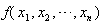在由下列不等式所确定的有界闭区域<i>Ω</i>内是连续的：

&nbsp;&nbsp;&nbsp;&nbsp;&nbsp;&nbsp;&nbsp;&nbsp;&nbsp;&nbsp;&nbsp;&nbsp;&nbsp;&nbsp;&nbsp;&nbsp;&nbsp;&nbsp;&nbsp;&nbsp; &nbsp;<i>a</i>≤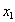≤<i>b</i>

&nbsp;&nbsp;&nbsp;&nbsp;&nbsp;&nbsp;&nbsp;&nbsp;&nbsp;&nbsp;&nbsp;&nbsp;&nbsp;&nbsp;&nbsp;&nbsp;&nbsp;&nbsp;&nbsp;&nbsp; &nbsp;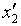()≤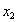≤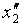 ()

&nbsp;&nbsp;&nbsp;&nbsp;&nbsp;&nbsp;&nbsp;&nbsp;&nbsp;&nbsp;&nbsp;&nbsp;&nbsp;&nbsp;&nbsp;&nbsp;&nbsp;&nbsp;&nbsp;&nbsp; &nbsp;………………………

&nbsp;&nbsp;&nbsp;&nbsp;&nbsp;&nbsp;&nbsp;&nbsp;&nbsp;&nbsp;&nbsp;&nbsp;&nbsp; &nbsp;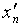()≤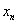≤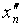 (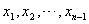)

式中<i>a</i>,<i>b</i>为常数，()， ()，…， ()， ()为连续函数，则对应的多重积分可按下面公式计算：

&nbsp;&nbsp;&nbsp;&nbsp;&nbsp;&nbsp; 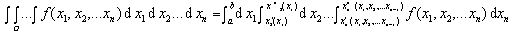

&nbsp;&nbsp;&nbsp;&nbsp;&nbsp;&nbsp; [多重积分的变量替换（雅可比式）] 若连续可微函数

&nbsp;&nbsp;&nbsp;&nbsp;&nbsp;&nbsp;&nbsp;&nbsp;&nbsp;&nbsp;&nbsp;&nbsp;&nbsp; 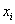=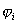 (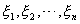), i=1,2,…,<i>n</i>

把<i>O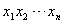</i>空间内的有界闭区域<i>Ω</i>双方单值地映射成<i>O'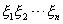</i>空间内的有界闭区域<i>Ω</i>',并且在闭区域<i>Ω</i>'内雅可比式

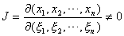

则

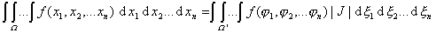

特别，根据公式

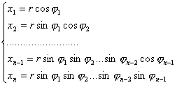

变换成极坐标(<i>r</i>,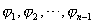)时，有：

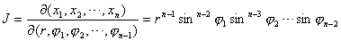

