

二、&nbsp;&nbsp;&nbsp; 曲线积分

<table class=MsoNormalTable border=0 cellspacing=0 cellpadding=0 align=right
 hspace=0 vspace=0>
 <tr>
  <td valign=top style='padding:0mm 0mm 0mm 0mm'>
  
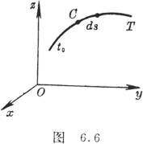

  </td>
 </tr>
</table>

&nbsp;&nbsp;&nbsp;&nbsp;&nbsp;&nbsp; [对弧长的曲线积分] &nbsp;若函数<i>f</i>(<i>x</i>,<i>y</i>,<i>z</i>)在光滑曲线<i>C</i>:

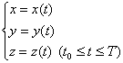

&nbsp;的各点上有定义并且连续（图6.6）则

&nbsp;&nbsp;&nbsp;&nbsp;&nbsp;&nbsp;&nbsp;&nbsp;&nbsp;&nbsp;&nbsp;&nbsp;&nbsp;
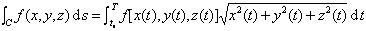

式中d<i>s</i>为弧的微分，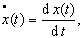等.这个积分与曲线<i>C</i>的方向无关.

&nbsp;&nbsp;&nbsp;&nbsp;&nbsp;&nbsp; [对坐标的曲线积分] &nbsp;若函数<i>P</i>=<i>P</i>(<i>x</i>,<i>y</i>,<i>z</i>),<i>Q</i>=<i>Q</i>(<i>x</i>,<i>y</i>,<i>z</i>),<i>R</i>=<i>R</i>(<i>x</i>,<i>y</i>,<i>z</i>)在光滑曲线C:

的各点上连续，这曲线的正方向为<i>t</i>增加的方向，则

&nbsp;&nbsp;&nbsp;&nbsp;&nbsp;&nbsp;
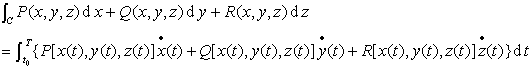

当曲线C的正向变更时，积分的符号改变.

&nbsp;&nbsp;&nbsp;&nbsp;&nbsp;&nbsp; [全微分的情形] &nbsp;若函数<i>P</i>=<i>P</i>(<i>x</i>,<i>y</i>,<i>z</i>),<i>Q</i>=<i>Q</i>(<i>x</i>,<i>y</i>,<i>z</i>),<i>R</i>=<i>R</i>(<i>x</i>,<i>y</i>,<i>z</i>)在区域<i>V</i>中的任一条光滑曲线<i>C</i>上连续，并且

&nbsp;&nbsp;&nbsp;&nbsp;&nbsp;&nbsp;

式中<i>u</i>=<i>u</i>(<i>x</i>,<i>y</i>,<i>z</i>)为区域<i>V</i>内的单值可微函数，则

&nbsp;&nbsp;&nbsp;&nbsp;&nbsp;&nbsp;
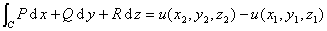

式中(<i>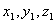</i>)为积分曲线<i>C</i>的始点，(<i>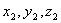</i>)为积分曲线<i>C</i>的终点.这说明在假定的条件下，积分值与曲线<i>C</i>的形状无关，只与曲线的始点和终点有关(图6.7).

&nbsp;&nbsp;&nbsp;&nbsp;&nbsp;&nbsp; 在单连通区域<i>V</i>内有连续的一阶偏导数的函数<i>P</i>,<i>Q</i>,<i>R</i>能表成全微分

&nbsp;&nbsp;&nbsp;&nbsp;&nbsp;&nbsp;&nbsp;&nbsp;&nbsp;&nbsp;&nbsp;&nbsp;&nbsp;
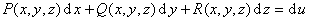

的充分必要条件是：在区域<i>V</i>内等式

&nbsp;&nbsp;&nbsp;&nbsp;&nbsp;&nbsp;&nbsp;&nbsp;&nbsp;&nbsp;&nbsp;&nbsp;&nbsp;&nbsp;&nbsp;&nbsp;&nbsp;&nbsp;&nbsp;&nbsp;
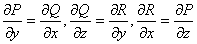

成立.这时函数<i>u</i>可按下面公式求得：

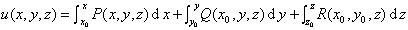

式中(<i>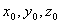</i>)为区域<i>V</i>内的某一固定点.

<table class=MsoNormalTable border=0 cellspacing=0 cellpadding=0 align=right
 hspace=0 vspace=0 height=190>
 <tr style='height:142.5pt'>
  <td valign=top style='padding:0mm 0mm 0mm 0mm;height:142.5pt'>
  
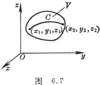

  </td>
 </tr>
</table>

&nbsp;&nbsp;&nbsp;&nbsp;&nbsp;&nbsp; [格林公式]

&nbsp;&nbsp;&nbsp;&nbsp;&nbsp;&nbsp; 1°曲线积分与二重积分的关系.设<i>C</i>为逐段光滑的简单（无自交点）闭曲线，围成单连通的有界区域<i>S</i>,这围线的方向使区域S保持在左边，若函数<i>P</i>(<i>x</i>,<i>y</i>),<i>Q</i>(<i>x</i>,<i>y</i>)及它们的一阶偏导数在<i>S</i>+<i>C</i>上连续，则有格林公式 ：

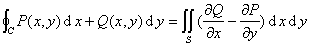

<table class=MsoNormalTable border=0 cellspacing=0 cellpadding=0 align=right
 hspace=0 vspace=0>
 <tr>
  <td valign=top style='padding:0mm 0mm 0mm 0mm'>
  
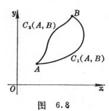

  </td>
 </tr>
</table>

&nbsp;&nbsp;&nbsp;&nbsp;&nbsp;&nbsp; 2° 曲线积分与积分线路的关系.若函数<i>P</i>,<i>Q</i>,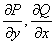 在区域<i>S</i>上连续，且

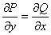

则沿<i>S</i>内的任一光滑闭曲线的积分为零，即

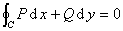

因而由<i>S</i>中的<i>A</i>到<i>B</i>的积分与线路无关（图6.8)，即

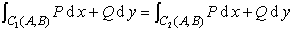

