

<h3 style='text-align:justify;text-justify:inter-ideograph'>三、&nbsp;&nbsp;&nbsp; 曲面积分</h3>

&nbsp;&nbsp;&nbsp;&nbsp;&nbsp;&nbsp; [对曲面面积的曲面积分]

&nbsp;&nbsp;&nbsp;&nbsp;&nbsp;&nbsp; 1° 若<i>S</i>为逐片光滑的双侧曲面*

&nbsp;&nbsp;&nbsp;&nbsp;&nbsp;&nbsp;&nbsp;&nbsp;&nbsp;&nbsp;&nbsp;&nbsp;&nbsp;&nbsp;&nbsp;&nbsp;&nbsp;&nbsp;&nbsp;&nbsp;
&nbsp;<i>z</i>=<i>z</i>(<i>x</i>,<i>y</i>)&nbsp;&nbsp; ((<i>x</i>,<i>y</i>))

式中<i>σ</i>为曲面<i>S</i>在<i>Oxy</i>坐标面上的投影，<i>z</i>(<i>x</i>,<i>y</i>)为单值连续可微函数，函数<i>f</i>(<i>x</i>,<i>y</i>,<i>z</i>)在曲面S的各点上有定义并连续，则

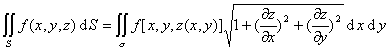

此积分与曲面<i>S</i>的方向（法线的方向）无关.

&nbsp;&nbsp;&nbsp;&nbsp;&nbsp;&nbsp; 2° 若曲面S由连续可微函数

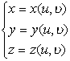&nbsp;&nbsp;
((<i>u</i>,<i>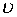</i>)∈<i>Ω</i>)

给定，则

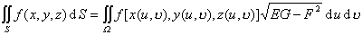

式中

&nbsp;&nbsp;&nbsp;&nbsp;&nbsp;&nbsp;&nbsp;&nbsp;&nbsp;&nbsp;&nbsp;&nbsp;&nbsp;
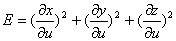

&nbsp;&nbsp;&nbsp;&nbsp;&nbsp;&nbsp;&nbsp;&nbsp;&nbsp;&nbsp;&nbsp;&nbsp;&nbsp;
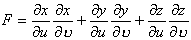

&nbsp;&nbsp;&nbsp;&nbsp;&nbsp;&nbsp;&nbsp;&nbsp;&nbsp;&nbsp;&nbsp;&nbsp;&nbsp;
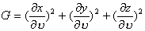

&nbsp;

&nbsp; * 曲面上某一点的法线方向的选定，唯一确定了曲面上所有其他点的法线方向，它们就是选定方向的

法线在曲面上连续移动（不经过曲面边缘）的指向，所以也就决定了曲面的一侧.如果改变原来选定

的法线方向，曲面上的所有其他点的法线方向都随着改变，曲面就从一侧移到另一侧.这种曲面称为

双侧曲面.

&nbsp;

&nbsp;&nbsp;&nbsp;&nbsp; [对坐标的曲面积分] &nbsp;若S为光滑的双侧曲面，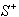为它的正面，即由法线方向<i>n</i>(cosα, cosβ,cos<i>γ</i>)所确定的一侧，<i>P</i>=<i>P</i>(<i>x</i>,<i>y</i>,<i>z</i>),<i>Q</i>=<i>Q</i>(<i>x</i>,<i>y</i>,<i>z</i>),<i>R</i>=<i>R</i>(<i>x</i>,<i>y</i>,<i>z</i>)为在曲面<i>S</i>上有定义并且连续的函数，则

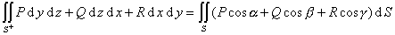

&nbsp;&nbsp;&nbsp;&nbsp;&nbsp;&nbsp; 若曲面<i>S</i>由连续可微函数

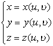&nbsp;&nbsp;&nbsp;&nbsp;
((<i>u</i>,)∈<i>Ω</i>)

给定，则

&nbsp;&nbsp;&nbsp;&nbsp;&nbsp;&nbsp;&nbsp;&nbsp;&nbsp;&nbsp;&nbsp;&nbsp;&nbsp;
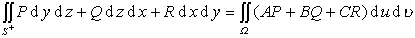

式中

&nbsp;&nbsp;&nbsp;&nbsp;&nbsp;&nbsp;&nbsp;&nbsp;&nbsp;&nbsp;&nbsp;&nbsp;&nbsp;
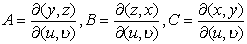

&nbsp;&nbsp;&nbsp;&nbsp;&nbsp;&nbsp; [斯托克斯公式] &nbsp;若<i>C</i>是包围逐片光滑有界双侧曲面<i>S</i>的逐段光滑简单闭曲线，<i>P</i>=<i>P</i>(<i>x</i>,<i>y</i>,<i>z</i>),<i>Q</i>=<i>Q</i>(<i>x</i>,<i>y</i>,<i>z</i>),<i>R</i>=<i>R</i>(<i>x</i>,<i>y</i>,<i>z</i>)是在<i>S</i>+<i>C</i>上连续可微函数，则

&nbsp;&nbsp;&nbsp;&nbsp;&nbsp;&nbsp;
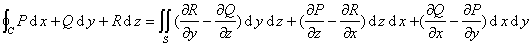

&nbsp;&nbsp;&nbsp;&nbsp;&nbsp;&nbsp; [高斯公式] &nbsp;若<i>S</i>为包含体积<i>V</i>的逐片光滑曲面<i>P</i>=<i>P</i>(<i>x</i>,<i>y</i>,<i>z</i>),<i>Q</i>=<i>Q</i>(<i>x</i>,<i>y</i>,<i>z</i>),<i>R</i>=<i>R</i>(<i>x</i>,<i>y</i>,<i>z</i>)及其一阶偏导数在<i>V</i>+<i>S</i>上连续，则有高斯公式：

&nbsp;&nbsp;&nbsp;&nbsp;&nbsp;&nbsp;&nbsp;&nbsp;&nbsp;&nbsp;&nbsp;&nbsp;&nbsp;
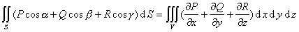

式中cos<i>α</i>,cos<i>β</i>,cos<i>γ</i>为曲面<i>S</i>的法线正方向的方向余弦.

