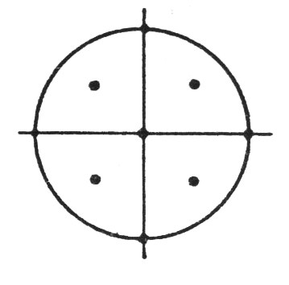
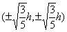
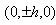
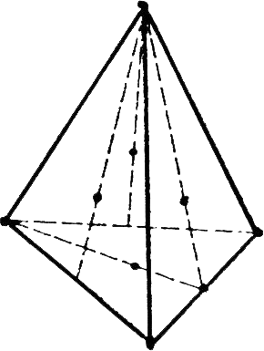
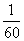
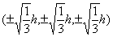

<h3 style='margin-left:36.0pt'>四、重积分、曲线积分与曲面积分的近似计算</h3>

&nbsp;&nbsp;&nbsp;&nbsp;&nbsp;&nbsp; [二重积分的近似计算公式]

&nbsp;&nbsp;&nbsp;&nbsp;&nbsp;&nbsp;&nbsp;&nbsp;&nbsp;&nbsp;&nbsp;&nbsp;&nbsp; 

式中对于不同的积分区域<i>Ω</i>选取不同的常数，是求积系数，<i>R</i>是余项.

&nbsp;&nbsp;&nbsp;&nbsp;&nbsp;&nbsp; <i>Ω</i>为圆形<i>C</i>: ≤ <i>Ac</i>=π

<table class=MsoNormalTable border=1 cellspacing=1 cellpadding=0 width=594
 style='width:445.5pt'>
 <tr>
  <td width="9%" valign=top style='width:9.0%;padding:5.25pt 5.25pt 5.25pt 5.25pt'>
  
<i>n</i> 

  </td>
  <td width="22%" valign=top style='width:22.0%;padding:5.25pt 5.25pt 5.25pt 5.25pt'>
  
图示 

  </td>
  <td width="27%" valign=top style='width:27.0%;padding:5.25pt 5.25pt 5.25pt 5.25pt'>
  

  </td>
  <td width="19%" valign=top style='width:19.0%;padding:5.25pt 5.25pt 5.25pt 5.25pt'>
  

  </td>
  <td width="22%" valign=top style='width:22.0%;padding:5.25pt 5.25pt 5.25pt 5.25pt'>
  
<i>R</i> 

  </td>
 </tr>
 <tr style='height:90.75pt'>
  <td width="9%" valign=top style='width:9.0%;padding:5.25pt 5.25pt 5.25pt 5.25pt;
  height:90.75pt'>
  
　

  
　

  
5 

  </td>
  <td width="22%" valign=top style='width:22.0%;padding:5.25pt 5.25pt 5.25pt 5.25pt;
  height:90.75pt'>
  

  </td>
  <td width="27%" valign=top style='width:27.0%;padding:5.25pt 5.25pt 5.25pt 5.25pt;
  height:90.75pt'>
  
(0,0)

  
(±<i>h</i>,0)

  
(0,±<i>h</i>) 

  </td>
  <td width="19%" valign=top style='width:19.0%;padding:5.25pt 5.25pt 5.25pt 5.25pt;
  height:90.75pt'>
  

  

  

  </td>
  <td width="22%" valign=top style='width:22.0%;padding:5.25pt 5.25pt 5.25pt 5.25pt;
  height:90.75pt'>
  
　

  
　

  

  </td>
 </tr>
 <tr>
  <td width="9%" valign=top style='width:9.0%;padding:5.25pt 5.25pt 5.25pt 5.25pt'>
  
　

  
　

  
4 

  </td>
  <td width="22%" valign=top style='width:22.0%;padding:5.25pt 5.25pt 5.25pt 5.25pt'>
  

  
　 

  </td>
  <td width="27%" valign=top style='width:27.0%;padding:5.25pt 5.25pt 5.25pt 5.25pt'>
  
　

  
　

  

  </td>
  <td width="19%" valign=top style='width:19.0%;padding:5.25pt 5.25pt 5.25pt 5.25pt'>
  
　

  

  </td>
  <td width="22%" valign=top style='width:22.0%;padding:5.25pt 5.25pt 5.25pt 5.25pt'>
  
　

  
　

  
　

  

  </td>
 </tr>
 <tr style='height:18.75pt'>
  <td width="9%" valign=top style='width:9.0%;padding:5.25pt 5.25pt 5.25pt 5.25pt;
  height:18.75pt'>
  
<i>n</i> 

  </td>
  <td width="22%" valign=top style='width:22.0%;padding:5.25pt 5.25pt 5.25pt 5.25pt;
  height:18.75pt'>
  
图示 

  </td>
  <td width="27%" valign=top style='width:27.0%;padding:5.25pt 5.25pt 5.25pt 5.25pt;
  height:18.75pt'>
  

  </td>
  <td width="19%" valign=top style='width:19.0%;padding:5.25pt 5.25pt 5.25pt 5.25pt;
  height:18.75pt'>
  

  </td>
  <td width="22%" valign=top style='width:22.0%;padding:5.25pt 5.25pt 5.25pt 5.25pt;
  height:18.75pt'>
  
<i>R</i> 

  </td>
 </tr>
 <tr style='height:99.0pt'>
  <td width="9%" valign=top style='width:9.0%;padding:5.25pt 5.25pt 5.25pt 5.25pt;
  height:99.0pt'>
  
　

  
7 

  </td>
  <td width="22%" valign=top style='width:22.0%;padding:5.25pt 5.25pt 5.25pt 5.25pt;
  height:99.0pt'>
  

  </td>
  <td width="27%" valign=top style='width:27.0%;padding:5.25pt 5.25pt 5.25pt 5.25pt;
  height:99.0pt'>
  
(0,0)

  
(±<i>h</i>,0)

  

  </td>
  <td width="19%" valign=top style='width:19.0%;padding:5.25pt 5.25pt 5.25pt 5.25pt;
  height:99.0pt'>
  

  

  

  </td>
  <td width="22%" valign=top style='width:22.0%;padding:5.25pt 5.25pt 5.25pt 5.25pt;
  height:99.0pt'>
  

  </td>
 </tr>
 <tr style='height:126.0pt'>
  <td width="9%" valign=top style='width:9.0%;padding:5.25pt 5.25pt 5.25pt 5.25pt;
  height:126.0pt'>
  
　

  
　

  
9 

  </td>
  <td width="22%" valign=top style='width:22.0%;padding:5.25pt 5.25pt 5.25pt 5.25pt;
  height:126.0pt'>
  

  </td>
  <td width="27%" valign=top style='width:27.0%;padding:5.25pt 5.25pt 5.25pt 5.25pt;
  height:126.0pt'>
  
(0,0)

  
(±<i>h</i>,0)

  
(0, ±<i>h</i>)

  

  </td>
  <td width="19%" valign=top style='width:19.0%;padding:5.25pt 5.25pt 5.25pt 5.25pt;
  height:126.0pt'>
  

  

  

  

  </td>
  <td width="22%" valign=top style='width:22.0%;padding:5.25pt 5.25pt 5.25pt 5.25pt;
  height:126.0pt'>
  
　

  
　

  

  </td>
 </tr>
 <tr style='height:117.75pt'>
  <td width="9%" valign=top style='width:9.0%;padding:5.25pt 5.25pt 5.25pt 5.25pt;
  height:117.75pt'>
  
　

  
　

  
　

  
7 

  </td>
  <td width="22%" valign=top style='width:22.0%;padding:5.25pt 5.25pt 5.25pt 5.25pt;
  height:117.75pt'>
  

  </td>
  <td width="27%" valign=top style='width:27.0%;padding:5.25pt 5.25pt 5.25pt 5.25pt;
  height:117.75pt'>
  
(0,0)

  
(±<i>h</i>,0)

  
(±<i>h</i>, ±<i>h</i>) 

  </td>
  <td width="19%" valign=top style='width:19.0%;padding:5.25pt 5.25pt 5.25pt 5.25pt;
  height:117.75pt'>
  

  

  

  </td>
  <td width="22%" valign=top style='width:22.0%;padding:5.25pt 5.25pt 5.25pt 5.25pt;
  height:117.75pt'>
  
　

  
　

  
　

  
　

  

  </td>
 </tr>
 <tr>
  <td width="9%" valign=top style='width:9.0%;padding:5.25pt 5.25pt 5.25pt 5.25pt'>
  
　

  
　

  
　

  
　

  
21 

  </td>
  <td width="22%" valign=top style='width:22.0%;padding:5.25pt 5.25pt 5.25pt 5.25pt'>
  
　

  
　

  

  </td>
  <td width="27%" valign=top style='width:27.0%;padding:5.25pt 5.25pt 5.25pt 5.25pt'>
  
(0,0)

  
(

  

  
(

  

  
<i>k</i>=1,2,…,10 

  </td>
  <td width="19%" valign=top style='width:19.0%;padding:5.25pt 5.25pt 5.25pt 5.25pt'>
  

  

  
　

  

  </td>
  <td width="22%" valign=top style='width:22.0%;padding:5.25pt 5.25pt 5.25pt 5.25pt'>
  
　

  
　

  
　

  
　

  

  </td>
 </tr>
</table>

&nbsp;&nbsp;&nbsp;&nbsp;&nbsp;&nbsp; <i>Ω</i>为正方形<i>S</i>: |<i>x</i>|≤<i>h</i>,|<i>y</i>|≤<i>h</i> , =4

<table class=MsoNormalTable border=1 cellspacing=1 cellpadding=0 width=604
 style='width:453.0pt'>
 <tr>
  <td width="11%" valign=top style='width:11.0%;padding:5.25pt 5.25pt 5.25pt 5.25pt'>
  
<i>n</i> 

  </td>
  <td width="23%" valign=top style='width:23.0%;padding:5.25pt 5.25pt 5.25pt 5.25pt'>
  
图示 

  </td>
  <td width="25%" valign=top style='width:25.0%;padding:5.25pt 5.25pt 5.25pt 5.25pt'>
  

  </td>
  <td width="19%" valign=top style='width:19.0%;padding:5.25pt 5.25pt 5.25pt 5.25pt'>
  

  </td>
  <td width="22%" valign=top style='width:22.0%;padding:5.25pt 5.25pt 5.25pt 5.25pt'>
  
<i>R</i> 

  </td>
 </tr>
 <tr>
  <td width="11%" valign=top style='width:11.0%;padding:5.25pt 5.25pt 5.25pt 5.25pt'>
  
　

  
　

  
9 

  </td>
  <td width="23%" valign=top style='width:23.0%;padding:5.25pt 5.25pt 5.25pt 5.25pt'>
  

  </td>
  <td width="25%" valign=top style='width:25.0%;padding:5.25pt 5.25pt 5.25pt 5.25pt'>
  
(0,0)

  
(±<i>h</i>,±<i>h</i>)

  
(±<i>h</i>,0)

  
(0, ±<i>h</i>)

  
　

  
　 

  </td>
  <td width="19%" valign=top style='width:19.0%;padding:5.25pt 5.25pt 5.25pt 5.25pt'>
  

  

  

  

  </td>
  <td width="22%" valign=top style='width:22.0%;padding:5.25pt 5.25pt 5.25pt 5.25pt'>
  
　

  
　

  

  </td>
 </tr>
 <tr style='height:14.25pt'>
  <td width="11%" valign=top style='width:11.0%;padding:5.25pt 5.25pt 5.25pt 5.25pt;
  height:14.25pt'>
  
<i>n</i> 

  </td>
  <td width="23%" valign=top style='width:23.0%;padding:5.25pt 5.25pt 5.25pt 5.25pt;
  height:14.25pt'>
  
图示 

  </td>
  <td width="25%" valign=top style='width:25.0%;padding:5.25pt 5.25pt 5.25pt 5.25pt;
  height:14.25pt'>
  

  </td>
  <td width="19%" valign=top style='width:19.0%;padding:5.25pt 5.25pt 5.25pt 5.25pt;
  height:14.25pt'>
  

  </td>
  <td width="22%" valign=top style='width:22.0%;padding:5.25pt 5.25pt 5.25pt 5.25pt;
  height:14.25pt'>
  
<i>R</i> 

  </td>
 </tr>
 <tr style='height:84.75pt'>
  <td width="11%" valign=top style='width:11.0%;padding:5.25pt 5.25pt 5.25pt 5.25pt;
  height:84.75pt'>
  
　

  
4 

  </td>
  <td width="23%" valign=top style='width:23.0%;padding:5.25pt 5.25pt 5.25pt 5.25pt;
  height:84.75pt'>
  

  </td>
  <td width="25%" valign=top style='width:25.0%;padding:5.25pt 5.25pt 5.25pt 5.25pt;
  height:84.75pt'>
  

  </td>
  <td width="19%" valign=top style='width:19.0%;padding:5.25pt 5.25pt 5.25pt 5.25pt;
  height:84.75pt'>
  

  </td>
  <td width="22%" valign=top style='width:22.0%;padding:5.25pt 5.25pt 5.25pt 5.25pt;
  height:84.75pt'>
  

  </td>
 </tr>
 <tr style='height:104.25pt'>
  <td width="11%" valign=top style='width:11.0%;padding:5.25pt 5.25pt 5.25pt 5.25pt;
  height:104.25pt'>
  
9 

  </td>
  <td width="23%" valign=top style='width:23.0%;padding:5.25pt 5.25pt 5.25pt 5.25pt;
  height:104.25pt'>
  

  </td>
  <td width="25%" valign=top style='width:25.0%;padding:5.25pt 5.25pt 5.25pt 5.25pt;
  height:104.25pt'>
  
(0,0)

  

  

  

  </td>
  <td width="19%" valign=top style='width:19.0%;padding:5.25pt 5.25pt 5.25pt 5.25pt;
  height:104.25pt'>
  

  

  

  

  </td>
  <td width="22%" valign=top style='width:22.0%;padding:5.25pt 5.25pt 5.25pt 5.25pt;
  height:104.25pt'>
  
　

  
　

  

  </td>
 </tr>
</table>

&nbsp;&nbsp;&nbsp;&nbsp;&nbsp;&nbsp; <i>Ω</i>为正三角形<i>T</i>: 外接圆半径为<i>h</i>，

<table class=MsoNormalTable border=1 cellspacing=1 cellpadding=0 width=602
 style='width:451.5pt'>
 <tr>
  <td width="9%" valign=top style='width:9.0%;padding:5.25pt 5.25pt 5.25pt 5.25pt'>
  
<i>n</i> 

  </td>
  <td width="22%" valign=top style='width:22.0%;padding:5.25pt 5.25pt 5.25pt 5.25pt'>
  
图示 

  </td>
  <td width="27%" valign=top style='width:27.0%;padding:5.25pt 5.25pt 5.25pt 5.25pt'>
  

  </td>
  <td width="19%" valign=top style='width:19.0%;padding:5.25pt 5.25pt 5.25pt 5.25pt'>
  

  </td>
  <td width="23%" valign=top style='width:23.0%;padding:5.25pt 5.25pt 5.25pt 5.25pt'>
  
<i>R</i> 

  </td>
 </tr>
 <tr>
  <td width="9%" valign=top style='width:9.0%;padding:5.25pt 5.25pt 5.25pt 5.25pt'>
  
　

  
　

  
4 

  </td>
  <td width="22%" valign=top style='width:22.0%;padding:5.25pt 5.25pt 5.25pt 5.25pt'>
  

  </td>
  <td width="27%" valign=top style='width:27.0%;padding:5.25pt 5.25pt 5.25pt 5.25pt'>
  
(0,0)

  
(<i>h</i>,0)

  

  </td>
  <td width="19%" valign=top style='width:19.0%;padding:5.25pt 5.25pt 5.25pt 5.25pt'>
  

  

  

  </td>
  <td width="23%" valign=top style='width:23.0%;padding:5.25pt 5.25pt 5.25pt 5.25pt'>
  
　

  
　

  

  </td>
 </tr>
 <tr>
  <td width="9%" valign=top style='width:9.0%;padding:5.25pt 5.25pt 5.25pt 5.25pt'>
  
　

  
　

  
　

  
7 

  </td>
  <td width="22%" valign=top style='width:22.0%;padding:5.25pt 5.25pt 5.25pt 5.25pt'>
  
　

  

  </td>
  <td width="27%" valign=top style='width:27.0%;padding:5.25pt 5.25pt 5.25pt 5.25pt'>
  
(0,0)

  

  

  

  

  </td>
  <td width="19%" valign=top style='width:19.0%;padding:5.25pt 5.25pt 5.25pt 5.25pt'>
  

  

  

  

  

  </td>
  <td width="23%" valign=top style='width:23.0%;padding:5.25pt 5.25pt 5.25pt 5.25pt'>
  
　

  
　

  
　

  

  </td>
 </tr>
 <tr>
  <td width="9%" valign=top style='width:9.0%;padding:5.25pt 5.25pt 5.25pt 5.25pt'>
  
　

  
　

  
　

  
　

  
　

  
　

  
　

  
7 

  </td>
  <td width="22%" valign=top style='width:22.0%;padding:5.25pt 5.25pt 5.25pt 5.25pt'>
  
　

  
　

  
　

  

  </td>
  <td width="27%" valign=top style='width:27.0%;padding:5.25pt 5.25pt 5.25pt 5.25pt'>
  

  </td>
  <td width="19%" valign=top style='width:19.0%;padding:5.25pt 5.25pt 5.25pt 5.25pt'>
  

  </td>
  <td width="23%" valign=top style='width:23.0%;padding:5.25pt 5.25pt 5.25pt 5.25pt'>
  
　

  
　

  
　

  
　

  
　

  
　

  
　

  

  </td>
 </tr>
</table>

&nbsp;&nbsp;&nbsp;&nbsp;&nbsp;&nbsp; 

<i>Ω</i>为正六边形<i>H</i>: 外接半径为<i>h</i>，

<table class=MsoNormalTable border=1 cellspacing=1 cellpadding=0 width=600
 style='width:450.0pt'>
 <tr>
  <td width="9%" valign=top style='width:9.0%;padding:5.25pt 5.25pt 5.25pt 5.25pt'>
  
<i>n</i> 

  </td>
  <td width="22%" valign=top style='width:22.0%;padding:5.25pt 5.25pt 5.25pt 5.25pt'>
  
图示 

  </td>
  <td width="27%" valign=top style='width:27.0%;padding:5.25pt 5.25pt 5.25pt 5.25pt'>
  

  </td>
  <td width="19%" valign=top style='width:19.0%;padding:5.25pt 5.25pt 5.25pt 5.25pt'>
  

  </td>
  <td width="23%" valign=top style='width:23.0%;padding:5.25pt 5.25pt 5.25pt 5.25pt'>
  
<i>R</i> 

  </td>
 </tr>
 <tr>
  <td width="9%" valign=top style='width:9.0%;padding:5.25pt 5.25pt 5.25pt 5.25pt'>
  
　

  
　

  
7 

  </td>
  <td width="22%" valign=top style='width:22.0%;padding:5.25pt 5.25pt 5.25pt 5.25pt'>
  

  </td>
  <td width="27%" valign=top style='width:27.0%;padding:5.25pt 5.25pt 5.25pt 5.25pt'>
  
(0,0)

  

  
(<i>h</i>,0) 

  </td>
  <td width="19%" valign=top style='width:19.0%;padding:5.25pt 5.25pt 5.25pt 5.25pt'>
  

  

  

  </td>
  <td width="23%" valign=top style='width:23.0%;padding:5.25pt 5.25pt 5.25pt 5.25pt'>
  
　

  
　

  

  </td>
 </tr>
 <tr>
  <td width="9%" valign=top style='width:9.0%;padding:5.25pt 5.25pt 5.25pt 5.25pt'>
  
　

  
　

  
7 

  </td>
  <td width="22%" valign=top style='width:22.0%;padding:5.25pt 5.25pt 5.25pt 5.25pt'>
  

  </td>
  <td width="27%" valign=top style='width:27.0%;padding:5.25pt 5.25pt 5.25pt 5.25pt'>
  
(0,0)

  

  

  </td>
  <td width="19%" valign=top style='width:19.0%;padding:5.25pt 5.25pt 5.25pt 5.25pt'>
  

  

  

  </td>
  <td width="23%" valign=top style='width:23.0%;padding:5.25pt 5.25pt 5.25pt 5.25pt'>
  
　

  
　

  

  </td>
 </tr>
</table>

&nbsp;&nbsp;&nbsp;&nbsp;&nbsp;&nbsp; [三重积分的近似计算公式]

&nbsp;&nbsp;&nbsp;&nbsp;&nbsp;&nbsp;&nbsp;&nbsp;&nbsp;&nbsp;&nbsp;&nbsp;&nbsp; 

式中对于不同的积分区域<i>V</i>选取不同的常数，是求积系数，<i>R</i>是余项.

&nbsp;&nbsp;&nbsp;&nbsp;&nbsp;&nbsp; <i>V</i>为球体 

<table class=MsoNormalTable border=1 cellspacing=1 cellpadding=0 width=608
 style='width:456.0pt'>
 <tr>
  <td width="9%" valign=top style='width:9.0%;padding:5.25pt 5.25pt 5.25pt 5.25pt'>
  
<i>n</i> 

  </td>
  <td width="22%" valign=top style='width:22.0%;padding:5.25pt 5.25pt 5.25pt 5.25pt'>
  
图示 

  </td>
  <td width="26%" valign=top style='width:26.0%;padding:5.25pt 5.25pt 5.25pt 5.25pt'>
  

  </td>
  <td width="18%" valign=top style='width:18.0%;padding:5.25pt 5.25pt 5.25pt 5.25pt'>
  

  </td>
  <td width="24%" valign=top style='width:24.0%;padding:5.25pt 5.25pt 5.25pt 5.25pt'>
  
<i>R</i> 

  </td>
 </tr>
 <tr>
  <td width="9%" valign=top style='width:9.0%;padding:5.25pt 5.25pt 5.25pt 5.25pt'>
  
　

  
　

  
7 

  </td>
  <td width="22%" valign=top style='width:22.0%;padding:5.25pt 5.25pt 5.25pt 5.25pt'>
  

  </td>
  <td width="26%" valign=top style='width:26.0%;padding:5.25pt 5.25pt 5.25pt 5.25pt'>
  
(0,0,0)

  

  

  

  </td>
  <td width="18%" valign=top style='width:18.0%;padding:5.25pt 5.25pt 5.25pt 5.25pt'>
  

  

  

  

  </td>
  <td width="24%" valign=top style='width:24.0%;padding:5.25pt 5.25pt 5.25pt 5.25pt'>
  
　

  
　

  

  </td>
 </tr>
</table>

&nbsp;&nbsp;&nbsp;&nbsp;&nbsp;&nbsp; <i>V</i>为立方体<i>C</i>: <i>|x|</i>≤<i>h</i>,|<i>y</i>|≤<i>h,|z|</i>≤<i>h.</i> =8

<table class=MsoNormalTable border=1 cellspacing=1 cellpadding=0 width=611
 style='width:458.25pt'>
 <tr>
  <td width="9%" valign=top style='width:9.0%;padding:5.25pt 5.25pt 5.25pt 5.25pt'>
  
<i>n</i> 

  </td>
  <td width="22%" valign=top style='width:22.0%;padding:5.25pt 5.25pt 5.25pt 5.25pt'>
  
图示 

  </td>
  <td width="26%" valign=top style='width:26.0%;padding:5.25pt 5.25pt 5.25pt 5.25pt'>
  

  </td>
  <td width="18%" valign=top style='width:18.0%;padding:5.25pt 5.25pt 5.25pt 5.25pt'>
  

  </td>
  <td width="24%" valign=top style='width:24.0%;padding:5.25pt 5.25pt 5.25pt 5.25pt'>
  
<i>R</i> 

  </td>
 </tr>
 <tr>
  <td width="9%" valign=top style='width:9.0%;padding:5.25pt 5.25pt 5.25pt 5.25pt'>
  
　

  
　

  
6 

  </td>
  <td width="22%" valign=top style='width:22.0%;padding:5.25pt 5.25pt 5.25pt 5.25pt'>
  
　

  

  </td>
  <td width="26%" valign=top style='width:26.0%;padding:5.25pt 5.25pt 5.25pt 5.25pt'>
  

  
&nbsp;

  

  
&nbsp;

  

  </td>
  <td width="18%" valign=top style='width:18.0%;padding:5.25pt 5.25pt 5.25pt 5.25pt'>
  

  

  

  </td>
  <td width="24%" valign=top style='width:24.0%;padding:5.25pt 5.25pt 5.25pt 5.25pt'>
  
　

  
　

  

  </td>
 </tr>
 <tr>
  <td width="9%" valign=top style='width:9.0%;padding:5.25pt 5.25pt 5.25pt 5.25pt'>
  
　

  
　

  
21 

  </td>
  <td width="22%" valign=top style='width:22.0%;padding:5.25pt 5.25pt 5.25pt 5.25pt'>
  

  </td>
  <td width="26%" valign=top style='width:26.0%;padding:5.25pt 5.25pt 5.25pt 5.25pt'>
  
(0,0,0)

  
中心到6个面的距离的6个中点

  
6个面的中心

  
8个顶点 

  </td>
  <td width="18%" valign=top style='width:18.0%;padding:5.25pt 5.25pt 5.25pt 5.25pt'>
  

  </td>
  <td width="24%" valign=top style='width:24.0%;padding:5.25pt 5.25pt 5.25pt 5.25pt'>
  
　

  
　

  

  </td>
 </tr>
 <tr style='height:17.25pt'>
  <td width="9%" valign=top style='width:9.0%;padding:5.25pt 5.25pt 5.25pt 5.25pt;
  height:17.25pt'>
  
<i>n</i> 

  </td>
  <td width="22%" valign=top style='width:22.0%;padding:5.25pt 5.25pt 5.25pt 5.25pt;
  height:17.25pt'>
  
图示 

  </td>
  <td width="26%" valign=top style='width:26.0%;padding:5.25pt 5.25pt 5.25pt 5.25pt;
  height:17.25pt'>
  

  </td>
  <td width="18%" valign=top style='width:18.0%;padding:5.25pt 5.25pt 5.25pt 5.25pt;
  height:17.25pt'>
  

  </td>
  <td width="24%" valign=top style='width:24.0%;padding:5.25pt 5.25pt 5.25pt 5.25pt;
  height:17.25pt'>
  
<i>R</i> 

  </td>
 </tr>
 <tr style='height:132.0pt'>
  <td width="9%" valign=top style='width:9.0%;padding:5.25pt 5.25pt 5.25pt 5.25pt;
  height:132.0pt'>
  
　

  
42 

  </td>
  <td width="22%" valign=top style='width:22.0%;padding:5.25pt 5.25pt 5.25pt 5.25pt;
  height:132.0pt'>
  

  </td>
  <td width="26%" valign=top style='width:26.0%;padding:5.25pt 5.25pt 5.25pt 5.25pt;
  height:132.0pt'>
  
6个面的中心

  
12个棱的中点

  
每个面的对角线上到每个面中心距离为的4个点（共

  
24点） 

  </td>
  <td width="18%" valign=top style='width:18.0%;padding:5.25pt 5.25pt 5.25pt 5.25pt;
  height:132.0pt'>
  

  

  

  </td>
  <td width="24%" valign=top style='width:24.0%;padding:5.25pt 5.25pt 5.25pt 5.25pt;
  height:132.0pt'>
  
　

  

  </td>
 </tr>
</table>

&nbsp;&nbsp;&nbsp;&nbsp;&nbsp;&nbsp; <i>Ω</i>为四面体<i>T</i>.为四面体体积

<table class=MsoNormalTable border=1 cellspacing=1 cellpadding=0 width=610
 style='width:457.5pt'>
 <tr>
  <td width="9%" valign=top style='width:9.0%;padding:5.25pt 5.25pt 5.25pt 5.25pt'>
  
<i>n</i> 

  </td>
  <td width="22%" valign=top style='width:22.0%;padding:5.25pt 5.25pt 5.25pt 5.25pt'>
  
图示 

  </td>
  <td width="26%" valign=top style='width:26.0%;padding:5.25pt 5.25pt 5.25pt 5.25pt'>
  

  </td>
  <td width="18%" valign=top style='width:18.0%;padding:5.25pt 5.25pt 5.25pt 5.25pt'>
  

  </td>
  <td width="24%" valign=top style='width:24.0%;padding:5.25pt 5.25pt 5.25pt 5.25pt'>
  
<i>R</i> 

  </td>
 </tr>
 <tr style='height:236.25pt'>
  <td width="9%" valign=top style='width:9.0%;padding:5.25pt 5.25pt 5.25pt 5.25pt;
  height:236.25pt'>
  
　

  
　

  
8

  
　

  
　

  
　

  
　

  
　

  
　

  
　

  
　

  
11 

  </td>
  <td width="22%" valign=top style='width:22.0%;padding:5.25pt 5.25pt 5.25pt 5.25pt;
  height:236.25pt'>
  

  

  </td>
  <td width="26%" valign=top style='width:26.0%;padding:5.25pt 5.25pt 5.25pt 5.25pt;
  height:236.25pt'>
  
4个顶点

  
4个面的重心

  
　

  
　

  
　

  
　

  
　

  
<i>T</i>的重心

  
4个顶点

  
6个棱的中点 

  </td>
  <td width="18%" valign=top style='width:18.0%;padding:5.25pt 5.25pt 5.25pt 5.25pt;
  height:236.25pt'>
  

  

  
　

  
　

  
　

  
　

  
　

  

  

  

  </td>
  <td width="24%" valign=top style='width:24.0%;padding:5.25pt 5.25pt 5.25pt 5.25pt;
  height:236.25pt'>
  
　

  
　

  
　

  
　

  
　

  
　

  
　 

  </td>
 </tr>
</table>

　

&nbsp;&nbsp;&nbsp;&nbsp;&nbsp;&nbsp; [曲线积分的近似计算公式]

&nbsp;&nbsp;&nbsp;&nbsp;&nbsp;&nbsp; 圆周：上的曲线积分

&nbsp;&nbsp;&nbsp;&nbsp;&nbsp;&nbsp; 

&nbsp;&nbsp;&nbsp;&nbsp;&nbsp;&nbsp; [曲面积分的近似计算公式]

&nbsp;&nbsp;&nbsp;&nbsp;&nbsp;&nbsp; 球面：上的曲面积分

&nbsp;&nbsp;&nbsp;&nbsp;&nbsp;&nbsp; 

<table class=MsoNormalTable border=1 cellspacing=1 cellpadding=0 width=569
 style='width:426.75pt'>
 <tr>
  <td width="10%" valign=top style='width:10.0%;padding:5.25pt 5.25pt 5.25pt 5.25pt'>
  
<i>n</i> 

  </td>
  <td width="23%" valign=top style='width:23.0%;padding:5.25pt 5.25pt 5.25pt 5.25pt'>
  
图示 

  </td>
  <td width="28%" valign=top style='width:28.0%;padding:5.25pt 5.25pt 5.25pt 5.25pt'>
  

  </td>
  <td width="20%" valign=top style='width:20.0%;padding:5.25pt 5.25pt 5.25pt 5.25pt'>
  

  </td>
  <td width="19%" valign=top style='width:19.0%;padding:5.25pt 5.25pt 5.25pt 5.25pt'>
  
<i>R</i> 

  </td>
 </tr>
 <tr>
  <td width="10%" valign=top style='width:10.0%;padding:5.25pt 5.25pt 5.25pt 5.25pt'>
  
　

  
　

  
6

  
　

  
　

  
　

  
　 

  </td>
  <td width="23%" valign=top style='width:23.0%;padding:5.25pt 5.25pt 5.25pt 5.25pt'>
  

  </td>
  <td width="28%" valign=top style='width:28.0%;padding:5.25pt 5.25pt 5.25pt 5.25pt'>
  

  
&nbsp;

  

  
&nbsp;

  

  
　

  
　

  
　 

  </td>
  <td width="20%" valign=top style='width:20.0%;padding:5.25pt 5.25pt 5.25pt 5.25pt'>
  

  

  

  </td>
  <td width="19%" valign=top style='width:19.0%;padding:5.25pt 5.25pt 5.25pt 5.25pt'>
  
　

  
　

  

  </td>
 </tr>
 <tr style='height:14.25pt'>
  <td width="10%" valign=top style='width:10.0%;padding:5.25pt 5.25pt 5.25pt 5.25pt;
  height:14.25pt'>
  
<i>n</i> 

  </td>
  <td width="23%" valign=top style='width:23.0%;padding:5.25pt 5.25pt 5.25pt 5.25pt;
  height:14.25pt'>
  
图示 

  </td>
  <td width="28%" valign=top style='width:28.0%;padding:5.25pt 5.25pt 5.25pt 5.25pt;
  height:14.25pt'>
  

  </td>
  <td width="20%" valign=top style='width:20.0%;padding:5.25pt 5.25pt 5.25pt 5.25pt;
  height:14.25pt'>
  

  </td>
  <td width="19%" valign=top style='width:19.0%;padding:5.25pt 5.25pt 5.25pt 5.25pt;
  height:14.25pt'>
  
<i>R</i> 

  </td>
 </tr>
 <tr style='height:185.25pt'>
  <td width="10%" valign=top style='width:10.0%;padding:5.25pt 5.25pt 5.25pt 5.25pt;
  height:185.25pt'>
  
　

  
　

  
　

  
　

  
18 

  </td>
  <td width="23%" valign=top style='width:23.0%;padding:5.25pt 5.25pt 5.25pt 5.25pt;
  height:185.25pt'>
  

  </td>
  <td width="28%" valign=top style='width:28.0%;padding:5.25pt 5.25pt 5.25pt 5.25pt;
  height:185.25pt'>
  

  

  

  

  

  
&nbsp;

  

  </td>
  <td width="20%" valign=top style='width:20.0%;padding:5.25pt 5.25pt 5.25pt 5.25pt;
  height:185.25pt'>
  

  

  

  

  

  

  </td>
  <td width="19%" valign=top style='width:19.0%;padding:5.25pt 5.25pt 5.25pt 5.25pt;
  height:185.25pt'>
  
　

  
　

  
　

  
　

  

  </td>
 </tr>
 <tr>
  <td width="10%" valign=top style='width:10.0%;padding:5.25pt 5.25pt 5.25pt 5.25pt'>
  
　

  
　

  
26 

  </td>
  <td width="23%" valign=top style='width:23.0%;padding:5.25pt 5.25pt 5.25pt 5.25pt'>
  

  </td>
  <td width="28%" valign=top style='width:28.0%;padding:5.25pt 5.25pt 5.25pt 5.25pt'>
  

  

  

  

  

  

  
&nbsp;

  

  </td>
  <td width="20%" valign=top style='width:20.0%;padding:5.25pt 5.25pt 5.25pt 5.25pt'>
  

  

  

  

  

  

  

  </td>
  <td width="19%" valign=top style='width:19.0%;padding:5.25pt 5.25pt 5.25pt 5.25pt'>
  
　

  
　

  

  </td>
 </tr>
</table>

&nbsp;

