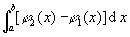

<h2 align=center style='text-align:center'>§3 积分的应用</h2>
<h3>一、求面积 </h3>

&nbsp;&nbsp;&nbsp;&nbsp;&nbsp;&nbsp; [平面图形面积计算公式]

<table class=MsoNormalTable border=1 cellspacing=1 cellpadding=0 width=607
 style='width:455.25pt'>
 <tr>
  <td width="38%" valign=top style='width:38.0%;padding:5.25pt 5.25pt 5.25pt 5.25pt'>
  
图 形 

  </td>
  <td width="62%" valign=top style='width:62.0%;padding:5.25pt 5.25pt 5.25pt 5.25pt'>
  
面 积 <i>S</i> 

  </td>
 </tr>
 <tr style='height:221.25pt'>
  <td width="38%" valign=top style='width:38.0%;padding:5.25pt 5.25pt 5.25pt 5.25pt;
  height:221.25pt'>
  

  
曲边梯形

  

  </td>
  <td width="62%" valign=top style='width:62.0%;padding:5.25pt 5.25pt 5.25pt 5.25pt;
  height:221.25pt'>
  
　

  

  
　

  
　

  
　

  
　　

  

  
　 

  </td>
 </tr>
 <tr style='height:81.0pt'>
  <td width="38%" valign=top style='width:38.0%;padding:5.25pt 5.25pt 5.25pt 5.25pt;
  height:81.0pt'>
  
扇形

  

  </td>
  <td width="62%" valign=top style='width:62.0%;padding:5.25pt 5.25pt 5.25pt 5.25pt;
  height:81.0pt'>
  
　

  

  </td>
 </tr>
 <tr style='height:97.5pt'>
  <td width="38%" valign=top style='width:38.0%;padding:5.25pt 5.25pt 5.25pt 5.25pt;
  height:97.5pt'>
  

  </td>
  <td width="62%" valign=top style='width:62.0%;padding:5.25pt 5.25pt 5.25pt 5.25pt;
  height:97.5pt'>
  

  </td>
 </tr>
 <tr>
  <td width="38%" valign=top style='width:38.0%;padding:5.25pt 5.25pt 5.25pt 5.25pt'>
  

  </td>
  <td width="62%" valign=top style='width:62.0%;padding:5.25pt 5.25pt 5.25pt 5.25pt'>
  
<i>S</i>=

  
或 <i>S</i>=2

  
式中表示上的曲线方程，<i>s</i>表示上的曲线的长度，d<i>s</i>为弧的微分，为曲线重心

  
G到旋转轴的距离. 

  </td>
 </tr>
 <tr style='height:375.0pt'>
  <td width="38%" valign=top style='width:38.0%;padding:5.25pt 5.25pt 5.25pt 5.25pt;
  height:375.0pt'>
  

  
曲面

  

  
在的区域上

  
&nbsp;

  

  
柱面夹在曲面和平面之间

  
　 

  </td>
  <td width="62%" valign=top style='width:62.0%;padding:5.25pt 5.25pt 5.25pt 5.25pt;
  height:375.0pt'>
  
　

  

  
&nbsp;

  

  
式中<i>C</i>为柱面的准线，d<i>s</i>为曲线<i>C</i>(<i>A,B</i>)上的弧的微

  
分 .

  
　 

  </td>
 </tr>
</table>

&nbsp;

