

<h3>二、求体积 </h3>
<table class=MsoNormalTable border=1 cellpadding=0 width=607 style='width:455.25pt;
 border:outset black 1.0pt'>
 <tr>
  <td width="38%" valign=top style='width:38.0%;border:inset black 1.0pt;
  padding:5.25pt 5.25pt 5.25pt 5.25pt'>
  
图 形 

  </td>
  <td width="62%" valign=top style='width:62.0%;border:inset black 1.0pt;
  padding:5.25pt 5.25pt 5.25pt 5.25pt'>
  
体 积<i>V</i> 

  </td>
 </tr>
 <tr style='height:236.25pt'>
  <td width="38%" valign=top style='width:38.0%;border:inset black 1.0pt;
  padding:5.25pt 5.25pt 5.25pt 5.25pt;height:236.25pt'>
  
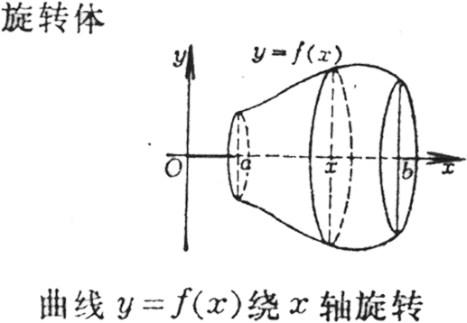

  
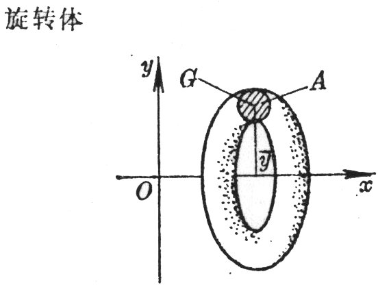

  </td>
  <td width="62%" valign=top style='width:62.0%;border:inset black 1.0pt;
  padding:5.25pt 5.25pt 5.25pt 5.25pt;height:236.25pt'>
  
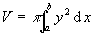

  
式中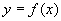为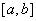上的曲线方程

  
　

  
　

  
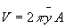

  
式中<i>A</i>为所旋转的平面图形的面积，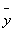为该平面图形重心<i>G</i>到旋转轴（<i>x</i>轴）的距离，此公式对计算环状体积较为方便.重心求法见本节，四 

  </td>
 </tr>
 <tr style='height:103.5pt'>
  <td width="38%" valign=top style='width:38.0%;border:inset black 1.0pt;
  padding:5.25pt 5.25pt 5.25pt 5.25pt;height:103.5pt'>
  
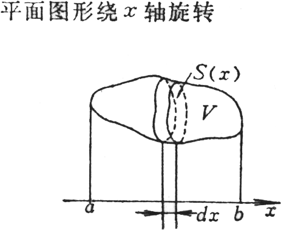

  </td>
  <td width="62%" valign=top style='width:62.0%;border:inset black 1.0pt;
  padding:5.25pt 5.25pt 5.25pt 5.25pt;height:103.5pt'>
  
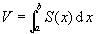

  
式中<i>S</i>(<i>x</i>)为垂直于<i>x</i>轴的截面面积 

  </td>
 </tr>
 <tr style='height:97.5pt'>
  <td width="38%" valign=top style='width:38.0%;border:inset black 1.0pt;
  padding:5.25pt 5.25pt 5.25pt 5.25pt;height:97.5pt'>
  
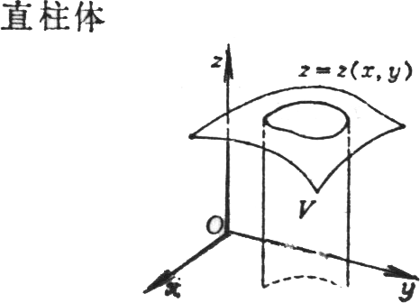

  
在曲面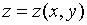与区域

  
之间 

  </td>
  <td width="62%" valign=top style='width:62.0%;border:inset black 1.0pt;
  padding:5.25pt 5.25pt 5.25pt 5.25pt;height:97.5pt'>
  
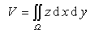

  </td>
 </tr>
 <tr style='height:162.75pt'>
  <td width="38%" valign=top style='width:38.0%;border:inset black 1.0pt;
  padding:5.25pt 5.25pt 5.25pt 5.25pt;height:162.75pt'>
  
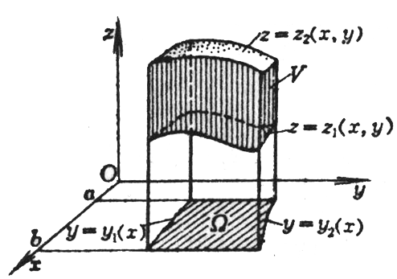

  
空间区域<i>V</i>由下列曲面围成：

  
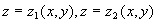（曲面)

  
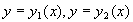（直柱面）

  
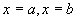（平面） 

  </td>
  <td width="62%" valign=top style='width:62.0%;border:inset black 1.0pt;
  padding:5.25pt 5.25pt 5.25pt 5.25pt;height:162.75pt'>
  
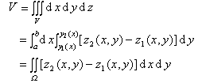

  
式中为<i>Oxy</i>平面上的区域，它由曲线 ，围成 

  </td>
 </tr>
</table>

　

