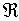

三<i>、</i><i>n</i>维空间中凸体体积公式

&nbsp;&nbsp;&nbsp;&nbsp;&nbsp;&nbsp; <i>n</i>维空间的点的坐标为().所谓<i>n</i>维空间中的凸体，是指中任意两点<i>A</i>和<i>B</i>的连线仍在中，即设<i>A</i>=<i>B</i>=,若<i>A</i>,<i>B</i>∈，则点.其中

&nbsp;&nbsp;&nbsp;&nbsp;&nbsp;&nbsp;&nbsp;&nbsp;&nbsp;&nbsp;&nbsp;&nbsp;&nbsp;&nbsp;&nbsp;&nbsp;&nbsp;&nbsp;&nbsp;&nbsp; &nbsp;, <i>i</i>=1,2,…,<i>n</i>

&nbsp;&nbsp;&nbsp;&nbsp;&nbsp;&nbsp; 下面列出几种凸体体积的计算公式.

&nbsp;&nbsp;&nbsp;&nbsp;&nbsp;&nbsp; [单纯形] 已知<i>n</i>维空间中的<i>n</i>+1个点，包含这<i>n</i>+1个点的最小凸体称为由张成的单纯形，记作，若设的<i>n</i>个坐标为

&nbsp;&nbsp;&nbsp;&nbsp;&nbsp;&nbsp;&nbsp;&nbsp;&nbsp;&nbsp;&nbsp;&nbsp;&nbsp;&nbsp;&nbsp;&nbsp;&nbsp;&nbsp;&nbsp;&nbsp; () <i>i</i>=1,2,…,<i>n</i>+1

则单纯形的体积

&nbsp;&nbsp;&nbsp;&nbsp;&nbsp;&nbsp;&nbsp;&nbsp;&nbsp;&nbsp;&nbsp;&nbsp;&nbsp;&nbsp;&nbsp;&nbsp;&nbsp;&nbsp;&nbsp;&nbsp; 

<i>n</i>=2时为三角形，<i>n</i>=3时为四面体.

&nbsp;&nbsp;&nbsp;&nbsp;&nbsp;&nbsp; [超立方体]

&nbsp;&nbsp;&nbsp;&nbsp;&nbsp;&nbsp;&nbsp;&nbsp;&nbsp;&nbsp;&nbsp;&nbsp;&nbsp;&nbsp;&nbsp;&nbsp;&nbsp;&nbsp;&nbsp;&nbsp; :
|
|≤,
<i>i</i>=1,2,…,<i>n</i>

&nbsp;&nbsp;&nbsp;&nbsp;&nbsp;&nbsp;&nbsp;&nbsp;&nbsp;&nbsp;&nbsp;&nbsp;&nbsp;&nbsp;&nbsp;&nbsp;&nbsp;&nbsp;&nbsp;&nbsp; <i>V</i>=

&nbsp;&nbsp;&nbsp;&nbsp;&nbsp;&nbsp; [广义八面体]

&nbsp;&nbsp;&nbsp;&nbsp;&nbsp;&nbsp; 1°1:≤<i>r</i>, &gt;0, <i>i</i>=1,2,…,<i>n</i>

&nbsp;&nbsp;&nbsp;&nbsp;&nbsp;&nbsp; 2°2:≤<i>r</i>, &gt;0, &gt;0，<i>i</i>=1,2,…,<i>n-</i>1

&nbsp;&nbsp;&nbsp;&nbsp;&nbsp;&nbsp;&nbsp;&nbsp;&nbsp;&nbsp;&nbsp;&nbsp;&nbsp; 

&nbsp;&nbsp;&nbsp;&nbsp;&nbsp;&nbsp; [<i>n</i>维球体]

&nbsp;&nbsp;&nbsp;&nbsp;&nbsp;&nbsp;&nbsp;&nbsp;&nbsp;&nbsp;&nbsp;&nbsp;&nbsp; :

&nbsp;&nbsp;&nbsp;&nbsp;&nbsp;&nbsp;&nbsp;&nbsp;&nbsp;&nbsp;&nbsp;&nbsp;&nbsp; 

[凸体的线形变换] 设有线性变换

&nbsp;&nbsp;&nbsp;&nbsp;&nbsp;&nbsp;&nbsp;&nbsp;&nbsp;&nbsp;&nbsp;&nbsp;&nbsp;&nbsp;&nbsp;&nbsp;&nbsp;&nbsp;&nbsp;&nbsp; = , <i>i</i>=1,2,…,<i>n</i>

&nbsp;&nbsp;&nbsp;&nbsp;&nbsp;&nbsp;&nbsp;&nbsp;&nbsp;&nbsp;&nbsp;&nbsp;&nbsp;&nbsp;&nbsp;&nbsp;&nbsp;&nbsp;&nbsp;&nbsp; <i>J</i>=det(<i>dij</i>)≠0

将凸体<i>R</i>映成，则的体积为

这里为该线性变换的雅可比式.

