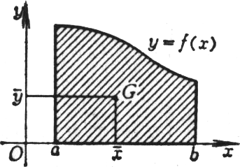
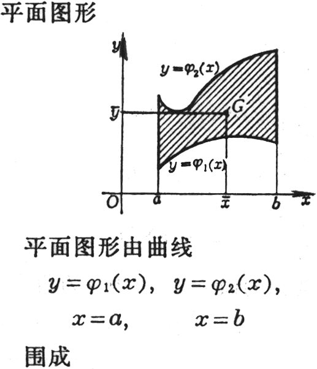
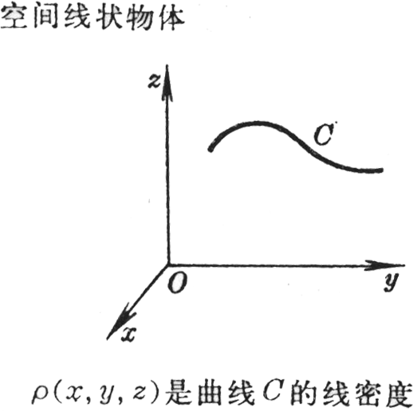

<h3>四、求重心 </h3>

&nbsp;&nbsp;&nbsp;&nbsp;&nbsp;&nbsp; [平面图形几何重心坐标的计算公式]

<table class=MsoNormalTable border=1 cellspacing=1 cellpadding=0 width=607
 style='width:455.25pt'>
 <tr>
  <td width="38%" valign=top style='width:38.0%;padding:5.25pt 5.25pt 5.25pt 5.25pt'>
  
图 形 

  </td>
  <td width="62%" valign=top style='width:62.0%;padding:5.25pt 5.25pt 5.25pt 5.25pt'>
  
几何重心 

  </td>
 </tr>
 <tr>
  <td width="38%" valign=top style='width:38.0%;padding:5.25pt 5.25pt 5.25pt 5.25pt'>
  
平面曲线

  

  </td>
  <td width="62%" valign=top style='width:62.0%;padding:5.25pt 5.25pt 5.25pt 5.25pt'>
  

  </td>
 </tr>
 <tr>
  <td width="38%" valign=top style='width:38.0%;padding:5.25pt 5.25pt 5.25pt 5.25pt'>
  
曲边梯形

  

  </td>
  <td width="62%" valign=top style='width:62.0%;padding:5.25pt 5.25pt 5.25pt 5.25pt'>
  

  </td>
 </tr>
 <tr>
  <td width="38%" valign=top style='width:38.0%;padding:5.25pt 5.25pt 5.25pt 5.25pt'>
  

  </td>
  <td width="62%" valign=top style='width:62.0%;padding:5.25pt 5.25pt 5.25pt 5.25pt'>
  

  </td>
 </tr>
</table>

&nbsp;&nbsp;&nbsp;&nbsp;&nbsp;&nbsp; 

[物体总质量与重心坐标的计算公式]

<table class=MsoNormalTable border=1 cellspacing=1 cellpadding=0 width=607
 style='width:455.25pt'>
 <tr>
  <td width="38%" valign=top style='width:38.0%;padding:5.25pt 5.25pt 5.25pt 5.25pt'>
  
物体形状及密度 

  </td>
  <td width="62%" valign=top style='width:62.0%;padding:5.25pt 5.25pt 5.25pt 5.25pt'>
  
总质量<i>M</i>与重心 

  </td>
 </tr>
 <tr>
  <td width="38%" valign=top style='width:38.0%;padding:5.25pt 5.25pt 5.25pt 5.25pt'>
  
薄板

  

  
是薄板的面密度 

  </td>
  <td width="62%" valign=top style='width:62.0%;padding:5.25pt 5.25pt 5.25pt 5.25pt'>
  

  

  </td>
 </tr>
 <tr style='height:11.25pt'>
  <td width="38%" valign=top style='width:38.0%;padding:5.25pt 5.25pt 5.25pt 5.25pt;
  height:11.25pt'>
  
物体形状及密度 

  </td>
  <td width="62%" valign=top style='width:62.0%;padding:5.25pt 5.25pt 5.25pt 5.25pt;
  height:11.25pt'>
  
总质量<i>M</i>与重心 

  </td>
 </tr>
 <tr style='height:50.0mm'>
  <td width="38%" valign=top style='width:38.0%;padding:5.25pt 5.25pt 5.25pt 5.25pt;
  height:50.0mm'>
  

  
是物体的密度 

  </td>
  <td width="62%" valign=top style='width:62.0%;padding:5.25pt 5.25pt 5.25pt 5.25pt;
  height:50.0mm'>
  

  

  </td>
 </tr>
 <tr style='height:146.25pt'>
  <td width="38%" valign=top style='width:38.0%;padding:5.25pt 5.25pt 5.25pt 5.25pt;
  height:146.25pt'>
  

  </td>
  <td width="62%" valign=top style='width:62.0%;padding:5.25pt 5.25pt 5.25pt 5.25pt;
  height:146.25pt'>
  

  

  
式中d<i>s</i> 为弧的微分，以上积分为曲线积分。 

  </td>
 </tr>
</table>

　

