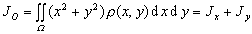

<h3 style='text-align:justify;text-justify:inter-ideograph'>五、求转动惯量</h3>

[薄板的转动惯量] &nbsp;设<i>Oxy</i>平面内薄板<i>Ω</i>的密度为<i>ρ</i>=<i>ρ</i>(<i>x,y</i>)，对于<i>x</i>轴,<i>y</i>轴，原点<i>O</i>的转动惯量分别为,则

&nbsp;&nbsp;&nbsp;&nbsp;&nbsp;&nbsp;&nbsp;&nbsp;&nbsp;

[一般物体的转动惯量] &nbsp;设物体<i>V</i>的密度<i>ρ</i>=<i>ρ</i>(<i>x,y,z</i>).若物体对于坐标平面的转动惯量分别为;物体对于某轴<i>l</i>的转动惯量为;物体对于坐标轴的转动惯量分别;物体对于原点的转动惯量为,则

&nbsp; 

&nbsp; 

式中<i>r</i>为物体的动点到轴<i>l</i>的距离.

&nbsp;&nbsp;&nbsp;&nbsp;&nbsp;&nbsp;

&nbsp;&nbsp;&nbsp;&nbsp;&nbsp;&nbsp;

&nbsp;&nbsp;&nbsp;&nbsp;&nbsp;&nbsp;

