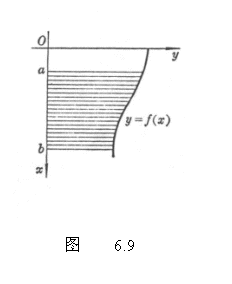
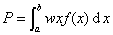

六、求流体压力 

&nbsp;

&nbsp;&nbsp;&nbsp;&nbsp;&nbsp;&nbsp; 设流体接触面的边缘曲线为<i>y=f(x)</i>（图6.9),流体密度为<i>w</i>，则单侧压力

&nbsp;&nbsp;&nbsp;&nbsp;&nbsp;&nbsp;&nbsp;&nbsp;&nbsp;&nbsp;&nbsp;&nbsp;&nbsp;&nbsp;&nbsp;&nbsp;&nbsp;&nbsp;&nbsp;&nbsp; 

